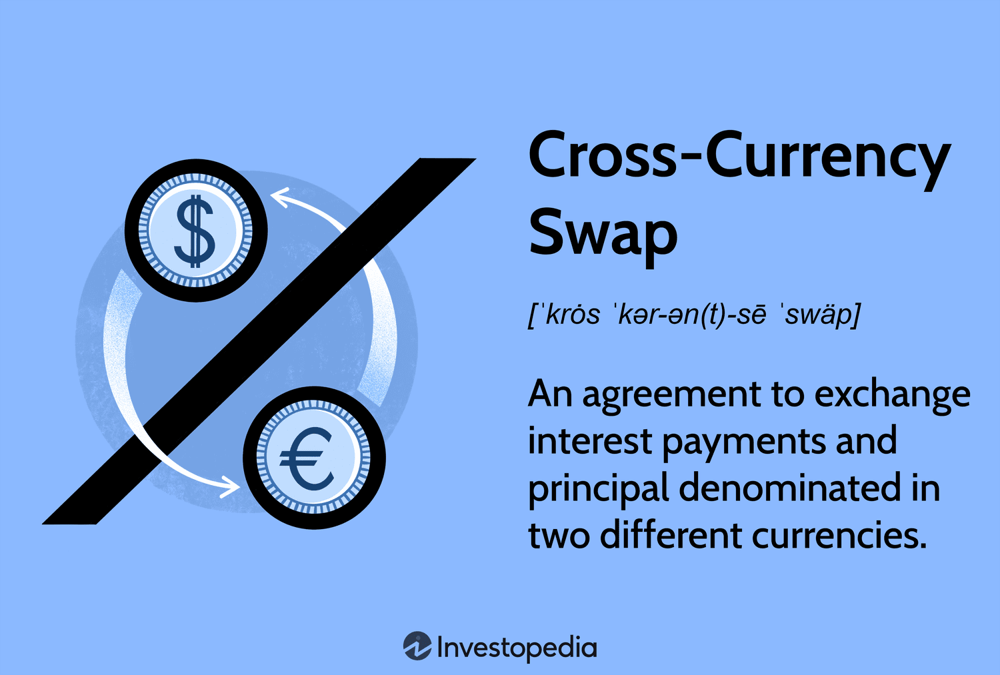

## Table of Contents

## What is a cross-currency swap?

A cross-currency swap is a financial agreement between two parties to exchange interest payments and principal amounts in different currencies. It's like a loan where one party borrows money in one currency and pays back in another. This swap helps companies and investors manage risks related to currency exchange rates and interest rates. For example, a company in the U.S. might want to borrow money in euros but pay back in dollars, so they use a cross-currency swap to do this.

In a cross-currency swap, the two parties agree on an initial exchange of principal amounts in different currencies at the start of the swap. Then, they make periodic interest payments to each other based on agreed-upon rates, which could be fixed or floating. At the end of the swap term, they exchange the principal amounts back, usually at the same exchange rate as the initial exchange. This helps businesses hedge against fluctuations in currency values and manage their cash flows more predictably.

## How does a cross-currency swap differ from a regular interest rate swap?

A cross-currency swap and a regular interest rate swap both help manage financial risks, but they do it in different ways. A regular interest rate swap involves exchanging interest payments between two parties, but both payments are in the same currency. For example, one party might pay a fixed interest rate on a loan while receiving a floating rate on the same loan amount, but all in dollars. This helps them manage the risk of interest rate changes without worrying about currency exchange rates.

On the other hand, a cross-currency swap involves not just interest payments but also the exchange of principal amounts in different currencies. At the start, one party might give dollars and receive euros, and they'll make interest payments in those currencies too. At the end, they swap the principal amounts back. This type of swap is useful for companies that need to borrow in one currency but want to pay back in another, helping them manage both interest rate and currency exchange risks.

## What are the main components of a cross-currency swap?

A cross-currency swap has a few main parts that make it work. First, there's the initial exchange of principal amounts in different currencies. For example, one company might give $1 million to another company and get 850,000 euros in return, based on the current exchange rate. This happens at the start of the swap. Then, over the life of the swap, the two companies make interest payments to each other. These payments can be based on fixed rates, like 5% on the dollars and 3% on the euros, or floating rates that change with market conditions.

The second main part is the periodic interest payments. Depending on the agreement, these payments could happen every month, quarter, or year. If the rates are fixed, the payments stay the same throughout the swap. But if they're floating, the payments can go up or down. The third part is the final exchange of principal at the end of the swap term. Usually, this happens at the same exchange rate as the initial exchange, so the company that gave $1 million at the start would get it back, and the one that received the euros would return them. This helps both companies manage their money better and protect against changes in currency values.

## How does the mechanism of a cross-currency swap work?

A cross-currency swap is like a deal between two companies to swap money in different currencies. At the start, one company gives money in one currency, like dollars, and gets money in another currency, like euros. They agree on how much to swap based on the exchange rate at that time. After the initial swap, they start making interest payments to each other. These payments can be at a fixed rate, where the payment stays the same, or a floating rate, where the payment changes with the market. The interest payments happen regularly, like every month or every year, until the swap ends.

When the swap is over, the companies swap the money back. They usually use the same exchange rate they used at the start. So, if one company gave $1 million and got 850,000 euros at the beginning, they would give back the 850,000 euros and get the $1 million back at the end. This helps both companies manage their money better. If a company needs to borrow in one currency but wants to pay back in another, a cross-currency swap lets them do that while also protecting them from changes in currency values.

## What are the typical terms and conditions in a cross-currency swap agreement?

A cross-currency swap agreement usually includes a few key terms and conditions that both parties agree on. One important term is the amount of money to be swapped at the start and the exchange rate used for this swap. For example, one company might give $1 million and get 850,000 euros in return. They also decide on the length of the swap, which could be a few years or more. Another important part is the type of interest rates they will use for the payments. These can be fixed rates, where the payment stays the same, or floating rates, which change with the market. The agreement also sets out how often these interest payments will happen, like monthly, quarterly, or yearly.

Another condition is what happens at the end of the swap. Usually, the companies swap the principal amounts back at the same exchange rate they used at the start. This means if one company gave $1 million at the beginning, they would get that back, and the other company would return the euros they received. The agreement might also include rules about what happens if one company can't make the payments, like penalties or early termination. There can also be terms about how to handle changes in the law or big changes in the market that could affect the swap. These terms and conditions help both companies know exactly what to expect and how to manage their money during the swap.

## What are the primary risks associated with cross-currency swaps?

One of the main risks with cross-currency swaps is the risk of changes in currency values. If the exchange rate between the two currencies changes a lot, one company might end up losing money when they swap the money back at the end. For example, if the euro gets weaker compared to the dollar, the company that borrowed in euros might have to give back more euros than they expected to get the same amount of dollars back. This can make the swap more expensive than planned.

Another risk is the interest rate risk. If the interest rates change, the payments that the companies make to each other can go up or down. If one company agreed to pay a floating rate and that rate goes up, their payments will be higher. This can make it harder for them to manage their money. Also, there's the risk that one of the companies might not be able to make the payments. If a company runs into financial trouble, they might not be able to pay back the money they owe, which can cause problems for the other company in the swap.

## How can companies use cross-currency swaps to manage foreign exchange risk?

Companies can use cross-currency swaps to manage foreign exchange risk by swapping money in different currencies at the start of the swap and then swapping it back at the end. This helps them lock in the exchange rate, so they know exactly how much they'll get back in their own currency, even if the exchange rate changes a lot during the swap. For example, a U.S. company that needs to borrow money in euros but wants to pay back in dollars can use a cross-currency swap. They give dollars to another company and get euros in return. At the end of the swap, they give the euros back and get their dollars back, usually at the same exchange rate as the start. This protects them from losing money if the euro gets weaker compared to the dollar.

Another way cross-currency swaps help manage foreign exchange risk is by allowing companies to match their income and expenses in different currencies. If a company earns money in one currency but has costs in another, a cross-currency swap can help them balance things out. For instance, if a company in Japan earns yen but has to pay back a loan in dollars, they can use a swap to convert their yen into dollars for the loan payments. By doing this, they reduce the risk of the yen getting weaker and making their loan payments more expensive. This way, they can better predict their cash flow and manage their finances more smoothly.

## What are the accounting implications of entering into a cross-currency swap?

When a company enters into a cross-currency swap, it has to follow certain accounting rules to record it in their financial statements. At the start of the swap, the company records the initial exchange of principal amounts in different currencies. For example, if a U.S. company gives $1 million and gets 850,000 euros, they would record this exchange at the current exchange rate. They also need to account for the interest payments they'll make and receive over the life of the swap. These payments can be at fixed or floating rates, and the company needs to record them as they happen, adjusting for any changes in the exchange rate.

The accounting gets a bit more complicated when it comes to the end of the swap. When the companies swap the principal amounts back, usually at the same exchange rate as the start, the company needs to record this final exchange. If the exchange rate has changed a lot during the swap, there might be a gain or loss to account for. Also, the company needs to consider how the swap affects their financial statements, like their income statement and balance sheet. They might need to show the swap as a hedge against foreign exchange risk, which can help them manage their financial reporting and show a more stable financial position.

## Can you explain the valuation process of a cross-currency swap?

Valuing a cross-currency swap involves figuring out what it's worth at a certain time. You do this by looking at the future cash flows from the swap and then adjusting them for the time value of money and any changes in the exchange rate. For example, if you have a swap where you're paying interest in dollars and receiving interest in euros, you'd calculate how much those interest payments are worth now, taking into account what's happening with interest rates and exchange rates.

The process starts with estimating the future interest payments based on the agreed-upon rates, whether they're fixed or floating. Then, you discount these payments back to today's value using the current interest rates for each currency. If the interest rates or exchange rates have changed since the swap started, you'll see a difference between what you expected to pay or receive and what it's actually worth now. This difference is the value of the swap at that moment. It can be positive or negative, depending on whether the swap is working in your favor or not.

## How do regulatory requirements impact cross-currency swap transactions?

Regulatory requirements can have a big impact on cross-currency swap transactions. These rules are set by financial authorities to make sure that the markets are safe and fair. For example, after the 2008 financial crisis, new rules were put in place to make sure that swaps are more transparent and that companies using them have enough money to cover their risks. One of these rules is that many swaps now have to be reported to a central place, so everyone can see what's going on. This helps to stop big problems from happening in the financial markets.

Another way regulations affect cross-currency swaps is by setting rules about how much money companies need to have as a safety net. This is called capital requirements, and it makes sure that if something goes wrong with a swap, the company can still pay what they owe. Also, some swaps have to be cleared through a central clearinghouse, which is like a middleman that makes sure both sides of the swap can meet their obligations. These rules can make swaps more expensive and complicated, but they also make the financial system safer for everyone.

## What are some advanced strategies involving cross-currency swaps used by multinational corporations?

Multinational corporations often use cross-currency swaps to manage their cash flows in different countries. For example, a company might have operations in the U.S. and Europe, earning money in dollars but needing to pay expenses in euros. By using a cross-currency swap, they can convert their dollar earnings into euros at a fixed exchange rate, which helps them plan their budgets better. This way, even if the euro gets stronger against the dollar, the company knows exactly how many euros they'll get, making their financial planning more predictable and stable.

Another advanced strategy involves using cross-currency swaps to take advantage of interest rate differences between countries. If a company can borrow money at a lower interest rate in one country but needs funds in another, they can use a swap to borrow in the cheaper currency and then convert it to the currency they need. For example, if interest rates are lower in Japan, a company might borrow in yen and then swap it into dollars or euros. This can save them money on interest payments, but it also means they need to manage the risk of currency fluctuations carefully. By doing this, companies can lower their borrowing costs and improve their overall financial health.

## How have recent market trends influenced the use and structure of cross-currency swaps?

Recent market trends, like low interest rates and changes in currency values, have made cross-currency swaps more popular. Companies are using them more often to take advantage of low rates in one country while still getting money in the currency they need. For example, if interest rates are low in Japan, a company might borrow money in yen and then use a swap to convert it into dollars or euros. This can save them money on interest payments. Also, with more uncertainty in the markets, companies are using swaps to protect themselves from big changes in currency values, which helps them plan their budgets better.

Another trend is that more swaps are now being cleared through central clearinghouses. This is because of new rules set up after the 2008 financial crisis to make the financial system safer. These rules can make swaps more expensive and complicated, but they also make them more transparent and safer for everyone. As a result, the structure of cross-currency swaps has changed a bit, with more focus on managing risk and meeting regulatory requirements. Companies have to think about these new rules when they set up their swaps, but overall, these trends have made cross-currency swaps a more important tool for managing money in a global market.

## What are Cross-Currency Swaps and how can they be explored?

Cross-currency swaps are sophisticated financial arrangements designed to exchange cash flows between two different currencies. These swaps serve as essential instruments in the financial landscape, managing exposure to currency risk, leveraging interest rate differentials, and optimizing cash flow structures. The fundamental construct of a cross-currency swap involves the exchange of principal and interest payments in two currencies over a predetermined period.

In a typical cross-currency swap, two parties agree to exchange specified amounts of two different currencies. Initially, principal amounts are exchanged at an agreed-upon spot rate. Over the life of the swap, the parties exchange interest payments on the principal amounts, typically on a quarterly or semi-annual basis. The unique aspect of these swaps is that they usually involve both fixed and floating interest rates, allowing parties to leverage interest rate differentials between the two currencies involved.

The mathematical representation of a cross-currency swap can be expressed through the net present value (NPV) of expected cash flows. The NPV will account for the differences in interest rates between the two currencies involved, typically represented as:

$$
\text{NPV} = \sum_{t=1}^{T} \left( \frac{C_{\text{foreign}}(1+r_{\text{foreign},t})}{(1+d_{\text{domestic},t})} - \frac{C_{\text{domestic}}(1+r_{\text{domestic},t})}{(1+d_{\text{domestic},t})} \right)
$$

where $C_{\text{foreign}}$ and $C_{\text{domestic}}$ represent the cash flows in foreign and domestic currencies, respectively, and $r$ and $d$ are the respective interest rates and discount rates.

Common applications of cross-currency swaps include multinational corporate financing, where companies seek to optimize their foreign currency debt servicing. By issuing debt in their local currency and swapping it into a foreign currency, corporations can manage foreign exchange risk while potentially benefiting from favorable interest rate differentials. Similarly, these swaps are utilized in hedging strategies to mitigate currency [volatility](/wiki/volatility-trading-strategies), especially in regions susceptible to significant exchange rate fluctuations.

In summary, cross-currency swaps are vital financial derivatives facilitating efficient currency risk management and optimized financial strategies in international finance.

## References & Further Reading

[1]: ["Foreign Exchange and Money Markets"](https://www.investopedia.com/terms/forex/f/foreign-exchange-markets.asp) by Roberto Perli, Antonio Mele & Yvan Lengwiler

[2]: ["Swaps and Other Derivatives"](https://www.investopedia.com/ask/answers/060215/what-difference-between-derivatives-and-swaps.asp) by Richard Flavell

[3]: Lopez de Prado, M. (2018). ["Advances in Financial Machine Learning"](https://www.amazon.com/Advances-Financial-Machine-Learning-Marcos/dp/1119482089) Wiley.

[4]: J.P. Morgan. (2018). ["Risk Management and the Energy: The Case for Cross-Currency Swaps"](https://www.jpmorgan.com/content/dam/jpm/wealth-management/documents/protecting-the-value-of-your-business-through-risk-management.pdf) J.P. Morgan Perspectives.

[5]: Hull, J. C. (2017). ["Options, Futures, and Other Derivatives"](https://www.semanticscholar.org/paper/Options%2C-Futures%2C-and-Other-Derivatives-Hull/89bdee500c8623864fc9eb7a471546aa713acc44) Pearson.