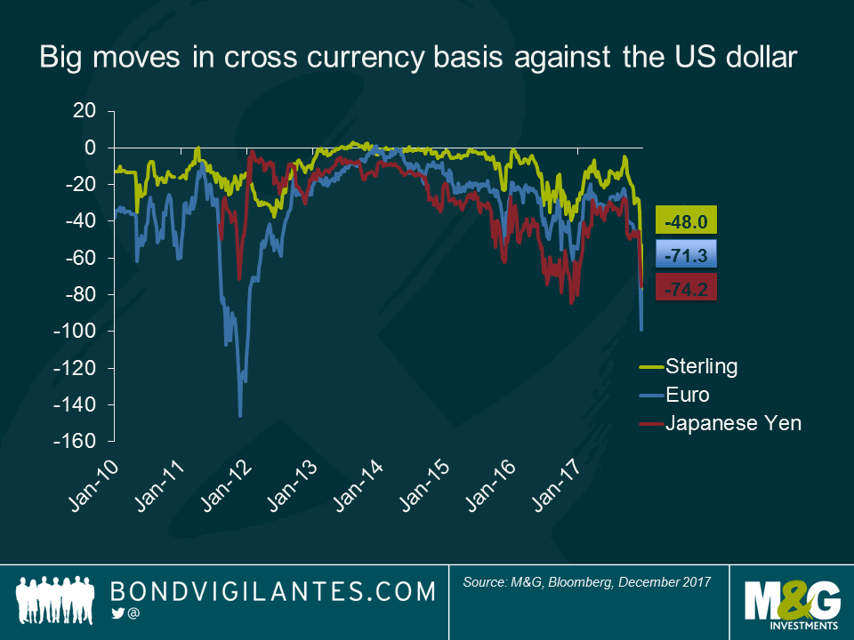

## Table of Contents

## What is a cross-currency transaction?

A cross-currency transaction is when you exchange one type of money for another type of money that isn't the main one used in your country. For example, if you live in the United States and you want to trade U.S. dollars for Japanese yen, that's a cross-currency transaction. It's different from trading your local money for the money of another big economy, like trading U.S. dollars for euros.

These transactions are important for businesses and people who work or travel in different countries. They help you buy things or invest in places where your own country's money isn't used much. Banks and money exchange places usually handle these transactions, and they might charge a fee or take a small part of the money as their profit. Knowing the exchange rate, which is how much one type of money is worth compared to another, is key to making sure you get a good deal.

## Why might someone choose to exclude the U.S. dollar in currency transactions?

Someone might choose to exclude the U.S. dollar in currency transactions because they want to trade directly between two other currencies. This can be useful if they are doing business or traveling between countries where the U.S. dollar isn't the main currency. For example, if a business in Europe wants to buy goods from Japan, they might choose to trade euros directly for yen instead of first converting euros to U.S. dollars and then to yen. This can save time and sometimes money because they avoid the extra step and any fees that come with it.

Another reason to avoid the U.S. dollar in transactions is to reduce the risk from changes in the dollar's value. If the U.S. dollar goes up or down a lot compared to other currencies, it can make the cost of goods or investments unpredictable. By trading directly between other currencies, businesses and people can have a better idea of what they will pay or receive, without worrying about what happens to the U.S. dollar. This can be especially important for countries that want to rely less on the U.S. dollar in their economy.

## What are the common currency pairs used in cross-currency transactions excluding the U.S. dollar?

In cross-currency transactions that don't involve the U.S. dollar, some of the most common currency pairs are the euro (EUR) and the Japanese yen (JPY), the euro and the British pound (GBP), and the euro and the Swiss franc (CHF). These pairs are popular because they involve major economies and are often used in international trade and finance. For example, a business in Germany might want to buy products from Japan, so they would exchange euros for yen directly.

Another common pair is the British pound and the Japanese yen (GBP/JPY). This pair is used when businesses or people in the UK want to trade with Japan without going through the U.S. dollar. The Australian dollar (AUD) and the Canadian dollar (CAD) also form a common pair, especially for trade between these two countries. These pairs help businesses and travelers avoid the extra step and costs of converting through the U.S. dollar.

Sometimes, other less common currency pairs are used as well, like the euro and the Swedish krona (EUR/SEK) or the British pound and the Swiss franc (GBP/CHF). These are used when there is specific trade or investment happening between the countries involved. Overall, the choice of currency pair depends on the needs of the people or businesses involved and the nature of the transaction.

## How does the absence of the U.S. dollar affect the liquidity of these transactions?

When you leave out the U.S. dollar in currency trades, it can make the transactions less liquid. Liquidity means how easy it is to buy or sell something without changing its price too much. The U.S. dollar is used a lot in the world's money markets, so when you don't use it, fewer people might be trading the currencies you want. This can mean it's harder to find someone to trade with, and you might have to wait longer or accept a worse price.

But, some currency pairs without the U.S. dollar can still be pretty liquid. For example, trading euros for Japanese yen is common because both Europe and Japan are big economies. Lots of people and businesses want to trade these currencies, so there's usually someone ready to buy or sell. Even without the U.S. dollar, these pairs can stay liquid because they're important in the global market.

## What are the risks associated with cross-currency transactions that do not involve the U.S. dollar?

When you trade currencies without using the U.S. dollar, one big risk is that the exchange rate might change a lot. This can happen because fewer people trade these currencies, so their prices can move up and down more than when the U.S. dollar is involved. If you're planning to buy something or invest in another country, a sudden change in the exchange rate could make it more expensive or less valuable than you expected.

Another risk is that it might be harder to find someone to trade with. When you use the U.S. dollar, there are always a lot of people and businesses ready to buy or sell it. But with other currencies, there might not be as many people trading, so you might have to wait longer or accept a worse price. This can make your transaction take more time and cost more money.

Overall, not using the U.S. dollar in currency trades can make things less predictable and more costly. It's important to think about these risks and maybe talk to a bank or financial expert to understand how they might affect your plans.

## How do exchange rates for cross-currency pairs without the U.S. dollar typically fluctuate?

Exchange rates for cross-currency pairs without the U.S. dollar can be more unpredictable than those involving the dollar. Because fewer people trade these currencies, their prices can change a lot in a short time. For example, if you're trading euros for Japanese yen, the rate might go up or down quickly because there aren't as many people buying and selling these currencies as there are with the U.S. dollar.

These fluctuations can be influenced by many things, like what's happening in the countries using those currencies. If a country's economy is doing well, its currency might get stronger. But if there's bad news, like a financial crisis, the currency might lose value fast. Also, big events in the world, like changes in oil prices or political problems, can shake up the exchange rates for these currency pairs. So, when you're dealing with cross-currency pairs without the U.S. dollar, you need to keep an eye on what's going on in the world and be ready for the rates to move around a lot.

## What role do central banks play in managing cross-currency transactions excluding the U.S. dollar?

Central banks play an important role in managing cross-currency transactions that don't involve the U.S. dollar. They do this by setting interest rates and controlling the money supply in their own country. When a central bank changes its interest rates, it can make its currency more or less attractive to people who want to trade. For example, if a central bank raises interest rates, it might make people want to buy that country's currency more, which can affect the exchange rate with other currencies.

Central banks also step in sometimes to buy or sell their own currency in the market. This is called intervention, and it can help keep the exchange rate stable. If a central bank sees that its currency is getting too weak or too strong compared to another currency, it might buy or sell its own currency to balance things out. This can help make cross-currency transactions smoother and less risky for businesses and people who need to trade between currencies without using the U.S. dollar.

## How can businesses hedge against currency risk in cross-currency transactions without using the U.S. dollar?

Businesses can use something called forward contracts to protect themselves from currency risk in cross-currency transactions without using the U.S. dollar. A forward contract is like a promise to buy or sell a certain amount of money at a set price in the future. So, if a business knows it will need to pay for something in another currency, like euros for yen, it can use a forward contract to lock in the exchange rate now. This way, even if the exchange rate changes later, the business knows exactly how much it will cost.

Another way businesses can hedge is by using currency options. These are like insurance policies for currency. A business can buy an option that gives it the right, but not the obligation, to exchange one currency for another at a certain rate. If the exchange rate goes against the business, it can use the option to trade at the better rate. But if the rate goes in their favor, they don't have to use the option and can trade at the better market rate. This helps businesses manage the risk of currency changes without involving the U.S. dollar.

## What are the regulatory considerations for cross-currency transactions excluding the U.S. dollar in different countries?

When businesses or people do cross-currency transactions without using the U.S. dollar, they need to think about the rules in different countries. Each country has its own laws about how to trade money, and these rules can be different. For example, some countries might need you to report big transactions, or they might limit how much money you can move across borders. It's important to know these rules to avoid getting in trouble or having to pay fines. Also, some countries might have special taxes or fees for certain currency trades, so it's good to check before you make any deals.

Another thing to think about is how countries work together on money rules. Some countries have agreements that make it easier to trade currencies between them. These agreements can help make cross-currency transactions smoother and less risky. But if countries don't get along well, it might be harder to trade their currencies. So, businesses need to keep an eye on international relations and any changes in rules that might affect their transactions. It's always a good idea to talk to a financial expert or a lawyer who knows about these things to make sure you're following all the rules.

## How do technological advancements influence cross-currency transactions that bypass the U.S. dollar?

Technological advancements have made cross-currency transactions without the U.S. dollar easier and faster. Now, businesses and people can use online platforms and mobile apps to trade currencies directly. These tools help them see the latest exchange rates and make trades quickly, without needing to go through a bank or a money changer. Also, new technologies like blockchain and cryptocurrencies let people trade money in new ways. They can use digital currencies that aren't tied to any country, which can make trading between different currencies simpler and cheaper.

These technologies also help reduce the risks that come with trading currencies without the U.S. dollar. For example, smart contracts on blockchain can automatically handle transactions when certain conditions are met, like when the exchange rate hits a certain point. This can protect businesses from big changes in currency values. Plus, with more data and better tools, people can keep a closer eye on what's happening in the market and make smarter choices about when to trade. Overall, technology is making it easier for businesses and people to do cross-currency transactions without the U.S. dollar, and it's helping them manage the risks better.

## What are the potential impacts of global economic shifts on cross-currency transactions excluding the U.S. dollar?

Global economic shifts can have big effects on cross-currency transactions that don't use the U.S. dollar. When big changes happen in the world, like a country's economy growing fast or slowing down, it can change how much people want to trade its currency. For example, if a country's economy is doing well, more people might want to buy its currency, making it stronger. But if the economy is struggling, people might sell the currency, making it weaker. This can make the exchange rates between other currencies go up and down a lot, which can be risky for businesses and people doing cross-currency trades without the U.S. dollar.

Also, when there are big changes in the world, like a financial crisis or big political events, it can shake up the whole global economy. These events can make people and businesses less sure about what will happen next, so they might trade less or be more careful about which currencies they use. If countries start trading more with each other and less with the U.S., it can make cross-currency transactions without the U.S. dollar more common. But it also means that businesses need to watch out for new risks and be ready to change their plans if the global economy shifts in unexpected ways.

## How can financial institutions optimize their operations for handling cross-currency transactions without the U.S. dollar?

Financial institutions can optimize their operations for handling cross-currency transactions without the U.S. dollar by using technology to make things faster and easier. They can use online platforms and mobile apps to let people trade currencies directly. This means they don't have to wait for a bank to handle the trade, which can save time and money. Also, financial institutions can use blockchain and smart contracts to make transactions more secure and automatic. These technologies can help them manage the risks better because they can set up trades to happen only when certain conditions are met, like when the exchange rate is right.

Another way financial institutions can optimize their operations is by understanding the rules in different countries and working with them. They need to know about any special taxes or limits on how much money can be moved across borders. By keeping up with these rules, they can help their customers avoid problems and fines. Also, financial institutions can use their knowledge of the global economy to help their customers make smart choices about when to trade currencies. By watching what's happening in the world and sharing this information with their customers, they can help them manage the risks that come with trading currencies without the U.S. dollar.

## References & Further Reading

[1]: Brown, C., & Aubin, E. (2020). ["Cross-Currency Basis Swap: A Guide to the Reference Markets and Funding Costs."](https://www.imf.org/-/media/Files/Publications/gfs-notes/2020/English/ANEA2020001.ashx) JPMorgan Research.

[2]: Kissell, R. (2014). ["The Science of Algorithmic Trading and Portfolio Management."](https://www.sciencedirect.com/book/9780124016897/the-science-of-algorithmic-trading-and-portfolio-management) Academic Press.

[3]: Engel, C. (2016). ["Exchange Rates, Interest Rates, and the Risk Premium."](https://www.aeaweb.org/articles?id=10.1257/aer.20121365) National Bureau of Economic Research. Working Paper 22873.

[4]: Chaboud, A., Chiquoine, B., Hjalmarsson, E., & Vega, C. (2014). ["Rise of the Machines: Algorithmic Trading in the Foreign Exchange Market."](https://www.jstor.org/stable/43612951) International Monetary Fund Working Paper.

[5]: Biais, B., Foucault, T., & Moinas, S. (2014). ["Equilibrium Fast Trading."](https://www.sciencedirect.com/science/article/pii/S0304405X15000288) The Review of Financial Studies, 27(11), 3261-3303.