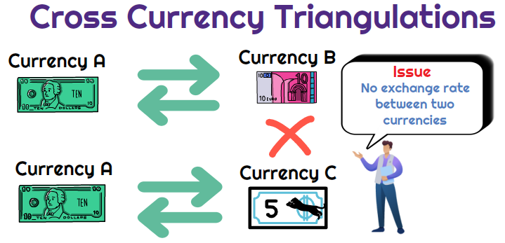

## Table of Contents

## What is cross currency triangulation?

Cross currency triangulation is a way to figure out the exchange rate between two currencies that don't trade directly with each other. Imagine you want to exchange money from one country to another, but those two countries don't have a direct trading relationship. Instead, you can use a third currency that both countries trade with to make the exchange. For example, if you want to exchange Brazilian Reals for Indian Rupees, but there's no direct exchange rate, you could first exchange Reals for US Dollars and then Dollars for Rupees.

This method involves using two different exchange rates to find the indirect rate between the two currencies you're interested in. It's like taking a detour through a common currency to reach your final destination. While it can be a bit more complicated, it's useful because it allows for currency conversion even when direct trading isn't available. However, you need to be careful because using multiple exchange rates can sometimes lead to less favorable rates and higher transaction costs.

## Why is cross currency triangulation important in foreign exchange markets?

Cross currency triangulation is important in foreign exchange markets because it helps traders and businesses convert money between currencies that don't have a direct exchange rate. Imagine you want to trade between two countries, but they don't directly trade with each other. You can still make the trade by using a third currency that both countries use. This method is crucial because it keeps the global economy connected, even when some countries don't trade directly with each other.

It also helps in finding the best exchange rates. By comparing different paths through various currencies, traders can choose the route that gives them the best deal. This can save money and make trading more efficient. However, it's important to be careful because using multiple exchange rates can sometimes lead to higher costs or less favorable rates. Overall, cross currency triangulation makes the foreign exchange market more flexible and accessible.

## How does cross currency triangulation work?

Cross currency triangulation is a way to change money from one currency to another when they don't trade directly. Imagine you want to trade Brazilian Reals for Indian Rupees, but there's no direct way to do that. Instead, you can use a third currency, like US Dollars, that both countries trade with. So, you first change your Reals into Dollars, and then you change those Dollars into Rupees. This method helps you make the trade even if the two countries don't have a direct exchange rate.

This process is important because it keeps the global economy connected. It lets people and businesses trade money between countries that don't directly trade with each other. By using a common currency like the US Dollar or the Euro, you can find a way to make the exchange. However, you need to be careful because using multiple exchange rates can sometimes lead to higher costs or less favorable rates. But overall, cross currency triangulation makes the foreign exchange market more flexible and accessible.

## What are the basic steps involved in cross currency triangulation?

Cross currency triangulation is a way to change money from one currency to another when there's no direct exchange rate between them. Let's say you want to trade Brazilian Reals for Indian Rupees, but you can't do that directly. Instead, you can use a third currency, like the US Dollar, that both countries trade with. So, you first change your Reals into Dollars, and then you change those Dollars into Rupees. This method helps you make the trade even if the two countries don't have a direct exchange rate.

To do this, you need to find out the exchange rate between the first currency and the third currency, and then the exchange rate between the third currency and the second currency. For example, if you know how many Dollars you get for one Real and how many Rupees you get for one Dollar, you can figure out how many Rupees you'll get for your Reals. You multiply the amount of Reals you have by the exchange rate to Dollars, and then multiply that result by the exchange rate from Dollars to Rupees. This way, you can trade between two currencies that don't directly trade with each other.

## Can you explain the concept of a currency pair in the context of triangulation?

A currency pair is two different currencies that are traded against each other. For example, if you want to change US Dollars into Euros, the currency pair would be USD/EUR. The first currency in the pair is the one you're starting with, and the second is the one you're getting. In the foreign exchange market, currency pairs are used to show how much one currency is worth compared to another.

In cross currency triangulation, you use currency pairs to find an indirect way to trade between two currencies that don't have a direct exchange rate. Let's say you want to trade Brazilian Reals for Indian Rupees, but there's no direct way to do that. You can use a third currency, like the US Dollar, to make the trade. So, you would look at the currency pair BRL/USD to see how many Dollars you get for your Reals, and then look at the currency pair USD/INR to see how many Rupees you get for those Dollars. By using these two currency pairs, you can figure out how many Rupees you'll get for your Reals.

## What are the common currency pairs used in triangulation?

In cross currency triangulation, people often use the US Dollar (USD) as the third currency because it's widely traded around the world. Common currency pairs that include the US Dollar are USD/EUR (US Dollar to Euro), USD/JPY (US Dollar to Japanese Yen), and USD/GBP (US Dollar to British Pound). These pairs are used to help trade between currencies that don't have a direct exchange rate. For example, if you want to trade Brazilian Reals for Indian Rupees, you might first change your Reals to Dollars using the BRL/USD pair, and then change those Dollars to Rupees using the USD/INR pair.

Another common currency used in triangulation is the Euro (EUR). Currency pairs like EUR/USD (Euro to US Dollar), EUR/GBP (Euro to British Pound), and EUR/JPY (Euro to Japanese Yen) are also widely used. These pairs can help you trade between currencies that don't directly trade with each other. For instance, if you want to trade Australian Dollars for Swiss Francs, you could use the AUD/EUR pair to change your Australian Dollars to Euros, and then use the EUR/CHF pair to change those Euros to Swiss Francs. Using these common currency pairs makes it easier to find a way to trade between any two currencies.

## How do exchange rates affect cross currency triangulation?

Exchange rates are really important in cross currency triangulation because they tell you how much of one currency you can get for another. When you're trying to trade between two currencies that don't have a direct exchange rate, you need to use a third currency, like the US Dollar or the Euro. The exchange rates between the first currency and the third currency, and then between the third currency and the second currency, will decide how much of the second currency you end up with. If the exchange rates are good, you might get a lot of the second currency, but if they're bad, you might not get as much.

Sometimes, exchange rates can change a lot, and this can make cross currency triangulation tricky. If the rates change while you're making your trades, you might end up with less of the second currency than you expected. That's why it's important to keep an eye on the exchange rates and maybe even wait for a better time to make your trades. But even with these challenges, cross currency triangulation is a useful way to trade between currencies that don't have a direct exchange rate, as long as you understand how exchange rates work and how they can affect your trades.

## What are the potential risks associated with cross currency triangulation?

Cross currency triangulation can be risky because it involves using more than one exchange rate. When you change money from one currency to another through a third currency, the exchange rates can change while you're making your trades. If the rates go down, you might end up with less of the second currency than you expected. This is called exchange rate risk, and it can make your trades less profitable or even cause you to lose money.

Another risk is the cost of the trades. Every time you change money from one currency to another, there are fees and charges. When you do this twice in triangulation, the costs can add up quickly. These extra costs can eat into your profits and make the trade less worthwhile. It's important to think about these costs and try to find the best exchange rates to minimize them.

## How can arbitrage opportunities be identified through cross currency triangulation?

Arbitrage is when you buy something in one place and sell it in another for a higher price, making a profit from the difference. In cross currency triangulation, you can look for arbitrage opportunities by comparing the exchange rates between different currency pairs. For example, if you can change your money from Brazilian Reals to US Dollars and then from US Dollars to Indian Rupees, you might find that the total amount of Rupees you get is more than if you could trade directly from Reals to Rupees. If the indirect path gives you more money than the direct path would, that's an arbitrage opportunity.

To find these opportunities, you need to keep an eye on the exchange rates between the currencies you're interested in. You can use a calculator or a computer program to quickly figure out the total exchange rate for the indirect path. If you see that the indirect path gives you a better deal, you can make the trades and make a profit. But remember, exchange rates can change quickly, so you need to act fast and be careful with the costs of the trades, because those can eat into your profits.

## What tools or software are commonly used for effective cross currency triangulation?

For effective cross currency triangulation, people often use special software and tools that help them keep track of exchange rates and make quick calculations. One popular tool is a foreign exchange calculator, which can figure out the total exchange rate when you're using more than one currency pair. These calculators are often part of bigger trading platforms that show real-time exchange rates and let you see how much money you'll get after making your trades. Some well-known platforms that offer these tools are MetaTrader 4 and 5, Bloomberg Terminal, and Reuters Eikon. These platforms are used by traders all over the world to find the best exchange rates and make smart trading decisions.

Another useful tool is a currency converter app, which you can use on your phone or computer. These apps are easy to use and can quickly show you the exchange rates between different currencies. They're great for people who need to make trades on the go or want to check rates without using a big trading platform. Some popular currency converter apps include XE Currency, OANDA, and Currency Converter Plus. These tools help you find arbitrage opportunities by showing you when the indirect path through a third currency gives you a better deal than trading directly between two currencies.

## How does cross currency triangulation impact international trade and investment?

Cross currency triangulation helps make international trade and investment easier by connecting countries that don't trade directly with each other. Imagine you want to buy something from a country that uses a different currency, but there's no direct way to change your money into theirs. With triangulation, you can use a third currency, like the US Dollar, to make the trade. This means businesses and investors can reach more markets and find new opportunities, even if there's no direct exchange rate between their currency and the one they need.

However, using cross currency triangulation can also add some risks and costs to international trade and investment. When you change money through a third currency, the exchange rates can change while you're making your trades. If the rates go down, you might end up with less money than you expected. Plus, every time you change money, there are fees and charges, and these can add up quickly. So, while triangulation opens up more opportunities, it's important for businesses and investors to be careful and keep an eye on exchange rates and costs to make the most of their trades.

## What advanced strategies can traders use to optimize their gains through cross currency triangulation?

Traders can use advanced strategies like arbitrage to make the most of cross currency triangulation. Arbitrage is when you buy something in one place and sell it in another for a higher price, making a profit from the difference. In cross currency triangulation, traders can look for arbitrage opportunities by comparing the exchange rates between different currency pairs. For example, if you can change your money from Brazilian Reals to US Dollars and then from US Dollars to Indian Rupees, you might find that the total amount of Rupees you get is more than if you could trade directly from Reals to Rupees. If the indirect path gives you more money than the direct path would, that's an arbitrage opportunity. Traders need to use tools like foreign exchange calculators and trading platforms to quickly figure out the total exchange rate for the indirect path and act fast before the rates change.

Another strategy is to use hedging to reduce the risks of exchange rate changes. Hedging is like buying insurance for your trades. When you're using cross currency triangulation, the exchange rates can change while you're making your trades, and this can make you lose money. To protect against this, traders can use financial instruments like forward contracts or options to lock in exchange rates for future trades. This way, even if the rates change, you know exactly how much money you'll get. It's a bit more complicated and might cost more, but it can help you make safer trades and keep your profits more stable. Using these advanced strategies can help traders make the most of cross currency triangulation and grow their investments.

## What is the role of algorithmic trading in forex markets?

Algorithmic trading refers to the use of computer algorithms to automate and optimize the execution of trades in financial markets, including the forex market. This approach relies on a set of predefined instructions or rules programmed to analyze market data, identify trading opportunities, and execute trades with minimal human intervention. Over the years, [algorithmic trading](/wiki/algorithmic-trading) has evolved significantly, driven by advancements in technology and increased access to market data, making it a cornerstone of modern forex trading strategies.

Speed and precision are critical in executing forex trades, especially given the market's high [volatility](/wiki/volatility-trading-strategies) and liquidity. Algorithmic trading enhances both by leveraging high-frequency trading systems capable of executing thousands of trades in mere milliseconds. This speed advantage allows traders to capitalize on fleeting opportunities that manually executed trades might miss. Additionally, the precision offered by algorithms ensures that trades are executed at optimal prices, minimizing slippage and improving overall profitability.

Algorithms can be designed to conduct cross currency triangulation efficiently by taking advantage of automated processes to identify and exploit arbitrage opportunities. Cross currency triangulation involves calculating the implied exchange rate of a currency pair through two other currency pairs and comparing it with the market rate. For example, given three currencies: X, Y, and Z, the formula for triangulation can be expressed as:

$$
\text{Cross Rate XY} = \text{Direct Rate XZ} \times \text{Direct Rate ZY}
$$

If the result differs from the market rate of XY, an arbitrage opportunity may exist. Algorithms can swiftly perform these calculations on multiple currency pairs, identify discrepancies, and execute necessary trades to capture the arbitrage profit. This automated approach is not only faster but also reduces the likelihood of errors that can occur during manual calculations.

One of the primary benefits of algorithmic trading is the removal of human error and emotions from trading decisions. Human traders are susceptible to biases and emotional responses, which can adversely affect trading outcomes. Algorithmic trading systems, however, follow strict, pre-defined criteria, ensuring consistent execution of trades based purely on data and analytics. This objectivity helps in maintaining discipline and adherence to trading strategies, which is crucial for sustained success in the volatile forex market.

In summary, algorithmic trading offers significant advantages in forex markets by enhancing speed, precision, and objectivity in executing trades. These benefits are particularly pronounced when algorithms are used for complex strategies like cross currency triangulation, paving the way for more efficient and profitable trading operations.

## References & Further Reading

[1]: ["Algorithmic and High-Frequency Trading"](https://assets.cambridge.org/97811070/91146/frontmatter/9781107091146_frontmatter.pdf) by Álvaro Cartea, Sebastian Jaimungal, and José Penalva

[2]: ["Algorithmic Trading and DMA: An introduction to direct access trading strategies"](https://www.amazon.com/Algorithmic-Trading-DMA-introduction-strategies/dp/0956399207) by Barry Johnson

[3]: ["Machine Learning for Asset Managers"](https://epubs.siam.org/doi/book/10.1137/1.9781611977905) by Marcos Lopez de Prado

[4]: ["Inside the Black Box: A Simple Guide to Quantitative and High Frequency Trading"](https://www.amazon.com/Inside-Black-Box-Quantitative-Frequency/dp/1118362411) by Rishi K. Narang

[5]: ["The Science of Algorithmic Trading and Portfolio Management"](https://www.sciencedirect.com/book/9780124016897/the-science-of-algorithmic-trading-and-portfolio-management) by Robert Kissell

[6]: ["Python for Finance: Mastering Data-Driven Finance"](https://books.google.com/books/about/Python_for_Finance.html?id=2qd9DwAAQBAJ) by Yves Hilpisch