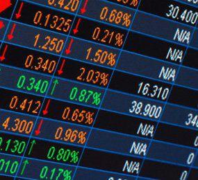

Currency exchange plays a vital role in the global economy, facilitating international trade and investment by enabling the conversion of one currency into another. This process underpins economic activities, allowing businesses and individuals to purchase foreign goods, services, and assets. It also contributes to maintaining balance in the global financial system, as exchange rates adjust to reflect economic conditions, trade balances, and monetary policies.

Cross currency triangulation is an essential approach in forex trading, especially in leveraging discrepancies within currency pairs to optimize trading outcomes. This method calculates the implied exchange rate between two currencies through a third currency, often revealing arbitrage opportunities that can be exploited for profit. The concept is critical for enhancing trading accuracy and efficiency in the forex market.



The rise of algorithmic trading in forex markets marks a significant evolution, driven by the need for speed and precision in executing trades. Algorithmic trading employs complex mathematical models and automated systems to conduct transactions, minimizing human intervention. This approach harnesses the power of computer algorithms to analyze large datasets, identify trading opportunities, and execute trades at optimal prices and speed.

The primary aim of this article is to explore the intersection of cross currency triangulation and algorithmic trading in the forex market. The fusion of these techniques holds great potential for enhancing trading efficiency and profitability. By integrating cross currency triangulation within algorithmic strategies, traders can automate the detection and exploitation of arbitrage opportunities, significantly improving trading outcomes.

Leveraging technology and advanced financial strategies is critical for effective forex trading. The use of sophisticated algorithms reduces human error and emotional biases, leading to more consistent trading performance. Additionally, the speed and volume capacity of algorithmic systems allow traders to operate in highly dynamic markets with greater confidence, making technology an indispensable tool for modern forex trading strategies. As the market continues to evolve, understanding and applying these techniques will be imperative for traders seeking to maintain a competitive edge.

## Table of Contents

## What is Currency Exchange and How Does It Work?

Currency exchange, also known as foreign exchange or forex, involves the conversion of one currency into another at an agreed-upon rate known as the exchange rate. This process plays a crucial role in international trade and finance. By allowing businesses and individuals to convert currencies, global commerce and investment operate smoothly. Currency exchange facilitates the buying and selling of goods and services across borders, investment in foreign enterprises, and is pivotal for tourists needing local currency.

Currency exchange markets are sophisticated environments where various financial instruments and transactions occur. The primary mechanisms in these markets include spot, forward, and swap transactions. Spot markets deal with the immediate exchange of currency at current rates, whereas forward markets involve commitments to exchange currency at a predetermined future date and rate, offering hedging against fluctuations. Swap markets are agreements to exchange currency between parties at specified dates in the future, effectively combining a spot and a forward contract to manage risk and [liquidity](/wiki/liquidity-risk-premium) needs.

Exchange rates in the currency exchange market are determined by various factors, primarily supply and demand dynamics. Several elements influence currency valuation, including interest rates, economic indicators, political stability, and market speculation. Central banks may also intervene to stabilize or increase their national currency's value. 

A fundamental aspect of [forex](/wiki/forex-system) trading is understanding currency pairs. Currencies are traded in pairs, with one quoted against the other. An example is EUR/USD, representing the euro against the U.S. dollar. The first currency in a pair is the base currency, while the second is the quote currency. Understanding these pairs is essential, as they define how much of the quote currency is required to purchase one unit of the base currency. Mastery of currency pairs allows traders to strategize effectively, leveraging changes in currency valuations to profit from market movements.

## Understanding Cross Currency Triangulation

Cross currency triangulation is a technique employed in forex trading to calculate the exchange rate between two currencies that do not have a direct market quote. This method is pivotal in ensuring accurate trading decisions by leveraging the existing exchange rates of other currencies. Its primary purpose is to exploit [arbitrage](/wiki/arbitrage) opportunities and improve the precision of currency trading decisions.

### Arbitrage Opportunities and Trading Accuracy

Cross currency triangulation is particularly effective in identifying arbitrage opportunities, which are scenarios where traders can profit from discrepancies in currency prices across different markets. By conducting triangulation, traders can compare the triangular relationships between three currencies and identify inconsistencies. For instance, if the exchange rates between EUR/USD, USD/JPY, and EUR/JPY do not align mathematically, there exists an opportunity to place trades that can yield risk-free profits until the market corrects itself.

### Process of Conducting Cross Currency Triangulation

The triangulation process involves three currencies, typically referred to as Currency A, Currency B, and Currency C. The objective is to calculate the implied exchange rate between Currency A and Currency B using the exchange rates between Currency A and Currency C and Currency B and Currency C. Here is a step-by-step example using three hypothetical currencies: USD, EUR, and JPY.

Suppose you have the following exchange rates:
- EUR/USD = 1.10 (Euros per US Dollar)
- USD/JPY = 110.00 (Japanese Yen per US Dollar)

To find the EUR/JPY rate using triangulation, you perform the following calculation:
$$
\text{EUR/JPY} = \frac{\text{EUR/USD}}{\text{USD/JPY}}
$$

Applying the given rates:
$$
\text{EUR/JPY} = \frac{1.10}{110.00} = 0.01
$$

This result implies that one Euro is equivalent to 110 Japanese Yen. If the actual market quote for EUR/JPY differs significantly from this implied rate, there might be an arbitrage opportunity.

### Conditions Benefiting Triangulation

Triangulation becomes highly beneficial under certain market conditions, particularly when:
1. **Lack of Direct Quotes:** When direct quotes between two currencies are unavailable, triangulation provides a method to derive the necessary rate for making informed trading decisions.
2. **Market Inefficiencies:** Discrepancies in currency pair pricing across multiple forex markets can create opportunities for arbitrage, precisely where triangulation can be most advantageous.
3. **High Liquidity:** Forex pairs involved in triangulation typically require high liquidity. This liquidity ensures that trades can be executed quickly without significant price slippage, crucial for capitalizing on small arbitrage margins.
4. **Technological Support:** Advanced trading platforms and algorithmic systems enhance the speed and accuracy of triangulation calculations, enabling traders to rapidly execute trades based on the computed rates.

In conclusion, cross currency triangulation serves as a foundational technique in forex trading, providing a robust mechanism for calculating indirect exchange rates and discovering arbitrage opportunities. By understanding and applying triangulation correctly, traders can leverage market inefficiencies to enhance their trading strategies.

## The Role of Algorithmic Trading in Forex Markets

Algorithmic trading refers to the use of computer algorithms to automate and optimize the execution of trades in financial markets, including the forex market. This approach relies on a set of predefined instructions or rules programmed to analyze market data, identify trading opportunities, and execute trades with minimal human intervention. Over the years, [algorithmic trading](/wiki/algorithmic-trading) has evolved significantly, driven by advancements in technology and increased access to market data, making it a cornerstone of modern forex trading strategies.

Speed and precision are critical in executing forex trades, especially given the market's high [volatility](/wiki/volatility-trading-strategies) and liquidity. Algorithmic trading enhances both by leveraging high-frequency trading systems capable of executing thousands of trades in mere milliseconds. This speed advantage allows traders to capitalize on fleeting opportunities that manually executed trades might miss. Additionally, the precision offered by algorithms ensures that trades are executed at optimal prices, minimizing slippage and improving overall profitability.

Algorithms can be designed to conduct cross currency triangulation efficiently by taking advantage of automated processes to identify and exploit arbitrage opportunities. Cross currency triangulation involves calculating the implied exchange rate of a currency pair through two other currency pairs and comparing it with the market rate. For example, given three currencies: X, Y, and Z, the formula for triangulation can be expressed as:

$$
\text{Cross Rate XY} = \text{Direct Rate XZ} \times \text{Direct Rate ZY}
$$

If the result differs from the market rate of XY, an arbitrage opportunity may exist. Algorithms can swiftly perform these calculations on multiple currency pairs, identify discrepancies, and execute necessary trades to capture the arbitrage profit. This automated approach is not only faster but also reduces the likelihood of errors that can occur during manual calculations.

One of the primary benefits of algorithmic trading is the removal of human error and emotions from trading decisions. Human traders are susceptible to biases and emotional responses, which can adversely affect trading outcomes. Algorithmic trading systems, however, follow strict, pre-defined criteria, ensuring consistent execution of trades based purely on data and analytics. This objectivity helps in maintaining discipline and adherence to trading strategies, which is crucial for sustained success in the volatile forex market.

In summary, algorithmic trading offers significant advantages in forex markets by enhancing speed, precision, and objectivity in executing trades. These benefits are particularly pronounced when algorithms are used for complex strategies like cross currency triangulation, paving the way for more efficient and profitable trading operations.

## Synergies Between Cross Currency Triangulation and Algo Trading

Cross currency triangulation is a vital process in forex trading, traditionally used to identify arbitrage opportunities and execute trades across multiple currency pairs. Algorithmic trading strategies can be seamlessly integrated to automate this process, ensuring efficiency and accuracy in executing forex transactions. Automating cross currency triangulation involves the use of sophisticated computational models that can quickly manage and interpret vast amounts of data to spot inefficiencies in pricing and execute trades within milliseconds.

The computational advantages of employing algorithms in cross currency triangulation are significant. Algorithms can process complex calculations faster and more accurately than manual procedures, allowing traders to exploit fleeting arbitrage opportunities that might be missed otherwise. For example, when dealing with three currency pairs $A/B$, $B/C$, and $A/C$, triangulation evaluates whether a discrepancy exists that could be exploited for profit. If the product of the expressed exchange rates $\frac{A}{B} \times \frac{B}{C} \neq \frac{A}{C}$, an arbitrage opportunity arises. Algorithms are designed to continuously monitor such equations and conditions to capitalize on any mispricing across exchanges.

Algorithmic trading strategies often incorporate triangulation by embedding complex mathematical formulas and statistical models into trading software. These strategies execute buy and sell orders automatically once certain market conditions are met, enhancing trading precision and speed. For instance, [pair trading](/wiki/pair-trading) algorithms, which are rooted in identifying [statistical arbitrage](/wiki/statistical-arbitrage) opportunities, can be adapted to incorporate cross currency triangulation. They analyze historical data to predict currency movements, ensuring that trades are only executed when the probability of profit meets a pre-set threshold.

Recent trends in successful algorithmic trading using triangulation have shown improved trading outcomes in terms of reduced transaction costs and increased profitability. A case study of a leading forex trading firm demonstrated substantial returns by automating their currency pair assessments, thanks to the integration of advanced [machine learning](/wiki/machine-learning) algorithms capable of dynamic adaptation to market changes. These firms often employ high-frequency trading ([HFT](/wiki/high-frequency-trading-strategies)) systems, wherein algorithms execute thousands of trades per second, exploiting minute price differentials that are typical indicators of arbitrage opportunities.

Overall, the synergy between cross currency triangulation and algorithmic trading is not only about enhanced efficiencies but also about leveraging technological advancements to gain a competitive edge in the fast-moving world of forex trading. By continuously evolving their strategies to include automated triangulation, traders can significantly increase their ability to execute profitable trades with minimal human intervention.

## Challenges in Algo Trading and Triangulation

Implementing cross currency triangulation algorithms in forex trading presents several challenges. Each of these challenges needs to be meticulously managed to ensure effective and profitable trading operations.

### Market Volatility
Market volatility is a significant concern in algorithmic trading, especially when applying cross currency triangulation. Highly volatile market conditions can lead to rapid changes in exchange rates, causing a decrease in the efficacy of pre-programmed algorithms. In extreme cases, sudden market movements can result in substantial losses if these changes occur faster than the algorithm's ability to react. To manage this, algorithms should be equipped with real-time monitoring tools capable of adjusting to extreme conditions quickly. Furthermore, implementing stop-loss mechanisms can limit losses during volatile periods.

### Data Accuracy
The precision of trading algorithms is heavily reliant on the accuracy of market data. Inaccurate or delayed data can lead to erroneous calculations and decisions, particularly in triangulation where the correlation between multiple currency pairs is crucial. Ensuring data integrity involves using high-quality data feeds from reliable sources and frequently updating databases to reflect the latest market conditions. Employing robust data validation processes to check for anomalies before feeding data into algorithms is also advisable.

### Execution Speed
Algorithmic trading prioritizes speed to capitalize on arbitrage opportunities which are often fleeting. Delays in trade execution can result in missed opportunities or execution at unfavorable rates. To mitigate this, traders should seek high-frequency trading solutions and ensure their technological infrastructure is optimized for minimal latency. This can include colocating servers close to exchanges and using optimized programming techniques to decrease processing time.

### Regulatory Considerations
The algorithmic trading environment is subject to stringent regulatory scrutiny, which can vary significantly between jurisdictions. Regulations govern aspects such as transaction reporting, market manipulation prevention, and system security. Compliance with these regulations is mandatory and often requires substantial resources to fulfill auditing and reporting requirements. Traders can implement automated compliance checks within their algorithms to ensure adherence to regulations, and stay updated on changes in the regulatory landscape to avoid penalties.

### Solutions and Best Practices
To address these challenges effectively, traders should adopt a holistic approach encompassing technology, strategy, and compliance. Frequent back-testing of algorithms against historical data can help refine trading strategies and anticipate potential challenges. Diversifying trading strategies to involve multiple algorithms can reduce the risk associated with any single method failing. Continuous education and engagement with technological advancements are imperative for staying competitive in the fast-evolving forex market.

Furthermore, collaboration with technology specialists can bolster infrastructure capabilities, ensuring systems are robust and scalable. Investing in high-quality data sources, and maintaining strong relationships with data providers, can significantly enhance data accuracy and execution speed. Implementing rigorous risk management protocols will also help mitigate potential losses due to unforeseen events like sudden market volatility or data errors.

By systematically addressing these challenges and leveraging advancements in technology, algorithmic trading with cross currency triangulation can be a highly efficient and effective approach in the forex market.

## The Future of Forex Trading: Integration of Algorithms and Advanced Strategies

As the forex market evolves, the integration of advanced algorithmic strategies is set to redefine trading landscapes. Emerging trends suggest that algorithms will play an increasingly pivotal role, driving innovations in speed, precision, and decision-making processes.

The use of technological advances such as [artificial intelligence](/wiki/ai-artificial-intelligence) (AI) and machine learning (ML) promises to transform trading systems by offering sophisticated data analysis capabilities. AI and ML can process vast datasets rapidly, identifying patterns and trends that are imperceptible to human traders. These technologies enable predictive analytics, which can forecast currency movements and optimize trading strategies with improved accuracy. By employing AI-driven models, traders can enhance decision-making processes, minimize risks, and maximize returns.

Machine learning algorithms, in particular, can adapt to market changes by continuously learning from new data. This adaptability is crucial in forex trading, where market conditions are highly volatile and influenced by a myriad of factors. ML models can be trained to adjust strategies in real-time, ensuring that traders remain ahead of market shifts. For example, [reinforcement learning](/wiki/reinforcement-learning)—a subset of ML—can be used to optimize strategies by simulating millions of trading scenarios, refining approaches based on past successes and failures.

Python, a favored language in algorithmic trading for its robust libraries such as NumPy, pandas, and TensorFlow, can be utilized to implement these AI strategies. A simple example of a trading algorithm using Python could involve the use of an LSTM [neural network](/wiki/neural-network) to predict exchange rates:

```python
import numpy as np
import pandas as pd
from keras.models import Sequential
from keras.layers import LSTM, Dense

# Load dataset
data = pd.read_csv('forex_data.csv')
data = data[['Open', 'High', 'Low', 'Close']]

# Prepare data
def prepare_data(data, n_steps):
    X, y = [], []
    for i in range(len(data) - n_steps):
        X.append(data[i:i+n_steps])
        y.append(data[i+n_steps])
    return np.array(X), np.array(y)

n_steps = 30
X, y = prepare_data(data.values, n_steps)

# Build LSTM model
model = Sequential()
model.add(LSTM(50, activation='relu', input_shape=(n_steps, X.shape[2])))
model.add(Dense(1))
model.compile(optimizer='adam', loss='mse')

# Train the model
model.fit(X, y, epochs=200, verbose=1)

# Predict
predicted = model.predict(X)
```

This code snippet demonstrates the implementation of an LSTM model, which is well-suited to predicting time-series data. Such models are increasingly important in the forex market, where historical data patterns inform future trends.

As algorithms become more sophisticated, traders are required to continuously adapt to harness these technological advancements effectively. Knowledge of coding, data analysis, and quantitative strategies is becoming essential for modern traders. Moreover, the integration of human intuition with algorithmic precision can offer a balanced approach for maximizing trading success.

In further anticipation, the combination of algorithmic trading with blockchain technology may enhance transparency and security in forex transactions. The immutable nature of blockchain could lead to more reliable trade records and smarter contracts.

The future of forex trading lies in the seamless integration of advanced algorithms and cutting-edge technology, promising an era of heightened efficiency and enhanced profitability. As the landscape continues to shift, staying informed and evolving skill sets will be imperative for traders and investors to maintain a competitive edge.

## Conclusion

In exploring the intersection of cross currency triangulation and algorithmic trading within the forex market, several key insights have been highlighted. The integration of these strategies serves as a powerful toolset for traders seeking to enhance both efficiency and accuracy in foreign exchange transactions. Cross currency triangulation facilitates the detection of arbitrage opportunities and improves the precision of trades by minimizing discrepancies in currency valuations. When combined with algorithmic trading, which offers speed and precision beyond human capability, this strategy becomes exponentially more effective.

The synergistic benefits of this combination are manifold. Algorithmic trading removes human error and emotional biases, ensuring that trades are executed based on predefined parameters and models. Algorithms can be designed to automatically perform triangulation, calculating complex currency relationships in milliseconds, thereby capturing fleeting arbitrage opportunities that would be missed manually.

The pursuit of continued research and technological advancement in forex trading is crucial. As the market becomes more sophisticated, the deployment of artificial intelligence and machine learning is anticipated to further revolutionize trading strategies, offering deeper insights and predictive capabilities.

Traders and investors should remain vigilant, staying informed about the latest developments and continually refining their strategies to maintain a competitive edge. By embracing these cutting-edge technologies, participants in the forex market can better navigate its complexities, ultimately achieving improved outcomes in their trading endeavors.

## References & Further Reading

[1]: ["Algorithmic and High-Frequency Trading"](https://assets.cambridge.org/97811070/91146/frontmatter/9781107091146_frontmatter.pdf) by Álvaro Cartea, Sebastian Jaimungal, and José Penalva

[2]: ["Algorithmic Trading and DMA: An introduction to direct access trading strategies"](https://www.amazon.com/Algorithmic-Trading-DMA-introduction-strategies/dp/0956399207) by Barry Johnson

[3]: ["Machine Learning for Asset Managers"](https://epubs.siam.org/doi/book/10.1137/1.9781611977905) by Marcos Lopez de Prado

[4]: ["Inside the Black Box: A Simple Guide to Quantitative and High Frequency Trading"](https://www.amazon.com/Inside-Black-Box-Quantitative-Frequency/dp/1118362411) by Rishi K. Narang

[5]: ["The Science of Algorithmic Trading and Portfolio Management"](https://www.sciencedirect.com/book/9780124016897/the-science-of-algorithmic-trading-and-portfolio-management) by Robert Kissell

[6]: ["Python for Finance: Mastering Data-Driven Finance"](https://books.google.com/books/about/Python_for_Finance.html?id=2qd9DwAAQBAJ) by Yves Hilpisch