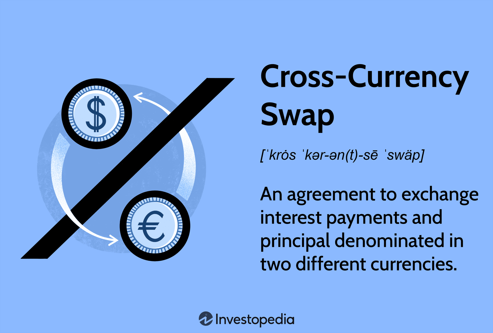

In today's ever-evolving financial landscape, foreign exchange (forex) trading has become a pivotal platform for global economic interaction. As one of the largest and most liquid markets in the world, forex provides immense opportunities for both individual traders and financial institutions. Currency trading serves as a vital tool for international trade and investment, as well as for ensuring economic stability through hedging and diversification.

The complexities of the forex market extend beyond mere currency exchange, encompassing various trading strategies and instruments. A critical facet of forex trading is the use of cross currency pairs, which enable the direct exchange of currencies that do not involve the U.S. dollar. This development simplifies transactions and provides traders with greater flexibility and potential opportunities for profit.

Moreover, the rise of algorithmic trading has revolutionized the forex market over recent years. Algorithmic trading employs sophisticated technology and pre-programmed strategies to execute trades with remarkable speed and precision. This approach minimizes human error and emotional decision-making, while maximizing the potential for capturing rapid market movements. By leveraging algorithmic trading, traders aim to enhance efficiency and achieve better overall returns in a competitive and fast-paced environment.

Understanding these aspects is essential for traders and financial professionals striving to harness the benefits and navigate the challenges of forex trading. As the market continues to evolve, staying updated with technological advancements and optimizing trading strategies are crucial for maintaining a competitive edge and capitalizing on future trends.

## Table of Contents

## Understanding Foreign Exchange Currency Trading

The foreign exchange (forex) market stands as the largest financial market globally, boasting a remarkable daily turnover that exceeds $6 trillion. This immense volume underscores its critical role in facilitating global economic activity. Forex trading is fundamentally the exchange of one currency for another and revolves around the use of currency pairs. A currency pair is a quotation of two different currencies, with the value of one currency being quoted against the other. 

In any given pair, the first currency listed is known as the base currency, while the second is referred to as the quote currency. For example, in the EUR/USD pair, the euro is the base currency, while the U.S. dollar is the quote currency. The price of the currency pair is determined by the supply and demand dynamics in the forex market, representing how much of the quote currency is needed to purchase one unit of the base currency.

The primary objective of [forex](/wiki/forex-system) trading is to capitalize on fluctuations in currency values. Traders aim to buy low and sell high, grasping the opportunity to profit from changes in currency exchange rates. This capability makes forex trading instrumental for international trade, investment hedging, and maintaining economic stability in an increasingly interconnected world. It enables corporations to hedge against currency risk and offers investors the opportunity to diversify their portfolios across different markets.

Forex markets can be categorized into three main groups based on the types of currency pairs traded: major, minor, and exotic pairs. Major currency pairs involve the world's most traded currencies and always include the U.S. dollar as either the base or the quote currency, such as EUR/USD, USD/JPY, and GBP/USD. These pairs are known for their high [liquidity](/wiki/liquidity-risk-premium) and narrow spreads. Minor currency pairs, on the other hand, do not include the U.S. dollar. Examples include EUR/GBP and AUD/NZD. While these pairs are still fairly liquid, they tend to have wider spreads when compared to major pairs. Lastly, exotic pairs consist of one major currency paired with a currency from a smaller or emerging economy, such as USD/TRY or USD/INR. These exotic pairs often exhibit higher [volatility](/wiki/volatility-trading-strategies) and lower liquidity, presenting both opportunities and risks for traders.

To effectively trade forex, it is essential to understand these concepts and the underlying mechanisms of currency pairs, which invariably involve analyzing economic indicators, geopolitical events, and various other factors that influence exchange rates. This foundational knowledge helps traders anticipate movements and make informed decisions in this dynamic market.

## Exploring Cross Currency Pairs in Forex Trading

Cross currency pairs enable traders to directly exchange currencies without involving the U.S. dollar, thereby simplifying and expediting transactions between non-USD currency pairs. Historically, such exchanges necessitated an initial conversion into the U.S. dollar, a process that was both time-consuming and potentially costly due to exchange rate fluctuations. However, cross currency pairs like EUR/GBP (Euro/British Pound) have streamlined this process, enabling more efficient and direct trade.

The introduction of cross currency pairs has provided traders with increased opportunities for both trading and hedging. By allowing for the direct conversion between non-USD currencies, cross pairs help traders manage currency exposure and diversify their trading strategies. This flexibility can be particularly beneficial in times of U.S. dollar volatility, where reliance on USD transactions could introduce additional risk.

Computing cross rates is fundamental to understanding cross currency pairs. A cross rate represents the exchange rate between two currencies not directly quoted against one another, instead derived through their individual rates against a third currency, often the U.S. dollar. To compute a cross rate, traders generally use the following formula:

$$
\text{Cross Rate} = \frac{\text{Currency A/USD}}{\text{Currency B/USD}}
$$

For instance, if the exchange rate for EUR/USD is 1.20 and GBP/USD is 1.30, the EUR/GBP cross rate can be calculated as:

$$
\text{EUR/GBP} = \frac{1.20}{1.30} \approx 0.923
$$

This computation illustrates that one Euro is equivalent to 0.923 British Pounds, providing traders with the direct exchange rate necessary for non-USD transactions.

The significance of cross rates extends beyond mere currency conversion; they also serve as vital tools for identifying discrepancies in currency valuation across different markets. Traders often exploit these discrepancies to engage in [arbitrage](/wiki/arbitrage), a strategy where they simultaneously buy low in one market and sell high in another, thereby profiting from temporary imbalances.

In conclusion, cross currency pairs have transformed forex trading by enhancing the efficiency of transactions between non-USD currencies and opening up new hedging and trading strategies. Understanding their computation and significance is a key skill for any forex trader seeking to maximize opportunities in the global currency market.

## Algorithmic Trading in Forex: Revolutionizing the Market

Algorithmic trading, often referred to as algo trading, has significantly transformed the forex market by automating trades through pre-determined instructions. This automation facilitates precision and efficiency, which are invaluable in the fast-paced environment of foreign exchange. A key component of algo trading is the use of algorithmic strategies that cater to varying market conditions and objectives. Among these, [trend following](/wiki/trend-following), arbitrage, and [market making](/wiki/market-making) stand out as prevalent strategies.

Trend following is a straightforward strategy that capitalizes on the [momentum](/wiki/momentum) of currency price movements. It involves the identification of strong directional trends and executing trades in the direction of these trends with the expectation that they will continue. Trend-following algorithms often utilize technical indicators such as moving averages and the Relative Strength Index (RSI) to confirm trend persistence.

Arbitrage strategies, on the other hand, exploit price discrepancies between different markets or currency pairs. In the context of forex, arbitrage can involve taking advantage of mismatched currency prices in various geographical locations or even exploiting temporary inefficiencies within different currency pairs. Algorithms designed for arbitrage are typically programmed to respond instantly to these discrepancies, executing simultaneous buy and sell orders to derive profit from the price differential before market corrections occur.

Market making involves providing liquidity to the forex market by continuously offering to buy and sell currency pairs at specified prices. Algorithms in market-making strategies aim to benefit from the bid-ask spread while maintaining inventory control. These algorithms are sophisticated, often employing advanced statistical models to manage risk and adjust pricing dynamically based on market conditions.

The impact of [algorithmic trading](/wiki/algorithmic-trading) on the forex market is profound. One notable benefit is the reduction in transaction costs due to the increased speed and efficiency with which trades are executed. These systems can analyze vast amounts of market data in real time, allowing traders to exploit fleeting opportunities that manual trading would miss. Moreover, algo trading minimizes human error and emotion, two factors that can negatively impact trading outcomes. This computational approach allows for the rapid execution of high-frequency trades, ensuring positions are adapted dynamically to the rhythm of the market.

Through these advancements, algorithmic trading has redefined the operational framework of the forex market, offering traders enhanced tools to navigate its complexities. As the technology continually evolves, it provides the potential for even greater optimization in trading strategies, enabling participants to capture opportunities with unprecedented precision and reliability.

## Benefits and Challenges of Algo Trading in Cross Currencies

Algorithmic trading has fundamentally reshaped the landscape of the foreign exchange (forex) market, particularly in trading cross currency pairs. By leveraging sophisticated technology and strategies, algorithmic trading offers several benefits that make trading more efficient, precise, and free from emotional bias, which often affects human decision-making. 

One of the primary advantages of algorithmic trading systems in cross currencies is speed. Algorithms can execute trades at a fraction of a second, far surpassing human capability. This speed ensures that traders can capitalize on fleeting market opportunities and react swiftly to changes in market conditions. Additionally, the efficiency brought about by these systems aids in handling large volumes of trades, thereby minimizing manual intervention and the associated errors.

Efficiency and precision in trade execution also contribute to reducing transaction costs. Algorithmic trading systems can execute complex strategies that require rapid market entry and [exit](/wiki/exit-strategy), such as arbitrage between cross currency pairs, with minimal slippage and lower brokerage fees. For example, trading cross currencies like EUR/JPY or GBP/CHF can be optimized through precise calculation of cross rates, thereby opening up arbitrage opportunities that can be exploited quickly.

However, alongside these benefits, algorithmic trading in cross currencies presents challenges that traders must navigate. The reliance on robust algorithms is critical; poorly designed algorithms can lead to significant financial losses. Ensuring that these algorithms are tested rigorously under various market conditions is essential for success. Moreover, system failures, such as connectivity issues or software bugs, can disrupt trading operations. Developing fail-safes and contingency plans is crucial to mitigate potential losses.

Furthermore, regulatory compliance represents another significant challenge. As algorithmic trading can have a pronounced impact on market liquidity and volatility, regulatory bodies worldwide are imposing stricter guidelines. Traders must ensure their systems comply with these regulations to avoid penalties and maintain market integrity.

Algorithmic trading also optimizes currency pair and cross rate trading by utilizing advanced computational techniques and big data analytics to forecast market trends and identify the best trading opportunities. These systems can analyze vast amounts of historical and real-time data to generate predictive models that guide trading strategies. As a result, traders can identify and exploit pricing inefficiencies in cross currency pairs, even in volatile market conditions.

In summary, while algorithmic trading systems offer substantial advantages in trading cross currencies, such as speed, efficiency, and cost reduction, the associated challenges require careful consideration. Robust algorithm design, thorough testing, effective risk management, and adherence to regulatory frameworks are essential to fully harness the potential of algorithmic trading in this dynamic market.

## Future Trends in Forex Algo Trading

Emerging technologies, particularly [artificial intelligence](/wiki/ai-artificial-intelligence) (AI) and [machine learning](/wiki/machine-learning) (ML), are at the forefront of transforming algorithmic trading in the foreign exchange (forex) market. These technologies offer the potential to enhance predictive analytics, enabling traders to make more informed decisions based on complex data patterns and trends that were previously difficult to detect. AI systems can analyze vast amounts of market data, identify patterns, and execute trades with minimal human intervention, thereby increasing efficiency and accuracy.

Machine learning models, especially [deep learning](/wiki/deep-learning), are becoming integral in developing predictive models. They can analyze historical data to forecast market trends, adapting to new data inputs dynamically. For example, the use of recurrent neural networks (RNNs) and [long short](/wiki/equity-long-short)-term memory networks (LSTMs) allows models to consider time-sequence data, which is crucial for predicting price movements in forex trading. The utilization of [reinforcement learning](/wiki/reinforcement-learning) also offers opportunities for creating algorithms that learn optimal trading strategies through interactions with the market environment.

The rise of cloud-based trading platforms is another trend shaping the future of forex algorithmic trading. These platforms offer significant advantages in terms of scalability, speed, and accessibility. Traders can leverage these services to deploy their trading algorithms without investing heavily in physical infrastructure. Cloud technology facilitates real-time data processing and storage, which are essential for executing complex trading strategies efficiently.

In addition, big data analytics is expected to further revolutionize the forex market. By analyzing large datasets from diverse sources, big data solutions can provide insights that enhance the reliability of trading models. They facilitate the identification of market sentiment, economic indicators, and social media trends, all of which can influence currency values and trading decisions. The integration of big data analytics with AI and ML models allows for more comprehensive analysis and more accurate predictions of market behavior.

For forex traders aiming to stay competitive, these technological advancements offer both opportunities and challenges. Adopting AI and machine learning technologies requires significant investment in skilled personnel and resources to develop, maintain, and optimize algorithms. Traders must also be adept at handling large datasets and understanding the ethical considerations related to data privacy and algorithmic decision-making.

Moreover, as technologies evolve, regulatory frameworks will need to adapt to ensure market integrity and protect participants from systemic risks associated with fully automated trading systems. Traders will have to navigate these evolving regulations while leveraging technology effectively.

In conclusion, the future of forex algorithmic trading is poised for continuous growth driven by AI, machine learning, cloud computing, and big data analytics. Staying abreast of these trends and incorporating them into strategic planning will be crucial for traders aiming to maintain a competitive edge in an increasingly technology-driven market.

## Conclusion

Foreign exchange currency trading operates as a dynamic and intricate component of the global financial system. With an average daily turnover surpassing $6 trillion, it serves as a vital arena for international trade, investment, and economic stability. Cross currency pairs have streamlined the trading process by enabling direct transactions between non-U.S. dollar currencies, thereby broadening the landscape for trading opportunities and hedging strategies. These pairs, by bypassing the need for conversion to and from the U.S. dollar, allow for more efficient and potentially lucrative transactions.

In parallel, the advent of algorithmic trading has brought about a fundamental shift in how trading is conducted in the forex market. By automating the trading process through sophisticated algorithms, traders are able to execute transactions with unprecedented speed and accuracy, reduce transaction costs, and minimize human errors. Algorithmic trading enables the exploitation of minute price discrepancies and rapid market movements, activities that would be nearly impossible without computational assistance.

The intersection of these technologies underscores the crucial role of innovation in navigating the challenges of the forex market. As the market evolves, so too must the strategies employed by traders and financial professionals. Incorporating emerging technologies such as artificial intelligence, machine learning, and big data analytics will be key to maintaining competitiveness. These innovations promise to further enhance the capabilities of algorithmic trading, allowing for more refined data analysis, predictive modeling, and decision-making processes.

Traders must embrace a mindset of continual learning and adaptation, given the rapid pace of technological change and the complexity of the forex market. Staying informed about technological advancements and regulatory changes is essential to effectively capitalize on upcoming opportunities. This continuous evolution necessitates an ongoing commitment to understanding and applying new tools and strategies to remain successful in this highly competitive sphere.

Ultimately, the fusion of human strategic thinking with technological advancement offers a powerful avenue to navigate the complexities and capitalize on the opportunities within forex trading. The combination of cross currency trading and algorithmic strategies holds promise for more efficient, responsive, and profitable trading engagements, thus ensuring that those who leverage these innovations effectively will remain at the forefront of the forex market's future.

## References & Further Reading

## References & Further Reading

1. **"Foreign Exchange: The Complete Guide" by David F. DeRosa**  
   This book offers a comprehensive overview of the forex market, detailing its mechanisms and intricacies. DeRosa's work is a vital resource for beginners and seasoned traders alike, providing insights into both the historical context and contemporary practices in currency trading.

2. **"Algorithmic Trading: Winning Strategies and Their Rationale" by Ernie Chan**  
   Ernie Chan presents a practical guide to developing algorithmic trading strategies. This book covers essential concepts, including [statistical arbitrage](/wiki/statistical-arbitrage) and trend following, which are crucial for creating and implementing effective trading algorithms in the forex market.

3. **"FX Derivatives Trader School" by Giles Jewitt**  
   Jewitt's book is an essential read for those interested in the technical aspects of [FX](/wiki/fx-anomaly) derivatives and the practical applications of algorithmic strategies in forex trading. It provides readers with a deep understanding of various cross currency pairs and derivatives trading.

4. **"High-Frequency Trading: A Practical Guide to Algorithmic Strategies and Trading Systems" by Irene Aldridge**  
   This publication examines the role of high-frequency trading ([HFT](/wiki/high-frequency-trading-strategies)) in modern markets, focusing on its implementation in forex. Aldridge explains how HFT can optimize trading processes and the importance of creating robust algorithms to minimize risks.

5. **Academic Journals on Algorithmic Trading**  
   Significant research studies, such as those published in the *Journal of Financial Markets* and *Quantitative Finance*, offer insights into the dynamics and evolution of algorithmic trading. These papers often explore advanced topics like machine learning applications and risk management in trading strategies.

6. **Online Platforms and Courses**  
   Websites like Coursera, Khan Academy, and Investopedia provide free or affordable courses and resources focused on forex trading and algorithmic strategy development. These platforms allow traders to expand their knowledge through interactive content and expert instruction.

7. **"The Forex Trading Course: A Self-Study Guide to Becoming a Successful Currency Trader" by Abe Cofnas**  
   Cofnas provides a structured approach to learning forex trading fundamentals and advanced strategies, with a focus on practical application. This guide is particularly useful for traders aiming to understand the nuances of various currency pairs and market dynamics.

8. **Web Technologies and Tools**  
   Open-source platforms such as QuantConnect and QuantLib offer tools for developing and testing algorithmic trading strategies. These resources are essential for traders interested in exploring Python and C++ applications to enhance trading precision and efficiency.

These materials provide a well-rounded approach to understanding and mastering forex trading and algorithmic strategies, offering valuable insights into both foundational concepts and cutting-edge advancements in the industry.