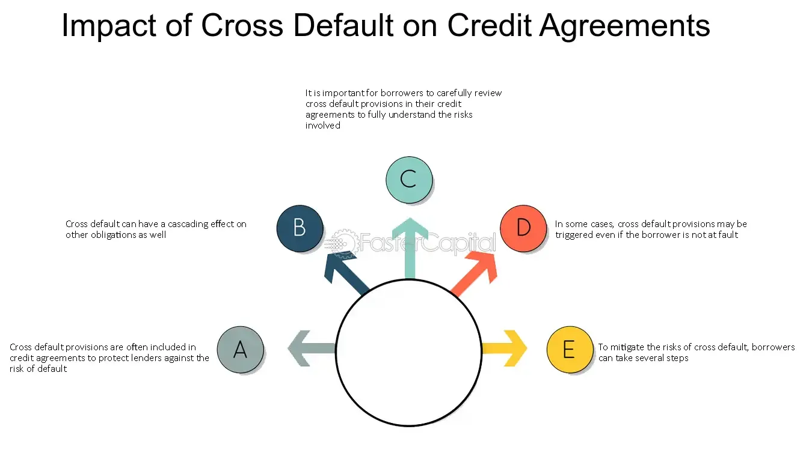

## Table of Contents

## What is a cross default clause?

A cross default clause is a part of a loan agreement or contract that says if you default on one loan, it can cause you to default on another loan too. For example, if you miss payments on one loan, the cross default clause can make all your other loans due immediately, even if you were paying those other loans on time.

This clause is used by lenders to protect themselves. If a borrower is having trouble paying one loan, it might mean they are having financial problems overall. The cross default clause helps lenders get their money back faster by making all loans due at the same time. It can be risky for borrowers because it can make their financial situation worse if they can't pay all the loans at once.

## How does a cross default clause work in financial agreements?

A cross default clause in financial agreements means that if you fail to meet the terms of one loan, it can trigger a default on another loan too. For example, if you miss a payment on one loan, the cross default clause can make all your other loans due right away, even if you were keeping up with those payments. This clause is put in place by lenders to protect themselves because if you're struggling with one loan, it might mean you're having money problems overall.

Lenders use the cross default clause to get their money back quicker if they think you might not be able to pay them back. If you default on one loan, the clause can cause all your loans to become due at the same time, which can make things very hard for you if you can't pay everything at once. It's a way for lenders to manage risk, but it can be risky for you as a borrower because it can make your financial situation worse if you're not prepared.

## What are the typical triggers for a cross default?

A cross default is usually triggered when you don't follow the rules of one of your loans. This can happen if you miss a payment, go over your credit limit, or break any other terms of your loan agreement. When you do this, the cross default clause can make all your other loans due right away, even if you were keeping up with those payments.

Lenders use cross default clauses to protect themselves. If you can't pay one loan, it might mean you're having money problems overall. The clause helps them get their money back faster by making all your loans due at the same time. This can be risky for you as a borrower because it can make your financial situation worse if you can't pay everything at once.

## Can you explain the difference between cross default and cross acceleration?

Cross default and cross acceleration are two terms you might see in loan agreements, and they can affect how you handle your loans. Cross default means that if you miss a payment or break any rules on one loan, it can make all your other loans due right away. This can happen even if you were keeping up with the payments on those other loans. It's like a chain reaction where one problem can cause all your loans to become due immediately.

Cross acceleration is a bit different. With cross acceleration, if you miss a payment or break the rules on one loan, it doesn't automatically make your other loans due right away. Instead, it gives the lender the option to demand full payment on the other loans if they want to. So, it's not automatic like cross default, but it still gives the lender more power to get their money back if they think you're having trouble paying your loans.

Both cross default and cross acceleration can make things harder for you as a borrower. They're tools that lenders use to protect themselves, but they can make your financial situation worse if you're not prepared to pay all your loans at once.

## What are the potential consequences of a cross default for a borrower?

If a cross default happens, it can be really hard for a borrower. It means that if you miss a payment or break the rules on one loan, all your other loans can become due right away. This can make your financial situation much worse because you might not have the money to pay everything at once. It can lead to a lot of stress and make it hard to keep up with your bills.

The cross default clause can also hurt your credit score. If you can't pay all your loans when they become due, the lenders might report this to credit agencies. A lower credit score can make it harder to get loans in the future, and you might have to pay higher interest rates. This can make it even harder to get out of financial trouble.

In some cases, cross default can even lead to bankruptcy. If you can't pay all your loans at once, you might have to declare bankruptcy to get some relief. This can have long-term effects on your financial life and make it very difficult to recover. So, it's important to be careful and try to avoid triggering a cross default if you can.

## How can a cross default impact a company's credit rating?

When a company triggers a cross default, it can really hurt its credit rating. This happens because a cross default means the company didn't pay one loan on time, which makes all its other loans due right away. If the company can't pay all those loans at once, lenders might tell credit agencies about it. Those agencies then lower the company's credit score because they see the company as riskier. A lower credit score can make it harder for the company to borrow money in the future.

Having a lower credit rating can also mean the company has to pay higher interest rates on new loans. This makes borrowing more expensive and can put more pressure on the company's finances. If the company keeps struggling to pay its loans, its credit rating might keep going down, making it even harder to get out of financial trouble. So, a cross default can start a cycle that makes a company's financial situation worse and worse.

## What industries are most affected by cross default provisions?

The industries most affected by cross default provisions are often those that rely heavily on borrowing money to operate, like real estate and construction. In real estate, companies might have several loans for different properties. If they miss a payment on one loan, the cross default clause can make all their other loans due right away. This can be really hard for them because real estate projects take a long time to finish and start making money.

Another industry that can be hit hard by cross default is energy, especially oil and gas. These companies often have big loans to pay for drilling and exploration. If the price of oil drops, they might not make enough money to pay their loans on time. If they miss a payment, the cross default clause can make all their loans due at once, which can be a big problem if they don't have the cash to pay everything. So, these industries need to be careful with their loans to avoid triggering a cross default.

## How do lenders benefit from including a cross default clause in contracts?

Lenders benefit from including a cross default clause in contracts because it helps them get their money back faster if a borrower starts having financial problems. If a borrower misses a payment on one loan, the cross default clause can make all their other loans due right away. This way, the lender can demand payment on all the loans at the same time, which reduces the risk that the borrower won't be able to pay them back.

The cross default clause also gives lenders more control over the situation. If they see that a borrower is struggling with one loan, they can use the clause to protect their investment in other loans too. This helps lenders manage their risk better because they can take action quickly if they think the borrower's financial situation is getting worse.

## What are the legal implications of a cross default in different jurisdictions?

The legal implications of a cross default can be different in various places around the world. In some countries, the laws might make it easier for lenders to use cross default clauses to get their money back quickly. For example, in places with strong creditor rights, a lender can move fast to demand payment on all loans if a borrower misses one payment. But in other countries, the laws might be more protective of borrowers. They might have rules that make it harder for lenders to use cross default clauses, or they might give borrowers more time to fix their problems before all their loans become due.

In the United States, for instance, the legal system generally supports the enforcement of cross default clauses, but there can be variations from state to state. Courts might look at the specific terms of the loan agreement and decide if the cross default clause is fair. If a borrower thinks the clause is too harsh, they might be able to challenge it in court. In Europe, different countries have their own rules. Some might have strict regulations to protect borrowers, while others might be more lenient towards lenders. So, it's important for both lenders and borrowers to know the local laws where they are doing business to understand how a cross default might affect them.

## How can companies mitigate the risks associated with cross default clauses?

Companies can mitigate the risks of cross default clauses by being very careful with their money and keeping a close eye on their loan agreements. They should make sure they always have enough cash to pay their loans on time. If they see they might miss a payment, they should talk to their lenders early to see if they can work out a new plan. It's also a good idea to spread out their loans with different lenders, so if they have trouble with one loan, it won't affect all their other loans at once.

Another way to lower the risk is to read loan agreements carefully before signing them. Companies should try to negotiate the terms of the cross default clause to make it less strict. They might be able to add some conditions that give them more time to fix a problem before all their loans become due. Keeping good relationships with lenders can also help. If lenders trust the company, they might be more willing to give the company some flexibility if it runs into trouble.

## What are some real-world examples of cross default events and their outcomes?

In 2008, during the financial crisis, Lehman Brothers faced a big problem because of cross default clauses. Lehman had lots of loans and investments. When they couldn't pay one of their loans, the cross default clause made all their other loans due right away. This made their financial problems even worse and led to them going bankrupt. Lehman's bankruptcy was one of the biggest in history and caused a lot of trouble for the whole financial world.

Another example is the energy company Enron in the early 2000s. Enron had many loans and used cross default clauses in their agreements. When people found out Enron was hiding its money problems, they lost trust in the company. This made Enron's stock price fall a lot, and they couldn't pay their loans. The cross default clauses kicked in, making all their loans due at once. This pushed Enron into bankruptcy too, and it was a big lesson for other companies about the risks of cross default clauses.

## How have cross default clauses evolved in response to global financial crises?

After big financial problems like the 2008 crisis, people started to look more closely at cross default clauses. They saw how these clauses could make things worse for companies and even cause more problems for the whole economy. So, lenders and borrowers began to change how they used these clauses. Lenders started to be more careful about putting these clauses in loan agreements. They also added more rules to make sure the clauses were fair and didn't cause too much trouble. Borrowers, on the other hand, started to negotiate harder to make the terms of the clauses less strict. They wanted to have more time to fix any problems before all their loans became due at once.

In the years after the crisis, laws and rules about cross default clauses also changed in some places. Governments and financial groups made new rules to protect both lenders and borrowers. They wanted to stop one company's problems from causing a big mess for everyone. These new rules made it harder for cross default clauses to be used in a way that could hurt the economy. As a result, companies and lenders had to be more careful and think more about how these clauses could affect them and others. This helped make the financial world a bit safer, but cross default clauses are still a big deal and can cause trouble if not handled right.

## References & Further Reading

[1]: Erdogan, B., & Tuzmen, G. (2022). ["Cross-default Provisions: The Case for Reform."](https://www.researchgate.net/publication/304188804_Leader-Member_Exchange_Theory) Journal of Financial Regulation Studies.

[2]: Bodie, Z., Kane, A., & Marcus, A. J. (2018). ["Investments and Portfolio Management,"](https://www.amazon.com/Investments-Portfolio-Management-Zvi-Bodie/dp/0071289143) 11th Edition, McGraw-Hill Education.

[3]: Choudhry, M. (2010). ["The Bond and Money Markets: Strategy, Trading, Analysis."](https://www.sciencedirect.com/book/9780750646772/the-bond-and-money-markets) Wiley.

[4]: Hull, J. C. (2018). ["Risk Management and Financial Institutions."](https://books.google.com/books/about/Risk_Management_and_Financial_Institutio.html?id=1J1QDwAAQBAJ) 5th Edition, Wiley.

[5]: Fabozzi, F. J., & Kothari, V. (2008). ["Introduction to Securitization."](https://onlinelibrary.wiley.com/doi/book/10.1002/9781118266892) Wiley Financial Series.

[6]: Schwark, F., & Pointon, C. (2009). ["Cross-default Clauses in Loan Agreements: A Comparative Study."](https://www.hcmp.com/blog/cross-collateralization-and-cross-default-clauses-in-commercial-loan-documents-know-the-difference) Journal of Financial Markets and Portfolio Management.