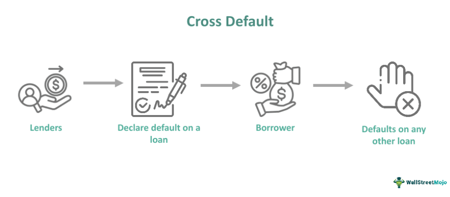

Understanding the nuances of financial agreements is paramount for both lenders and borrowers in the financial sector. These agreements often contain various provisions and default clauses, which serve as tools to manage and mitigate risks. Among the most complex are cross-default and loan default provisions. This article aims to clarify these concepts and elucidate their importance in financial dealings.

Loan defaults occur when borrowers fail to adhere to the terms stipulated in their agreements, potentially leading to significant financial repercussions. They may affect a borrower's ability to secure future financing and can disrupt their broader financial obligations. Understanding the mechanisms of loan defaults helps stakeholders anticipate the impact of unmet obligations across different agreements.



Cross-default provisions further complicate the landscape by linking the default of one financial instrument to others held by the same borrower. This interconnectedness means that a default on a single loan can trigger defaults on multiple obligations, creating a cascade or domino effect. Such clauses are strategic for lenders aiming to safeguard their interests but can be perilous for borrowers managing complex financial portfolios.

This article sets the stage for a detailed examination of these provisions, highlighting how they shape financial actions and strategies. It underscores the importance of careful financial assessment and structuring of agreements to mitigate the cascading risks inherent in cross-default scenarios. As financial instruments grow increasingly interconnected, understanding these dynamics becomes even more critical to maintaining stability and ensuring mutual benefits in lending relationships.

## Table of Contents

## Understanding Loan Defaults

In financial terms, a loan default occurs when a borrower fails to meet the contractual obligations of a loan agreement, typically by missing scheduled payments. Loan defaults can be categorized into different types, with the most common being technical and cross-defaults. A technical default occurs when a borrower violates a term or condition of the loan agreement, not related to payment, such as failing to maintain a certain financial ratio or deliver required documents. Cross-default, on the other hand, is a clause that signals a default across multiple agreements if a borrower defaults on a single obligation, which is covered in detail in a subsequent section of this article.

The risks tied to loan defaults are significant for both lenders and borrowers. From a lender's perspective, a default poses a risk of financial loss, as the lender may not receive the expected returns on the loan. This situation can prompt the lender to initiate asset recovery processes or renegotiate loan terms, both of which can be costly and time-consuming. Lenders also face increased financial scrutiny and regulatory pressures when managing defaulted loans.

Borrowers experience severe consequences too; a default can lead to increased borrowing costs, legal actions from lenders, and credit score damage, affecting future borrowing capabilities. Moreover, defaulting can obligate borrowers to pay the entire loan in full immediately or lose collateral assets.

Preventative strategies against loan defaults include comprehensive financial assessments before entering into agreements. Borrowers are encouraged to maintain a stable income flow, keep an accurate budget, and anticipate potential financial challenges to avoid missing payments. Regular communication with lenders can also lead to opportunities to renegotiate terms more favorable to the borrower's current financial condition, thereby preventing defaults.

For lenders, rigorous credit assessments and a detailed understanding of a borrower's financial health before disbursing loans can mitigate risks. Structuring the loan with appropriate covenants helps monitor the borrower’s financial engagements and detect early signs of distress, allowing lenders to take proactive measures.

In conclusion, understanding loan defaults, including their types and implications, is critical to maintaining financial health for both borrowers and lenders. Comprehensive assessments and strategic planning are essential safeguards in the complex landscape of financial agreements.

## What is Cross-default?

Cross-default is a significant provision in financial agreements, serving as a protective mechanism for lenders. It is a specific clause that stipulates that a default in one financial obligation can trigger a default across other related agreements. This interconnectedness ensures that lenders maintain a consistent level of risk management across all financial instruments associated with a borrower.

### Criteria for Triggering Cross-default

The activation of a cross-default provision typically hinges on certain criteria, which may include:

1. **Missed Payments**: The most common trigger is the failure to meet scheduled payments, whether they are interest, principal, or other amounts due as stipulated in any financial agreement.

2. **Breach of Terms**: Any breach of the covenants within a financial contract beyond payment issues can also initiate a cross-default. This may include violating financial ratios, failing to maintain collateral value, or other agreed-upon obligations.

Such triggers are designed to promptly signal potential financial instability and allow lenders to take protective actions.

### Widespread Financial Repercussions

The effects of triggering a cross-default clause can be far-reaching. For borrowers, the primary repercussion is a sudden acceleration of debt obligations, where multiple loans may be called in or repayment schedules may be accelerated. This can severely strain the financial [liquidity](/wiki/liquidity-risk-premium) of the borrower, leading to further defaults and even bankruptcy in extreme cases. Companies may also suffer from damaged reputations, making future financing more difficult or more expensive to obtain.

For example, if a corporation defaults on a loan with one lender, under a cross-default clause, other lenders could demand immediate repayment of debts, potentially destabilizing the company’s financial structure.

### Strategies to Avoid Triggering Cross-default

To mitigate the risks associated with cross-default provisions, borrowers can adopt various strategies, including:

- **Robust Financial Planning**: Adequate financial forecasting and maintaining sufficient liquidity can help in ensuring timely payment of obligations, thus avoiding defaults.

- **Negotiation with Lenders**: Borrowers might negotiate with lenders to either modify existing cross-default terms or remove them, especially if they can demonstrate strong financial health and reliability.

- **Maintaining Open Communications**: Regularly updating lenders about the financial health and intentions of the borrowing entity can build trust and potentially provide leverage in renegotiating terms, should a challenging financial situation arise.

By understanding these aspects and maintaining disciplined financial practices, borrowers can effectively manage their obligations and minimize the risk of triggering a cross-default.

## Cross-default Clause in Loan Agreements

Cross-default clauses are integral components of loan agreements, providing a safeguard for lenders by linking the default of one financial instrument to others. These clauses are embedded within loan agreements to manage risk across an interconnected array of financial obligations. The cross-default provision operates on the principle that a default on one loan or financial obligation can trigger a default across all related agreements. This stipulation is especially prevalent in loan agreements involving corporate borrowers with complex financial structures.

**Structure and Typical Terms**

The structuring of cross-default clauses is crucial, as it defines the scope and conditions under which the clause will be activated. Typically, these clauses specify the exact events of default that can initiate a cross-default. Common triggers include missed payments, breaches of financial covenants, or insolvency proceedings. For instance, a clause might state that if a borrower defaults on a payment for any loan over a certain threshold amount, it constitutes a cross-default, thereby affecting other loans and financial agreements.

```plaintext
Cross-default threshold: Default is triggered if obligations in excess of $X are not met.
```

In some cases, the clause may include a grace period, allowing the borrower to rectify the default before it escalates to a cross-default scenario. Additionally, the specificity and thresholds of the amounts that trigger a cross-default are often a focal point in drafting these clauses. 

**Linguistic Nuances and Clarity**

The precise language used in cross-default clauses plays a significant role in their enforceability and applicability. Ambiguities in wording can lead to disputes, making clarity and specificity paramount. Legal language must clearly delineate what constitutes a default, the timeline for rectification, and the implications for other agreements. By ensuring the clause is unambiguous, lenders and borrowers can minimize the potential for disagreements.

For example, the phrase "any payment default" might be substituted with "any default exceeding $X," which provides a clear quantifiable measure. Legal advisors often draft these clauses with potential litigation in mind, crafting language that precludes varied interpretations.

**Negotiation Tactics for Borrowers**

Borrowers facing loan agreements with stringent cross-default conditions can employ various strategies to negotiate favorable terms. One effective tactic is to argue for higher thresholds or longer cure periods, thus reducing the likelihood of a minor default triggering a broader financial crisis. Another approach is to limit the cross-default clause to specific, larger debts rather than all indebtedness, which can prevent a minor obligation from snowballing into a major default.

Borrowers may also seek to insert 'standstill' provisions, which require lenders to provide notice and an opportunity to cure before declaring a cross-default. This tactic grants borrowers time to address possible issues without immediate penalties.

Moreover, borrowers can leverage their financial stability and market position in negotiations, offering assurances of their creditworthiness in exchange for more lenient cross-default clauses. By proactively engaging lenders and clearly communicating their financial strategy, borrowers can often mitigate the harshest elements of these clauses.

In summary, cross-default clauses are a pivotal element within loan agreements that necessitate careful drafting and negotiation. Clarity in language and strategic negotiations can considerably alter the risk profile associated with these provisions, safeguarding both borrowers and lenders from unforeseen financial reverberations.

## Impacts of Cross-default

Cross-default provisions can exert a significant influence on a borrower's financial stability, primarily through the triggering effect that causes defaults beyond the initially affected loan. This clause, often incorporated in loan agreements, can create a domino effect: if a borrower defaults on one financial obligation, it can automatically trigger defaults on other obligations. This scenario can rapidly escalate financial distress for borrowers, intensifying their inability to meet multiple commitments simultaneously.

From the lender's perspective, cross-default clauses serve as a prudent risk management strategy. By ensuring that a default on one obligation leads to the reassessment and, potentially, early resolution of others, lenders can proactively manage their risk exposure. These clauses offer a mechanism where lenders can seek repayments or renegotiate terms under the pretext of default across interconnected financial instruments, thereby safeguarding their financial interests.

Notable examples of the destabilizing impact of cross-default can be discerned from historical cases. For instance, during the financial crisis of 2007-2008, several large corporations, entangled in complex webs of financial agreements, faced cascading defaults. The interconnectedness of their financial obligations meant that a default on one bond or loan had far-reaching implications, often propelling corporations into broader financial jeopardy.

One illustrative case is that of Lehman Brothers, where cross-default provisions exacerbated the collapse. The company's failure to meet obligations on specific credit agreements triggered cross-defaults, accelerating their financial deterioration and contributing to systemic financial instability. These high-profile cases highlight the essential role of cross-default clauses in either stabilizing or destabilizing financial landscapes, depending on their deployment and the financial health of involved entities. Understanding these impacts allows both lenders and borrowers to navigate the complexities of financial agreements more strategically, with a keen appreciation of the potential repercussions embedded within cross-default provisions.

## How to Avoid Cross-default?

To prevent cross-defaults, strategic financial planning is imperative. One crucial step involves maintaining proactive and open communication with creditors. This can include scheduling regular updates to discuss the borrower's financial health and any potential issues. Such transparency can foster mutual trust and allow for early interventions if financial strains surface.

Negotiation of loan terms is another critical strategy. Borrowers should ensure that the conditions of all financial obligations are feasible given their current and anticipated financial status. This could involve seeking longer repayment periods, lower interest rates, or temporary payment reductions during periods of expected financial difficulty.

Restructuring existing obligations is also vital. Borrowers may consolidate several smaller debts into a single, more manageable loan, often with a longer term and lower [interest rate](/wiki/interest-rate-trading-strategies). This can alleviate immediate cash flow pressures and reduce the risk of a single default triggering cross-default clauses across multiple obligations.

Furthermore, maintaining a robust financial buffer—such as a contingency reserve—can help. By setting aside a portion of revenue or profits periodically, borrowers can create a safety net to cover unforeseen shortfalls, thereby reducing the likelihood of default.

Regular financial assessments and audits can also play a significant role in early identification of risks. By employing predictive analytics and financial modeling, borrowers can anticipate future cash flows and financial obligations. Here's a basic example in Python to assess financial health:

```python
def calculate_financial_health(current_liabilities, projected_income, savings_reserve):
    # Estimate buffer after covering liabilities
    buffer = projected_income + savings_reserve - current_liabilities
    return buffer

# Example data
liabilities = 50000
income = 60000
reserve = 10000

# Calculate buffer
financial_buffer = calculate_financial_health(liabilities, income, reserve)

if financial_buffer > 0:
    print("Financially healthy with a buffer of:", financial_buffer)
else:
    print("Potential financial strain detected.")
```

This code helps borrowers assess their financial situation by calculating the buffer available after covering current liabilities, providing an indication of their ability to meet their obligations without defaulting.

## Relationship Between Loan Defaults and Cross-default

In financial agreements, understanding the relationship between loan defaults and cross-default provisions is critical for managing risk. A loan default occurs when a borrower fails to meet the terms of their loan agreement, such as missing a payment or breaching other contractual obligations. When a borrower defaults on a loan, it can trigger a cross-default clause, which is a provision in a loan or bond agreement that puts the borrower in default across multiple contracts. 

The direct relationship between loan defaults and cross-default occurs when a borrower’s default on one financial instrument causes a chain reaction, leading to defaults on other agreements. This connection is often stipulated in the loan agreement itself, where the cross-default clause specifies that a default on one obligation triggers defaults on other obligations. For instance, if a company defaults on its bank loan, the cross-default clause may result in its corporate bonds being considered in default as well, even if those obligations are otherwise current.

Indirectly, loan defaults can escalate financial instability, making cross-default scenarios more likely. For example, a loan default can negatively impact a borrower's credit rating, which may lead to increased borrowing costs or reduced access to new financing. This, in turn, increases the risk of failing to meet other financial obligations, thereby potentially triggering cross-default clauses. Additionally, if the loan default arises from a systemic issue, such as a downturn in the borrower's industry, it can increase the risk across various financial agreements that are interconnected through cross-default clauses.

To mitigate these risks, borrowers and lenders alike must engage in comprehensive risk assessments before finalizing loan agreements. Financial covenants can be structured to provide early warning indicators of financial distress, allowing for proactive management strategies. For borrowers, maintaining open lines of communication with creditors is vital; renegotiating terms or restructuring existing obligations can prevent loan defaults and avoid triggering cross-default clauses. For lenders, implementing cross-default provisions can be a powerful risk management tool, although these should be balanced with the borrower’s capacity to meet all financial obligations.

Furthermore, strategic financial planning involves stress-testing scenarios to evaluate how a default in one area might affect overall financial stability. By understanding these relationships and taking preventative measures, both parties can navigate the complexities of loan defaults and cross-defaults more effectively.

## Legal Implications of Cross-default

Legal implications surrounding cross-default provisions are integral to understanding their enforceability and the challenges involved in seeking remedies across different jurisdictions. Cross-default clauses are primarily embedded within loan agreements to protect lenders by triggering a default event if a borrower defaults on any other agreement. Despite their protective nature, these clauses present complex legal considerations due to variations in legal frameworks globally.

### Enforceability Across Jurisdictions

The enforceability of cross-default clauses can vary significantly depending on the jurisdiction. In common law countries like the United States and the United Kingdom, such clauses are generally enforceable if clearly drafted and agreed upon by the parties involved. Courts in these jurisdictions tend to uphold freedom of contract, provided that the terms are not unconscionable or against public policy. Therefore, a lender can often rely on a cross-default clause to demand immediate repayment or seek other remedies if the borrower defaults on another obligation.

In contrast, civil law jurisdictions may impose stricter regulations to ensure fairness and prevent excessive punitive measures against borrowers. For instance, courts in countries like France and Germany may scrutinize the proportionality and transparency of cross-default clauses, potentially limiting their enforceability if deemed overly broad or punitive. This necessitates precise drafting and negotiation to ensure clauses are compliant with local legal expectations.

### Potential Challenges

1. **Ambiguity in Drafting**: One significant challenge is the ambiguity that can arise in the drafting of cross-default clauses. Legal terms require clarity to avoid disputes over interpretations. For example, what constitutes a "material" default or the specific financial instruments covered by the clause can be contested, leading to legal challenges.

2. **Conflict of Laws**: In international agreements, determining which jurisdiction’s laws apply can be contentious. Parties must specify a governing law provision to mitigate such disputes. Additionally, the principle of comity, which refers to legal reciprocity, may affect how foreign courts view the enforceability of cross-default clauses originated from different jurisdictions.

3. **Jurisdictional Challenges**: Enforcing a cross-default clause can also encounter jurisdictional challenges. Courts may differ in their approach to cross-border financial instruments and related defaults. Lenders might face obstacles in countries where enforcement practice is more lenient toward borrowers, requiring comprehensive understanding and anticipation of jurisdiction-specific legal landscapes.

4. **Remediation and Bankruptcy Laws**: The interaction between cross-default clauses and bankruptcy laws presents another complex layer. Bankruptcy courts may prioritize the orderly resolution of a borrower’s debts, possibly mandating a stay on enforcement actions, including those triggered by cross-defaults. This can thwart lender attempts to invoke clauses immediately upon a borrower’s default.

### Conclusion

Legal frameworks governing cross-default clauses are not uniform and present unique challenges in terms of enforceability and seeking remedies. These challenges suggest the necessity for clear, well-negotiated agreements and an astute understanding of international legal environments. Lenders and borrowers must navigate these implications carefully to mitigate risks and protect their respective interests.

## Conclusion

The exploration of cross-default and loan defaults underscores their pivotal roles in maintaining the stability and predictability of financial markets. The cross-default clause acts as a safeguard for lenders by linking various financial instruments, creating a network that ensures accountability and reduces the risk of cascading financial failures. For borrowers, understanding these concepts is crucial to managing their financial commitments and preventing inadvertent defaults that could disrupt their broader financial obligations.

Loan defaults, whether technical or substantial, pose significant risks to both parties involved in a financial agreement. For lenders, they highlight the importance of comprehensive risk assessment and the strategic inclusion of protective clauses such as cross-default in loan agreements. These measures mitigate potential losses and maintain the integrity of the lending process.

For borrowers, being well-informed about these provisions can lead to better negotiation outcomes and a clearer grasp of the potential ramifications of their financial actions. Recognizing the interconnectedness of financial commitments can aid in strategic planning and prevent defaults that may trigger cross-default clauses.

The landscape of financial agreements is ever-evolving, driven by changing market conditions, regulatory environments, and technological advancements. Future considerations may involve the increased complexity and customization of financial instruments, requiring even more sophisticated risk management strategies. Both lenders and borrowers must continue to adapt, ensuring that financial agreements evolve to meet new challenges while providing clear, enforceable, and fair terms for all parties involved. Understanding these dynamic elements will remain crucial for sustaining healthy financial ecosystems and fostering mutual trust between lenders and borrowers.

## References & Further Reading

[1]: Erdogan, B., & Tuzmen, G. (2022). ["Cross-default Provisions: The Case for Reform."](https://www.researchgate.net/publication/304188804_Leader-Member_Exchange_Theory) Journal of Financial Regulation Studies.

[2]: Bodie, Z., Kane, A., & Marcus, A. J. (2018). ["Investments and Portfolio Management,"](https://www.amazon.com/Investments-Portfolio-Management-Zvi-Bodie/dp/0071289143) 11th Edition, McGraw-Hill Education.

[3]: Choudhry, M. (2010). ["The Bond and Money Markets: Strategy, Trading, Analysis."](https://www.sciencedirect.com/book/9780750646772/the-bond-and-money-markets) Wiley.

[4]: Hull, J. C. (2018). ["Risk Management and Financial Institutions."](https://books.google.com/books/about/Risk_Management_and_Financial_Institutio.html?id=1J1QDwAAQBAJ) 5th Edition, Wiley.

[5]: Fabozzi, F. J., & Kothari, V. (2008). ["Introduction to Securitization."](https://onlinelibrary.wiley.com/doi/book/10.1002/9781118266892) Wiley Financial Series.

[6]: Schwark, F., & Pointon, C. (2009). ["Cross-default Clauses in Loan Agreements: A Comparative Study."](https://www.hcmp.com/blog/cross-collateralization-and-cross-default-clauses-in-commercial-loan-documents-know-the-difference) Journal of Financial Markets and Portfolio Management.