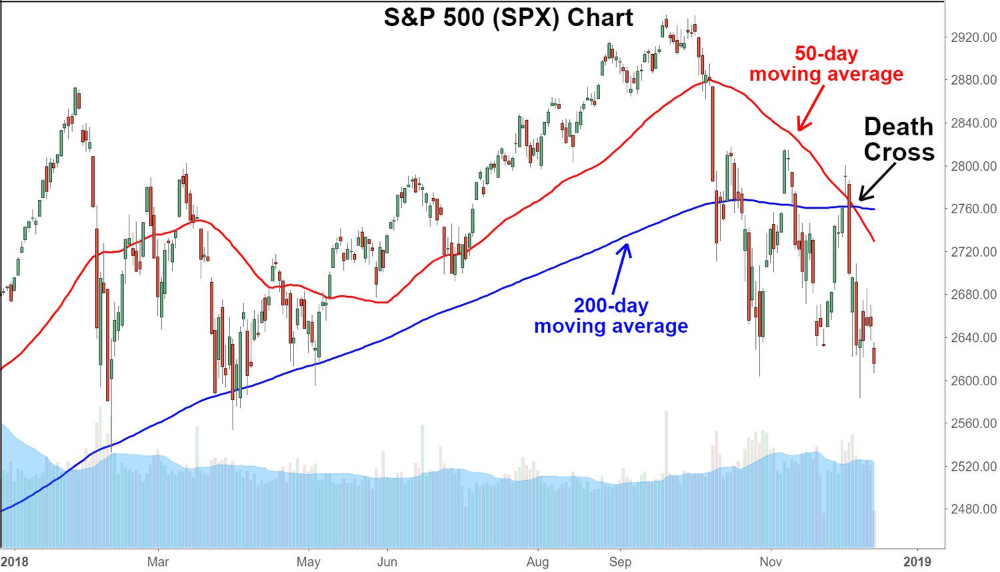

Algorithmic trading has undergone substantial transformation over the past decade, propelled by rapid advancements in technology. Traders now leverage sophisticated systems and innovative methodologies to enhance decision-making processes, resulting in faster and more efficient trading operations. One significant development in this domain is cross-functional algorithmic trading. This approach involves blending multiple scientific and technical disciplines to optimize trading strategies, providing a competitive edge in contemporary financial markets.

Cross-functional algorithmic trading stands out as a pivotal area, encouraging the integration of diverse fields such as statistics, machine learning, and financial engineering. This multidisciplinary strategy enables traders to design and implement advanced trading systems that are not only versatile but also highly robust. Strategies based on cross-functional methods offer enhanced adaptability and resilience, crucial in today's dynamic and often volatile market conditions.



The utility of cross-functional algo trading is evident in its ability to harness techniques from various domains. For instance, statistical methods are used to uncover pricing inefficiencies, machine learning algorithms facilitate the analysis of large datasets for predictive modeling, and financial engineering provides the tools for constructing sophisticated simulations and models. This fusion of techniques results in trading strategies that benefit from the strengths of each field, ensuring comprehensive and effective market engagement.

Understanding and applying cross-functional algorithmic trading strategies are essential for traders aiming to maintain a competitive edge. By staying informed about the integration of these diverse methodologies, traders can develop strategies that cater to evolving market demands, achieving optimal flexibility and efficiency. This introduction sets the stage for further exploration of specific cross-functional algo trading strategies and their profound impact on shaping the future of the financial markets.

## Table of Contents

## Understanding Cross-Functional Algorithmic Trading

Cross-functional algorithmic trading is a sophisticated approach that integrates numerous quantitative and qualitative techniques to enhance trading systems, positioning itself as a critical paradigm in the advancement of modern financial markets. This interdisciplinary method draws upon diverse fields such as statistics, machine learning, financial engineering, and risk management, enabling the development of trading solutions that are both comprehensive and flexible.

Quantitative methods in cross-functional algo trading often encompass statistical techniques used to analyze historical data, forecast price movements, and identify profitable trading opportunities. For instance, time series analysis, probabilistic modeling, and hypothesis testing are commonly employed to discern patterns and predict future trends in asset prices. By leveraging these statistical tools, traders can systematically exploit market inefficiencies and improve their execution strategies. Consider a simple example of mean reversion, where a trader anticipates that a stock's price, having deviated from its average, will revert over time.

```python
import numpy as np

# Example: Simple Mean Reversion Strategy
def moving_average(signal, window=50):
    return np.convolve(signal, np.ones(window)/window, 'valid')

def mean_reversion_signal(prices, window=50):
    moving_av = moving_average(prices, window)
    signal = prices[window-1:] - moving_av
    return signal

prices = np.array([100, 102, 101, 103, 105, 104, 102, 100, 98, 97, 99, 101])
signals = mean_reversion_signal(prices)
print("Mean Reversion Signals:", signals)
```

Qualitative aspects, such as market sentiment analysis and regulatory considerations, also play a vital role in cross-functional algo trading. These components help traders make informed decisions by providing insights into the broader market context, which may not be immediately evident from quantitative data alone. For instance, sentiment analysis of news articles or social media can offer predictive insights that inform trading decisions and strategy adjustments.

Machine learning models serve as a pivotal component in cross-functional strategies, enabling traders to process large datasets for predictive analysis and pattern recognition. Algorithms such as neural networks and support vector machines (SVMs) are frequently employed to model complex, non-linear relationships in financial markets, automating trading decisions based on real-time insights. With [machine learning](/wiki/machine-learning), traders can develop adaptive models that enhance the algorithm's learning capacity over time, continuously refining decision-making processes.

Additionally, the integration of financial engineering ensures that models are not only theoretically sound but also practically applicable, employing optimization techniques and derivative pricing models to craft strategies that account for risk and return objectives. By employing rigorous quantitative methods, traders can simulate various market scenarios, identifying optimal trading paths and minimizing potential losses.

The adaptability and comprehensive nature of cross-functional [algorithmic trading](/wiki/algorithmic-trading) lie in its capacity to synthesize these diverse methodologies, resulting in a cohesive framework for strategy optimization, risk management, and trade execution. By utilizing best practices from multiple domains, traders can construct robust systems that are capable of navigating the complexities and dynamics of global financial markets efficiently.

## Statistical Arbitrage

Statistical [arbitrage](/wiki/arbitrage) is a sophisticated trading strategy that leverages statistical and mathematical models to identify and exploit pricing inefficiencies across a range of securities. By capitalizing on short-term anomalies, statistical arbitrageurs aim to generate profits by predicting the return to equilibrium of such mispricings. This cross-functional strategy heavily relies on the quantitative disciplines of data analysis and financial modeling to develop and optimize trading algorithms.

One fundamental technique employed within [statistical arbitrage](/wiki/statistical-arbitrage) is mean reversion, which is based on the principle that asset prices tend to revert to their historical mean over time. Traders monitor deviations from this mean and execute trades that profit when prices move back toward it. The effectiveness of mean reversion strategies largely depends on the accurate estimation of the mean and the timing of trades. 

Pairs trading is another integral method used in statistical arbitrage, where a pair of related securities is identified, and trades are executed when the relative price difference between them diverges from its historical mean. The expectation is that the prices will converge, allowing the trader to profit from this reversion. This strategy can be mathematically formalized through the concept of cointegration, which assesses whether a linear combination of two non-stationary series is itself stationary. The potential profit is realized when the spread between the pair widens and subsequently converges.

Statistical arbitrage strategies have evolved significantly over the years, with advancements in technology and access to high-frequency market data enabling traders to develop more complex and reliable algorithms. Modern statistical arbitrage strategies often incorporate machine learning techniques to enhance predictive accuracy and adaptability in volatile markets. For example, machine learning algorithms can be used to dynamically recalibrate models in response to changing market conditions, providing a competitive edge.

The following example demonstrates a simplified approach to implementing a pairs trading strategy using Python:

```python
import numpy as np
import pandas as pd
from statsmodels.tsa.stattools import coint

# Load historical price data for two securities
prices_A = pd.Series(...)
prices_B = pd.Series(...)

# Calculate the cointegration test
score, p_value, _ = coint(prices_A, prices_B)

if p_value < 0.05:
    spread = prices_A - prices_B
    mean_spread = spread.mean()
    std_spread = spread.std()

    # Define entry and exit points based on standard deviation bands
    entry_threshold = 2 * std_spread
    exit_threshold = 0.5 * std_spread

    # Trading logic
    if spread.iloc[-1] > mean_spread + entry_threshold:
        # Short A, Long B
        pass
    elif spread.iloc[-1] < mean_spread - entry_threshold:
        # Long A, Short B
        pass
    elif abs(spread.iloc[-1] - mean_spread) < exit_threshold:
        # Close positions
        pass
```

The future trajectory of statistical arbitrage is likely to be influenced by further advancements in computational finance and emerging technologies. As financial markets continue to evolve, statistical arbitrage remains an essential tool for traders seeking to navigate and capitalize on the complexities of modern trading environments.

## Machine Learning in Trading

Machine learning has significantly transformed algorithmic trading by providing powerful tools for analyzing large volumes of data and constructing predictive models. It allows traders to identify hidden patterns and trends, thus enhancing the precision and efficiency of trading strategies. Algorithms such as neural networks and decision trees are commonly integrated into trading systems to facilitate the recognition of complex, non-linear relationships in financial datasets.

Neural networks are widely used due to their capability to automatically learn and model intricate relationships between inputs and outputs. They are especially beneficial in uncovering patterns that are not immediately apparent through traditional statistical methods. The architecture of neural networks, consisting of interconnected neurons organized in layers, enables them to learn from historical data and improve predictive accuracy over time. A commonly used type of [neural network](/wiki/neural-network) in trading is the Long Short-Term Memory (LSTM) network, which is well-suited for sequence prediction problems and time-series forecasting due to its ability to remember previous inputs.

For instance, a trader might implement an LSTM network to predict future stock prices based on a historical price dataset. The network would learn temporal dependencies within the data, allowing it to make informed predictions about future price movements. The Python code snippet below illustrates a basic implementation of an LSTM model using the Keras library:

```python
from keras.models import Sequential
from keras.layers import LSTM, Dense
import numpy as np

# Sample data (e.g., historical stock prices)
data = np.array([...])

# Reshape data into a 3D array for LSTM [samples, time steps, features]
data_reshaped = np.reshape(data, (data.shape[0], 1, data.shape[1]))

# Build LSTM model
model = Sequential()
model.add(LSTM(units=50, return_sequences=True, input_shape=(data_reshaped.shape[1], data_reshaped.shape[2])))
model.add(LSTM(units=50))
model.add(Dense(units=1))

# Compile and fit the model
model.compile(optimizer='adam', loss='mean_squared_error')
model.fit(data_reshaped, data, epochs=100, batch_size=32)
```

Decision trees and their ensembles, such as random forests and gradient boosting machines, are also popular in machine learning for trading due to their ability to handle large datasets with numerous variables. These algorithms work by constructing a model in the form of a tree structure, where each node represents a feature in the dataset, each branch represents a decision rule, and each leaf represents an outcome. Decision tree-based models are highly interpretable, which is advantageous for traders seeking to understand the decision-making process of their algorithms.

Moreover, the application of supervised and unsupervised learning techniques allows for the development of adaptive trading models. Supervised learning, which involves training a model on a labeled dataset, helps in tasks like predicting the direction of future stock prices. In contrast, unsupervised learning, which does not rely on labeled data, is useful in clustering stocks with similar behaviors or detecting anomalies in trading patterns.

These advanced machine learning solutions significantly enhance market predictions by providing traders with sophisticated tools to adapt to dynamic market conditions. Improved algorithm accuracy results in better trading decisions, ultimately leading to increased profitability and reduced risk. By harnessing the power of machine learning, traders can achieve a competitive edge, exploring latent variables and intricate market dynamics that traditional analysis might overlook.

## Quantitative Research and Financial Engineering

Quantitative research is fundamental to the development of trading algorithms, relying heavily on mathematical models and simulations to derive strategic insights. By employing quantitative methods, traders can systematically identify and exploit inefficiencies in financial markets. Techniques such as time series analysis, stochastic calculus, and Monte Carlo simulations are frequently used to evaluate the potential outcomes and risks associated with different trading strategies. For instance, time series analysis can help forecast future price movements by examining historical data patterns, while Monte Carlo simulations can model the probability of various financial scenarios, aiding in decision-making under uncertainty.

Financial engineering goes hand in hand with quantitative research by applying advanced mathematical techniques to solve intricate financial problems. A major aspect of financial engineering is the development and pricing of derivatives, complex financial instruments whose value is derived from underlying assets such as stocks, bonds, or commodities. Derivative pricing models, such as the Black-Scholes model, are essential tools in financial engineering. They provide a framework for calculating theoretical prices of options, facilitating hedging strategies and risk management. The Black-Scholes model, for example, estimates the price of an option using inputs like the underlying asset price, strike price, risk-free [interest rate](/wiki/interest-rate-trading-strategies), time to expiration, and asset [volatility](/wiki/volatility-trading-strategies), expressed as:

$$
C(S, t) = N(d_1)S - N(d_2)Ke^{-r(T-t)}
$$

Where:

- $C$ is the call option price
- $S$ is the current stock price
- $K$ is the strike price
- $r$ is the risk-free rate
- $T$ is the time to maturity
- $N$ is the cumulative distribution function of the standard normal distribution
- $d_1$ and $d_2$ are calculated as:

$$
d_1 = \frac{\ln(\frac{S}{K}) + (r + \frac{\sigma^2}{2})(T-t)}{\sigma \sqrt{T-t}}
$$

$$
d_2 = d_1 - \sigma \sqrt{T-t}
$$

Risk management frameworks are heavily integrated into trading algorithms, ensuring that potential losses are mitigated and that strategies are robust against market fluctuations. Portfolio optimization methods help allocate assets in a way that maximizes returns for a given level of risk, utilizing tools such as the Mean-Variance Optimization (MVO) approach. This approach seeks to find the optimal balance between risk and return, using the following objective function:

$$
\text{Minimize: } \frac{1}{2} x^T \Sigma x - \mu^T x
$$

Where:

- $x$ is the portfolio weight vector
- $\Sigma$ is the covariance matrix of asset returns
- $\mu$ is the expected return vector

Furthermore, quantitative research and financial engineering are pivotal in the construction and testing of trading algorithms through [backtesting](/wiki/backtesting). This process involves applying historical market data to a trading strategy to evaluate its performance over time. By ensuring that the strategy works well in different market conditions, analysts can refine their models to better anticipate future market behavior.

In summary, quantitative research and financial engineering serve as integral components in shaping sophisticated algorithmic trading strategies. They enable traders to employ rigorous mathematical analyses to inform strategic decisions, manage risks, and potentially achieve desirable financial outcomes in competitive markets.

## Integrating Risk Management into Trading Algorithms

Effective risk management is crucial in cross-functional algorithmic trading to ensure sustainable performance and mitigate potential losses. The integration of risk management strategies within trading algorithms involves the development of real-time risk assessment and control mechanisms, which are essential for navigating the unpredictable nature of financial markets.

One of the primary components of risk management in algorithmic trading is portfolio optimization. This process involves allocating assets in a manner that maximizes returns while minimizing risk. The classic approach to portfolio optimization is grounded in Modern Portfolio Theory (MPT) proposed by Harry Markowitz. The efficient frontier is a fundamental concept in MPT, representing a set of optimal portfolios that offer the highest expected return for a defined level of risk. This can be expressed mathematically as:

$$

\text{Minimize } \sigma_p = \sqrt{\mathbf{w}^T \mathbf{\Sigma} \mathbf{w}} 
$$

Subject to:

$$

\mathbf{w}^T \mathbf{\mu} = R_p 
$$

$$

\sum w_i = 1 
$$

Where $\mathbf{w}$ is the vector of asset weights, $\mathbf{\Sigma}$ is the covariance matrix of asset returns, and $\mathbf{\mu}$ is the expected return vector. $R_p$ represents the target return, and $\sigma_p$ is the portfolio's standard deviation, a measure of risk.

Another critical aspect of risk management in trading algorithms is the calculation of Value-at-Risk (VaR). VaR provides an estimate of the potential loss in value of a portfolio over a specific time period, given normal market conditions, and at a defined confidence level. A commonly used method is the historical simulation approach, which involves analyzing historical returns to estimate future losses. The Python code snippet below illustrates a basic VaR calculation:

```python
import numpy as np

# Generate simulated returns
returns = np.random.normal(loc=0.01, scale=0.02, size=1000)

# Define the confidence level
confidence_level = 0.95

# Calculate the VaR
VaR = np.percentile(returns, (1 - confidence_level) * 100)
print(f"Value-at-Risk (VaR) at {confidence_level*100}% confidence level: {VaR:.2f}")
```

Stress testing is another essential mechanism used to evaluate how trading algorithms perform under extreme market conditions. Stress tests expose portfolios to hypothetical scenarios to assess the impact of adverse market movements. This helps in identifying vulnerabilities and aids in formulating strategies to mitigate potential risks.

Addressing market volatility and systemic risks necessitates leveraging cross-functional expertise. For example, expertise in [statistics](/wiki/bayesian-statistics) can aid in developing robust predictive models, while insights from financial engineering can optimize derivative pricing models and hedging strategies. By incorporating these interdisciplinary approaches, traders can enhance the resilience of their algorithms against systemic shocks, such as sudden economic downturns or geopolitical events.

In summary, effective risk management in cross-functional algorithmic trading involves a comprehensive approach that integrates portfolio optimization, VaR calculations, and stress testing. By utilizing cross-discipline expertise, traders can design algorithms that not only generate superior returns but also withstand unforeseen market turbulences.

## The Future of Cross-Functional Algorithmic Trading

As technology continues to advance, cross-functional algorithmic trading stands on the verge of a transformative era marked by innovative trends and emerging technologies. One of the most promising developments is quantum computing, which holds the potential to revolutionize data processing speeds and computational complexity. Quantum algorithms can handle numerous calculations simultaneously, potentially optimizing trading strategies by quickly solving complex market models and uncovering patterns that classical computing might miss.

Similarly, blockchain technology is poised to enhance transparency and security within trading ecosystems. By facilitating immutable, transparent, and secure transaction ledgers, blockchain can streamline trade settlement processes and reduce the risk of fraud. Smart contracts, an integral part of blockchain, can automate and enforce transaction conditions, thus reducing operational risks and enhancing efficiency in trade execution.

Furthermore, AI-driven trading platforms continue to gain traction, enabling traders to harness advanced machine learning algorithms for predictive analytics. AI can process vast datasets in real-time, providing insights into market trends, volatility, and potential disruptions. These platforms can improve decision-making by adapting to new data, leading to more dynamic and responsive trading strategies.

Emerging technologies like these can significantly enhance cross-functional strategies, allowing traders to integrate multiple disciplines more effectively. For instance, the synergy between quantum computing and AI can lead to robust predictive models capable of handling uncertainty and complexity in financial markets. Meanwhile, blockchain's transparency can complement risk management frameworks, assuring compliance and monitoring of algorithmic performance.

By staying informed about these technological advancements, traders can remain competitive and agile, capitalizing on cutting-edge solutions to devise more efficient, resilient, and profitable trading algorithms. As these innovations continue to integrate into financial markets, the landscape of cross-functional algorithmic trading is set to become more sophisticated, offering unprecedented opportunities for those ready to embrace the change.

## Conclusion

Cross-functional algorithmic trading represents a sophisticated approach for navigating modern financial markets, combining techniques from diverse fields such as statistics, machine learning, and financial engineering. This integrative strategy offers traders the agility and resilience necessary to adapt to an ever-evolving market landscape. By harnessing the strengths of various disciplines, traders develop robust strategies that can adjust to new data and changing conditions, ensuring sustained performance.

As financial markets grow increasingly complex, those who employ cross-functional strategies will likely maintain a competitive edge. This approach allows for better risk management, more accurate market predictions, and the exploitation of inefficiencies. Throughout this article, we have explored the substantive impact of cross-functional algo trading, including statistical arbitrage, the application of machine learning, quantitative research, and the critical aspect of risk management. These methodologies not only enhance trading efficiency but also help manage volatility and systemic risk.

In embracing cross-functional algorithmic trading, traders and institutions position themselves to capitalize on emerging opportunities while confidently navigating the associated challenges. By integrating advanced technologies and methodologies, they prepare for a future where technological advancements such as quantum computing, blockchain, and AI-driven platforms may redefine market strategies. Ultimately, this multifaceted approach equips traders with the tools needed to stay ahead of the curve, maximizing both opportunity and security in their trading endeavors.

## References & Further Reading

[1]: Bergstra, J., Bardenet, R., Bengio, Y., & Kégl, B. (2011). ["Algorithms for Hyper-Parameter Optimization."](https://papers.nips.cc/paper/4443-algorithms-for-hyper-parameter-optimization) Advances in Neural Information Processing Systems 24.

[2]: ["Advances in Financial Machine Learning"](https://www.amazon.com/Advances-Financial-Machine-Learning-Marcos/dp/1119482089) by Marcos Lopez de Prado

[3]: ["Evidence-Based Technical Analysis: Applying the Scientific Method and Statistical Inference to Trading Signals"](https://www.amazon.com/Evidence-Based-Technical-Analysis-Scientific-Statistical/dp/0470008741) by David Aronson

[4]: ["Machine Learning for Algorithmic Trading"](https://github.com/stefan-jansen/machine-learning-for-trading) by Stefan Jansen

[5]: ["Quantitative Trading: How to Build Your Own Algorithmic Trading Business"](https://www.amazon.com/Quantitative-Trading-Build-Algorithmic-Business/dp/1119800064) by Ernest P. Chan