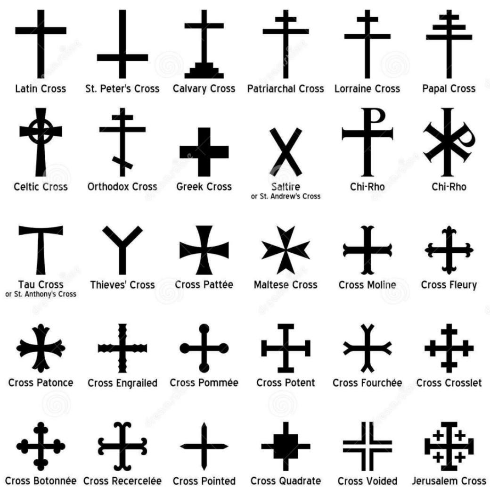

## Table of Contents

## What is a cross?

A cross is a shape that looks like two lines crossing each other. It is often used as a symbol in many different ways. The most common cross is the Christian cross, which has a long vertical line and a shorter horizontal line. This cross is very important in Christianity because it represents the crucifixion of Jesus Christ.

Crosses are also used in other religions and cultures. For example, in some Native American cultures, the cross represents the four directions: north, south, east, and west. In addition to religious meanings, crosses can also be used as a sign or a marker. For instance, a red cross is used as a symbol for medical help and first aid around the world.

Overall, the cross is a simple shape with many different meanings. It can represent faith, direction, or help, depending on how it is used. People see the cross in churches, on jewelry, and in many other places, making it a widely recognized symbol.

## What is the basic function of a cross?

A cross is a simple shape made of two lines that cross each other. It is used in many different ways. The most common use of a cross is as a symbol in religion, especially in Christianity. In Christianity, the cross represents the crucifixion of Jesus Christ. People often see crosses in churches, on necklaces, and in other places where they want to show their faith.

Crosses also have meanings in other cultures and religions. For example, some Native American cultures use the cross to show the four directions: north, south, east, and west. Besides religion, crosses can be used as signs or markers. A red cross is a well-known symbol for medical help and first aid. So, the basic function of a cross is to be a symbol that can mean different things depending on where and how it is used.

## What are the different types of crosses?

There are many different types of crosses used around the world. One of the most well-known is the Latin Cross, which has a long vertical line and a shorter horizontal line. This is the cross most people think of when they hear the word "cross." Another common type is the Greek Cross, which has four arms of equal length. The Celtic Cross is also popular; it has a circle around the intersection of the arms and is often seen in Irish culture.

Other types of crosses include the Coptic Cross, used by the Coptic Orthodox Church, which has a distinctive design with three points at the ends of each arm. The Ankh, from ancient Egypt, looks like a cross with a loop at the top and represents life. The Maltese Cross has eight points and is often used by firefighters and emergency services. Each type of cross has its own special meaning and is used in different ways by different groups of people.

In addition to these, there are the Tau Cross, which looks like the letter "T," and the St. Andrew's Cross, which is shaped like an "X." The Jerusalem Cross has a large cross with four smaller crosses in each quadrant. The Patriarchal Cross has two horizontal bars, and the Papal Cross has three. These different types of crosses show how one simple shape can have many different forms and meanings in various cultures and religions.

## What is the historical significance of the cross?

The cross has a long history and is very important in many cultures. In Christianity, the cross became a big symbol around 300 AD when Emperor Constantine made it the symbol of his army. Before that, the cross was used by the Romans to punish people by crucifying them. Jesus Christ was crucified on a cross, so for Christians, the cross became a symbol of Jesus' sacrifice and love. Over time, the cross became a common sight in churches and on Christian art and jewelry.

The cross is also important in other cultures and religions. In ancient Egypt, the Ankh, which looks like a cross with a loop at the top, was a symbol of life. Some Native American cultures used the cross to show the four directions: north, south, east, and west. In Europe, different types of crosses like the Celtic Cross and the Maltese Cross became symbols of different groups and countries. The Red Cross, which started in 1863, uses a red cross on a white background as a symbol of medical help and first aid around the world.

Overall, the cross has many different meanings and uses. It can represent faith, life, direction, or help, depending on where and how it is used. The cross is a simple shape that has been important to people for thousands of years and continues to be a powerful symbol today.

## How is the cross used in various religions?

In Christianity, the cross is a very important symbol. It represents the crucifixion of Jesus Christ, who Christians believe died on the cross to save people from their sins. The cross is seen in churches, on necklaces, and in many other places where Christians want to show their faith. It reminds them of Jesus' sacrifice and love. Different types of crosses, like the Latin Cross and the Celtic Cross, are used in different Christian groups, but they all mean the same thing: Jesus' death and resurrection.

The cross is also used in other religions and cultures. In ancient Egypt, the Ankh, which looks like a cross with a loop at the top, was a symbol of life. Some Native American cultures use the cross to show the four directions: north, south, east, and west. In Hinduism, the Swastika, which looks like a cross with bent arms, is a symbol of good luck and well-being. Each of these uses of the cross has its own special meaning and shows how one simple shape can be important in many different ways.

Overall, the cross is a powerful symbol that means different things in different religions. It can represent faith, life, direction, or good luck, depending on where and how it is used. People have been using the cross for thousands of years, and it continues to be an important part of many religions and cultures today.

## What materials are commonly used to make crosses?

Crosses are made from many different materials. Some of the most common materials are wood, metal, and plastic. Wood is often used because it is easy to shape and can be painted or stained in different colors. Metal crosses can be made from gold, silver, or other metals. They can be shiny or have a special finish. Plastic crosses are light and cheap, so they are used a lot for things like necklaces and other small items.

People also use other materials to make crosses. Stone and marble are used for big crosses that are placed in churches or cemeteries. These materials are strong and last a long time. Glass crosses can be colorful and are often used as decorations. Some people even make crosses from paper or fabric, which can be used for art projects or as part of clothing. Each material has its own special look and feel, so people choose the one that fits their needs and style.

## What are the differences between a Latin cross and a Greek cross?

The Latin cross and the Greek cross are two types of crosses that look a bit different. The Latin cross has a long vertical line and a shorter horizontal line. It looks like the letter "t" but with the horizontal line a bit higher. This is the cross most people think of when they hear the word "cross." It is very important in Christianity because it shows how Jesus was crucified.

The Greek cross, on the other hand, has four arms that are all the same length. It looks like a plus sign (+). This cross is used in many different places, not just in Christianity. For example, it can be seen in art and architecture from different cultures. Both crosses are important, but they look different and can have different meanings depending on where they are used.

## How has the design of the cross evolved over time?

The design of the cross has changed a lot over time. At first, the cross was just a simple shape used by the Romans to punish people. They would nail people to a cross made of wood. When Jesus was crucified, the cross became very important in Christianity. Early Christians started using the cross as a symbol of Jesus' sacrifice and love. They would draw or carve it on walls, tombs, and other places.

Over the years, the cross became more than just a simple shape. Different cultures and religions added their own touches to it. The Latin cross, with its long vertical line and shorter horizontal line, became the most common in Christianity. But other designs like the Greek cross, with its four equal arms, and the Celtic cross, with its circle around the middle, also became popular. People started making crosses from different materials like gold, silver, and even glass. Today, the cross is used in many ways and can be seen in churches, on jewelry, and in art all around the world.

## What are some cultural variations of the cross?

The cross is a simple shape that looks like two lines crossing each other. It is used in many different ways by different cultures and religions. In Christianity, the Latin cross is very important because it shows how Jesus was crucified. It has a long vertical line and a shorter horizontal line. People see this cross in churches, on necklaces, and in many other places. Another type of cross used in Christianity is the Greek cross, which has four arms that are all the same length. It looks like a plus sign and is used in different ways in Christian art and architecture.

The cross is also important in other cultures and religions. In ancient Egypt, the Ankh looks like a cross with a loop at the top. It is a symbol of life and was used in many Egyptian pictures and carvings. Some Native American cultures use the cross to show the four directions: north, south, east, and west. In Hinduism, the Swastika looks like a cross with bent arms and is a symbol of good luck and well-being. Each of these crosses has its own special meaning and shows how one simple shape can be important in many different ways around the world.

## What is the symbolism associated with different types of crosses?

The Latin cross is the most common type of cross in Christianity. It has a long vertical line and a shorter horizontal line. This cross reminds Christians of Jesus' crucifixion and his love for people. It is seen in churches, on necklaces, and in many other places. The Greek cross has four arms that are all the same length. It looks like a plus sign. This cross is used in many different ways, not just in Christianity. It can be found in art and architecture from different cultures.

The Celtic cross has a circle around the middle of the cross. It is often seen in Irish culture and represents the connection between heaven and earth. The Ankh from ancient Egypt looks like a cross with a loop at the top. It is a symbol of life and was used in many Egyptian pictures and carvings. The Maltese cross has eight points and is often used by firefighters and emergency services. It stands for bravery and help. Each type of cross has its own special meaning and is used in different ways by different groups of people.

## How are crosses used in modern art and fashion?

In modern art, crosses are used in many different ways. Artists use crosses to make people think about religion, life, and death. They might paint or sculpt crosses in new and interesting ways. Some artists use crosses to make a statement about society or to show their own feelings. Crosses can be part of big art pieces in museums or small works that people hang in their homes. They can be made from many different materials like wood, metal, or even paper. This shows how the cross can be a powerful symbol in art.

In fashion, crosses are also very popular. People wear crosses on necklaces, earrings, and other jewelry. These crosses can be made from gold, silver, or other materials. Some people wear crosses to show their faith, while others wear them just because they like how they look. Crosses are also used on clothes like t-shirts and dresses. Fashion designers might use crosses in their designs to make a statement or to add a special touch to their work. This shows how the cross can be both a symbol and a part of style in modern fashion.

## What are the controversies or debates surrounding the use of the cross in different contexts?

The cross is a powerful symbol, but it can also cause arguments and debates. In some places, people argue about whether it is okay to have crosses in public places like schools or government buildings. Some people think that having a cross in these places is a way to show their faith and history. Others believe that it is not fair to people who do not follow the same religion. They think that public places should not favor one religion over another.

Another debate is about how the cross is used in fashion and art. Some people feel that using the cross in jewelry or on clothes can be disrespectful to their faith. They think that the cross should only be used to show religious beliefs, not as a fashion statement. On the other hand, others believe that using the cross in art and fashion can help spread its message and make it more meaningful to more people. These debates show how one simple shape can mean different things to different people.

## What is the relationship between Quantitative Research and Financial Engineering?

Quantitative research is fundamental to the development of trading algorithms, relying heavily on mathematical models and simulations to derive strategic insights. By employing quantitative methods, traders can systematically identify and exploit inefficiencies in financial markets. Techniques such as time series analysis, stochastic calculus, and Monte Carlo simulations are frequently used to evaluate the potential outcomes and risks associated with different trading strategies. For instance, time series analysis can help forecast future price movements by examining historical data patterns, while Monte Carlo simulations can model the probability of various financial scenarios, aiding in decision-making under uncertainty.

Financial engineering goes hand in hand with quantitative research by applying advanced mathematical techniques to solve intricate financial problems. A major aspect of financial engineering is the development and pricing of derivatives, complex financial instruments whose value is derived from underlying assets such as stocks, bonds, or commodities. Derivative pricing models, such as the Black-Scholes model, are essential tools in financial engineering. They provide a framework for calculating theoretical prices of options, facilitating hedging strategies and risk management. The Black-Scholes model, for example, estimates the price of an option using inputs like the underlying asset price, strike price, risk-free [interest rate](/wiki/interest-rate-trading-strategies), time to expiration, and asset [volatility](/wiki/volatility-trading-strategies), expressed as:

$$
C(S, t) = N(d_1)S - N(d_2)Ke^{-r(T-t)}
$$

Where:

- $C$ is the call option price
- $S$ is the current stock price
- $K$ is the strike price
- $r$ is the risk-free rate
- $T$ is the time to maturity
- $N$ is the cumulative distribution function of the standard normal distribution
- $d_1$ and $d_2$ are calculated as:

$$
d_1 = \frac{\ln(\frac{S}{K}) + (r + \frac{\sigma^2}{2})(T-t)}{\sigma \sqrt{T-t}}
$$

$$
d_2 = d_1 - \sigma \sqrt{T-t}
$$

Risk management frameworks are heavily integrated into trading algorithms, ensuring that potential losses are mitigated and that strategies are robust against market fluctuations. Portfolio optimization methods help allocate assets in a way that maximizes returns for a given level of risk, utilizing tools such as the Mean-Variance Optimization (MVO) approach. This approach seeks to find the optimal balance between risk and return, using the following objective function:

$$
\text{Minimize: } \frac{1}{2} x^T \Sigma x - \mu^T x
$$

Where:

- $x$ is the portfolio weight vector
- $\Sigma$ is the covariance matrix of asset returns
- $\mu$ is the expected return vector

Furthermore, quantitative research and financial engineering are pivotal in the construction and testing of trading algorithms through [backtesting](/wiki/backtesting). This process involves applying historical market data to a trading strategy to evaluate its performance over time. By ensuring that the strategy works well in different market conditions, analysts can refine their models to better anticipate future market behavior.

In summary, quantitative research and financial engineering serve as integral components in shaping sophisticated [algorithmic trading](/wiki/algorithmic-trading) strategies. They enable traders to employ rigorous mathematical analyses to inform strategic decisions, manage risks, and potentially achieve desirable financial outcomes in competitive markets.

## How can risk management be integrated into trading algorithms?

Effective risk management is crucial in cross-functional algorithmic trading to ensure sustainable performance and mitigate potential losses. The integration of risk management strategies within trading algorithms involves the development of real-time risk assessment and control mechanisms, which are essential for navigating the unpredictable nature of financial markets.

One of the primary components of risk management in algorithmic trading is portfolio optimization. This process involves allocating assets in a manner that maximizes returns while minimizing risk. The classic approach to portfolio optimization is grounded in Modern Portfolio Theory (MPT) proposed by Harry Markowitz. The efficient frontier is a fundamental concept in MPT, representing a set of optimal portfolios that offer the highest expected return for a defined level of risk. This can be expressed mathematically as:

$$

\text{Minimize } \sigma_p = \sqrt{\mathbf{w}^T \mathbf{\Sigma} \mathbf{w}} 
$$

Subject to:

$$

\mathbf{w}^T \mathbf{\mu} = R_p 
$$

$$

\sum w_i = 1 
$$

Where $\mathbf{w}$ is the vector of asset weights, $\mathbf{\Sigma}$ is the covariance matrix of asset returns, and $\mathbf{\mu}$ is the expected return vector. $R_p$ represents the target return, and $\sigma_p$ is the portfolio's standard deviation, a measure of risk.

Another critical aspect of risk management in trading algorithms is the calculation of Value-at-Risk (VaR). VaR provides an estimate of the potential loss in value of a portfolio over a specific time period, given normal market conditions, and at a defined confidence level. A commonly used method is the historical simulation approach, which involves analyzing historical returns to estimate future losses. The Python code snippet below illustrates a basic VaR calculation:

```python
import numpy as np

# Generate simulated returns
returns = np.random.normal(loc=0.01, scale=0.02, size=1000)

# Define the confidence level
confidence_level = 0.95

# Calculate the VaR
VaR = np.percentile(returns, (1 - confidence_level) * 100)
print(f"Value-at-Risk (VaR) at {confidence_level*100}% confidence level: {VaR:.2f}")
```

Stress testing is another essential mechanism used to evaluate how trading algorithms perform under extreme market conditions. Stress tests expose portfolios to hypothetical scenarios to assess the impact of adverse market movements. This helps in identifying vulnerabilities and aids in formulating strategies to mitigate potential risks.

Addressing market volatility and systemic risks necessitates leveraging cross-functional expertise. For example, expertise in [statistics](/wiki/bayesian-statistics) can aid in developing robust predictive models, while insights from financial engineering can optimize derivative pricing models and hedging strategies. By incorporating these interdisciplinary approaches, traders can enhance the resilience of their algorithms against systemic shocks, such as sudden economic downturns or geopolitical events.

In summary, effective risk management in cross-functional algorithmic trading involves a comprehensive approach that integrates portfolio optimization, VaR calculations, and stress testing. By utilizing cross-discipline expertise, traders can design algorithms that not only generate superior returns but also withstand unforeseen market turbulences.

## References & Further Reading

[1]: Bergstra, J., Bardenet, R., Bengio, Y., & Kégl, B. (2011). ["Algorithms for Hyper-Parameter Optimization."](https://papers.nips.cc/paper/4443-algorithms-for-hyper-parameter-optimization) Advances in Neural Information Processing Systems 24.

[2]: ["Advances in Financial Machine Learning"](https://www.amazon.com/Advances-Financial-Machine-Learning-Marcos/dp/1119482089) by Marcos Lopez de Prado

[3]: ["Evidence-Based Technical Analysis: Applying the Scientific Method and Statistical Inference to Trading Signals"](https://www.amazon.com/Evidence-Based-Technical-Analysis-Scientific-Statistical/dp/0470008741) by David Aronson

[4]: ["Machine Learning for Algorithmic Trading"](https://github.com/stefan-jansen/machine-learning-for-trading) by Stefan Jansen

[5]: ["Quantitative Trading: How to Build Your Own Algorithmic Trading Business"](https://www.amazon.com/Quantitative-Trading-Build-Algorithmic-Business/dp/1119800064) by Ernest P. Chan