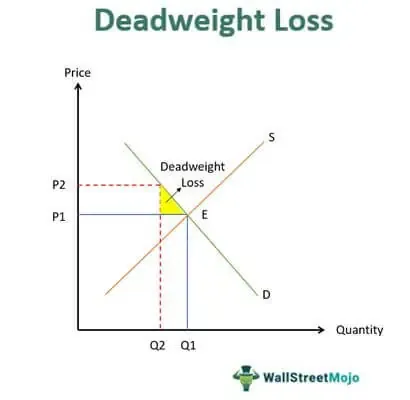

In algorithmic trading, optimizing trading models is essential to achieving profitability and maintaining a competitive edge. These models leverage mathematical and statistical techniques to predict market movements and make automated trading decisions. Among the critical components in evaluating the performance of these models is cross-entropy loss, often referred to as log loss. This metric is instrumental in measuring the accuracy of classification models by quantifying the difference between predicted probabilities and actual outcomes.

Cross-entropy loss serves as a foundational element in evaluating and refining trading models, particularly within the context of classification tasks. These tasks are prevalent in algorithmic trading, where models frequently classify market data into distinct categories, such as predicting asset price movement directions. Understanding and applying cross-entropy loss in algorithmic trading can lead to enhanced model accuracy, enabling traders to make more informed decisions based on probabilistic predictions.



Log loss, a specific case of cross-entropy loss applicable to binary classification tasks, is particularly relevant for trading strategies involving binary decisions such as buy or sell signals. By penalizing incorrect predictions more heavily, log loss encourages models to produce more accurate probability estimates, thus improving their ability to predict market trends accurately.

This article discusses the significance of cross-entropy loss and log loss scoring in the optimization of algorithmic trading strategies. By comprehensively understanding and utilizing these loss functions, traders can improve the precision of their models and potentially increase their trading success. Through the minimization of loss, trading models can better align predicted outcomes with actual market dynamics, leading to enhanced decision-making and ultimately, more profitable trading operations.

## Table of Contents

## Understanding Cross-Entropy Loss and Log Loss

Cross-entropy loss is a fundamental concept in [machine learning](/wiki/machine-learning), primarily used to gauge the discrepancy between predicted probability distributions and real outcomes. This loss function is widely utilized in various applications, including [algorithmic trading](/wiki/algorithmic-trading), due to its effectiveness in classification tasks. Cross-entropy quantifies this difference by providing a scalar loss value that reflects how closely the predicted probability distribution adheres to the true distribution.

In a mathematical context, cross-entropy loss for a binary classification problem can be expressed as:

$$
\text{Loss}(y, \hat{y}) = -\left(y \cdot \log(\hat{y}) + (1 - y) \cdot \log(1 - \hat{y})\right)
$$

Here, $y$ represents the actual class label, which can be either 0 or 1, and $\hat{y}$ is the predicted probability that the instance belongs to class 1. The above formula assesses the predicted probability against the true label, and penalties are assigned based on incorrect predictions. This makes cross-entropy particularly valuable for enhancing the accuracy of classifiers.

Log loss is a special case of cross-entropy loss that specifically applies to binary classification tasks, common in scenarios requiring a decision between two outcomes, such as whether a particular stock price will rise or fall. In the context of algorithmic trading, this binary nature makes log loss extremely useful for predicting simple market movements or signals such as "buy" or "sell."

Both cross-entropy loss and log loss play crucial roles in classification problems, which are inherently prevalent in algorithmic trading models. Trading algorithms frequently use classification methods to predict asset price movements or categorize assets based on future profitability indicators. These loss functions provide a robust mechanism for evaluating and refining these predictive models.

Incorporating these functions enables algorithmic trading systems to learn effectively from market data and iteratively hone their predictions, increasing their precision over time. As a result, they become indispensable tools in the trader's toolkit, ensuring that the algorithm remains adaptive and optimized to the constantly evolving financial landscape.

## The Role of Loss Functions in Algo Trading

In algorithmic trading, the evaluation of models that predict buy or sell signals is essential for creating effective trading strategies. Loss functions such as cross-entropy loss are pivotal in this evaluation process. Cross-entropy loss measures the divergence between predicted probabilities of market trends and the actual market movements. The formula for cross-entropy loss is given by:

$$
\text{Loss} = -\sum_{i=1}^{n} y_i \log(p_i) + (1 - y_i) \log(1 - p_i)
$$

where $y_i$ is the actual outcome (0 or 1 for binary classification), and $p_i$ is the predicted probability of the outcome.

By applying cross-entropy loss, trading models can be fine-tuned to better align their predictions with real market data. The loss function guides the optimization process, typically employing gradient descent to iteratively adjust model parameters in pursuit of minimizing loss. This process enhances predictive accuracy, which in algorithmic trading translates to more reliable buy or sell signals.

Moreover, the sensitivity of cross-entropy loss to the discrepancy between predicted and actual probabilities ensures that models discriminately adjust their parameters, promoting a more precise understanding of market dynamics. This capability is critical in a domain where even minor inaccuracies can lead to significant financial consequences.

Overall, the application of cross-entropy loss in algorithmic trading fosters the development of models that not only predict market movements more accurately but also adapt to the ever-changing financial environment, thereby supporting robust and profitable trading strategies.

## Log Loss in Binary Trading Models

Binary options trading models frequently utilize log loss to assess prediction accuracy due to its unique characteristics in handling binary classification problems. Log loss, also known as logistic loss or binary cross-entropy loss, measures the discrepancy between actual binary outcomes and predicted probabilities. The mathematical formula for log loss is:

$$

\text{Log Loss} = -\frac{1}{N} \sum_{i=1}^{N} [y_i \log(p_i) + (1-y_i) \log(1-p_i)]
$$

where $N$ is the number of observations, $y_i$ is the actual binary outcome (0 or 1), and $p_i$ is the predicted probability of the outcome being 1.

Log loss penalizes false predictions more severely than correct ones by assigning a high cost to confident but incorrect predictions. This characteristic fosters model improvements by encouraging more accurate probability estimations, particularly in predicting asset price movements as either a 'buy' or 'sell' signal. False positives and false negatives are heavily penalized, pushing the model to refine its parameters and improve decision-making accuracy.

In binary trading models, precise assessments are critical for profitability, and log loss drives enhancements by forcing the model to better understand and predict market dynamics. By minimizing log loss, traders can achieve a higher degree of confidence in their binary decisions, thus optimizing the performance of trading strategies in binary options markets.

## Multi-Class Classification with Cross-Entropy

In trading environments where multiple asset classes are involved, using cross-entropy loss is essential for effectively managing complex classifications. Cross-entropy affords the ability to evaluate probability distributions over several classes, enabling algorithmic models to assess and refine predictions concerning a broad array of potential asset movements. This is crucial for developing trading strategies that can dynamically allocate resources across various markets and instruments, optimizing the likelihood of favorable outcomes.

The mathematical representation of cross-entropy loss for multi-class classification is given by:

$$
H(p, q) = -\sum_{i=1}^{N} p(x_i) \log(q(x_i))
$$

where $p(x_i)$ is the true distribution, often represented by the one-hot encoded label of the asset, and $q(x_i)$ is the predicted probability distribution output by the model. This loss function quantifies the dissimilarity between the actual market behavior and the model's forecasts, and by minimizing this disparity, the model improves its predictive capability.

Using cross-entropy in multi-class scenarios not only makes it possible to classify each asset accurately but also ensures the trading algorithm can handle unexpected market conditions with greater resilience. By distributing probabilities across an array of possible outcomes, the model gains insights into patterns and relationships among different asset classes.

For instance, consider a trading model that predicts movements across stocks, bonds, commodities, and currencies. With cross-entropy loss, the algorithm can assign probabilities to each of these asset classes in response to market signals, thereby crafting a diversified and balanced portfolio. Executing such a strategy involves utilizing a machine learning architecture that can handle this level of complexity, such as a [neural network](/wiki/neural-network) designed for multi-class classification tasks.

Leveraging libraries like TensorFlow or PyTorch facilitates the implementation of these models. The following Python snippet demonstrates how a simple multi-class classifier using cross-entropy can be set up using TensorFlow:

```python
import tensorflow as tf

# Assuming input_shape and num_classes are predefined
model = tf.keras.models.Sequential([
    tf.keras.layers.Dense(128, activation='relu', input_shape=(input_shape,)),
    tf.keras.layers.Dense(num_classes, activation='softmax')
])

model.compile(optimizer='adam',
              loss='categorical_crossentropy',
              metrics=['accuracy'])
```

Here, `categorical_crossentropy` is used as the loss function to accommodate multi-class predictions. This configuration enables the model to evaluate and adjust its predictions based on the feedback from the cross-entropy loss, thus improving its accuracy and effectiveness in trading multiple asset classes. As a result, traders equipped with such refined algorithms are better positioned to navigate the complexities of the market landscape, making informed decisions and maximizing potential returns.

## Optimizing Trading Strategies with Loss Functions

Loss functions like cross-entropy are fundamental in enabling trading algorithms to refine their parameters effectively through gradient descent. In algorithmic trading, the ultimate goal is to predict market trends with high precision to make profitable trading decisions. Cross-entropy loss serves as a quantitative measure of a model's prediction accuracy, allowing algorithms to make data-driven adjustments and improve their performance over time.

### Gradient Descent and Loss Minimization

Gradient descent is a widely used optimization technique in machine learning that helps in adjusting model parameters to minimize a given loss function. The basic idea is to compute the gradient of the loss function with respect to the model's parameters and update the parameters in the opposite direction of the gradient. This process iteratively reduces the loss, thereby increasing the model's accuracy. Formally, the parameter update can be expressed as:

$$
\theta' = \theta - \eta \nabla_\theta L(\theta)
$$

Where:
- $\theta$ are the model parameters
- $\eta$ is the learning rate
- $\nabla_\theta L(\theta)$ is the gradient of the loss function with respect to $\theta$

By minimizing the cross-entropy loss using the gradient descent method, trading algorithms can more accurately predict market movements and identify profitable trading opportunities.

### Enhancing Predictive Precision

Minimizing the cross-entropy loss directly impacts the algorithm's capacity to predict market trends accurately. A lower cross-entropy loss indicates that the predicted probabilities are closer to the actual market outcomes, which is critical in making informed buy or sell decisions. This precision is particularly crucial in dynamic markets where rapid decision-making can lead to significant profits or losses.

### Developing Robust Trading Strategies

Understanding and leveraging loss functions like cross-entropy facilitates the development of robust and adaptive trading strategies. These loss functions enable the algorithm to dynamically adjust to varying market conditions, enhancing its flexibility and resilience. By continually fine-tuning the model parameters to minimize loss, trading strategies can evolve to better handle different market scenarios and asset classes.

In conclusion, loss functions such as cross-entropy are integral to the optimization of trading models. They enable algorithms to adjust effectively through gradient descent, improve prediction accuracy, and contribute to the development of robust, adaptable trading strategies. Ongoing advancements in this area promise to yield even more sophisticated and successful trading algorithms in the future.

## Challenges and Solutions

A significant challenge encountered with cross-entropy and log loss functions in algorithmic trading is overfitting. Overfitting occurs when a model captures noise rather than the underlying data pattern, leading to overly confident predictions that may not generalize well to unseen data. This tendency can result in substantial financial losses for trading models that make predictions excessively tailored to historical market data.

One effective method to combat overfitting is the introduction of noise into predictions. This technique, often referred to as "label smoothing," involves slightly altering the predicted probability distributions. By preventing the model from assigning extreme probabilities to classes, label smoothing encourages a more generalized model capable of better performance on new data. For instance, instead of predicting a probability of 1 for a certain class and 0 for all others, the smoothing process could adjust it to predict 0.95 for the chosen class and distribute the remaining 0.05 among other classes.

Regularization is another strategy widely used to mitigate overfitting. Regularization techniques, such as L1 and L2 regularization, impose penalties on large coefficients within the model, discouraging complex models that fit noise in the data. These penalties can be added to the loss function, allowing for a trade-off between fitting the training data and maintaining simpler, more generalizable models. Mathematically, a regularized loss function could be expressed as:

$$
\text{Loss} = \text{CrossEntropy} + \lambda \cdot \text{Penalty}
$$

where $\lambda$ represents the regularization parameter, and the Penalty could be the sum of absolute values of coefficients (L1) or their squares (L2).

Furthermore, computational efficiency becomes a crucial consideration as the trading models increase in complexity. When dealing with numerous asset classes, models need to process vast datasets quickly to make timely trading decisions. Techniques such as mini-batch gradient descent can enhance computational efficiency by updating model parameters more frequently and in smaller increments, without the need to compute gradients over the entire dataset. This can lead to faster convergence and improved performance, particularly in environments requiring rapid decision-making.

In conclusion, tackling overfitting and maintaining computational efficiency are critical challenges in optimizing algorithmic trading models using cross-entropy and log loss. Through techniques like noise addition and regularization, combined with efficient computational practices, it is possible to create robust models that deliver reliable trading insights.

## Conclusion

Cross-entropy and log loss are critical components in algorithmic trading, serving as foundational tools for evaluating and optimizing trading models. By accurately measuring the disparity between predicted probabilities and actual outcomes, these loss functions ensure that trading algorithms are not only precise but also adaptive to market dynamics. The proper application of cross-entropy and log loss facilitates the development of trading strategies that are both robust and reliable, ultimately leading to more successful trading operations.

The continuous evolution of cross-entropy and log loss methodologies offers promising avenues for enhancing predictive accuracy in trading algorithms. As researchers and practitioners refine these techniques, the potential for achieving higher profitability and reduced risk in trading increases. By integrating these loss functions effectively, algorithmic trading systems can achieve greater sophistication in predicting market movements, thus equipping traders with powerful tools to navigate complex financial landscapes. Through ongoing research and innovation, the field of algorithmic trading stands to benefit significantly, paving the way for more advanced and accurate trading solutions.

## References & Further Reading

[1]: Goodfellow, I., Bengio, Y., & Courville, A. (2016). ["Deep Learning"](https://link.springer.com/article/10.1007/s10710-017-9314-z). MIT Press.

[2]: Murphy, K. P. (2012). ["Machine Learning: A Probabilistic Perspective"](https://www.semanticscholar.org/paper/Machine-learning-a-probabilistic-perspective-Murphy/360ca02e6f5a5e1af3dce4866a257aafc2d6d6f5) The MIT Press.

[3]: Ng, A. Y., & Jordan, M. I. (2001). ["On Discriminative vs. Generative classifiers: A comparison of logistic regression and naive Bayes."](https://papers.nips.cc/paper/2001/file/7b7a53e239400a13bd6be6c91c4f6c4e-Paper.pdf) Advances in Neural Information Processing Systems 14.

[4]: Bishop, C. M. (2006). ["Pattern Recognition and Machine Learning"](https://link.springer.com/book/9780387310732). Springer.

[5]: Leskovec, J., Rajaraman, A., & Ullman, J. D. (2014). ["Mining of Massive Datasets"](https://assets.cambridge.org/97811084/76348/frontmatter/9781108476348_frontmatter.pdf). Cambridge University Press.

[6]: Chollet, F. (2018). ["Deep Learning with Python"](https://books.google.com/books/about/Deep_Learning_with_Python_Second_Edition.html?id=XHpKEAAAQBAJ). Manning Publications.