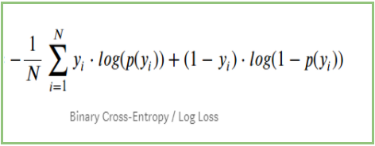

## Table of Contents

## What is cross-entropy loss?

Cross-entropy loss is a way to measure how well a machine learning model is doing, especially in tasks like classification where the model needs to pick one option out of many. It compares the model's predictions to the actual true answers. If the model's predictions are far from the true answers, the cross-entropy loss will be high, showing that the model needs to improve. If the predictions are close to the true answers, the loss will be low, meaning the model is doing well.

Think of it like this: imagine you're trying to guess the weather. If you predict it will be sunny and it actually is sunny, your guess was good and the cross-entropy loss would be low. But if you predict sunny and it rains, your guess was bad and the loss would be high. The goal in training a model is to minimize this loss, so the model gets better at making accurate predictions over time.

## How does cross-entropy loss differ from other loss functions?

Cross-entropy loss is different from other loss functions because it's specifically designed for classification problems where you need to pick one option out of several. It measures how well the model's predicted probabilities match the actual true outcomes. For example, if a model is trying to identify if an image is a cat, dog, or bird, cross-entropy loss will be low if the model confidently and correctly says "cat" when the image is indeed a cat. Other loss functions, like mean squared error, might be used for regression problems where you're predicting a number, not choosing a category.

Another key difference is how cross-entropy loss handles probabilities. It penalizes the model more heavily when it's very confident but wrong. If the model says there's a 99% chance of a cat when it's actually a dog, the cross-entropy loss will be high. In contrast, loss functions like mean absolute error or mean squared error don't directly deal with probabilities; they focus on the difference between predicted and actual values. This makes cross-entropy loss particularly useful in scenarios where understanding the probability of different outcomes is important, like in machine learning models that need to classify data accurately.

## Why is cross-entropy loss also known as log loss?

Cross-entropy loss is also called log loss because it uses logarithms in its calculation. When the model makes a prediction, it gives a probability for each possible outcome. Cross-entropy loss takes the logarithm of these probabilities and compares them to the true outcome. If the model's prediction is far from the truth, the logarithm of the probability will be a big negative number, making the loss high. If the prediction is close to the truth, the logarithm won't be as negative, keeping the loss low.

This use of logarithms in cross-entropy loss helps make the penalty for wrong predictions bigger when the model is very confident but wrong. Imagine if the model says there's a 99% chance of something happening, but it doesn't happen. The logarithm of 0.01 (1% chance) is a big negative number, so the loss is high. This pushes the model to be more careful and accurate with its predictions. That's why cross-entropy loss is also known as log loss - because it's all about using logarithms to measure how wrong the model's predictions are.

## How is cross-entropy loss calculated?

Cross-entropy loss is calculated by comparing the model's predicted probabilities to the actual true outcomes. Let's say you're trying to classify something into three categories: A, B, and C. The model gives a probability for each category, like 0.7 for A, 0.2 for B, and 0.1 for C. If the true answer is A, the cross-entropy loss focuses on the probability the model gave for A. It takes the negative logarithm of that probability, so if the model said 0.7 for A, the loss is -log(0.7). If the model was right but not very confident, like saying 0.5 for A, the loss would be -log(0.5), which is bigger.

If the model gets it wrong, the loss gets even bigger. For example, if the true answer is A but the model says 0.1 for A, the loss is -log(0.1), which is a much bigger number. This means the model gets penalized more for being very wrong and confident. The final cross-entropy loss is the average of these negative logarithms across all the examples in your dataset. The goal is to make this number as small as possible, which means the model is doing a good job at predicting the right categories.

## What are the advantages of using cross-entropy loss in classification problems?

Cross-entropy loss is great for classification problems because it helps the model learn to make better guesses by comparing its predictions to the true answers. It uses a special math trick called logarithms to make the model pay more attention when it's very wrong but confident. This means if the model thinks something is almost definitely true but it's not, the loss will be high, pushing the model to fix its mistake. This is really helpful because it makes the model work harder to get things right, especially when it's sure but wrong.

Another big advantage is that cross-entropy loss works well with probabilities. It looks at how likely the model thinks each answer is and compares that to what's actually true. This is important in classification because often you want to know not just the final answer, but how sure the model is about it. By focusing on these probabilities, cross-entropy loss helps the model improve its understanding of how likely different outcomes are, leading to more accurate and reliable predictions over time.

## Can cross-entropy loss be used for multi-class classification?

Yes, cross-entropy loss can be used for multi-class classification. In multi-class classification, you're trying to pick one option out of many, like choosing between cat, dog, and bird in an image. Cross-entropy loss works well here because it looks at the probabilities the model gives for each class. If the model says there's a 70% chance of a cat, 20% for a dog, and 10% for a bird, and the image is actually a cat, cross-entropy loss will focus on the 70% probability for cat. It uses a special math trick called logarithms to figure out how wrong or right the model is, making it a good choice for multi-class problems.

Cross-entropy loss helps the model learn better by making it pay more attention when it's very wrong but confident. If the model is sure about a wrong answer, like saying 90% dog when it's actually a cat, the loss will be high. This big loss tells the model it needs to fix its mistake. By doing this over and over with many examples, the model gets better at guessing the right class. This makes cross-entropy loss really useful for multi-class classification, where getting the right answer and understanding how sure the model is about it matters a lot.

## How does cross-entropy loss handle imbalanced datasets?

Cross-entropy loss can face challenges with imbalanced datasets, where some classes have a lot more examples than others. For example, if you're trying to classify images and most of them are cats, but only a few are dogs, the model might learn to always guess "cat" because it's seen so many more cat examples. This can make the model less accurate for the less common classes like dogs. Cross-entropy loss itself doesn't fix this problem directly, but it can be used with other techniques to help.

One common way to deal with imbalanced datasets is to use something called class weighting. This means you tell the model to pay more attention to the classes that don't show up as often. For example, if dogs are rare, you can make the loss bigger for wrong guesses about dogs. This makes the model try harder to get the dog class right. Another way is to change the dataset itself by adding more examples of the less common classes or removing some examples of the more common ones. These methods can help make the model better at handling all classes, even when the dataset is imbalanced.

## What are the common pitfalls when using cross-entropy loss?

One common pitfall when using cross-entropy loss is dealing with imbalanced datasets. If you have a lot more examples of one class than others, the model might learn to always guess the more common class, making it less accurate for the less common ones. Cross-entropy loss doesn't fix this problem on its own. You need to use other techniques like class weighting, where you make the model pay more attention to the less common classes, or change the dataset to balance it out.

Another pitfall is when the model is too confident but wrong. Cross-entropy loss can make the model focus too much on being confident, even if it's wrong. This happens because the loss gets really big when the model says something is almost definitely true but it's not. It's important to keep an eye on this and maybe use other methods to stop the model from being too sure of itself when it's wrong.

Sometimes, people also forget that cross-entropy loss is best for classification problems, not for things like predicting numbers. If you try to use it for the wrong kind of problem, like guessing someone's age instead of classifying them as young or old, you won't get good results. It's important to pick the right loss function for the job.

## How does the choice of optimizer affect the performance of cross-entropy loss?

The choice of optimizer can really change how well cross-entropy loss works. An optimizer is like a coach that helps the model learn from its mistakes. Some optimizers, like Stochastic Gradient Descent (SGD), are simple but can be slow. They might take a long time to make the cross-entropy loss small because they move in small steps. Other optimizers, like Adam or RMSprop, are smarter and can make the model learn faster. They adjust the steps the model takes based on how it's doing, which can help the cross-entropy loss go down quicker.

But it's not just about speed. Different optimizers can also affect how well the model does overall. For example, SGD might help the model find a good answer eventually, but it might get stuck along the way. Adam and RMSprop can help the model avoid getting stuck, but sometimes they might make the model jump around too much, which can make the cross-entropy loss go up and down a lot. So, choosing the right optimizer is important because it can make the model learn faster and better, helping the cross-entropy loss get as small as possible.

## What are the mathematical properties of cross-entropy loss?

Cross-entropy loss is a way to measure how different the model's guesses are from the true answers. It uses a math trick called logarithms to do this. If the model's guess is close to the true answer, the loss is small. But if the model is very sure about a wrong answer, the loss gets really big. This is because the logarithm of a small number (like the probability of the right answer when the model is wrong) is a big negative number. The formula for cross-entropy loss is the negative sum of the true probabilities times the logarithm of the predicted probabilities. This makes the model try harder to get the right answer and be less sure when it's wrong.

Cross-entropy loss is really useful because it helps the model learn from its mistakes. When the model is wrong but confident, the loss gets bigger, which tells the model it needs to fix its mistake. This is important for classification problems where the model needs to pick one answer out of many. The loss pushes the model to make its guesses closer to the true answers over time. By using logarithms, cross-entropy loss makes sure the model pays more attention to the examples it gets wrong, especially when it's very sure about those wrong answers.

## How can cross-entropy loss be optimized for deep learning models?

To make cross-entropy loss work better with deep learning models, you can use different tricks. One way is to choose the right optimizer, like Adam or RMSprop, which can help the model learn faster. These optimizers adjust how the model changes its guesses based on how it's doing, which can make the cross-entropy loss smaller quicker. Another trick is to use something called learning rate scheduling, where you change how big the steps the model takes are as it learns. Starting with big steps can help the model learn fast at first, but smaller steps later on can help it fine-tune its guesses.

Dealing with imbalanced datasets is also important. If your data has a lot more examples of one thing than another, the model might always guess the more common thing. To fix this, you can use class weighting, which makes the model pay more attention to the less common things. You can also change the dataset itself by adding more examples of the less common things or removing some of the more common ones. These tricks can help the model learn better and make the cross-entropy loss smaller, even when the data isn't balanced.

## What are some advanced techniques for improving cross-entropy loss performance?

One advanced technique to improve cross-entropy loss performance is called label smoothing. This means you don't tell the model the exact right answer all the time. Instead, you make the right answer a little less sure, like saying it's 90% right instead of 100%. This can help the model learn better because it doesn't get too confident about the right answers. Another technique is called focal loss, which makes the model pay more attention to the examples it gets wrong. If the model is doing well on most examples but struggling with a few, focal loss helps it focus on those hard ones, making the overall performance better.

Another way to boost cross-entropy loss performance is by using regularization techniques like dropout. Dropout randomly turns off some parts of the model during training, which can stop the model from relying too much on any one part. This makes the model more flexible and can help it learn better. Also, using techniques like data augmentation, where you create more training examples by changing the existing ones a little bit, can help the model see different versions of the same thing. This can make the model more accurate and reduce the cross-entropy loss by helping it understand the data better.

## What is the understanding of Cross-Entropy Loss and Log Loss?

Cross-entropy loss is a fundamental concept in [machine learning](/wiki/machine-learning), primarily used to gauge the discrepancy between predicted probability distributions and real outcomes. This loss function is widely utilized in various applications, including [algorithmic trading](/wiki/algorithmic-trading), due to its effectiveness in classification tasks. Cross-entropy quantifies this difference by providing a scalar loss value that reflects how closely the predicted probability distribution adheres to the true distribution.

In a mathematical context, cross-entropy loss for a binary classification problem can be expressed as:

$$
\text{Loss}(y, \hat{y}) = -\left(y \cdot \log(\hat{y}) + (1 - y) \cdot \log(1 - \hat{y})\right)
$$

Here, $y$ represents the actual class label, which can be either 0 or 1, and $\hat{y}$ is the predicted probability that the instance belongs to class 1. The above formula assesses the predicted probability against the true label, and penalties are assigned based on incorrect predictions. This makes cross-entropy particularly valuable for enhancing the accuracy of classifiers.

Log loss is a special case of cross-entropy loss that specifically applies to binary classification tasks, common in scenarios requiring a decision between two outcomes, such as whether a particular stock price will rise or fall. In the context of algorithmic trading, this binary nature makes log loss extremely useful for predicting simple market movements or signals such as "buy" or "sell."

Both cross-entropy loss and log loss play crucial roles in classification problems, which are inherently prevalent in algorithmic trading models. Trading algorithms frequently use classification methods to predict asset price movements or categorize assets based on future profitability indicators. These loss functions provide a robust mechanism for evaluating and refining these predictive models.

Incorporating these functions enables algorithmic trading systems to learn effectively from market data and iteratively hone their predictions, increasing their precision over time. As a result, they become indispensable tools in the trader's toolkit, ensuring that the algorithm remains adaptive and optimized to the constantly evolving financial landscape.

## What is the Role of Loss Functions in Algo Trading?

In algorithmic trading, the evaluation of models that predict buy or sell signals is essential for creating effective trading strategies. Loss functions such as cross-entropy loss are pivotal in this evaluation process. Cross-entropy loss measures the divergence between predicted probabilities of market trends and the actual market movements. The formula for cross-entropy loss is given by:

$$
\text{Loss} = -\sum_{i=1}^{n} y_i \log(p_i) + (1 - y_i) \log(1 - p_i)
$$

where $y_i$ is the actual outcome (0 or 1 for binary classification), and $p_i$ is the predicted probability of the outcome.

By applying cross-entropy loss, trading models can be fine-tuned to better align their predictions with real market data. The loss function guides the optimization process, typically employing gradient descent to iteratively adjust model parameters in pursuit of minimizing loss. This process enhances predictive accuracy, which in algorithmic trading translates to more reliable buy or sell signals.

Moreover, the sensitivity of cross-entropy loss to the discrepancy between predicted and actual probabilities ensures that models discriminately adjust their parameters, promoting a more precise understanding of market dynamics. This capability is critical in a domain where even minor inaccuracies can lead to significant financial consequences.

Overall, the application of cross-entropy loss in algorithmic trading fosters the development of models that not only predict market movements more accurately but also adapt to the ever-changing financial environment, thereby supporting robust and profitable trading strategies.

## What is Log Loss in Binary Trading Models?

Binary options trading models frequently utilize log loss to assess prediction accuracy due to its unique characteristics in handling binary classification problems. Log loss, also known as logistic loss or binary cross-entropy loss, measures the discrepancy between actual binary outcomes and predicted probabilities. The mathematical formula for log loss is:

$$

\text{Log Loss} = -\frac{1}{N} \sum_{i=1}^{N} [y_i \log(p_i) + (1-y_i) \log(1-p_i)]
$$

where $N$ is the number of observations, $y_i$ is the actual binary outcome (0 or 1), and $p_i$ is the predicted probability of the outcome being 1.

Log loss penalizes false predictions more severely than correct ones by assigning a high cost to confident but incorrect predictions. This characteristic fosters model improvements by encouraging more accurate probability estimations, particularly in predicting asset price movements as either a 'buy' or 'sell' signal. False positives and false negatives are heavily penalized, pushing the model to refine its parameters and improve decision-making accuracy.

In binary trading models, precise assessments are critical for profitability, and log loss drives enhancements by forcing the model to better understand and predict market dynamics. By minimizing log loss, traders can achieve a higher degree of confidence in their binary decisions, thus optimizing the performance of trading strategies in binary options markets.

## What is Multi-Class Classification with Cross-Entropy?

In trading environments where multiple asset classes are involved, using cross-entropy loss is essential for effectively managing complex classifications. Cross-entropy affords the ability to evaluate probability distributions over several classes, enabling algorithmic models to assess and refine predictions concerning a broad array of potential asset movements. This is crucial for developing trading strategies that can dynamically allocate resources across various markets and instruments, optimizing the likelihood of favorable outcomes.

The mathematical representation of cross-entropy loss for multi-class classification is given by:

$$
H(p, q) = -\sum_{i=1}^{N} p(x_i) \log(q(x_i))
$$

where $p(x_i)$ is the true distribution, often represented by the one-hot encoded label of the asset, and $q(x_i)$ is the predicted probability distribution output by the model. This loss function quantifies the dissimilarity between the actual market behavior and the model's forecasts, and by minimizing this disparity, the model improves its predictive capability.

Using cross-entropy in multi-class scenarios not only makes it possible to classify each asset accurately but also ensures the trading algorithm can handle unexpected market conditions with greater resilience. By distributing probabilities across an array of possible outcomes, the model gains insights into patterns and relationships among different asset classes.

For instance, consider a trading model that predicts movements across stocks, bonds, commodities, and currencies. With cross-entropy loss, the algorithm can assign probabilities to each of these asset classes in response to market signals, thereby crafting a diversified and balanced portfolio. Executing such a strategy involves utilizing a machine learning architecture that can handle this level of complexity, such as a [neural network](/wiki/neural-network) designed for multi-class classification tasks.

Leveraging libraries like TensorFlow or PyTorch facilitates the implementation of these models. The following Python snippet demonstrates how a simple multi-class classifier using cross-entropy can be set up using TensorFlow:

```python
import tensorflow as tf

# Assuming input_shape and num_classes are predefined
model = tf.keras.models.Sequential([
    tf.keras.layers.Dense(128, activation='relu', input_shape=(input_shape,)),
    tf.keras.layers.Dense(num_classes, activation='softmax')
])

model.compile(optimizer='adam',
              loss='categorical_crossentropy',
              metrics=['accuracy'])
```

Here, `categorical_crossentropy` is used as the loss function to accommodate multi-class predictions. This configuration enables the model to evaluate and adjust its predictions based on the feedback from the cross-entropy loss, thus improving its accuracy and effectiveness in trading multiple asset classes. As a result, traders equipped with such refined algorithms are better positioned to navigate the complexities of the market landscape, making informed decisions and maximizing potential returns.

## How can trading strategies be optimized with loss functions?

Loss functions like cross-entropy are fundamental in enabling trading algorithms to refine their parameters effectively through gradient descent. In algorithmic trading, the ultimate goal is to predict market trends with high precision to make profitable trading decisions. Cross-entropy loss serves as a quantitative measure of a model's prediction accuracy, allowing algorithms to make data-driven adjustments and improve their performance over time.

### Gradient Descent and Loss Minimization

Gradient descent is a widely used optimization technique in machine learning that helps in adjusting model parameters to minimize a given loss function. The basic idea is to compute the gradient of the loss function with respect to the model's parameters and update the parameters in the opposite direction of the gradient. This process iteratively reduces the loss, thereby increasing the model's accuracy. Formally, the parameter update can be expressed as:

$$
\theta' = \theta - \eta \nabla_\theta L(\theta)
$$

Where:
- $\theta$ are the model parameters
- $\eta$ is the learning rate
- $\nabla_\theta L(\theta)$ is the gradient of the loss function with respect to $\theta$

By minimizing the cross-entropy loss using the gradient descent method, trading algorithms can more accurately predict market movements and identify profitable trading opportunities.

### Enhancing Predictive Precision

Minimizing the cross-entropy loss directly impacts the algorithm's capacity to predict market trends accurately. A lower cross-entropy loss indicates that the predicted probabilities are closer to the actual market outcomes, which is critical in making informed buy or sell decisions. This precision is particularly crucial in dynamic markets where rapid decision-making can lead to significant profits or losses.

### Developing Robust Trading Strategies

Understanding and leveraging loss functions like cross-entropy facilitates the development of robust and adaptive trading strategies. These loss functions enable the algorithm to dynamically adjust to varying market conditions, enhancing its flexibility and resilience. By continually fine-tuning the model parameters to minimize loss, trading strategies can evolve to better handle different market scenarios and asset classes.

In conclusion, loss functions such as cross-entropy are integral to the optimization of trading models. They enable algorithms to adjust effectively through gradient descent, improve prediction accuracy, and contribute to the development of robust, adaptable trading strategies. Ongoing advancements in this area promise to yield even more sophisticated and successful trading algorithms in the future.

## What are the challenges and solutions?

A significant challenge encountered with cross-entropy and log loss functions in algorithmic trading is overfitting. Overfitting occurs when a model captures noise rather than the underlying data pattern, leading to overly confident predictions that may not generalize well to unseen data. This tendency can result in substantial financial losses for trading models that make predictions excessively tailored to historical market data.

One effective method to combat overfitting is the introduction of noise into predictions. This technique, often referred to as "label smoothing," involves slightly altering the predicted probability distributions. By preventing the model from assigning extreme probabilities to classes, label smoothing encourages a more generalized model capable of better performance on new data. For instance, instead of predicting a probability of 1 for a certain class and 0 for all others, the smoothing process could adjust it to predict 0.95 for the chosen class and distribute the remaining 0.05 among other classes.

Regularization is another strategy widely used to mitigate overfitting. Regularization techniques, such as L1 and L2 regularization, impose penalties on large coefficients within the model, discouraging complex models that fit noise in the data. These penalties can be added to the loss function, allowing for a trade-off between fitting the training data and maintaining simpler, more generalizable models. Mathematically, a regularized loss function could be expressed as:

$$
\text{Loss} = \text{CrossEntropy} + \lambda \cdot \text{Penalty}
$$

where $\lambda$ represents the regularization parameter, and the Penalty could be the sum of absolute values of coefficients (L1) or their squares (L2).

Furthermore, computational efficiency becomes a crucial consideration as the trading models increase in complexity. When dealing with numerous asset classes, models need to process vast datasets quickly to make timely trading decisions. Techniques such as mini-batch gradient descent can enhance computational efficiency by updating model parameters more frequently and in smaller increments, without the need to compute gradients over the entire dataset. This can lead to faster convergence and improved performance, particularly in environments requiring rapid decision-making.

In conclusion, tackling overfitting and maintaining computational efficiency are critical challenges in optimizing algorithmic trading models using cross-entropy and log loss. Through techniques like noise addition and regularization, combined with efficient computational practices, it is possible to create robust models that deliver reliable trading insights.

## References & Further Reading

[1]: Goodfellow, I., Bengio, Y., & Courville, A. (2016). ["Deep Learning"](https://link.springer.com/article/10.1007/s10710-017-9314-z). MIT Press.

[2]: Murphy, K. P. (2012). ["Machine Learning: A Probabilistic Perspective"](https://www.semanticscholar.org/paper/Machine-learning-a-probabilistic-perspective-Murphy/360ca02e6f5a5e1af3dce4866a257aafc2d6d6f5) The MIT Press.

[3]: Ng, A. Y., & Jordan, M. I. (2001). ["On Discriminative vs. Generative classifiers: A comparison of logistic regression and naive Bayes."](https://papers.nips.cc/paper/2001/file/7b7a53e239400a13bd6be6c91c4f6c4e-Paper.pdf) Advances in Neural Information Processing Systems 14.

[4]: Bishop, C. M. (2006). ["Pattern Recognition and Machine Learning"](https://link.springer.com/book/9780387310732). Springer.

[5]: Leskovec, J., Rajaraman, A., & Ullman, J. D. (2014). ["Mining of Massive Datasets"](https://assets.cambridge.org/97811084/76348/frontmatter/9781108476348_frontmatter.pdf). Cambridge University Press.

[6]: Chollet, F. (2018). ["Deep Learning with Python"](https://books.google.com/books/about/Deep_Learning_with_Python_Second_Edition.html?id=XHpKEAAAQBAJ). Manning Publications.