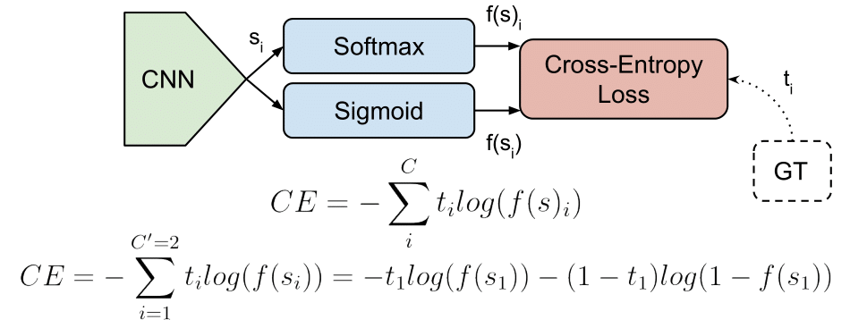

## Table of Contents

## What is Cross-Entropy in the context of machine learning?

Cross-Entropy is a concept used in machine learning to measure the difference between two probability distributions. In the context of machine learning, it's often used to measure how well a model's predictions match the actual outcomes. Imagine you have a model that predicts whether an email is spam or not. Cross-Entropy helps you understand how far off the model's predictions are from the real labels. If the model predicts a high probability for spam but the email is actually not spam, the cross-entropy loss will be high, indicating that the model needs to improve.

Mathematically, cross-entropy can be expressed using the formula $$ H(p, q) = -\sum_{x} p(x) \log q(x) $$, where \( p(x) \) is the true distribution and \( q(x) \) is the predicted distribution. In simpler terms, this formula calculates the average number of bits needed to encode an event from the true distribution using the predicted distribution. The goal in training a machine learning model is to minimize this value, which means making the model's predictions as close as possible to the actual outcomes. Lower cross-entropy values indicate better model performance, as the model's predictions are more aligned with the true probabilities.

## How does Cross-Entropy differ from other loss functions?

Cross-Entropy is different from other loss functions like Mean Squared Error (MSE) or Mean Absolute Error (MAE) because it focuses on the difference between probability distributions. While MSE and MAE measure the average of the squares or absolute differences between predicted and actual values, Cross-Entropy measures how well a set of predicted probabilities matches the actual distribution of outcomes. This makes Cross-Entropy particularly useful for classification problems where the output is a probability distribution over multiple classes.

For example, in a binary classification problem, Cross-Entropy would be calculated as $$ H(p, q) = -[y \log(p) + (1 - y) \log(1 - p)] $$, where \( y \) is the true label (0 or 1) and \( p \) is the predicted probability of the positive class. This formula penalizes the model more heavily for being confident and wrong than for being uncertain but close to the correct answer. In contrast, MSE or MAE might treat all errors equally, which can be less effective for classification tasks where understanding the probability of each class is crucial.

## Can you explain the mathematical formula for Cross-Entropy?

The mathematical formula for Cross-Entropy is $$ H(p, q) = -\sum_{x} p(x) \log q(x) $$. Here, \( p(x) \) represents the true distribution of the data, and \( q(x) \) represents the predicted distribution by the model. The formula calculates the average number of bits needed to encode an event from the true distribution using the predicted distribution. The goal in [machine learning](/wiki/machine-learning) is to minimize this value, which means the model's predictions are as close as possible to the actual outcomes.

In simpler terms, if you think of \( p(x) \) as the correct answer and \( q(x) \) as what the model thinks, Cross-Entropy measures how different these two are. The formula uses a sum over all possible outcomes, multiplying the true probability of each outcome by the logarithm of the predicted probability. The negative sign ensures that the result is always positive, and a lower value means the model's predictions are better.

## Why is Cross-Entropy particularly useful for classification problems?

Cross-Entropy is particularly useful for classification problems because it measures how well a model's predicted probabilities match the actual outcomes. In classification, the goal is to predict which class an input belongs to, and Cross-Entropy helps by comparing the model's probability distribution over all classes with the true distribution. This is important because it allows the model to learn from how confident it was in its predictions, not just whether it got the prediction right or wrong.

For example, if a model predicts a 90% chance of an email being spam when it's actually not spam, Cross-Entropy will penalize this more heavily than if the model predicted a 51% chance. This encourages the model to be more accurate in its confidence levels. The formula for Cross-Entropy, $$ H(p, q) = -\sum_{x} p(x) \log q(x) $$, directly reflects this by taking into account the true probabilities and the predicted probabilities, making it a powerful tool for improving classification accuracy.

## How does Cross-Entropy relate to information theory?

Cross-Entropy comes from information theory, which is all about how to measure and handle information. In information theory, entropy measures how much uncertainty there is in a random variable. Cross-Entropy builds on this idea by measuring the average number of bits needed to encode an event from one distribution using another distribution. If you think of the true distribution as the correct answer and the predicted distribution as what the model thinks, Cross-Entropy tells you how different these two are. The formula for Cross-Entropy is $$ H(p, q) = -\sum_{x} p(x) \log q(x) $$, where \( p(x) \) is the true distribution and \( q(x) \) is the predicted distribution.

In machine learning, this connection to information theory is really useful. When we train a model, we want it to make predictions that are as close as possible to the real outcomes. Cross-Entropy helps us do this by giving us a way to measure how well our model's predictions match the actual data. By trying to minimize the Cross-Entropy, we're essentially trying to make our model's predictions more like the true distribution, which is exactly what we want in classification problems. This makes Cross-Entropy a powerful tool for improving how well our models work.

## What is the significance of log base in the Cross-Entropy formula?

The log base in the Cross-Entropy formula $$ H(p, q) = -\sum_{x} p(x) \log q(x) $$ matters because it affects how we measure the difference between the true and predicted distributions. When we use the natural logarithm (base e), we're measuring the average number of bits needed to encode an event from the true distribution using the predicted distribution in units called "nats." If we use base 2, we're measuring in "bits." The choice of base changes the scale of the Cross-Entropy value but doesn't change the overall goal of minimizing it.

In simple terms, if you switch the log base, you're just changing the units of measurement, like going from inches to centimeters. But the key thing is that the relative differences between Cross-Entropy values stay the same no matter which base you choose. This means you can use any base that fits your needs, and the model will still work to make its predictions closer to the true outcomes.

## How can Cross-Entropy be used to measure the performance of a model?

Cross-Entropy is a way to see how well a model is doing by comparing its guesses to what's actually true. Imagine you're trying to guess what kind of fruit is in a basket. If you say there's a high chance of apples but it's actually full of oranges, Cross-Entropy will show that your guess was pretty far off. The formula for Cross-Entropy is $$ H(p, q) = -\sum_{x} p(x) \log q(x) $$, where \( p(x) \) is what's really in the basket and \( q(x) \) is what you guessed. By using this formula, you can see how different your guesses are from the truth.

When training a model, the goal is to make this Cross-Entropy number as small as possible. A smaller number means your model's guesses are getting closer to what's actually happening. For example, if your model is getting better at telling apples from oranges, the Cross-Entropy will go down. This helps you know if your model is improving and how much more work it might need to be really good at its job.

## What are the practical considerations when implementing Cross-Entropy in a machine learning model?

When implementing Cross-Entropy in a machine learning model, one of the main things to think about is handling the case when the predicted probability is zero or very close to zero. This can happen if your model is very confident that something won't happen, but it actually does. In this case, the logarithm in the Cross-Entropy formula $$ H(p, q) = -\sum_{x} p(x) \log q(x) $$ would try to calculate the log of zero, which is undefined. To avoid this, you can add a small number, called a "smoothing [factor](/wiki/factor-investing)" or "epsilon," to your predictions. This makes sure the log never tries to calculate zero, keeping your calculations stable.

Another important thing to consider is how to use Cross-Entropy to improve your model. When training your model, you want to minimize the Cross-Entropy loss. This means adjusting the model's parameters so that its predictions get closer to the true outcomes. You can do this by using an optimization algorithm like gradient descent, which changes the model's parameters a little bit at a time to reduce the Cross-Entropy. It's also good to keep an eye on the Cross-Entropy value as you train your model, because if it stops going down, it might mean your model has learned as much as it can from the data you're giving it.

## How does Cross-Entropy handle multi-class classification problems?

In multi-class classification problems, Cross-Entropy measures how well a model's predictions match the true outcomes across multiple classes. Imagine you're trying to guess which type of fruit is in a basket, and there are many types like apples, oranges, and bananas. If your model says there's a high chance of apples but the basket actually has bananas, Cross-Entropy will show how different your guess is from the truth. The formula for Cross-Entropy in this case is $$ H(p, q) = -\sum_{x} p(x) \log q(x) $$, where \( p(x) \) is the true distribution (like the actual fruit in the basket) and \( q(x) \) is the predicted distribution (what the model thinks is in the basket). By calculating this for all classes, Cross-Entropy gives you a single number that tells you how well your model's predictions match the real world.

When using Cross-Entropy for multi-class classification, you need to make sure your model's output is a set of probabilities that add up to one. This is often done using a softmax function, which turns the model's raw output into a probability distribution over all classes. For example, if your model outputs scores for apples, oranges, and bananas, the softmax function will convert these scores into probabilities like 0.7 for apples, 0.2 for oranges, and 0.1 for bananas. By comparing these probabilities to the true labels (like 1 for bananas and 0 for the others), Cross-Entropy helps the model learn to make better guesses by minimizing the difference between its predictions and the actual outcomes.

## Can you discuss the limitations and potential issues with using Cross-Entropy as a loss function?

One limitation of using Cross-Entropy as a loss function is that it can be sensitive to class imbalance. If you have a lot more examples of one class than another, the model might focus too much on the common class and not learn well about the rare ones. This can make the model's predictions less useful for the less common classes. Another issue is that Cross-Entropy can sometimes cause the model to be overconfident in its predictions. If the model predicts a very high probability for the wrong class, the Cross-Entropy loss will be very high, which can lead to the model trying to be too sure about its guesses, even when it's wrong.

There are also practical issues to consider when using Cross-Entropy. For example, when the model predicts a probability of zero for the true class, the logarithm in the Cross-Entropy formula $$ H(p, q) = -\sum_{x} p(x) \log q(x) $$ becomes undefined. To avoid this, you need to add a small number, called a smoothing factor or epsilon, to the predictions. This keeps the calculations stable but can change the loss a bit. Also, while Cross-Entropy is great for classification problems, it might not be the best choice for other types of problems, like regression, where you're trying to predict a number instead of a class.

## How does the concept of Cross-Entropy extend to more advanced topics like neural networks?

In neural networks, Cross-Entropy is used as a loss function to help the network learn how to classify things better. Imagine you're teaching a [neural network](/wiki/neural-network) to tell the difference between pictures of cats and dogs. The network makes a guess about each picture, saying something like "90% chance it's a cat, 10% chance it's a dog." Cross-Entropy compares these guesses to the actual labels (like "it's really a dog") and tells the network how wrong it was. The formula for Cross-Entropy is $$ H(p, q) = -\sum_{x} p(x) \log q(x) $$, where \( p(x) \) is the true label and \( q(x) \) is the network's prediction. By trying to make this number smaller, the neural network adjusts its weights and biases to make better guesses over time.

One cool thing about using Cross-Entropy in neural networks is that it works well with backpropagation, a method used to update the network's parameters. Backpropagation calculates how much each part of the network contributed to the wrong guess and adjusts those parts to make the network's predictions more accurate. Cross-Entropy's sensitivity to the difference between the predicted and true probabilities helps the network learn faster and more effectively. It's like giving the network a clear signal about where it needs to improve, making it a key part of training successful neural networks for classification tasks.

## What are some advanced techniques or modifications to the basic Cross-Entropy method used in state-of-the-art models?

In state-of-the-art models, one advanced technique to modify the basic Cross-Entropy method is called Label Smoothing. This technique helps prevent the model from being too confident in its predictions. Instead of using hard labels like 1 for the correct class and 0 for others, Label Smoothing uses soft labels. For example, if the true label is a cat, instead of using 1 for cat and 0 for dog, you might use 0.9 for cat and 0.1 for dog. This change makes the Cross-Entropy loss less harsh when the model makes a mistake, encouraging the model to be more cautious and potentially improving its performance on new data.

Another modification is Focal Loss, which is particularly useful when dealing with imbalanced datasets. Focal Loss adjusts the Cross-Entropy formula to focus more on hard-to-classify examples. The formula for Focal Loss is $$ FL(p_t) = -\alpha_t (1 - p_t)^\gamma \log(p_t) $$, where \( p_t \) is the model's estimated probability for the correct class, \( \alpha_t \) is a weighting factor, and \( \gamma \) is a focusing parameter. By giving more weight to the examples the model gets wrong, Focal Loss helps the model learn better from these challenging cases, leading to improved performance on minority classes.