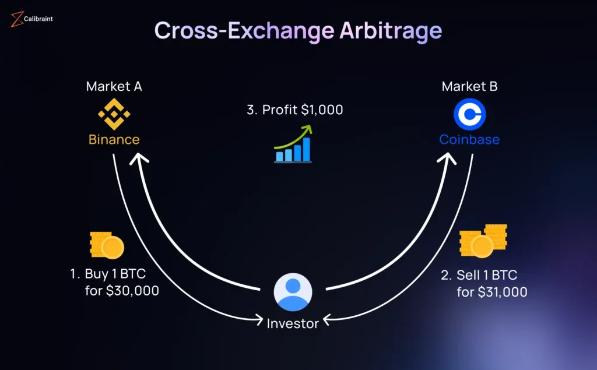

## Table of Contents

## What is cross-exchange trading?

Cross-exchange trading is when you buy and sell the same cryptocurrency on different exchanges to make a profit. For example, if Bitcoin is cheaper on one exchange and more expensive on another, you can buy it on the cheaper exchange and sell it on the more expensive one. This way, you can take advantage of the price differences between exchanges.

To do cross-exchange trading, you need to have accounts on multiple exchanges and be able to move your cryptocurrency quickly between them. It can be a bit complicated because you have to keep track of the prices on different exchanges and also consider the fees for trading and transferring. But if you do it right, it can be a good way to make money in the cryptocurrency market.

## Why would someone engage in cross-exchange trading?

Someone might engage in cross-exchange trading because they want to make money from the differences in prices of cryptocurrencies on different exchanges. If Bitcoin is cheaper on one exchange and more expensive on another, a trader can buy it on the cheaper exchange and sell it on the more expensive one. This way, they can earn a profit from the price difference, which is called arbitrage.

Cross-exchange trading can be appealing because it offers a way to potentially make money without having to predict the overall direction of the [cryptocurrency](/wiki/cryptocurrency) market. Instead, traders focus on the price gaps between exchanges. However, it requires quick action and careful management because the prices can change rapidly, and there are fees for trading and transferring cryptocurrencies between exchanges. Despite these challenges, many traders find it a worthwhile strategy to explore.

## What are the basic risks involved in cross-exchange trading?

One basic risk of cross-exchange trading is that prices can change very quickly. You might see a big price difference between two exchanges, but by the time you buy on the cheaper exchange and try to sell on the more expensive one, the prices might have changed. This means you could end up losing money instead of making a profit. It's important to act fast and keep an eye on the prices all the time.

Another risk is the fees you have to pay. Every time you buy, sell, or move your cryptocurrency between exchanges, there are fees. These fees can eat into your profits, especially if the price difference between the exchanges is small. You need to make sure the profit you're hoping to make is bigger than the total fees you'll have to pay.

Lastly, there's the risk of technical issues. Sometimes, exchanges can have problems like slow transaction times or even crashes. If you can't move your cryptocurrency quickly enough, you might miss out on the price difference you were trying to take advantage of. It's a good idea to use exchanges that are reliable and have good performance.

## How does one identify arbitrage opportunities in cross-exchange trading?

To find [arbitrage](/wiki/arbitrage) opportunities in cross-exchange trading, you need to keep an eye on the prices of the same cryptocurrency on different exchanges. You're looking for times when the price on one exchange is lower than on another. For example, if Bitcoin is $30,000 on Exchange A and $30,500 on Exchange B, you might be able to buy it on Exchange A and sell it on Exchange B to make a profit. You can use websites or tools that show prices across multiple exchanges to help you spot these differences quickly.

Once you find a price difference, you have to act fast because prices can change quickly. It's also important to think about the fees you'll have to pay for buying, selling, and moving the cryptocurrency between exchanges. These fees can eat into your profit, so the price difference needs to be big enough to cover them. Sometimes, using special software or bots can help you find and take advantage of these opportunities faster and more efficiently.

## What tools or platforms are commonly used for cross-exchange trading?

To do cross-exchange trading, people often use special tools and platforms that help them find and take advantage of price differences quickly. One popular type of tool is called an arbitrage bot. These bots watch the prices on different exchanges all the time and can automatically buy and sell cryptocurrencies when they find a good opportunity. This can be really helpful because it means you don't have to watch the prices yourself all the time. Some well-known arbitrage bots are Blackbird, Gimmer, and Haasbot.

Another type of tool is called a price aggregator. These tools collect price data from many different exchanges and show it all in one place. This makes it easier to see where the prices are different and decide where to buy and sell. Examples of price aggregators include CoinGecko, CoinMarketCap, and CryptoCompare. These websites are easy to use and can help you spot arbitrage opportunities without needing to check each exchange separately.

Some traders also use trading platforms that let them trade on multiple exchanges from one place. These platforms often have built-in tools for finding arbitrage opportunities and can help manage the buying, selling, and moving of cryptocurrencies between exchanges. Examples of these platforms include 3Commas and Cryptohopper. Using these tools can make cross-exchange trading easier and more efficient, but it's still important to understand the risks and fees involved.

## Can you explain the concept of price discrepancies across exchanges?

Price discrepancies across exchanges happen when the same cryptocurrency has different prices on different trading platforms. This can happen for many reasons. Sometimes, there are more people wanting to buy or sell on one exchange than another, which can make the price go up or down. Other times, news or events might affect the price on one exchange faster than others. Also, some exchanges might have fewer people trading, which can lead to bigger price differences.

Traders look for these price discrepancies because they can make money from them. If Bitcoin is cheaper on one exchange and more expensive on another, a trader can buy it on the cheaper exchange and then sell it on the more expensive one. This is called arbitrage. But to make a profit, the trader needs to act quickly because prices can change fast. They also have to think about the fees for buying, selling, and moving the cryptocurrency between exchanges, which can eat into their profits.

## What are some common strategies for beginners in cross-exchange trading?

For beginners in cross-exchange trading, one good strategy is to start by using price aggregators like CoinGecko or CoinMarketCap. These tools show you the prices of cryptocurrencies on different exchanges all in one place. By looking at these prices, you can easily spot when a cryptocurrency is cheaper on one exchange and more expensive on another. Once you find a good price difference, you can buy the cryptocurrency on the cheaper exchange and sell it on the more expensive one to make a profit. Remember, you need to act quickly because prices can change fast.

Another strategy for beginners is to start with small amounts of money. This way, you can learn how cross-exchange trading works without risking too much. It's also a good idea to focus on just a few cryptocurrencies at first, like Bitcoin or Ethereum, because they are more widely traded and easier to find price differences for. As you get more comfortable, you can start trading with bigger amounts and looking at more cryptocurrencies. Always remember to check the fees for buying, selling, and moving your cryptocurrency, because these can affect your profits.

## How does liquidity affect cross-exchange trading strategies?

Liquidity is really important for cross-exchange trading. It means how easy it is to buy or sell a cryptocurrency on an exchange without the price changing a lot. If an exchange has high [liquidity](/wiki/liquidity-risk-premium), you can quickly buy and sell without moving the price much. This is good for cross-exchange trading because you want to take advantage of price differences without making the price change on you. If an exchange has low liquidity, it can be harder to trade because your trades might move the price, making it harder to make a profit.

When you're planning your cross-exchange trading strategy, you need to think about the liquidity of the exchanges you're using. If one exchange has low liquidity, the price might change a lot when you try to buy or sell, which could make your arbitrage opportunity go away. So, it's a good idea to use exchanges with high liquidity for both buying and selling. This way, you can be more sure that the price won't change too much while you're making your trades, helping you make a profit from the price differences between exchanges.

## What advanced techniques can be used to optimize cross-exchange trading?

One advanced technique for optimizing cross-exchange trading is using arbitrage bots. These are special computer programs that watch the prices on different exchanges all the time. When they see a good price difference, they can automatically buy and sell the cryptocurrency for you. This can help you take advantage of opportunities faster than if you were doing it by hand. Arbitrage bots can also help you keep track of fees and make sure you're making a profit after you pay them. But you need to be careful and make sure you choose a good bot that works well and is safe to use.

Another technique is to use multiple trading accounts on different exchanges. This can help you move your cryptocurrency quickly between exchanges to take advantage of price differences. You can also use special trading platforms that let you trade on many exchanges from one place. These platforms often have tools that can help you find good arbitrage opportunities and manage your trades better. By using these advanced techniques, you can make your cross-exchange trading more efficient and increase your chances of making a profit. But remember, even with these tools, it's important to keep learning and stay careful because the cryptocurrency market can be unpredictable.

## How do regulatory differences between exchanges impact cross-exchange trading?

Regulatory differences between exchanges can make cross-exchange trading more complicated. Different countries have their own rules about cryptocurrencies, and these rules can affect how exchanges work. For example, some countries might have strict rules about who can trade and how much they can trade, while others might have more relaxed rules. This means that the same cryptocurrency might be easier to buy and sell on one exchange than on another, which can lead to bigger price differences. Traders need to be aware of these rules because they can affect how quickly and easily they can move their cryptocurrency between exchanges.

These regulatory differences can also affect the fees and the time it takes to move cryptocurrency between exchanges. Some exchanges might have higher fees or longer waiting times because of the rules in their country. This can make it harder to make a profit from cross-exchange trading because the price differences need to be big enough to cover these extra costs. Traders need to do their research and understand the regulations for each exchange they use, so they can plan their trades better and avoid any surprises that might cost them money.

## What are the tax implications of profits made from cross-exchange trading?

When you make money from cross-exchange trading, you have to think about taxes. In many countries, the profits you make from trading cryptocurrencies are considered taxable income. This means you need to report your earnings to the tax office and pay taxes on them. The exact amount of tax you'll pay depends on the rules in your country and how much money you made. Some places might tax your profits as capital gains, while others might treat them as regular income. It's important to keep good records of all your trades so you can report everything correctly and avoid any trouble with the tax office.

Different countries have different rules about how to handle cryptocurrency taxes. For example, in the United States, the IRS treats cryptocurrencies as property, so any profit you make from trading is subject to capital gains tax. In other countries, like Germany, if you hold your cryptocurrencies for more than a year, your profits might be tax-free. Because the rules can be complicated and change often, it's a good idea to talk to a tax professional who knows about cryptocurrencies. They can help you understand what you need to do and make sure you're following the law.

## How can one manage and mitigate the risks associated with cross-exchange trading at an expert level?

At an expert level, managing and mitigating the risks of cross-exchange trading involves using advanced tools and strategies. One key approach is to use arbitrage bots that can monitor prices across multiple exchanges in real-time and execute trades automatically when profitable opportunities arise. These bots can help you act quickly and reduce the chance of missing out on price differences. Additionally, experts often use sophisticated risk management software that can help them set stop-loss orders to limit potential losses if the market moves against them. By combining these tools, experts can better manage the fast-paced nature of cross-exchange trading and minimize the impact of sudden price changes.

Another important strategy is diversification. Instead of focusing on just one or two cryptocurrencies, experts spread their trades across multiple assets. This can help reduce the risk of losing a lot of money if the price of one cryptocurrency suddenly drops. Experts also pay close attention to the liquidity of the exchanges they use, choosing platforms with high trading volumes to ensure they can buy and sell quickly without significantly affecting the price. Finally, staying informed about regulatory changes and understanding the tax implications of their trading activities helps experts navigate the complex landscape of cross-exchange trading more effectively, ensuring they are prepared for any potential issues that may arise.

## References & Further Reading

[1]: Dijkema, T. (2010). ["Cross-Exchange Arbitrage"](https://kensoninvestments.com/knowledge-centre/the-art-of-arbitrage-exploiting-price-differences-across-crypto-exchanges/). SSRN Electronic Journal. 

[2]: Hendershott, T., & Riordan, R. (2013). ["Algorithmic Trading and the Market for Liquidity."](https://www.cambridge.org/core/journals/journal-of-financial-and-quantitative-analysis/article/abs/algorithmic-trading-and-the-market-for-liquidity/C1A34D3767436529EA4F23DB1780273C) Journal of Financial and Quantitative Analysis.

[3]: Lopez de Prado, M. (2018). ["Advances in Financial Machine Learning"](https://www.amazon.com/Advances-Financial-Machine-Learning-Marcos/dp/1119482089). Wiley.

[4]: Aldridge, I. (2013). ["High-Frequency Trading: A Practical Guide to Algorithmic Strategies and Trading Systems"](https://www.amazon.com/High-Frequency-Trading-Practical-Algorithmic-Strategies/dp/1118343506). Wiley.

[5]: Chan, E. (2009). ["Quantitative Trading: How to Build Your Own Algorithmic Trading Business"](https://github.com/ftvision/quant_trading_echan_book). Wiley.