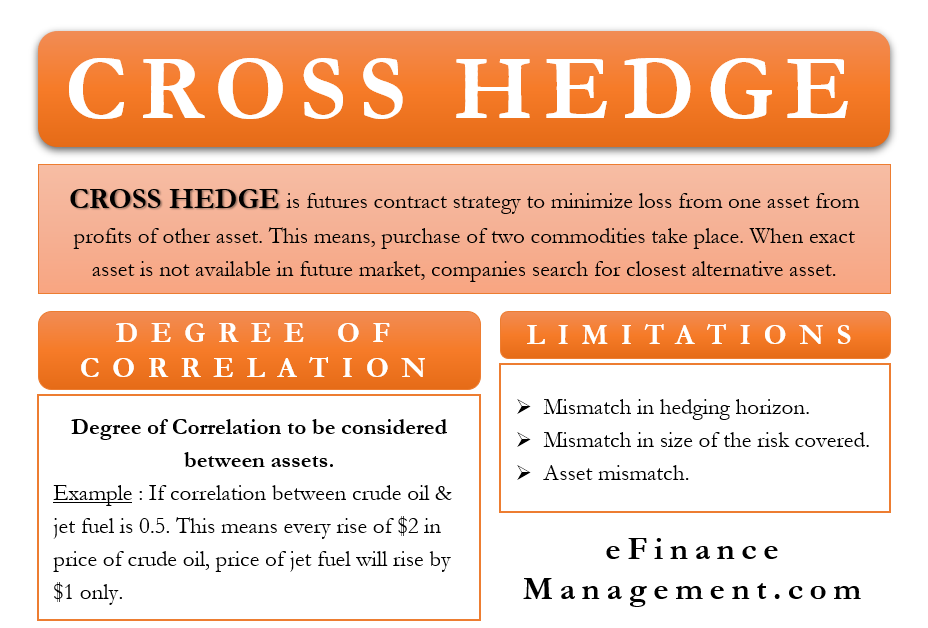

## Table of Contents

## What is a cross hedge in trading?

A cross hedge in trading is when you use a futures contract to protect yourself from price changes in something you own or plan to buy, but the futures contract is for a different, yet related, product. For example, if you grow wheat but there are no wheat futures available, you might use corn futures to hedge your wheat price risk because wheat and corn prices often move together.

This strategy is useful because it helps manage risk when a direct hedge isn't possible. However, it's not perfect because the prices of the two products might not move exactly the same way. So, while a cross hedge can reduce your risk, it might not eliminate it completely. It's like using an umbrella to stay dry in a rainstorm, but the umbrella might have a few holes in it.

## How does cross hedging differ from direct hedging?

Cross hedging and direct hedging are both ways to protect against price changes, but they work a bit differently. In direct hedging, you use a futures contract that matches exactly what you're trying to protect. For example, if you're a farmer growing corn, you would use corn futures to hedge against price changes in corn. This is like using a key that fits perfectly into a lock.

Cross hedging, on the other hand, is used when you can't find a perfect match for what you want to protect. Instead, you use a futures contract for something related to what you own. Going back to the farmer example, if there are no corn futures available, the farmer might use wheat futures instead because corn and wheat prices often move in similar ways. It's like using a key that's close to fitting the lock but might need a bit of jiggling to work.

## What are the basic steps to implement a cross hedge?

To implement a cross hedge, you first need to identify the asset you want to protect and find a related futures contract that you can use. For example, if you're a farmer growing soybeans but there are no soybean futures available, you might look at corn futures because soybean and corn prices often move together. Once you've chosen the related futures contract, you need to figure out how much of that futures contract you need to buy or sell. This depends on how closely the prices of the two products move together. If soybean and corn prices move very similarly, you might need less of the corn futures contract. If they don't move as closely, you might need more.

Next, you'll need to decide whether to buy or sell the futures contract. If you're worried about the price of your asset going down, you would sell the futures contract. If you're worried about the price going up, you would buy the futures contract. After setting up the hedge, you'll need to keep an eye on the prices of both your asset and the futures contract. If the prices move differently than you expected, you might need to adjust your hedge. Remember, a cross hedge isn't perfect because the prices might not move exactly the same way, but it can still help reduce your risk.

## Can you explain the concept of correlation in cross hedging?

Correlation in cross hedging is all about how closely the prices of two different things move together. When you're using a cross hedge, you're trying to protect the price of something you own or plan to buy, but you're using a futures contract for a different product. The key is to find a futures contract for something that has a high correlation with what you're trying to protect. If the prices of the two products move in a similar way, the hedge will work better.

For example, if you're a farmer growing soybeans and you want to protect against falling soybean prices, but there are no soybean futures available, you might use corn futures instead. If soybean and corn prices usually go up and down together, they have a high correlation. This means that when soybean prices fall, corn prices are likely to fall too, so selling corn futures can help protect your soybean prices. But if soybean and corn prices don't move together very well, the hedge won't work as well because the correlation is low.

## What are some common assets used in cross hedging?

In cross hedging, people often use commodities like corn, wheat, and soybeans. For example, if a farmer grows wheat but there are no wheat futures, they might use corn futures instead because corn and wheat prices often move together. Another common use is with different types of oil. If you're in the oil business and want to protect against price changes in crude oil, but there are no crude oil futures available, you might use heating oil futures because their prices tend to move in a similar way.

Another area where cross hedging is common is with currencies. If you're doing business in a country where there are no futures for that country's currency, you might use futures for a related currency. For example, if you're doing business in Mexico but there are no Mexican peso futures, you might use US dollar futures because the peso and the dollar are often linked. This can help protect against changes in the value of the peso.

In the stock market, cross hedging can also be used with stock indices. If you own a lot of tech stocks and want to protect against a drop in tech stock prices, but there are no specific tech stock futures, you might use futures on a broader stock index like the S&P 500. This is because tech stocks are part of the S&P 500, so their prices often move together.

## How can a beginner identify suitable assets for cross hedging?

To identify suitable assets for cross hedging, a beginner should first look at what they want to protect. If you're a farmer with wheat, you want to find something else that moves in a similar way to wheat prices. This means you need to look for things that are related to what you have. For example, if wheat prices often go up and down with corn prices, corn could be a good choice for cross hedging. You can find out which assets move together by looking at historical price data or talking to experts in the field.

Once you've found a few possible assets, you need to check how closely their prices move with your asset. This is called correlation. You can use tools like charts and graphs to see how the prices have moved over time. If the prices move a lot alike, that asset could work well for cross hedging. Remember, the closer the prices move together, the better the hedge will work. But if the prices don't move together very well, the hedge won't be as effective. So, take your time to find the right asset that matches well with what you want to protect.

## What are the risks associated with cross hedging?

Cross hedging can be a bit tricky because it's not a perfect way to protect your prices. The main risk is that the prices of the two things you're using might not move in the same way. For example, if you're a farmer using corn futures to protect your wheat prices, but corn and wheat prices don't move together as much as you thought, your hedge won't work as well. This means you might still lose money if wheat prices go down a lot and corn prices don't go down as much.

Another risk is that you might not choose the right amount of the futures contract to use. If you use too little, your hedge won't protect you enough. If you use too much, you might end up losing money on the futures contract even if your original asset's price stays the same. It's like trying to use an umbrella that's too small or too big for the rain; it won't keep you as dry as you need to be. So, it's important to do your homework and make sure you're using the right amount of the futures contract to match the risk you're trying to protect against.

## How can one measure the effectiveness of a cross hedge?

To measure the effectiveness of a cross hedge, you need to see how well it protects you from price changes. One way to do this is by looking at how much the price of what you're trying to protect changes compared to the price of the futures contract you're using. If the two prices move together a lot, the hedge is working well. You can use something called correlation to measure this. If the correlation is high, it means the hedge is more effective because the prices are moving together more closely.

Another way to measure the effectiveness is by looking at how much money you lose or gain on the futures contract compared to the asset you're trying to protect. If the hedge is working well, any losses on the asset you're protecting should be balanced out by gains on the futures contract, and vice versa. If you find that you're still losing a lot of money even with the hedge in place, it might not be as effective as you need it to be. It's like checking if your umbrella is keeping you dry; if you're still getting wet, you might need a better umbrella or a different way to stay dry.

## What advanced techniques can be used to optimize a cross hedge strategy?

To optimize a cross hedge strategy, you can use something called regression analysis. This is a fancy way of figuring out how much the price of one thing affects the price of another thing. By using regression analysis, you can find out exactly how much of the futures contract you need to use to protect your asset. This can make your hedge more effective because you're using just the right amount of the futures contract. It's like using a recipe to make sure you're putting in the right amount of each ingredient to make the perfect cake.

Another advanced technique is to use multiple futures contracts instead of just one. This is called a multi-asset hedge. If you're trying to protect the price of wheat, you might use both corn and soybean futures because wheat prices can be affected by both corn and soybean prices. By using more than one futures contract, you can cover more of the risk and make your hedge even better. It's like using more than one umbrella to stay dry in a heavy rainstorm; the more umbrellas you have, the less likely you are to get wet.

## Can you provide examples of successful cross hedging in different markets?

In the agricultural market, a farmer growing soybeans might use corn futures to protect against falling soybean prices. Soybean and corn prices often move together, so if soybean prices start to drop, the farmer can sell corn futures to make up for the loss. For example, a farmer in the Midwest noticed that soybean prices were about to drop due to a bumper crop. Since there were no soybean futures available, the farmer used corn futures instead. When soybean prices fell, the farmer made money on the corn futures, which helped cover the loss on the soybeans. This cross hedge worked well because soybean and corn prices were closely related.

In the currency market, a company doing business in Mexico might use US dollar futures to protect against changes in the value of the Mexican peso. If the peso starts to lose value compared to the dollar, the company can use US dollar futures to make up for the loss. For instance, a tech company in the US was planning to expand into Mexico but was worried about the peso's value dropping. They used US dollar futures to hedge their risk. When the peso did weaken against the dollar, the company made money on the US dollar futures, which helped offset the cost of doing business in Mexico. This cross hedge was effective because the peso and the dollar often move together.

In the stock market, an investor with a lot of tech stocks might use S&P 500 futures to protect against a drop in tech stock prices. Tech stocks are part of the S&P 500, so their prices often move together. For example, an investor saw that tech stocks were about to take a hit due to a new regulation. Since there were no specific tech stock futures available, the investor used S&P 500 futures instead. When tech stock prices fell, the investor made money on the S&P 500 futures, which helped cover the loss on the tech stocks. This cross hedge worked well because tech stocks and the S&P 500 are closely related.

## How do regulatory environments affect cross hedging strategies?

Regulatory environments can really change how cross hedging works. Different countries have different rules about trading futures and other financial tools. For example, some places might not let you use certain futures contracts for cross hedging, or they might make you follow strict rules about how much you can trade. This can make it harder to find the right futures contract to use for your hedge. If the rules are too tight, you might have to look for other ways to protect your prices, which can be tricky and might not work as well.

Also, regulations can affect the costs of cross hedging. Some countries have taxes or fees that you have to pay when you trade futures. These extra costs can make cross hedging more expensive, which means it might not be worth it if the costs are too high. On the other hand, if the regulations are more relaxed, it can be easier and cheaper to use cross hedging. So, it's important to know the rules in your area and how they might change your cross hedging strategy.

## What are the future trends and developments in cross hedging?

In the future, cross hedging might become easier and more effective because of new technology. Computers and special software can help people find the best futures contracts to use for cross hedging. They can look at a lot of data quickly and figure out which assets move together the most. This can make it easier for people to set up their hedges and make them work better. Also, as more people start using cross hedging, there might be more futures contracts available for different things. This means people will have more choices for what to use in their hedges, which can make them more effective.

Another trend we might see is more rules and regulations about cross hedging. Governments and other groups might start making new laws to make sure people are using cross hedging in a fair and safe way. This could mean more paperwork and costs for people who want to use cross hedging, but it could also make the markets more stable and trustworthy. As these changes happen, people who use cross hedging will need to keep up with the new rules and find ways to make their strategies work within them.

## What is the Cross Hedge Trading Strategy?

Cross hedge trading is a sophisticated risk management strategy employed to mitigate potential losses in investment portfolios by leveraging correlations between different assets. This approach involves using two correlated assets—securities that generally move in tandem due to similar price drivers—to offset potential adverse movements in one asset by taking an opposing position in another.

The fundamental principle of a cross hedge trading strategy relies on identifying a pair of assets with positive correlations. For example, a trader holding a position in [crude oil](/wiki/crude-oil) may choose to hedge this exposure by taking a position in a correlated asset such as natural gas. While the two commodities are distinct, their price movements are often related due to shared economic influences like global energy demand.

This strategy offers a form of protection against market [volatility](/wiki/volatility-trading-strategies). By holding offsetting positions, potential losses in one security are balanced by gains in the other, assuming the correlation holds. The formula for implementing a basic cross hedge can be represented as:

$$
\text{Hedge Ratio} = \frac{\text{Cov}(R_a, R_b)}{\text{Var}(R_b)}
$$

where:
- $R_a$ represents the return of the asset being hedged.
- $R_b$ represents the return of the hedging asset.
- $\text{Cov}(R_a, R_b)$ denotes the covariance between the returns of the two assets.
- $\text{Var}(R_b)$ is the variance of the returns of the hedging asset.

Despite its utility, cross hedge trading strategies [carry](/wiki/carry-trading) inherent risks. A primary concern is the breakdown of correlations during market stress or unexpected economic events, where the paired assets may move in opposite directions, thus nullifying the hedge. For instance, external factors like geopolitical developments or abrupt changes in market sentiment could cause correlated assets to diverge, resulting in an ineffective hedge.

Traders employing cross hedge strategies must continuously monitor the relationships between their chosen assets and be prepared for scenarios where the correlations may not behave as expected. Additionally, ongoing assessment of market conditions and re-evaluation of hedge ratios are crucial in maintaining the efficacy of this strategy.

## References & Further Reading

[1]: Campbell, J. Y., Lo, A. W., & MacKinlay, A. C. (1997). ["The Econometrics of Financial Markets."](https://press.princeton.edu/books/hardcover/9780691043012/the-econometrics-of-financial-markets) Princeton University Press.

[2]: Chincarini, L. B., & Kim, D. (2006). ["Quantitative Equity Portfolio Management: An Active Approach to Portfolio Construction and Management."](https://archive.org/details/quantitativeequi0000chin_c9d6) McGraw-Hill Education.

[3]: De Prado, M. L. (2018). ["Advances in Financial Machine Learning."](https://www.amazon.com/Advances-Financial-Machine-Learning-Marcos/dp/1119482089) Wiley.

[4]: Chan, E. P. (2013). ["Algorithmic Trading: Winning Strategies and Their Rationale."](https://github.com/ftvision/quant_trading_echan_book) Wiley.

[5]: Bhansali, V. (2007). ["Tail Risk Hedging."](https://www.semanticscholar.org/paper/TAIL-RISK-HEDGING%3A-Creating-Robust-Portfolios-for-Bhansali/ff3793c55f685a7d690865ebcd5de6eb6e29c1db) Journal of Portfolio Management.