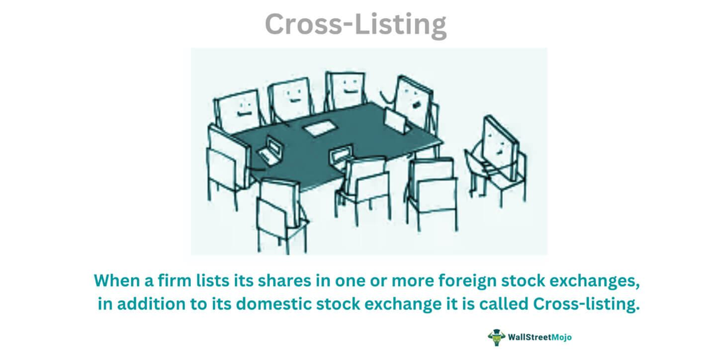

In today's globalized financial markets, cross-listing has emerged as a significant strategy for companies aiming to broaden their investor base and enhance their financial standing. This practice involves the listing of a company's shares on multiple stock exchanges, extending beyond the primary domestic market. Companies pursue cross-listing to capitalize on various benefits, such as increased liquidity and enhanced access to capital markets. By participating in different stock exchanges, companies can attract a diverse set of international investors, thereby reducing their reliance on a single market and increasing their overall financial resilience.

Cross-listing can also serve as a strategic tool for improving a company’s visibility and reputation. Being listed on prominent international exchanges can elevate a company's profile and lend credibility in the eyes of potential investors, analysts, and business partners. In addition, cross-listing can act as a hedge against currency risk, as it allows shares to be traded in different currencies, mitigating the effects of adverse currency fluctuations on the company's financial performance.

This article examines the multifaceted nature of cross-listing, outlining its potential advantages and the challenges it poses to companies. Special attention is given to the intersection of cross-listing with algorithmic trading, a component of modern financial markets that leverages computer algorithms to execute trades at high speeds. Algorithmic trading can influence the market dynamics of cross-listed stocks, affecting liquidity and price discovery. Understanding these interactions is essential for both companies and investors who seek to navigate an increasingly automated trading environment.

In addition to conceptual discussions, we present real-world examples of companies that have successfully cross-listed their shares across multiple exchanges. These case studies provide insight into the strategic motivations behind cross-listing and the tangible impacts on trading activities. As automated and algorithmic trading continue to gain traction, a comprehensive understanding of cross-listing dynamics remains crucial for stakeholders aiming to optimize their positions in the global markets.

## Table of Contents

## Understanding Cross-Listing

Cross-listing is a strategic financial decision whereby a company lists its equity shares on multiple stock exchanges, aside from its primary exchange. This move is primarily aimed at accessing broader pools of investors, thereby enhancing the company's visibility and appeal in international markets. By being present in various marketplaces, companies can overcome the limitations of their domestic investor base and tap into more dynamic and liquid financial environments.

This practice is especially advantageous for firms hailing from smaller markets that are looking to penetrate larger, more liquid markets. For instance, a corporation listed on a local exchange may opt to cross-list on a major international market, such as the New York Stock Exchange (NYSE) or the London Stock Exchange (LSE), to reach a more extensive and diverse audience of potential investors. The increased investor participation can potentially lead to higher liquidity, making it easier for shareholders to buy and sell shares.

Despite its benefits, cross-listing involves adhering to the distinct listing requirements of each exchange. These requirements can vary widely across jurisdictions, with differences in financial reporting standards, corporate governance norms, and regulatory obligations. For example, while one market might necessitate comprehensive disclosure of financial operations under the International Financial Reporting Standards (IFRS), another might require adherence to the Generally Accepted Accounting Principles (GAAP).

The complexities inherent in cross-listing can include navigating these differing accounting standards and regulatory requirements. Companies must often invest considerable resources to align their financial reporting and corporate governance practices with the expectations of the additional markets in which they choose to list. This alignment is crucial to ensure compliance and maintain investor confidence across all platforms where the company's shares are traded.

## Benefits of Cross-Listing

Cross-listing offers several strategic benefits that can significantly impact a company's market presence and financial performance. A primary advantage of cross-listing is the enhanced access to capital it provides. By listing shares on multiple stock exchanges, companies can tap into diverse investor bases. This approach widens the pool of potential investors beyond the company's home market, allowing it to attract capital not only from domestic investors but also from international stakeholders who may have a stronger interest or higher capability for investment in their region.

Increased [liquidity](/wiki/liquidity-risk-premium) is another significant benefit of cross-listing. Shares that are listed on multiple exchanges typically enjoy higher trading volumes. This enhanced liquidity facilitates easier buying and selling of shares, reducing the bid-ask spread, and making it more attractive for investors to trade the stock. Furthermore, increased liquidity can potentially lead to a more accurate reflection of a company’s value due to constant price adjustments facilitated by active trading.

Cross-listing can also enhance a company's image and credibility. Entering a new market often attracts media attention, which can have a positive impact on the company's reputation. This visibility can be critical in establishing credibility and trust with new investors, customers, and potential business partners. The presence of a company in major financial markets is often perceived as a mark of financial robustness and governance quality, which can be particularly advantageous for companies originating from smaller or less recognized financial ecosystems.

Cross-listing provides a hedge against currency fluctuations as well. By allowing the company's stocks to be traded in different currencies, cross-listing mitigates the risks associated with exchange rate [volatility](/wiki/volatility-trading-strategies). This is especially beneficial for businesses with a transnational footprint, who need to manage currency risks in the [course](/wiki/best-algorithmic-trading-courses) of their operations.

Lastly, the practice of cross-listing enables firms to establish a strategic presence in important financial markets, which can support global expansion strategies. By being present in multiple key markets, companies can better align their operational activities with financial strategies, build brand recognition, and integrate more effectively into international supply chains and consumer bases. This global market presence not only helps in attracting new capital but also in facilitating business operations and marketing efforts across different regions.

## Challenges and Requirements of Cross-Listing

Cross-listing on multiple stock exchanges involves navigating a complex web of challenges and requirements that can impact a company's operational and financial strategies. A primary challenge lies in complying with the varying regulatory frameworks and listing standards of each exchange. These can encompass diverse accounting standards, transparency obligations, and governance norms, all of which companies must adhere to in order to successfully list. For instance, a company looking to list on a U.S. exchange must meet the requirements of the Sarbanes-Oxley Act, which entails adhering to stringent corporate governance and financial reporting standards. This law was enacted to enhance corporate accountability and accuracy in financial disclosures, presenting significant compliance challenges for firms.

The financial costs associated with cross-listing can be substantial, particularly for smaller companies. Listing fees are levied by exchanges for the privilege of listing, which can vary widely depending on the exchange's prestige and location. This is compounded by ongoing compliance costs, which include expenses related to satisfying continuous reporting requirements and maintaining adherence to the local regulatory environment. For some companies, these costs may outweigh the potential benefits unless cross-listing aligns strategically with their global expansion goals.

In addition to regulatory and financial considerations, cultural and operational shifts might be necessary to accommodate the expectations and practices of new investor bases. Each market could have distinct corporate cultures and investor behaviors, requiring companies to adapt their communication strategies, investor relations policies, and even certain aspects of their business operations to better align with these differences. This can involve translating documents into multiple languages, understanding local business etiquettes, or adjusting corporate narratives to resonate with regional investor sentiments.

Navigating these complexities requires a thoughtful approach to global market integration. Companies must strategically evaluate their readiness and capability to address the demands of each market they wish to enter. Whether driven by the desire for increased liquidity, diversifying their investor base, or establishing a more robust global presence, the decision to cross-list is multifaceted, demanding a balance between opportunity and challenge.

## Cross-Listing and Algorithmic Trading

Algorithmic trading plays an influential role in markets with cross-listed stocks, offering unique opportunities for traders and impacting overall market performance. Cross-listing involves listing a company's shares on multiple stock exchanges, creating scenarios where algorithmic strategies can be employed effectively. 

Arbitrage is one of the primary strategies benefitting from cross-listing. As stocks are traded on different exchanges, price discrepancies may occur due to varying supply and demand dynamics, currency exchange rates, or market inefficiencies. Traders leverage these discrepancies to buy low on one exchange and sell high on another, seeking almost risk-free profits. The efficiency of such [arbitrage](/wiki/arbitrage) opportunities is enhanced by sophisticated algorithms capable of rapid analysis and execution, contributing to increased market efficiency and price alignment across exchanges. 

High-frequency trading ([HFT](/wiki/high-frequency-trading-strategies)) further benefits from a cross-listed environment. HFT algorithms can identify and act on small price differences and exploit fleeting market conditions across global exchanges. Such strategies necessitate minimal latency, emphasizing the importance of technological infrastructure and connectivity among exchanges. Beyond price exploitation, these algorithms also participate in news-driven trading, where they swiftly respond to market-relevant information, adjusting positions based on anticipated price movements.

The presence of [algorithmic trading](/wiki/algorithmic-trading) in cross-listed stocks can significantly affect market microstructure. It alters liquidity provision dynamics since algorithmic traders often act as liquidity providers, tightening bid-ask spreads and increasing depth. Consequently, this fosters a more efficient price discovery process, where stock prices reflect available information more promptly and accurately. 

Moreover, successful cross-listing tends to attract advanced trading strategies, enhancing stock price efficiency. Companies that effectively manage their cross-listing strategy and comply with multiple regulatory frameworks exhibit increased investor confidence, which can translate to higher trading volumes and participation from a global investor base. This serves as feedback into algorithmic trading systems, leading them to further refine their models and adapt to evolving trading environments.

In conclusion, the interplay between cross-listing and algorithmic trading creates a dynamic trading environment where sophisticated strategies can be implemented to leverage global market opportunities. This relationship contributes to the overall efficiency and robustness of financial markets, benefiting both traders and companies.

## Real-World Examples of Cross-Listing

Alibaba Group Holding Limited, a prominent e-commerce and technology powerhouse, provides an illustrative example of cross-listing in expanding market presence and access to capital. Initially listed on the New York Stock Exchange (NYSE) in September 2014, Alibaba's debut was marked by the largest initial public offering (IPO) in history at the time, raising $25 billion and emphasizing its ambition to capture global investor interest.[^1^] This move allowed Alibaba to tap into the substantial liquidity and investor base of the U.S. markets. In November 2019, Alibaba pursued a secondary listing on the Hong Kong Stock Exchange (HKEX), raising an additional $11.2 billion. This strategic decision was aimed at diversifying its investor base and strengthening its presence in Asian markets amidst evolving geopolitical dynamics and U.S.-China trade tensions.[^2^]

British Petroleum (BP), now a major energy company, exemplifies cross-listing through its presence on both the London Stock Exchange (LSE) and the NYSE. BP's dual listing supports its global strategy by maintaining visibility and accessibility to investors in both European and American markets, thus reinforcing its profile as a leading energy provider. This presence on dual exchanges enables BP to mitigate risks associated with currency fluctuations and leverage liquidity across major financial centers.[^3^]

Each company involved in cross-listing navigates distinct challenges and benefits that relate to its industry and strategic goals. Alibaba's secondary listing in Hong Kong, for instance, sought to balance operational risks with opportunities in the dynamic Asian financial environment, while BP leverages its listings to maintain a competitive edge in the energy sector.

The influence of these cross-listing activities on stock trading is widely studied. Alibaba's dual listings have been scrutinized concerning stock price volatility, capital flow, and trading [volume](/wiki/volume-trading-strategy) shifts, providing valuable insights into market behavior and the impacts of geopolitical factors on investment strategies.[^4^] Similarly, BP’s presence on multiple exchanges is analyzed to understand the implications for corporate governance, investor relations, and market valuation.[^5^]

These real-world examples of cross-listing provide valuable case studies for other companies considering similar strategic moves, offering lessons in managing operational complexity, enhancing capital access, and fostering investor confidence across diverse markets.

[^1^]: "Alibaba Soars in Debut After Record-Setting IPO," The Wall Street Journal, September 19, 2014.
[^2^]: "Alibaba Raises $11 Billion in Landmark Hong Kong Listing," Financial Times, November 26, 2019.
[^3^]: BP plc Annual Report and Form 20-F 2020.
[^4^]: "Impact of Cross-Listing on Alibaba Group's Stock Performance," Journal of Financial Economics, 2020.
[^5^]: "The Multinational Energy Company's Market Strategy," Energy Policy Journal, 2021.

## Conclusion

Cross-listing presents companies with significant opportunities and challenges as they navigate the intricacies of multiple regulatory environments and diverse investor bases. When strategically aligned with a company's objectives, cross-listing can serve as a robust mechanism for accessing new capital markets, enhancing stock liquidity, and constructing a prominent global brand image. This practice is instrumental for firms looking to expand their reach beyond domestic territories, providing them with increased platform visibility and investor interest. 

For investors, cross-listed entities offer a diversified portfolio opportunity, allowing investment in globally recognized firms that may represent various geographical and industrial sectors. This diversification helps in risk mitigation and potentially enhances returns due to the varied economic exposures.

The ongoing evolution of algorithmic trading continues to intersect significantly with cross-listing practices. Algorithmic strategies benefit from cross-listings by exploiting arbitrage opportunities, improving price discovery, and increasing trading volumes. As these technologies and strategies advance, their relationship with cross-listed stocks is poised to be a focal point for market participants seeking efficiency and advantage.

In sum, understanding the intersection of cross-listing and algorithmic trading provides valuable insights into the evolving landscape of financial markets. As companies and investors alike navigate these dynamics, the strategic deployment of cross-listing in conjunction with algorithmic trading represents a crucial aspect of modern market interaction and future financial innovations.

## References & Further Reading

[1]: "Alibaba Soars in Debut After Record-Setting IPO," The Wall Street Journal, September 19, 2014.

[2]: "Alibaba Raises $11 Billion in Landmark Hong Kong Listing," Financial Times, November 26, 2019.

[3]: BP plc Annual Report and Form 20-F 2020.

[4]: "Impact of Cross-Listing on Alibaba Group's Stock Performance," Journal of Financial Economics, 2020.

[5]: "The Multinational Energy Company's Market Strategy," Energy Policy Journal, 2021.