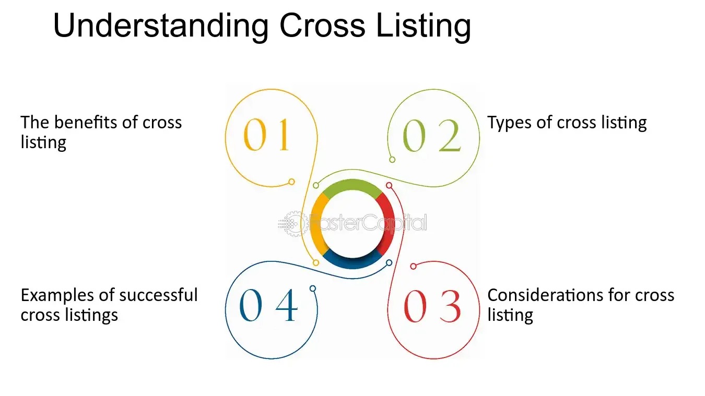

## Table of Contents

## What is cross-listing in the context of stock markets?

Cross-listing in the context of stock markets refers to the practice of listing a company's shares on more than one stock exchange. This means that a company, originally listed on its home country's stock exchange, decides to also list its shares on another exchange in a different country. The main reason companies do this is to increase their visibility and access to capital from investors in different parts of the world.

By cross-listing, a company can attract a broader range of investors, which can lead to a higher stock price and a more diversified shareholder base. It also helps the company to raise capital more easily in different markets. However, cross-listing can also be expensive and complex, as it involves meeting the regulatory requirements of each exchange where the shares are listed. Despite these challenges, many companies find that the benefits of cross-listing outweigh the costs.

## Why would a company choose to cross-list its shares?

A company might choose to cross-list its shares because it wants to reach more investors around the world. When a company lists its shares on stock exchanges in different countries, it can attract people from those countries to buy its shares. This can help the company get more money to grow its business. Also, by being on more stock exchanges, the company can become more well-known and respected in different parts of the world.

Cross-listing can also make a company's shares more valuable. When more people can buy the shares, the demand for them can go up, which can push the price higher. This can be good for the company and its current shareholders. But, cross-listing is not easy. It can cost a lot of money and take a lot of work to follow the rules of each stock exchange. Even with these challenges, many companies think that cross-listing is worth it because of the benefits it brings.

## What are the benefits of cross-listing for investors?

Cross-listing can be good for investors because it gives them more choices. When a company lists its shares on different stock exchanges, investors from around the world can buy them more easily. This means that investors can put their money into a company that they might not have been able to invest in before. It also helps investors spread out their money in different markets, which can make their investments safer.

Another benefit for investors is that cross-listing can make a company's shares more valuable. When more people can buy the shares, the demand for them can go up, which can push the price higher. This can be good for investors because they might see the value of their investment grow. Plus, with shares listed on multiple exchanges, investors can trade the shares at different times of the day, depending on the time zones of the exchanges.

## How does cross-listing affect a company's stock price?

Cross-listing can make a company's stock price go up. When a company lists its shares on more stock exchanges, it can reach more investors around the world. More people can buy the shares, which can increase the demand for them. When demand goes up, the price of the shares usually goes up too. This is good for the company because it can show that people believe in the company and want to invest in it.

But, cross-listing can also make the stock price go down sometimes. If the company has to follow a lot of new rules from different countries, it might cost a lot of money. This can make the company less profitable, and investors might not want to buy the shares as much. Also, if the company does not do well in one market, it can affect how people see the company in other markets too. So, while cross-listing can help the stock price, it can also bring some risks.

## What are the different types of cross-listing?

There are different types of cross-listing, and each one works a bit differently. One type is called a direct listing. In a direct listing, a company lists its shares on a foreign exchange without changing the shares. The shares are the same as the ones on the home exchange, but now they can be traded in another country too. This can help the company reach more investors without a lot of changes.

Another type is called a depositary receipt. With depositary receipts, a bank in the foreign country holds the company's shares and then issues new securities called depositary receipts. These receipts represent the shares and can be traded on the foreign exchange. This type is good for companies that want to list on a foreign exchange but do not want to follow all the rules of that country.

The last type is a dual listing. In a dual listing, a company lists its shares on two exchanges at the same time. The shares are the same on both exchanges, and they can be traded in both places. This can help the company get more attention from investors in different countries. Each type of cross-listing has its own benefits and challenges, so companies choose the one that fits their goals best.

## Can you explain the process of cross-listing a company's shares?

When a company wants to cross-list its shares, it starts by choosing the foreign stock exchange where it wants to list. The company needs to follow the rules of that exchange, which can be different from the rules of its home exchange. This might mean the company has to share more information about its business or follow new laws. The company might also need to work with a bank in the foreign country to help with the process. This can take a lot of time and money, but it can help the company reach more investors.

Once the company has met all the rules, it can list its shares on the foreign exchange. If the company chooses a direct listing, it will list the same shares that are on its home exchange. But if it chooses to use depositary receipts, a bank in the foreign country will hold the shares and issue new securities that represent the shares. These depositary receipts can then be traded on the foreign exchange. For a dual listing, the company will list the same shares on both exchanges at the same time. After the shares are listed, investors in the foreign country can buy them, which can help the company grow its business.

## What are the regulatory requirements for cross-listing in major stock exchanges like NYSE or NASDAQ?

When a company wants to cross-list its shares on major stock exchanges like the New York Stock Exchange (NYSE) or the NASDAQ, it must follow strict rules. For the NYSE, the company needs to meet financial standards, like having enough earnings or assets. It also has to share a lot of information about its business, like financial reports and how it is run. The company must follow U.S. laws and rules, which can be different from the rules in its home country. This can take a lot of work and money, but it helps the company reach more investors in the U.S.

For the NASDAQ, the rules are similar but a bit different. The company needs to meet financial tests, like having enough money or a certain stock price. It also has to give detailed information about its business, including financial statements and how it is managed. Like the NYSE, the company must follow U.S. laws and regulations, which might be harder than the rules in its home country. Even though it can be tough, listing on the NASDAQ can help the company attract more investors and grow its business.

## How does cross-listing impact a company's corporate governance?

When a company cross-lists its shares on different stock exchanges, it has to follow the rules of each place where its shares are listed. This can make the company's corporate governance better. Corporate governance is about how a company is run and how it makes decisions. By following more rules, the company might have to be more open about its business and how it is managed. This can help the company be more honest and fair, which can make investors trust it more.

But, cross-listing can also make corporate governance more complex. The company has to keep track of different rules from different countries, which can be hard. Sometimes, the rules might even be different or disagree with each other. This can make it harder for the company to make decisions quickly. Even with these challenges, many companies find that the benefits of better corporate governance from cross-listing are worth it.

## What are some challenges and risks associated with cross-listing?

Cross-listing can be hard for a company because it has to follow the rules of different countries. Each country has its own laws and ways of doing things, which can be confusing and take a lot of time to understand. It can also cost a lot of money to meet all the different rules. This can make the company spend less on growing its business and more on just following the rules. Sometimes, the rules from different countries might even disagree with each other, which can make it hard for the company to know what to do.

Another risk of cross-listing is that it can make the company's stock price go down. If the company does not do well in one market, it can hurt how people see the company in other markets too. Also, if the company has to spend a lot of money to follow all the rules, it might not make as much profit. This can make investors less interested in buying the shares, which can lower the stock price. Even though cross-listing can help a company reach more investors, it also brings some risks that the company needs to think about carefully.

## Can you provide examples of successful cross-listings and what made them successful?

One example of a successful cross-listing is the Chinese company Alibaba, which listed its shares on the New York Stock Exchange (NYSE) in 2014. Alibaba's cross-listing was successful because it helped the company reach a lot more investors in the U.S. This made the demand for Alibaba's shares go up, which helped the stock price grow. Alibaba also followed the rules of the NYSE well, which made investors trust the company more. By being on the NYSE, Alibaba became more well-known around the world and was able to grow its business even more.

Another example is the British company Unilever, which has been cross-listed on both the London Stock Exchange and the NYSE for many years. Unilever's cross-listing worked well because it helped the company get money from investors in both the U.K. and the U.S. This gave Unilever more choices for raising money to grow its business. Unilever also did a good job of following the rules of both exchanges, which made investors feel safe about buying its shares. By being on two big exchanges, Unilever was able to become more valuable and respected in different parts of the world.

## How does cross-listing influence a company's global market strategy?

When a company cross-lists its shares, it can reach more investors from different countries. This helps the company get more money to grow its business. By being on more stock exchanges, the company can become more well-known around the world. This can help the company sell its products or services in new places. For example, if a company lists its shares on the New York Stock Exchange, it might find it easier to sell its products in the U.S. because more American investors know about the company.

Cross-listing can also help a company learn about different markets. By being on stock exchanges in different countries, the company can see how people in those places think about its business. This can help the company make better plans for selling its products or services in those markets. But, cross-listing can also be hard because the company has to follow the rules of each exchange. Even with these challenges, many companies find that cross-listing helps them grow and succeed in the global market.

## What are the future trends and potential developments in cross-listing practices?

In the future, cross-listing might become easier for companies because of new technology. Companies might use special computer programs to help them follow the rules of different countries. This can make it less expensive and less work for companies to list their shares on more exchanges. Also, more countries might work together to make the rules for cross-listing simpler. This can help companies reach more investors around the world without so much trouble.

Another trend might be that more companies from new markets, like China and India, will want to cross-list their shares. These companies might see that listing on big exchanges like the New York Stock Exchange can help them grow their business and reach more investors. But, they will need to be careful about following the rules of different countries. Even with these challenges, more companies from these growing markets might choose to cross-list in the future to become more well-known and respected around the world.

## References & Further Reading

[1]: "Alibaba Soars in Debut After Record-Setting IPO," The Wall Street Journal, September 19, 2014.

[2]: "Alibaba Raises $11 Billion in Landmark Hong Kong Listing," Financial Times, November 26, 2019.

[3]: BP plc Annual Report and Form 20-F 2020.

[4]: "Impact of Cross-Listing on Alibaba Group's Stock Performance," Journal of Financial Economics, 2020.

[5]: "The Multinational Energy Company's Market Strategy," Energy Policy Journal, 2021.