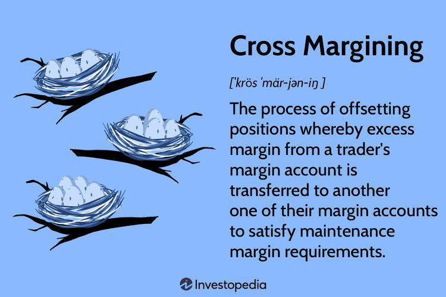

## Table of Contents

## What is cross margining?

Cross margining is a way for people who trade futures and options to use their money more efficiently. Instead of keeping separate amounts of money for each type of trade, cross margining lets traders use the same money for different trades. This can help them save money because they don't need to put up as much cash upfront. It works by looking at all the trades together and figuring out the total risk, then setting the margin based on that total risk.

For example, if someone is trading in both stock futures and commodity futures, cross margining can take into account that some of these trades might offset each other's risk. If the price of one goes up and the other goes down, they might balance out. By considering this, the exchange can lower the total amount of margin required. This makes trading more affordable and can help traders manage their money better.

## How does cross margining differ from isolated margining?

Cross margining and isolated margining are two different ways to manage the money you need to trade. With cross margining, all your trades are looked at together. If you're trading different things that might balance each other out, you might not need as much money upfront. It's like putting all your eggs in one basket and seeing how they balance out. This can save you money because the total risk is considered, and you might need less margin overall.

On the other hand, isolated margining treats each trade separately. Each trade needs its own amount of money, and they don't affect each other. It's like having separate baskets for each egg. This can be safer because if one trade goes bad, it won't affect the others. But it might cost more because you have to put up more money overall since the risks aren't combined.

So, cross margining can be more cost-effective but riskier because all your trades are linked. Isolated margining is safer but might require more money because each trade stands alone. It's important to choose the right method based on how much risk you're willing to take and how much money you have.

## What are the basic steps involved in the cross margining process?

The cross margining process starts with a trader having multiple positions in different futures or options contracts. These positions are all put into one big account where they can be looked at together. The first step is to figure out how these different trades might affect each other. For example, if one trade might go up in value while another goes down, they might balance each other out. This is called offsetting risk. The exchange then calculates the total risk of all the trades combined instead of looking at each one separately.

Once the total risk is calculated, the next step is to set the margin requirement. Because the trades are considered together, the amount of money needed to cover potential losses might be less than if each trade was treated separately. This is the main benefit of cross margining - it can save money by requiring less margin. The final step is for the trader to deposit the calculated margin into their account. The exchange will then monitor the account to make sure the margin stays sufficient as the market moves and the value of the trades changes.

## What types of financial instruments are typically used in cross margining?

Cross margining is often used with futures and options contracts. Futures are agreements to buy or sell something at a set price in the future, like corn or oil. Options give the right, but not the obligation, to buy or sell at a certain price before a certain date. These financial instruments are used because they can be traded on exchanges, and their values can go up and down in ways that might balance each other out.

For example, someone might have futures in both stocks and commodities. If the stock market goes down, the value of stock futures might drop, but if commodity prices go up at the same time, the value of commodity futures might rise. By looking at these positions together, cross margining can figure out the total risk and set the margin accordingly. This helps traders save money by needing less margin overall.

## What are the potential benefits of using cross margining for traders?

Using cross margining can help traders save money. When traders have different types of trades, like futures in stocks and commodities, cross margining looks at all these trades together. If one trade might lose money while another might make money, they can balance each other out. This means the trader might not need as much money upfront to cover potential losses. This can make trading cheaper because the total amount of money needed for margin is lower.

Another benefit of cross margining is that it can help traders manage their money better. Instead of having to keep separate amounts of money for each trade, traders can use the same money for all their trades. This can free up cash that they can use for other things or invest in more trades. By being able to use their money more efficiently, traders can potentially increase their profits and take advantage of more trading opportunities.

## What risks should traders be aware of when using cross margining?

When traders use cross margining, one big risk is that all their trades are connected. If something goes wrong with one trade, it can affect all the others because they're all in the same account. This means that if the market moves in a way that wasn't expected, the trader might need to put in more money quickly to keep the margin level up. If they can't do that, they might have to close some trades at a loss, which can be stressful and costly.

Another risk is that cross margining can be complicated. It's not as simple as keeping each trade separate, so traders need to understand how their different trades might affect each other. If they don't fully understand this, they might end up taking on more risk than they thought. It's important for traders to keep a close eye on their accounts and be ready to adjust their positions if the market changes. This can take a lot of time and attention, which might be hard for some traders to manage.

## How does cross margining affect liquidity and market efficiency?

Cross margining can help make markets more liquid and efficient. When traders use cross margining, they can use their money more efficiently because they don't need as much margin. This means they can trade more with the same amount of money. More trading can lead to more buyers and sellers in the market, which makes it easier for people to buy and sell things quickly. This increased activity can make the market more liquid, meaning there's more action and it's easier to trade.

However, there are also risks that can affect market efficiency. If traders using cross margining face big losses and need to close their positions quickly, it can cause sudden changes in the market. This can make the market less stable and might scare other traders away. So, while cross margining can help with [liquidity](/wiki/liquidity-risk-premium) and efficiency, it's important for traders to manage their risks carefully to keep the market stable and efficient.

## Can you explain the regulatory framework surrounding cross margining?

The rules about cross margining come from groups like the Commodity Futures Trading Commission (CFTC) in the United States and other similar groups in other countries. These groups make sure that the way cross margining is done is safe and fair for everyone. They set rules about how much money traders need to have in their accounts and how the exchanges should calculate the margin. This helps to stop big problems in the market and keeps things running smoothly.

Cross margining can be tricky, so regulators also make sure that the exchanges have good systems to watch over it. They check that the exchanges are keeping a close eye on the total risk of all the trades and making sure traders have enough money to cover potential losses. By doing this, regulators help to make sure that cross margining doesn't cause too much risk and that the market stays stable.

## What are some real-world examples of cross margining in action?

One real-world example of cross margining happens at the Chicago Mercantile Exchange (CME). Traders there can have positions in different futures, like stock index futures and commodity futures. If a trader has a position in S&P 500 futures and another in gold futures, the CME looks at how these might balance each other out. If the stock market goes down, S&P futures might lose value, but if gold prices go up at the same time, the gold futures could gain value. By considering these trades together, the CME can set a lower margin requirement for the trader, saving them money.

Another example is at the Options Clearing Corporation (OCC), where traders can use cross margining for options and futures. A trader might have options on stocks and futures on interest rates. If the stock options lose value, the [interest rate](/wiki/interest-rate-trading-strategies) futures might gain value, balancing out the risk. The OCC calculates the total risk across all these positions and sets the margin accordingly. This helps traders manage their money better and take advantage of more trading opportunities without needing as much cash upfront.

## How do clearinghouses manage the complexities of cross margining?

Clearinghouses manage the complexities of cross margining by using special computer systems that keep track of all the trades in one account. These systems look at how different trades might affect each other and figure out the total risk. If a trader has positions in stock futures and commodity futures, the system checks if a drop in stock prices might be balanced out by a rise in commodity prices. By doing this, the clearinghouse can set the right amount of margin that the trader needs to have, which is usually less than if each trade was looked at alone.

To make sure everything runs smoothly, clearinghouses also have rules and checks in place. They watch the market all the time and make sure traders have enough money in their accounts to cover any potential losses. If the market moves a lot and the risk goes up, the clearinghouse might ask traders to add more money to their accounts. This helps keep the market stable and makes sure that cross margining doesn't cause big problems. By managing these complexities well, clearinghouses help traders save money and trade more efficiently.

## What advanced strategies can be employed to optimize cross margining?

To optimize cross margining, traders can use a strategy called portfolio diversification. This means having different types of trades that might balance each other out. For example, a trader might have positions in both stock futures and commodity futures. If the stock market goes down, the stock futures might lose value, but if commodity prices go up at the same time, the commodity futures could gain value. By carefully choosing which trades to have, traders can reduce their overall risk and need less margin. This can help them save money and trade more with the same amount of cash.

Another advanced strategy is to use real-time risk management tools. These tools help traders keep a close eye on their accounts and make quick changes if needed. If the market moves a lot and the risk goes up, these tools can show traders exactly how much more margin they might need. By staying on top of their accounts and adjusting their positions quickly, traders can avoid big losses and keep their margin levels low. This makes cross margining even more efficient and helps traders take advantage of more trading opportunities without needing a lot of extra money.

## How might future technological advancements impact the practice of cross margining?

Future technology could make cross margining easier and safer. Computers might get better at figuring out the risks of different trades and how they balance each other out. This could mean that the systems used by clearinghouses become even smarter and faster. They might be able to watch the market all the time and change the margin requirements right away if something big happens. This would help traders save money and trade more without worrying as much about big losses.

Also, new technology could help traders see their risks better. With better tools, traders could look at their whole account in real-time and make quick choices about their trades. This could mean less chance of big surprises and more ways to use their money smartly. As technology keeps getting better, cross margining might become a bigger part of trading, helping more people trade more things without needing a lot of extra cash.

## References & Further Reading

[1]: Bergstra, J., Bardenet, R., Bengio, Y., & Kégl, B. (2011). ["Algorithms for Hyper-Parameter Optimization."](https://dl.acm.org/doi/10.5555/2986459.2986743) Advances in Neural Information Processing Systems 24.

[2]: ["Advances in Financial Machine Learning"](https://www.amazon.com/Advances-Financial-Machine-Learning-Marcos/dp/1119482089) by Marcos Lopez de Prado

[3]: SEC Concept Release: Equity Market Structure. (2010). ["Securities and Exchange Commission"](https://www.sec.gov/rules-regulations/2010/01/concept-release-equity-market-structure). 

[4]: ["Quantitative Trading: How to Build Your Own Algorithmic Trading Business"](https://www.amazon.com/Quantitative-Trading-Build-Algorithmic-Business/dp/1119800064) by Ernest P. Chan

[5]: Glasserman, P., & Wu, Q. (2018). ["Persistence and Procyclicality in Margin Requirements"](https://www.jstor.org/stable/48748375) in *The Review of Financial Studies*

[6]: Hull, J. C. (2018). ["Options, Futures, and Other Derivatives"](https://www.semanticscholar.org/paper/Options%2C-Futures%2C-and-Other-Derivatives-Hull/89bdee500c8623864fc9eb7a471546aa713acc44) (10th Edition). Pearson. 

[7]: ["The Future of Finance: The Impact of FinTech, AI, and Crypto on Financial Services"](https://link.springer.com/book/10.1007/978-3-030-14533-0) by Henri Arslanian and Fabrice Fischer

[8]: Aldridge, I. (2013). ["High-Frequency Trading: A Practical Guide to Algorithmic Strategies and Trading Systems"](https://www.amazon.com/High-Frequency-Trading-Practical-Algorithmic-Strategies/dp/1118343506). Wiley Finance.