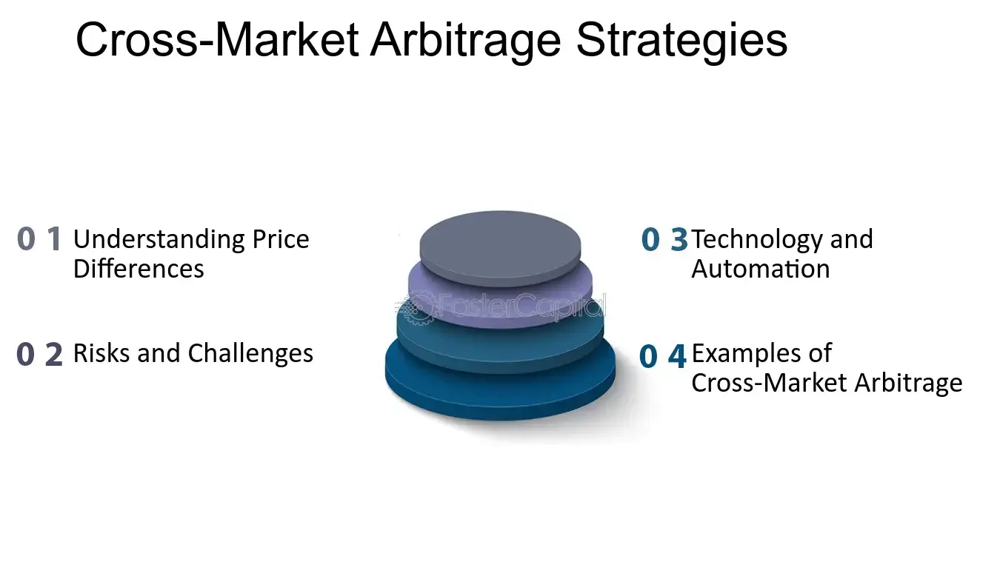

## Table of Contents

## What is cross-market arbitrage?

Cross-market arbitrage is a trading strategy where someone buys a product in one market and sells it in another market at a higher price. This works because the same product can have different prices in different places. For example, if a toy costs $10 in one store and $15 in another store, a person can buy the toy for $10 and sell it for $15, making a $5 profit. This strategy helps to balance out prices across different markets over time.

The key to successful cross-market arbitrage is to find and act on these price differences quickly. Traders need to consider costs like shipping and taxes, which can eat into their profits. With the internet, it's easier to spot these opportunities, but it also means more people are trying to do the same thing. This competition can make the price differences smaller and harder to profit from.

## How does cross-market arbitrage differ from traditional arbitrage?

Cross-market arbitrage and traditional arbitrage both aim to make money by taking advantage of price differences, but they do it in different ways. Traditional arbitrage usually involves buying and selling the same thing at the same time but in different forms or places. For example, you might buy a stock on one exchange where it's cheaper and sell it on another exchange where it's more expensive. The key here is that the buying and selling happen almost at the same time, so there's less risk.

Cross-market arbitrage, on the other hand, involves buying a product in one market and selling it in a different market where the price is higher. This could mean buying something in one country and selling it in another, or even buying from one online store and selling on another. The main difference is that cross-market arbitrage often involves more time and costs, like shipping and taxes, which can affect the profit. It's also more about spotting opportunities across different markets rather than just different exchanges or forms of the same asset.

## What are the basic steps to execute a cross-market arbitrage strategy?

To execute a cross-market arbitrage strategy, you first need to find a product that has a price difference between two markets. This could be between different countries, different online stores, or even different physical stores. You'll need to research and keep an eye on prices to spot these opportunities. Once you find a product that's cheaper in one market and more expensive in another, you need to calculate if you can make a profit after considering all the costs, like shipping, taxes, and any fees.

After you've done your research and calculations, the next step is to buy the product from the cheaper market. You'll need to make sure you can get the product quickly and safely to the other market where you plan to sell it. Once you have the product, you'll need to list it for sale in the more expensive market. You might need to use different websites or platforms to do this. Finally, when someone buys your product, you'll need to ship it to them and make sure everything goes smoothly. If all goes well, you'll make a profit from the difference in prices between the two markets.

## What types of markets are typically involved in cross-market arbitrage?

Cross-market arbitrage usually involves different types of markets where the same product can be bought and sold. These markets can be online or physical stores. For example, you might buy a toy from an online store like Amazon and sell it on eBay, or you might buy something from a store in one country and sell it in another country where it's more expensive. The main thing is that there's a price difference between the two places where you're buying and selling.

Sometimes, cross-market arbitrage can also happen between different types of markets, like buying from a wholesale market and selling in a retail market. For instance, you could buy clothes from a wholesale supplier at a low price and then sell them in a retail store or on a retail website at a higher price. The key is to find markets where the same product has different prices and then use that difference to make a profit.

## What are the key factors to consider before engaging in cross-market arbitrage?

Before you start cross-market arbitrage, it's important to think about a few things. First, you need to find a product that is cheaper in one market and more expensive in another. This could be between different online stores, like Amazon and eBay, or between different countries. You need to do a lot of research to find these price differences. Once you find a product, you need to figure out if you can make a profit after paying for things like shipping, taxes, and any fees. These extra costs can eat into your profit, so you need to be careful.

Another thing to consider is how quickly you can buy the product and get it to the other market. The longer it takes, the more risk you have that the price might change and you won't make as much money. You also need to think about how you will sell the product in the other market. Will you list it on a website or sell it in a store? Each way has its own costs and challenges. Finally, you need to be ready for things to go wrong, like the product getting damaged in shipping or not selling as quickly as you hoped. Being prepared for these problems can help you do better at cross-market arbitrage.

## How can technology and software tools assist in cross-market arbitrage?

Technology and software tools can make cross-market arbitrage easier and more efficient. These tools can help you quickly find price differences between different markets. For example, price comparison websites and apps can show you the prices of a product on different online stores like Amazon and eBay. This saves you a lot of time because you don't have to look at each store one by one. Also, software can help you keep track of prices over time, so you know when the best time to buy and sell is. This is important because prices can change quickly.

Another way technology helps is by automating parts of the arbitrage process. Some tools can automatically buy products from one market and list them for sale in another. This can be really useful if you are dealing with a lot of products or if you want to do arbitrage in different time zones. Plus, technology can help you manage shipping and logistics better. There are apps and software that can track your shipments and make sure they get to the buyer on time. This can help you avoid problems and make sure you get your profit.

## What are the common risks associated with cross-market arbitrage?

One big risk with cross-market arbitrage is that prices can change quickly. You might buy a product at a low price in one market, but by the time you get it to the other market to sell, the price might have gone down. This can mean you lose money instead of making a profit. Another risk is the cost of shipping and taxes. These can be higher than you expected, which can eat into your profit. You need to think about all these costs before you start, or you might end up losing money.

Another risk is that the product might get damaged or lost during shipping. This can be a big problem because you won't be able to sell it and make your profit. Also, there's the risk that the product might not sell as quickly as you thought. If it sits in the other market for a long time, you might have to sell it for less than you planned, or you might not be able to sell it at all. These risks can make cross-market arbitrage tricky, so you need to be ready for things to go wrong and have a plan to deal with them.

## Can you explain a real-world example of successful cross-market arbitrage?

One real-world example of successful cross-market arbitrage involved buying and selling smartphones. A trader noticed that a popular smartphone model was selling for $500 on an online store in the United States, but the same model was selling for $600 on a different online store in Europe. The trader bought the phones in bulk from the U.S. store, paid for shipping to Europe, and then sold them on the European store. After accounting for shipping costs and taxes, the trader made a profit of $50 per phone.

This example shows how cross-market arbitrage can work well when you find big price differences and manage the costs right. The trader had to do a lot of research to find the price difference and make sure the profit would be worth it after all the extra costs. By acting quickly and keeping an eye on the prices, the trader was able to take advantage of the opportunity and make money from the price difference between the two markets.

## How do regulatory differences between markets impact cross-market arbitrage?

Regulatory differences between markets can make cross-market arbitrage harder. Each country or region has its own rules about what you can buy and sell, how you can ship things, and what taxes you have to pay. For example, some places might have strict rules about importing certain products, which can make it tough to move goods from one market to another. If you don't follow these rules, you might get in trouble or have to pay big fines, which can eat into your profit or even make you lose money.

On the other hand, understanding these regulatory differences can also help you find good arbitrage opportunities. If you know that one market has lower taxes or fewer restrictions on a product, you might be able to buy it there cheaper and sell it in a market with higher costs. But you need to be careful and do a lot of research to make sure you're following all the rules. This can take time and effort, but it can also lead to bigger profits if you get it right.

## What advanced strategies can be used to enhance cross-market arbitrage opportunities?

One advanced strategy to enhance cross-market arbitrage is to use data analytics and [machine learning](/wiki/machine-learning). These tools can help you find price differences between markets faster and more accurately. By analyzing a lot of data, you can see patterns and trends that might not be easy to spot by just looking at prices. This can help you predict when prices will change and make better decisions about when to buy and sell. Also, machine learning can help you automate parts of the process, like buying and selling, which can save you time and help you take advantage of more opportunities.

Another strategy is to focus on niche markets where there might be bigger price differences. Instead of looking at common products that a lot of people are buying and selling, you can look at special or unique items that not many people know about. These niche markets can have less competition, which means you might be able to find bigger price differences and make more profit. But you need to do a lot of research to find these niche markets and make sure you understand the products and the markets well.

## How does global economic policy affect cross-market arbitrage?

Global economic policy can have a big impact on cross-market arbitrage. When countries change their policies, like tariffs or trade agreements, it can change the prices of products in different markets. For example, if one country puts a new tax on imports, it might make products more expensive there. This can create bigger price differences between markets, which can be good for arbitrage. But it can also make it harder to move products from one market to another because of the new rules and costs. So, people doing arbitrage need to keep an eye on these policy changes and be ready to change their plans.

Also, things like currency exchange rates can affect arbitrage. If the value of one country's money goes up or down compared to another country's money, it can change the prices of products when you convert them. This can create new opportunities for arbitrage if you can buy something in a country with a weaker currency and sell it in a country with a stronger currency. But it can also make things more risky because exchange rates can change quickly. So, understanding and watching global economic policies can help people doing arbitrage find good opportunities and avoid problems.

## What are the future trends and potential developments in cross-market arbitrage?

In the future, technology will play a bigger role in cross-market arbitrage. Tools like [artificial intelligence](/wiki/ai-artificial-intelligence) and machine learning will get better at finding price differences between markets quickly. This will help people spot good opportunities faster and make better decisions about when to buy and sell. Also, more automation will make it easier to buy products in one market and sell them in another without having to do everything by hand. This can save a lot of time and help people take advantage of more arbitrage opportunities.

Another trend will be more focus on niche markets. As more people get into arbitrage, the price differences in big markets will get smaller. So, people will look for special or unique items that not many people know about. These niche markets can have bigger price differences and less competition, which can lead to bigger profits. But it will take a lot of research and understanding of these markets to do well. Overall, the future of cross-market arbitrage will be about using technology better and finding new opportunities in different places.

## What is the Definition and Concept?

Cross-market arbitrage involves executing the simultaneous purchase and sale of an asset across different markets to capitalize on existing price differences. This practice remains viable due to various factors such as market inefficiencies, [liquidity](/wiki/liquidity-risk-premium) variations, and information lags. 

Market inefficiencies occur when identical assets have different prices in various markets owing to discrepancies in supply and demand or transaction delays. These inefficiencies can be temporary, leading to opportunities for arbitrageurs to capitalize before market forces drive prices to parity. Liquidity variations across markets also contribute, as markets with less liquidity might exhibit price deviations due to the lack of sufficient buying or selling pressure. Information lags, where news reaches different markets at different times, can also temporarily cause price disparities.

The essence of profit in cross-market arbitrage is grounded in the differential between the buying and selling prices, often expressed as:

$$
\text{Profit} = (\text{Selling Price} - \text{Buying Price}) - \text{Transaction Costs}
$$

Transaction costs are critical as they can erode the margins available in [arbitrage](/wiki/arbitrage) opportunities. These include brokerage fees, taxes, and costs associated with trade execution and asset transfer. Efficient execution requires a thorough understanding of these costs to ascertain net profitability.

In practice, technology and fast execution are pivotal in successfully identifying and exploiting cross-market arbitrage opportunities amidst these conditions.

## What are examples of cross-market arbitrage?

Currency arbitrage in [forex](/wiki/forex-system) markets exemplifies a classic form of cross-market arbitrage, where traders profit from slight variances in currency pair valuations offered by different dealers. These discrepancies often arise due to market inefficiencies, differences in liquidity, or timing lags. For instance, if a currency pair such as EUR/USD is trading at 1.1050 with one dealer and simultaneously at 1.1045 with another, arbitrageurs can purchase the currency from the second dealer at the lower rate and sell it to the first dealer at the higher rate. The potential profit from this arbitrage opportunity can be calculated as follows:

$$
\text{Profit} = \left( \frac{1}{\text{Exchange Rate at Dealer 2}} - \frac{1}{\text{Exchange Rate at Dealer 1}} \right) \times \text{Transaction Volume}
$$

It's important to consider transaction costs, which can affect the overall profitability of the arbitrage strategy. Effective execution requires swift trade actions often implemented through automated trading systems.

Cross-exchange [cryptocurrency](/wiki/cryptocurrency) arbitrage operates on a similar principle but within the rapidly evolving digital asset ecosystem. Price discrepancies for the same cryptocurrency can occur across different exchanges due to variations in demand, supply, and fee structures. Traders aim to purchase the cryptocurrency at a lower price on one platform and sell it at a higher price on another. For example:

1. Buy Bitcoin (BTC) on Exchange A where the price is $50,000.
2. Simultaneously, sell BTC on Exchange B where the price is $50,200.

The trader makes a profit of $200 per BTC, minus any transaction fees and transfer times. It's crucial to [factor](/wiki/factor-investing) in the withdrawal and deposit times, which can impact the final profitability. Python has emerged as a popular tool for implementing such strategies due to its extensive libraries for cryptocurrency exchanges. A simple Python code snippet for monitoring price differences might look like this:

```python
import requests

def get_price(exchange_url, symbol):
    response = requests.get(exchange_url + symbol)
    return response.json()['price']

exchange_a_url = 'https://api.exchangeA.com/price?symbol='
exchange_b_url = 'https://api.exchangeB.com/price?symbol='

symbol = 'BTCUSD'
price_a = get_price(exchange_a_url, symbol)
price_b = get_price(exchange_b_url, symbol)

if price_a < price_b:
    print(f"Arbitrage opportunity: Buy at Exchange A ({price_a}) and sell at Exchange B ({price_b})")
```

Although the concept appears straightforward, successful execution demands precise execution timing and a thorough understanding of fee structures to ensure that potential profits are not eroded by operational costs.

## References & Further Reading

[1]: Avellaneda, M., & Stoikov, S. (2008). ["High-frequency trading in a limit order book."](https://people.orie.cornell.edu/sfs33/LimitOrderBook.pdf) Quantitative Finance, 8(3), 217-224.

[2]: Hasbrouck, J. (2003). ["Intraday price formation in U.S. equity index markets."](https://onlinelibrary.wiley.com/doi/10.1046/j.1540-6261.2003.00609.x) The Review of Financial Studies, 16(4), 1035-1074.

[3]: ["Algorithmic and High-Frequency Trading"](https://www.amazon.com/Algorithmic-High-Frequency-Trading-Mathematics-Finance/dp/1107091144) by Álvaro Cartea, Sebastian Jaimungal, and José Penalva.

[4]: Gomber, P., Arndt, B., Lutat, M., & Uhle, T. (2011). ["High-frequency trading."](https://papers.ssrn.com/sol3/papers.cfm?abstract_id=1858626) The Role of Technology Innovation in Improving Efficiency in Financial Markets.

[5]: Lo, A. (2010). ["Adaptive Markets: Financial Evolution at the Speed of Thought."](https://books.google.com/books/about/Adaptive_Markets.html?id=Q4d7DwAAQBAJ) Princeton University Press.

[6]: Biais, B., Foucault, T., & Moinas, S. (2015). ["Equilibrium Fast Trading."](https://www.sciencedirect.com/science/article/pii/S0304405X15000288) The Review of Financial Studies, 28(7), 1947-1976.

[7]: Mackenzie, D., & Spears, T. (2012). ["‘The Formula That Killed Wall Street’: The Gaussian Copula and the Material Cultures of Modelling."](https://mathbabe.files.wordpress.com/2012/06/gaussian14.pdf) Social Studies of Science, 44(1), 3-33.