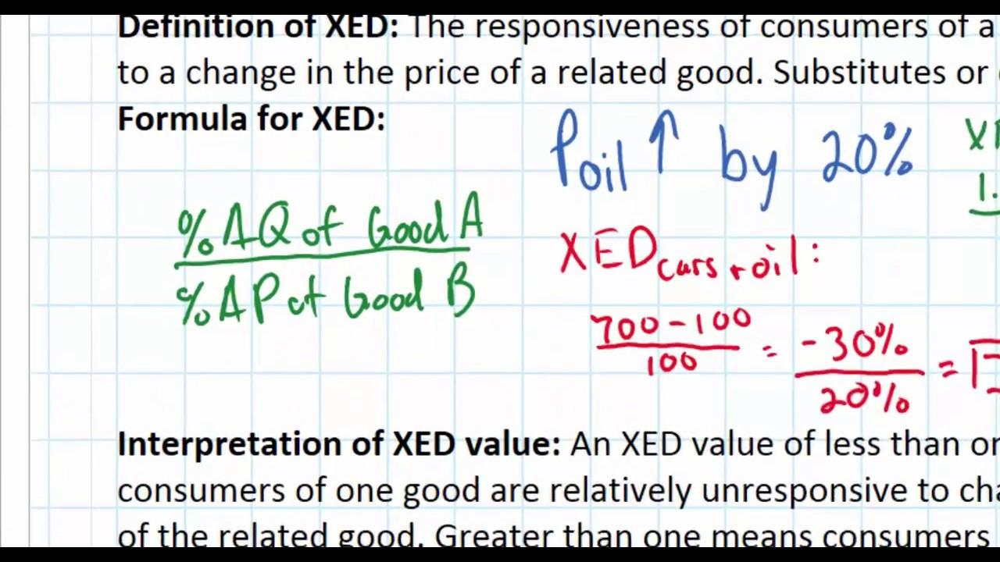

## Table of Contents

## What is cross price elasticity of demand?

Cross price elasticity of demand is a measure that shows how the quantity demanded of one good changes when the price of another good changes. It helps us understand the relationship between two different products. If the price of one product goes up or down, cross price elasticity tells us how much the demand for another product will be affected.

For example, if the price of coffee increases, people might start buying more tea instead. In this case, coffee and tea are substitutes, and the cross price elasticity would be positive, meaning the demand for tea goes up when the price of coffee goes up. On the other hand, if the price of gasoline goes up, people might drive less and buy fewer tires. Here, gasoline and tires are complements, and the cross price elasticity would be negative, showing that the demand for tires decreases when the price of gasoline increases.

## How is cross price elasticity calculated?

Cross price elasticity of demand is calculated by taking the percentage change in the quantity demanded of one good and dividing it by the percentage change in the price of another good. So, if you want to know how the demand for tea changes when the price of coffee changes, you would look at how much the quantity of tea demanded changes (in percentage) and divide that by the percentage change in the price of coffee.

For example, if the price of coffee goes up by 10% and, as a result, the demand for tea goes up by 5%, the cross price elasticity would be 5% divided by 10%, which equals 0.5. This positive number tells us that tea and coffee are substitutes because when the price of coffee goes up, people buy more tea. If the number was negative, it would mean the goods are complements, like gasoline and car tires.

## What does a positive cross price elasticity indicate?

A positive cross price elasticity means that when the price of one product goes up, people start buying more of another product. This shows that the two products are substitutes for each other. For example, if the price of butter goes up, people might buy more margarine instead. The positive number tells us that these two items can be used in place of each other.

This kind of information is useful for businesses and economists. They can use it to predict how changes in prices will affect the sales of different products. If a company knows that their product is a substitute for another, they might adjust their prices or marketing strategies to compete better in the market.

## What does a negative cross price elasticity indicate?

A negative cross price elasticity means that when the price of one product goes up, people buy less of another product. This shows that the two products are complements, meaning they are used together. For example, if the price of hot dogs goes up, people might buy fewer hot dog buns because they go together.

This information is helpful for businesses and economists. If they know that their product is a complement to another, they can predict how changes in prices will affect the sales of both products. For instance, a company selling printers might lower the price of ink if they know that cheaper ink will lead to more printer sales.

## Can you explain the formula for cross price elasticity with an example?

The formula for cross price elasticity of demand is the percentage change in the quantity demanded of one good divided by the percentage change in the price of another good. This helps us see how much the demand for one thing changes when the price of something else changes. If the result is positive, it means the two things are substitutes, like tea and coffee. If it's negative, they are complements, like hot dogs and hot dog buns.

Let's use an example to make it clear. Imagine the price of coffee goes up by 10%, and as a result, people start buying 5% more tea. To find the cross price elasticity, we take the 5% increase in tea demand and divide it by the 10% increase in coffee price. So, it's 5% divided by 10%, which equals 0.5. This positive number tells us that tea and coffee are substitutes because when coffee gets more expensive, people switch to tea.

## How does cross price elasticity differ from own price elasticity?

Cross price elasticity and own price elasticity are two different ways to understand how prices affect what people buy. Cross price elasticity looks at how the demand for one thing changes when the price of another thing changes. For example, if the price of butter goes up, people might buy more margarine instead. This helps us see if two products are substitutes, like butter and margarine, or complements, like hot dogs and hot dog buns.

Own price elasticity, on the other hand, focuses on how the demand for a product changes when its own price changes. It tells us how sensitive people are to price changes for that specific product. For instance, if the price of a candy bar goes up, own price elasticity shows how much less people will buy that candy bar. It's all about understanding how the price of one item directly affects its own demand, without considering other products.

## What are the practical applications of cross price elasticity in business?

Businesses use cross price elasticity to understand how their products relate to others in the market. If a company sells a product that is a substitute for another, they can predict how their sales might change if the other product's price goes up or down. For example, if a soda company knows that their drink is a substitute for another popular soda, they might lower their prices to attract more customers when the other soda's price increases. This helps them stay competitive and increase their market share.

Cross price elasticity is also useful for companies that sell products that are complements. If a business sells printers and knows that ink is a complement, they might offer deals on ink to boost printer sales. By understanding how these products are linked, companies can make better decisions about pricing and marketing strategies. This helps them increase overall sales and profits by making sure that changes in one product's price lead to positive outcomes for related products.

## How can cross price elasticity be used to determine substitute and complement goods?

Cross price elasticity helps businesses and economists figure out if two products are substitutes or complements. When the price of one product goes up and people start buying more of another product, that means the two products are substitutes. For example, if the price of coffee goes up and people buy more tea instead, coffee and tea are substitutes. The cross price elasticity would be a positive number because the demand for tea goes up when the price of coffee goes up.

On the other hand, if the price of one product goes up and people buy less of another product, that means the two products are complements. For instance, if the price of hot dogs goes up and people buy fewer hot dog buns, hot dogs and hot dog buns are complements. The cross price elasticity would be a negative number because the demand for hot dog buns goes down when the price of hot dogs goes up. By looking at the cross price elasticity, businesses can tell if their products are substitutes or complements and plan their strategies accordingly.

## What factors can affect the cross price elasticity between two goods?

Several things can change how much the demand for one thing goes up or down when the price of another thing changes. One big factor is how close the two things are as substitutes or complements. If two products are very similar, like Coke and Pepsi, even a small change in the price of one can make a big difference in how much people buy the other. On the other hand, if the products are not very similar, like apples and oranges, the change in demand might not be as big.

Another factor is how important the products are to people. If a product is something people really need or want, like gasoline for their cars, a change in the price of a complement, like car tires, can have a big effect. But if the product is something people can easily do without, like a luxury item, the effect might not be as strong. Also, the time people have to react to price changes matters. If prices change and people have a lot of time to adjust, the cross price elasticity might be higher because they can switch to substitutes or cut back on complements more easily.

## How does the time frame influence the measurement of cross price elasticity?

The time frame can really change how we measure cross price elasticity. If we only look at a short time after a price change, people might not have had enough time to switch to other products or change how much they use things that go together. So, the cross price elasticity might seem smaller because people haven't fully reacted yet. For example, if the price of gas goes up, it might take a while for people to start using less gas or switch to other ways of getting around.

But if we look at a longer time frame, people have more time to adjust. They might start buying more of a different product if it's a substitute, or they might use less of a product that goes with the one that got more expensive. So, over time, the cross price elasticity can become larger because people have had the chance to make bigger changes in what they buy. This is why it's important to think about how long people have had to react when we measure cross price elasticity.

## Can you discuss a real-world case study where cross price elasticity was crucial for a business decision?

When Coca-Cola and Pepsi compete, understanding cross price elasticity is really important. A few years ago, Coca-Cola decided to raise the price of their drinks. They wanted to know how this would affect their sales and also how it would change what people bought from Pepsi. By looking at cross price elasticity, Coca-Cola found out that their drinks and Pepsi's drinks are close substitutes. This meant that if they raised their prices too much, people would just buy more Pepsi instead. So, Coca-Cola had to be careful about how much they increased their prices to not lose too many customers to Pepsi.

In another case, a company that makes printers and ink, like HP, used cross price elasticity to make smart business decisions. They noticed that when they lowered the price of their ink, more people bought their printers too. This showed that printers and ink are complements. By understanding this, HP decided to offer deals on ink to boost printer sales. This strategy helped them sell more of both products and make more money overall. It's a good example of how knowing about cross price elasticity can help a business plan better and increase profits.

## How might cross price elasticity be integrated into econometric models for forecasting?

Cross price elasticity can be a big help when businesses and economists want to predict how people will buy things in the future. They use special math models called econometric models to do this. By putting cross price elasticity into these models, they can see how the price of one thing might change what people buy of another thing. For example, if they know that coffee and tea are substitutes, they can guess that if coffee gets more expensive, more people might start drinking tea. This helps them make better guesses about what will happen in the market.

To use cross price elasticity in these models, experts first need to collect a lot of data about prices and how much people buy of different things over time. They then use this data to figure out the cross price elasticity between products. Once they know this, they can add it into their models to make predictions. This way, they can see how changes in one price might affect the whole market. It's like looking into the future to make smart decisions today.

## What is Cross Price Elasticity and How Can We Understand It?

Cross price elasticity of demand (CPED) is a significant economic measure that assesses how the quantity demanded of one good responds to changes in the price of another good. This concept plays a crucial role in identifying the relationship between goods, primarily whether they are substitutes or complements. When two goods are substitutes, an increase in the price of one leads to an increase in the quantity demanded of the other, resulting in a positive cross price elasticity. Conversely, if the goods are complements, an increase in the price of one good decreases the demand for the other, yielding a negative cross price elasticity.

The formula for calculating cross price elasticity of demand is:

$$
\text{Cross Price Elasticity of Demand} (CPED) = \frac{\% \Delta Q_x}{\% \Delta P_y}
$$

Where:
- $\% \Delta Q_x$ is the percentage change in the quantity demanded of good $x$.
- $\% \Delta P_y$ is the percentage change in the price of good $y$.

This metric is particularly valuable for businesses aiming to understand and strategize around market competition and pricing dynamics. By analyzing cross price elasticity, firms can make informed decisions regarding which products to bundle or monitor for competitive pricing trends.

Real-world examples of cross price elasticity can be seen in the relationship between everyday products. For instance, tea and coffee are considered substitute goods; an increase in the price of coffee may lead to more consumers purchasing tea, provided they view tea as an adequate replacement. Another example involves cars and gasoline, which are complementary goods; an increase in gasoline prices typically reduces the demand for cars, especially those with lower fuel efficiency.

Understanding and applying cross price elasticity enables businesses to gauge competitive landscapes and consumer preferences, ultimately driving better pricing and product strategies.

## What is Exploring Elasticity of Demand?

Elasticity of demand is a measure of how responsive the quantity demanded of a good is to a change in its price. It is a key concept in economics and plays a significant role in business decision-making, particularly in setting prices and forecasting revenue. The elasticity of demand can be categorized into three types:

1. **Elastic Demand**: When a product's demand is elastic, consumers show high sensitivity to price changes. This implies a relatively large percentage change in quantity demanded in response to a price change. Products with many substitutes typically have elastic demand because consumers can easily switch to another product if the price increases. 

2. **Inelastic Demand**: In this case, demand exhibits low sensitivity to price changes, meaning that a price increase does not significantly alter the quantity demanded. Necessities, such as basic utilities or essential foods, often have inelastic demand because consumers continue to purchase them even as prices rise.

3. **Unitary Elastic Demand**: This occurs when the percentage change in quantity demanded equals the percentage change in price. In such scenarios, total revenue remains constant when prices change.

The formula used to calculate demand elasticity is:

$$
\text{Elasticity of Demand (E_d)} = \frac{\text{Percentage Change in Quantity Demanded}}{\text{Percentage Change in Price}}
$$

$$
E_d = \frac{\Delta Q / Q}{\Delta P / P}
$$

Where $\Delta Q$ is the change in quantity demanded, $\Delta P$ is the change in price, $Q$ is the initial quantity demanded, and $P$ is the initial price.

Several factors influence elasticity of demand:

- **Availability of Substitutes**: The more substitutes a good has, the more elastic its demand. Consumers are likely to switch to alternatives when price changes occur.

- **Necessity vs. Luxury**: Essential goods tend to have inelastic demand as they are required for daily living. Conversely, luxury items tend to be elastic since they are not necessities.

- **Consumer Income Levels**: Generally, higher income levels can lead to more elastic demand for particular goods, as consumers have a greater ability to adjust their purchasing decisions.

The concept of elasticity of demand is critical for businesses to consider as it impacts their pricing strategies and revenue expectations. Understanding whether their products face elastic or inelastic demand helps firms optimize prices to maximize profits. Companies can use this insight to adjust their marketing and production strategies, ensuring they match consumer responsiveness to prices effectively.

## References & Further Reading

[1]: Krugman, P., & Wells, R. (2018). ["Microeconomics."](https://books.google.com/books/about/Microeconomics.html?id=MAiLswEACAAJ) Macmillan Press.

[2]: Varian, H. R. (2014). ["Intermediate Microeconomics: A Modern Approach."](https://wwnorton.com/books/9781324034292) W.W. Norton & Company.

[3]: Lo, A. W., Mamaysky, H., & Wang, J. (2000). ["Foundations of Technical Analysis: Computational Algorithms, Statistical Inference, and Empirical Implementation."](https://www.nber.org/papers/w7613) The Journal of Finance, 55(4), 1705-1765.

[4]: ["Algorithmic and High-Frequency Trading"](https://www.cambridge.org/us/universitypress/subjects/mathematics/mathematical-finance/algorithmic-and-high-frequency-trading) by Álvaro Cartea, Sebastian Jaimungal, and José Penalva

[5]: ["Principles of Economics"](https://open.umn.edu/opentextbooks/textbooks/32) by N. Gregory Mankiw