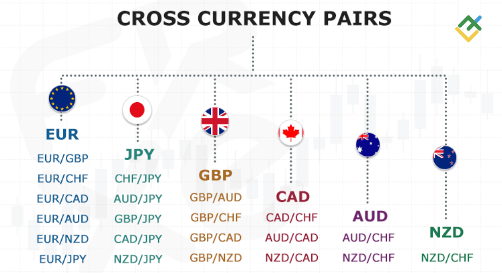

## Table of Contents

## What is a cross rate in forex trading?

A cross rate in forex trading is the exchange rate between two currencies that are not the U.S. dollar. Usually, when you trade currencies, one side of the pair is the U.S. dollar, like EUR/USD or USD/JPY. But with a cross rate, you're looking at pairs like EUR/JPY or GBP/AUD, where the U.S. dollar isn't involved.

These rates are important because they let traders and businesses know how much one currency is worth compared to another without going through the U.S. dollar. For example, if you're in Europe and want to buy something in Japan, you'd use the EUR/JPY cross rate to figure out how many euros you need for yen. Cross rates can be calculated by using the rates of each currency against the U.S. dollar, but they're also directly quoted in the market for easier trading.

## How do you calculate a cross rate?

To calculate a cross rate, you need the exchange rates of both currencies against a common third currency, usually the U.S. dollar. Let's say you want to find the cross rate between the euro (EUR) and the Japanese yen (JPY). You would need the EUR/USD rate and the USD/JPY rate. If 1 euro equals 1.10 U.S. dollars (EUR/USD = 1.10) and 1 U.S. dollar equals 110 Japanese yen (USD/JPY = 110), you can find the EUR/JPY rate by multiplying these two numbers together. So, 1.10 times 110 equals 121, meaning 1 euro equals 121 Japanese yen.

Sometimes, you might need to divide instead of multiply, depending on how the rates are given. For example, if you have the USD/EUR rate instead of EUR/USD, you would use division. If USD/EUR is 0.91 (meaning 1 U.S. dollar equals 0.91 euros), and you still have USD/JPY at 110, you would divide 110 by 0.91 to get the EUR/JPY rate. That calculation gives you about 120.88, so 1 euro equals about 120.88 Japanese yen. It's important to pay attention to which currency is the base and which is the quote in each rate to make sure you're doing the math correctly.

## What are the most common currency pairs involved in cross rates?

The most common currency pairs involved in cross rates are those that do not include the U.S. dollar. These are often called major cross rates or simply crosses. Popular ones include the euro against the Japanese yen (EUR/JPY), the euro against the British pound (EUR/GBP), and the euro against the Swiss franc (EUR/CHF). These pairs are widely traded because they involve major economies and currencies that are frequently used in international trade and finance.

Another set of common cross rates involves the British pound paired with other major currencies, like the pound against the Japanese yen (GBP/JPY) and the pound against the Swiss franc (GBP/CHF). These crosses are also important because the UK has significant trade relationships with Japan and Switzerland. Traders and businesses use these rates to hedge against currency fluctuations or to speculate on the movements of these currencies relative to each other.

In addition to these, there are cross rates involving the Australian dollar, such as AUD/JPY and AUD/NZD, which are popular in the Asia-Pacific region. These crosses are important for traders and businesses in that part of the world because of the economic ties between Australia, Japan, and New Zealand. Understanding these common cross rates can help in managing currency risks and making informed trading decisions.

## Can you provide an example of a cross rate calculation?

Let's say you want to know how many Japanese yen you can get for one euro. You have two pieces of information: 1 euro equals 1.10 U.S. dollars (EUR/USD = 1.10), and 1 U.S. dollar equals 110 Japanese yen (USD/JPY = 110). To find out the cross rate between the euro and the yen (EUR/JPY), you multiply these two numbers together. So, 1.10 times 110 equals 121. This means that 1 euro equals 121 Japanese yen.

Now, let's try another example where you need to divide instead of multiply. Suppose you have the rate of 1 U.S. dollar equals 0.91 euros (USD/EUR = 0.91), and you still know that 1 U.S. dollar equals 110 Japanese yen (USD/JPY = 110). To find the EUR/JPY rate, you divide 110 by 0.91. This calculation gives you about 120.88, so 1 euro equals about 120.88 Japanese yen. It's important to pay attention to which currency is the base and which is the quote in each rate to make sure you're doing the math correctly.

## How do cross rates affect international trade?

Cross rates are important for international trade because they help businesses know how much one country's money is worth compared to another country's money without using the U.S. dollar. When a business in one country wants to buy things from another country, they need to know the cross rate to figure out how much it will cost them in their own money. For example, if a French company wants to buy goods from Japan, they would use the EUR/JPY cross rate to know how many euros they need to pay for yen. This helps them plan their costs and make sure they can afford the goods they want to buy.

Cross rates can also affect how businesses make decisions about where to buy or sell their products. If the cross rate between two countries' currencies changes a lot, it can make goods from one country cheaper or more expensive compared to goods from another country. This can cause businesses to change their suppliers or markets to take advantage of better prices. For example, if the EUR/JPY rate goes down, making yen cheaper for euros, a French company might decide to buy more from Japan because it's now cheaper. Understanding and using cross rates helps businesses manage their money better and stay competitive in the global market.

## What are the differences between major, minor, and exotic currency pairs?

In [forex](/wiki/forex-system) trading, currency pairs are grouped into three main categories: major, minor, and exotic. Major pairs are the most traded and involve the U.S. dollar paired with other major world currencies like the euro, Japanese yen, British pound, Canadian dollar, Australian dollar, New Zealand dollar, and Swiss franc. These pairs have the highest liquidity and the smallest spreads, which means they are easier and cheaper to trade. Examples of major pairs include EUR/USD, USD/JPY, and GBP/USD.

Minor pairs, also known as cross-currency pairs, do not include the U.S. dollar. They are made up of other major currencies and are less liquid than major pairs but still widely traded. The spreads for minor pairs are usually a bit larger than those for major pairs. Common examples of minor pairs include EUR/GBP, EUR/JPY, and GBP/CHF. These pairs are important for traders and businesses that need to exchange currencies without going through the U.S. dollar.

Exotic pairs involve one major currency and one currency from a smaller or emerging economy. These pairs have the lowest liquidity and the largest spreads, making them more expensive and riskier to trade. Examples of exotic pairs include USD/TRY (U.S. dollar/Turkish lira), EUR/SEK (euro/Swedish krona), and GBP/ZAR (British pound/South African rand). Traders might use exotic pairs to take advantage of unique economic conditions in smaller markets, but they need to be aware of the higher risks involved.

## How do geopolitical events influence cross rates?

Geopolitical events can really shake up cross rates. When big things happen between countries, like fights or new agreements, it can change how people see the value of different currencies. For example, if two countries start arguing a lot, people might think one country's money is riskier and not want to hold onto it. This can make the currency weaker compared to others. On the other hand, if countries make a new trade deal, people might think their money is safer and want more of it, making it stronger.

These changes in how people feel about a country's money can lead to big moves in cross rates. For instance, if there's a lot of trouble in Europe, the euro might get weaker against the yen. Traders and businesses that use cross rates to trade or buy things from other countries need to watch these events closely. They can help them guess how rates might change and plan their money moves better.

## What role do cross rates play in arbitrage opportunities?

Cross rates can help traders find [arbitrage](/wiki/arbitrage) opportunities. Arbitrage is when someone buys something in one place and sells it in another place for more money, making a profit from the difference in prices. In forex, arbitrage happens when a trader sees that the price of a currency pair is different in two places. They can buy the pair where it's cheaper and sell it where it's more expensive. Cross rates are important because they show the price of one currency against another without using the U.S. dollar. If the cross rate is different in two markets, a trader can use this difference to make money.

For example, let's say the EUR/JPY rate is 120 in one market and 122 in another market. A trader can buy euros with yen at the lower rate of 120 and then sell those euros for yen at the higher rate of 122. The difference between these two rates is the profit from arbitrage. But, these opportunities don't last long because many traders are looking for them, and the rates will quickly adjust to close the gap. So, traders need to act fast and have good technology to take advantage of these arbitrage chances.

## How can traders use cross rates to hedge their portfolios?

Traders can use cross rates to protect their money from big changes in currency values. If a trader has investments in different countries, they might worry that changes in one country's money could hurt their overall money. By using cross rates, they can make trades that help balance out these risks. For example, if a trader has a lot of money in euros and is worried about the euro getting weaker compared to the yen, they can use the EUR/JPY cross rate to make a trade that will make money if the euro does get weaker. This way, any losses from their euro investments could be made up for by gains from the cross rate trade.

This kind of trading is called hedging. It's like buying insurance for your money. By using cross rates, traders can set up trades that work in the opposite way of their main investments. If the value of one currency goes down, the cross rate trade can go up, helping to keep the trader's overall money safe. It's important for traders to watch the news and understand how different currencies might move compared to each other. By doing this, they can use cross rates to make smart choices about how to protect their money from big surprises in the currency markets.

## What are the risks associated with trading cross rates?

Trading cross rates can be risky because they are less traded than major currency pairs that include the U.S. dollar. This means they might not have as many buyers and sellers, which can make the price move a lot more quickly and unpredictably. If you want to buy or sell a cross rate, you might find it harder to do so at the price you want, which can lead to bigger losses if the market moves against you.

Another risk is that cross rates can be affected by news and events in two countries instead of just one. If something big happens in either country, it can change the value of the cross rate a lot. For example, if there's a political problem in Japan, it could make the yen weaker or stronger against the euro, which would change the EUR/JPY rate. Traders need to keep an eye on what's happening in both countries to try and guess how the cross rate might move. This can be hard and might lead to mistakes if you don't have all the information.

## How do interest rate differentials impact cross rate movements?

Interest rate differentials can really affect how cross rates move. When one country's interest rates go up compared to another country, people might want to move their money to the country with the higher rates to get more interest. This can make the currency of the country with higher interest rates stronger against the currency of the country with lower interest rates. For example, if Japan raises its interest rates and Europe keeps theirs the same, the yen might get stronger against the euro, making the EUR/JPY cross rate go down.

This movement can also work the other way around. If a country lowers its interest rates, people might take their money out and put it in a country with higher rates, making the currency of the country with lower rates weaker. Traders watch these [interest rate](/wiki/interest-rate-trading-strategies) changes closely because they can help them guess how cross rates might move. By understanding these differences, traders can make better decisions about when to buy or sell different currencies.

## What advanced strategies can be employed when trading cross rates?

One advanced strategy for trading cross rates is called [carry](/wiki/carry-trading) trading. This is when a trader borrows money in a country with low interest rates and uses it to invest in a country with high interest rates. They hope to make money from the difference in interest rates. For example, if Japan has low interest rates and Australia has high ones, a trader might borrow yen to buy Australian dollars. If the AUD/JPY cross rate stays the same or goes up, the trader can make money from both the interest rate difference and any increase in the cross rate. But, if the cross rate goes down a lot, the trader could lose money. This strategy needs careful watching because big changes in the cross rate can wipe out the gains from interest.

Another strategy is called pairs trading. This involves finding two currencies that usually move together but have temporarily moved apart. A trader might buy one currency and sell the other, betting that they will move back towards each other. For example, if the EUR/GBP and EUR/CHF cross rates usually move together but EUR/GBP has gone up a lot more than EUR/CHF, a trader might sell EUR/GBP and buy EUR/CHF, expecting them to come back closer together. This strategy can be less risky than betting on just one currency because it's based on the relationship between the two. But, it still needs careful watching and understanding of how different events can affect each currency differently.

## What are we exploring about cross rates?

Cross rates are essential components of the foreign exchange (forex) market, especially for traders who deal with currency pairs that do not involve the U.S. dollar (USD). A cross rate refers to the exchange rate between two currencies, neither of which is the official currency of the country in which the quote is provided. This differs from direct currency pairs, which typically involve the USD as one of the currencies in the pair. For instance, EUR/GBP (Euro to British Pound) is a cross rate in the United States, whereas USD/EUR or USD/GBP would be considered direct currency pairs.

Cross rates are particularly important for traders who need to conduct transactions involving two non-USD currencies. They offer a way to assess the relative value between any two currencies even when neither is the USD, facilitating diverse trading opportunities and wider market participation. This is especially vital in global markets where traders may want to hedge against currency risks or capitalize on macroeconomic trends affecting currencies outside the U.S.

The calculation of cross rates typically utilizes major currency pairs involving the U.S. dollar. To derive a cross rate, traders often use the formula:

$$
\text{Cross Rate} = \frac{\text{Currency A / USD}}{\text{Currency B / USD}}
$$

For example, if a trader is interested in calculating the cross rate for EUR/GBP using the major pairs USD/EUR and USD/GBP, they could use the USD as a common [factor](/wiki/factor-investing):

$$
\text{EUR/GBP} = \frac{\text{1 USD/EUR}}{\text{1 USD/GBP}}
$$

This formula demonstrates how the relative exchange values against the USD can be used to estimate the exchange rate between two other currencies.

Several cross currency pairs are widely traded and hold market significance due to their stability and [liquidity](/wiki/liquidity-risk-premium). Popular cross rates include EUR/GBP, AUD/JPY (Australian Dollar to Japanese Yen), and EUR/CHF (Euro to Swiss Franc). These pairs enable traders to speculate on the economic and geopolitical factors affecting the respective countries without the interference of USD fluctuations. Cross rates often present unique trading opportunities as they can experience pricing dynamics distinct from those involving the USD, influenced directly by regional economic conditions, interest rates, and market sentiment.

In summary, cross rates are pivotal for traders focusing on transactions that bypass the USD. They not only expand the range of trading strategies available but also provide deeper insights into the interconnectedness of global currencies.

 to Algorithmic Trading

Algorithmic trading, often referred to as algo trading, is a method of executing orders using automated pre-programmed trading instructions. This approach takes advantage of technological advancements and mathematical models to execute high-speed trades, capitalizing on tiny price disparities in the financial markets. 

The primary benefit of [algorithmic trading](/wiki/algorithmic-trading) over traditional methods lies in its speed and efficiency. Human traders face limitations in processing multiple signals and executing trades at the same blistering speed as computers. Algorithms can analyze vast datasets and execute trades in milliseconds, which is crucial in today's fast-paced markets. Additionally, algorithmic trading removes emotional bias from trading decisions, as algorithms follow predefined rules and parameters without deviation. This provides a more consistent and disciplined approach to trading.

There are several types of algorithmic trading strategies employed by traders and financial institutions. These include:

1. **Trend Following**: This strategy involves algorithms that identify and capitalize on market trends based on historical data. Algorithms assess price movements and make trades that follow market trends.

2. **Arbitrage**: Arbitrage strategies capitalize on price differences of the same asset in different markets. Algorithms detect these discrepancies and execute trades to profit from the price variance.

3. **Market Making**: This involves placing both buy and sell orders to earn the spread between the bid and ask prices. Algorithms help in maintaining inventory and adjusting orders based on market conditions.

4. **Mean Reversion**: This strategy operates on the assumption that prices will revert to their historical mean. Algorithms identify deviations from the mean and execute trades to profit from eventual corrections.

5. **Statistical Arbitrage**: Statistical arbitrage involves creating complex models to identify trading opportunities, often based on the statistical mispricing of one or more assets.

The growing trend of algorithmic trading in the forex market is driven by an increased demand for foreign exchange transactions and technological advancements. Forex markets, being one of the most liquid and volatile, present numerous opportunities for algorithmic strategies. The ability to execute trades seamlessly across various currency pairs and cross rates has made algorithmic trading an attractive option for traders seeking efficient market engagement. This automation and precision are reshaping how trading is conducted, allowing for higher volumes and reduced transaction costs. 

As algorithms continue to evolve with advancements in [artificial intelligence](/wiki/ai-artificial-intelligence) and [machine learning](/wiki/machine-learning), their role is expected to further expand, offering new strategies and deeper insights into market dynamics. This technological evolution signifies a pivotal shift in the forex market landscape, laying the foundation for future trading methodologies.

## References & Further Reading

[1]: King, M., & Rime, D. (2010). ["The $4 trillion question: What explains FX growth since the 2007 survey?"](https://papers.ssrn.com/sol3/papers.cfm?abstract_id=1727410) BIS Quarterly Review.

[2]: Lopez de Prado, M. (2018). ["Advances in Financial Machine Learning."](https://www.amazon.com/Advances-Financial-Machine-Learning-Marcos/dp/1119482089) Wiley.

[3]: Aronson, D. R. (2006). ["Evidence-Based Technical Analysis: Applying the Scientific Method and Statistical Inference to Trading Signals."](https://www.amazon.com/Evidence-Based-Technical-Analysis-Scientific-Statistical/dp/0470008741) Wiley.

[4]: Chan, E. P. (2009). ["Quantitative Trading: How to Build Your Own Algorithmic Trading Business."](https://github.com/ftvision/quant_trading_echan_book) Wiley.

[5]: Jansen, S. (2020). ["Machine Learning for Algorithmic Trading."](https://github.com/stefan-jansen/machine-learning-for-trading) Packt Publishing.