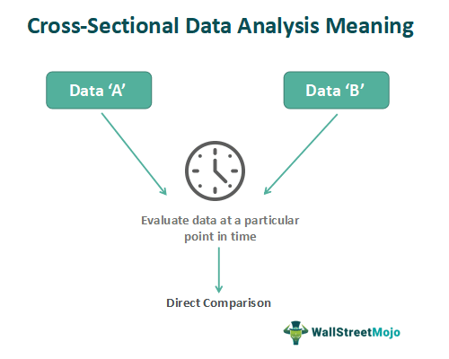

In today's fast-paced financial markets, mastering various techniques in financial analysis is critical for investors and traders seeking to navigate complex trading environments. The financial landscape is characterized by vast amounts of data, requiring robust methodologies to interpret and extract valuable insights that inform investment decisions. This article examines foundational and advanced strategies, namely data comparison, financial analysis, cross-sectional analysis, and algorithmic trading, demonstrating their integration for effective investment strategies.

Data comparison forms the backbone of financial analysis, enabling investors to compare different metrics such as earnings, growth rates, and valuation ratios. This process is vital for performance benchmarking and ensuring alignment with investment objectives. Through a comparative lens, investors can detect patterns, evaluate trends, and establish a comprehensive understanding of a company's or asset's relative standing. Techniques such as ratio analysis assist in these comparisons, revealing differences that might otherwise remain obscured in raw financial statements.



Cross-sectional analysis offers another layer of understanding by examining multiple companies or assets at a specific point in time. Unlike time series analysis, which evaluates data points over a period, cross-sectional analysis provides a snapshot, allowing investors to identify strengths and weaknesses across an industry landscape. This method is particularly useful in deciphering competitive advantages, sectoral performance trends, and potential valuation discrepancies.

Algorithmic trading, the automation of trading processes through pre-programmed instructions, leverages these analytical techniques to inform decision-making. This integration of data analytics into trading strategies enables rapid execution of trades based on complex criteria, enhancing efficiency and precision. Algorithmic trading platforms employ cross-sectional analysis to refine stock selection, capitalize on arbitrage opportunities, and optimize portfolio construction.

Through the convergence of these disciplines, investors can achieve a nuanced understanding of financial data, driving more informed and strategic investment decisions. With continuous advancements in technology and analytics, the ability to integrate and apply these techniques effectively will remain essential, offering the potential for greater returns in ever-evolving financial markets.

## Table of Contents

## Understanding Data Comparison in Financial Analysis

Data comparison is a fundamental component of financial analysis, where investors scrutinize different data sets to uncover meaningful patterns and insights. This process enables investors to make well-informed decisions by identifying trends and benchmarking performance against specific objectives. A critical aspect of data comparison is the evaluation of key financial metrics such as earnings, growth rates, and valuation ratios, which provide insight into a company's financial health and market standing.

### Importance of Comparing Financial Data

Comparing financial data is crucial for several reasons:

1. **Performance Benchmarking**: It allows investors to benchmark a company's performance against its peers or industry standards. By comparing key indicators such as Return on Equity (ROE), Return on Assets (ROA), and Price-to-Earnings (P/E) ratios, investors can assess whether a company is overperforming or underperforming relative to its competitors.

2. **Trend Identification**: Through systematic comparison, investors can identify trends such as increasing revenue growth, improving profit margins, or declining debt levels. These trends serve as valuable signals for making investment decisions.

3. **Valuation Analysis**: Valuation ratios, which include metrics like the P/E ratio, Price-to-Book (P/B) ratio, and Enterprise Value to EBITDA (EV/EBITDA), are instrumental in determining whether a stock is undervalued or overvalued. Comparing these ratios across companies or sectors aids in identifying potential investment opportunities or risks.

### Techniques for Effective Data Comparison

To effectively compare financial data, investors can employ several analytical techniques:

- **Normalization**: This process involves adjusting values measured on different scales to a common scale, often using statistical measures such as Z-scores or min-max scaling. Normalization is vital when comparing data from companies of varying sizes or industries.

- **Ratio Analysis**: Financial ratios offer a simplified means to compare different aspects of a company's performance. For instance, the Current Ratio and Quick Ratio provide insights into liquidity, whereas Debt-to-Equity Ratio indicates leverage levels.

- **Time-Series Analysis**: While not exclusively about comparison, analyzing financial data over time helps in understanding the historical context and forecasting future performance.

### Python Example for Financial Data Comparison

Below is a basic Python snippet that demonstrates how to use financial ratios to compare two companies:

```python
import pandas as pd

# Sample financial data for two companies
data = {'Company': ['A', 'B'],
        'Net Income': [500000, 600000],
        'Shareholder Equity': [2000000, 2500000],
        'Total Debt': [1000000, 1200000],
        'Current Assets': [800000, 900000],
        'Current Liabilities': [400000, 300000]}

# Create DataFrame
df = pd.DataFrame(data)

# Calculate ROE and Current Ratio
df['ROE'] = df['Net Income'] / df['Shareholder Equity']
df['Current Ratio'] = df['Current Assets'] / df['Current Liabilities']

# Output the financial ratios
print(df[['Company', 'ROE', 'Current Ratio']])
```

This code calculates the Return on Equity (ROE) and Current Ratio for two hypothetical companies, providing a basis for comparison. Such computations are instrumental in assessing financial performance and [liquidity](/wiki/liquidity-risk-premium).

### Conclusion

Effective data comparison equips investors with the knowledge needed to align their investment strategies with their financial goals. By evaluating a myriad of financial metrics, investors can gauge a company's performance and make strategic decisions that enhance portfolio returns.

## What is Cross-Sectional Analysis?

Cross-sectional analysis is a financial assessment methodology that evaluates a group of companies or assets at a specific point in time. This approach is utilized to identify trends, performance indicators, and comparative metrics across similar entities within an industry, allowing for an insightful comparison. Unlike time series analysis, which examines data sequences or trends over a period, cross-sectional analysis offers a snapshot view, focusing on the relative standing of each entity at that particular moment.

This analytical perspective is crucial in understanding the competitive landscape and positioning of companies within a sector. By analyzing a range of financial metrics such as price-to-earnings ratios, return on equity, or debt-to-equity ratios across different firms, investors can pinpoint which companies are outperforming their peers and which may be lagging.

The analysis leverages specific performance indicators to highlight strengths and weaknesses. For instance, in the retail sector, cross-sectional analysis might reveal that while two firms have similar revenue growth, one has a significantly higher profit margin due to cost management efficiencies. This insight can guide investors toward more profitable opportunities by identifying companies that exhibit superior operational performance.

An additional benefit of cross-sectional analysis is its ability to highlight sector-wide trends that may not be apparent in isolation. For example, if most firms in an industry report declining growth rates, the analysis may suggest broader economic or regulatory challenges affecting the sector. Recognizing these trends can aid investors in making strategic decisions, such as reallocating resources or hedging against potential risks.

In practical terms, conducting a cross-sectional analysis can involve statistical and computational techniques to manage large datasets effectively. Implementing such analysis might include using Python libraries like pandas for data manipulation, along with visualization tools to illustrate comparative metrics across entities. Here is an example Python snippet that demonstrates a basic comparative analysis:

```python
import pandas as pd

# Sample data for cross-sectional analysis
data = {
    'Company': ['A', 'B', 'C'],
    'Revenue': [500, 700, 600],
    'Profit Margin': [0.1, 0.15, 0.08],
    'Debt/Equity Ratio': [0.5, 0.3, 0.7]
}

df = pd.DataFrame(data)

# Calculate average indicators for benchmarking
avg_revenue = df['Revenue'].mean()
avg_profit_margin = df['Profit Margin'].mean()
avg_de_ratio = df['Debt/Equity Ratio'].mean()

# Compare companies to average
df['Revenue vs Avg'] = df['Revenue'] - avg_revenue
df['Profit Margin vs Avg'] = df['Profit Margin'] - avg_profit_margin
df['Debt/Equity vs Avg'] = df['Debt/Equity Ratio'] - avg_de_ratio

print(df)
```

This code creates a dataframe of financial metrics for a hypothetical set of companies and calculates deviations from the average for each metric, providing a straightforward benchmark comparison typical in cross-sectional analysis.

In summary, cross-sectional analysis is a versatile tool essential for identifying the relative performance and positioning of companies at any given time within their industry, offering valuable insights that support strategic investment decisions. Its differentiation from time series analysis lies in its focus on contemporaneous comparisons rather than chronological data evaluation.

## Applications of Cross-Sectional Analysis in Algorithmic Trading

Algorithmic trading has transformed the financial landscape by enabling traders to employ computer algorithms to execute trading strategies with precision and speed. Cross-sectional analysis plays a crucial role in [algorithmic trading](/wiki/algorithmic-trading) by providing insights into how financial securities perform relative to one another at a given point in time. This technique aids in stock selection, [arbitrage](/wiki/arbitrage) opportunities, and portfolio construction.

### Stock Selection

Cross-sectional analysis is fundamental in developing stock selection strategies. By comparing various stocks at a specific time, traders can identify which stocks are undervalued or overvalued based on financial metrics such as price-to-earnings (P/E) ratio, return on equity (ROE), and earnings growth. For instance, a stock with a low P/E ratio relative to its peers might be deemed undervalued, offering a potential buying opportunity. Algorithmic trading systems integrate such cross-sectional comparisons into their decision-making processes, allowing for automated selection and execution of trades based on predefined criteria.

### Arbitrage Opportunities

Arbitrage opportunities arise when there is a price discrepancy between securities that should, theoretically, have the same value. Cross-sectional analysis assists in identifying these inefficiencies by analyzing price relationships between similar securities. For example, consider two exchange-traded funds (ETFs) that track the same index but trade at different prices. Cross-sectional analysis can detect this anomaly, and algorithmic trading systems can be programmed to exploit it by simultaneously buying the undervalued [ETF](/wiki/etf-trading-strategies) and selling the overvalued one until the price discrepancy is arbitraged away.

To implement an arbitrage strategy in Python, one might use the following simple pseudocode:

```python
def arbitrage_strategy(security_a, security_b):
    if price(security_a) < price(security_b):
        buy(security_a)
        sell(security_b)
    elif price(security_a) > price(security_b):
        buy(security_b)
        sell(security_a)
```

### Portfolio Construction

The construction of an optimal portfolio is another significant application of cross-sectional analysis in algorithmic trading. By evaluating the relative performance and risk characteristics of different assets, traders can use cross-sectional data to diversify and optimize their portfolios. Techniques such as mean-variance optimization, which considers the expected return and variance of different assets, benefit from cross-sectional inputs to inform the selection and weighting of assets in a portfolio.

A mathematical representation in the context of portfolio optimization might be expressed as:

$$
\text{Maximize} \, \mathbf{w^T\mu} - \frac{\lambda}{2}\mathbf{w^T\Sigma w}
$$

where:
- $\mathbf{w}$ is the weight vector of assets in the portfolio,
- $\mathbf{\mu}$ is the vector of expected returns,
- $\Sigma$ is the covariance matrix of asset returns,
- $\lambda$ is the risk-aversion coefficient.

### Practical Implementation Examples

Several trading firms have successfully harnessed cross-sectional analysis within their algorithmic trading frameworks. Renaissance Technologies, for instance, is renowned for using [machine learning](/wiki/machine-learning) and sophisticated statistical models to exploit cross-sectional differences across large data sets. Similarly, Two Sigma utilizes data science and technology to apply cross-sectional insights in its algorithmic trades, focusing on identifying high-probability opportunities across multiple financial instruments.

In conclusion, cross-sectional analysis is an indispensable tool in algorithmic trading. Its applications in stock selection, arbitrage, and portfolio construction offer substantial advantages by leveraging relative performance metrics to inform trading strategies. As algorithmic systems continue to evolve, the integration and refinement of cross-sectional analytical methods will likely yield even more sophisticated and effective trading strategies.

## Techniques and Tools for Cross-Sectional Analysis

Cross-sectional analysis in finance involves a range of techniques and tools designed to analyze and interpret data from a snapshot perspective, comparing different entities at a specific point in time. This type of analysis often employs statistical methods and computational tools to extract actionable insights from large datasets. These methods include multi-[factor](/wiki/factor-investing) models, machine learning techniques, and data reduction methods like principal component analysis (PCA) and clustering.

### Multi-Factor Models
Multi-factor models are commonly used to understand the influence of various factors on financial returns. By incorporating multiple explanatory variables, these models aim to capture the complex behaviors of financial markets. The Capital Asset Pricing Model (CAPM) is a well-known single-factor model, which can be expanded to include multiple factors such as size, value, and [momentum](/wiki/momentum), as seen in models like the Fama-French three-factor model.

### Principal Component Analysis (PCA)
PCA is a data reduction technique that transforms high-dimensional data into a lower-dimensional space while retaining most of the variability in the data. This method is particularly useful in cross-sectional analysis for identifying underlying structures in financial datasets. PCA identifies principal components, which are orthogonal linear combinations of the original variables, maximizing variance and minimizing information loss.

Mathematically, PCA involves the eigen decomposition of a covariance matrix or singular value decomposition (SVD) of the data matrix. The principal components are derived as follows:

$$
X_{\text{new}} = X \cdot W
$$

Where $X$ is the original data matrix, and $W$ is the matrix of eigenvectors (principal components).

### Clustering
Clustering techniques classify data into groups based on similarity, enabling investors to segment companies or assets for comparative analysis. Popular clustering methods include k-means clustering and hierarchical clustering. These methods help identify groups with similar financial characteristics, allowing for targeted investment strategies.

For instance, k-means clustering aims to partition data into $k$ clusters, minimizing the variance within each cluster. The objective is to minimize the following cost function:

$$
J = \sum_{i=1}^{k} \sum_{x \in C_i} \| x - \mu_i \|^2
$$

Where $C_i$ is the $i$-th cluster and $\mu_i$ is the mean of points in $C_i$.

### Machine Learning Applications
Machine learning (ML) extends traditional statistical tools by enabling automated and scalable data analysis. Algorithms such as decision trees, support vector machines (SVM), and neural networks allow for the discovery of non-linear patterns and relationships within financial data. These ML models can process vast amounts of data, making them suitable for cross-sectional analysis where datasets are large and complex.

### Role of Software and Analytics Platforms
Implementing these techniques often requires sophisticated software and analytics platforms. Platforms like MATLAB, R, and Python, equipped with libraries such as NumPy, SciPy, scikit-learn, and TensorFlow, provide essential tools for financial data analysis. These platforms facilitate the execution of statistical methods, machine learning algorithms, and data visualization, making cross-sectional analysis more efficient and accessible.

In summary, cross-sectional analysis is bolstered by a suite of techniques and tools, ranging from statistical models to advanced computational methods. By leveraging these resources, analysts can derive insights that inform investment decisions and strategies in dynamic financial markets.

## Challenges and Limitations of Cross-Sectional Analysis

Cross-sectional analysis is an essential tool in financial analysis, yet it comes with certain challenges and limitations that practitioners need to be aware of to ensure robust and reliable outcomes. One of the primary issues encountered is the quality of data. In financial markets, accurate and timely data are critical for effective analysis. Inaccuracies in data, stemming from incorrect reporting or outdated information, can lead to misleading conclusions. To mitigate this, analysts should employ data cleaning techniques, regularly update datasets, and verify data accuracy through multiple sources.

Another significant limitation is the risk of overfitting. Overfitting occurs when a model becomes too complex, capturing noise instead of the underlying pattern. This is a common pitfall in cross-sectional analysis when too many variables are included without sufficient justification. By employing methods such as cross-validation and regularization techniques like Lasso or Ridge regression, analysts can reduce the risk of overfitting and build more generalizable models.

Regulatory considerations are also crucial in cross-sectional analysis. Regulatory changes can influence market dynamics and alter the relationships between financial variables. Analysts must stay informed about regulatory developments in the jurisdictions in which they operate, as these can affect the availability and interpretation of financial data.

Market dynamics, including fluctuations in liquidity, interest rates, and economic factors, can impact the effectiveness of cross-sectional analysis. Such dynamics may cause structural changes in the market that render historical analysis less predictive of future trends. Analysts should adjust their models regularly to account for these changes and incorporate economic indicators that reflect current market conditions.

By being aware of these challenges and proactively addressing them, practitioners of cross-sectional analysis can enhance the reliability and accuracy of their financial insights.

## Future Trends in Cross-Sectional Analysis and Algo Trading

Emerging trends such as [artificial intelligence](/wiki/ai-artificial-intelligence) (AI), machine learning, and [alternative data](/wiki/best-alternative-data) are reshaping the landscape of cross-sectional analysis and algorithmic trading, offering new opportunities and enhancements for financial market participants. AI and machine learning algorithms enable traders to extract more nuanced insights from large datasets, allowing for the development of sophisticated models that can adjust dynamically to market changes. These technologies excel at identifying non-linear patterns and interactions between variables that traditional analysis methods might miss. Machine learning algorithms, such as random forests or deep neural networks, can be trained on historical cross-sectional data to predict future asset returns or identify potential arbitrage opportunities.

Alternative data, which includes information not traditionally used in financial models—such as social media sentiment, satellite imagery, and web traffic metrics—provides additional dimensions to cross-sectional analysis. This data can enhance predictive models by capturing market sentiments or macroeconomic factors in real time, thereby offering a competitive edge. For example, sentiment analysis of social media data might provide early signals of stock price movements, allowing traders to adjust their strategies accordingly.

The integration of blockchain technology contributes to improved data transparency and integrity, two critical factors in financial analysis and trading. Blockchain's decentralized and immutable ledger can ensure the accuracy and reliability of financial data used in cross-sectional analyses. This technology can facilitate the sharing of data among various stakeholders while maintaining trust and accountability, which is crucial for automated trading systems that rely on accurate information.

Future advancements in cross-sectional analysis and algorithmic trading may include the increased use of quantum computing, which could process complex calculations at unprecedented speeds, enabling the evaluation of vast datasets more efficiently. Additionally, advancements in natural language processing (NLP) could further enhance the ability of trading algorithms to interpret and act on unstructured text data, such as news articles or regulatory filings.

In conclusion, the integration of AI, machine learning, alternative data, and blockchain technology with cross-sectional analysis holds significant promise for enhancing the capabilities of algorithmic trading. These advancements not only improve the precision and adaptability of trading strategies but also open new avenues for innovation in financial markets. Staying abreast of these trends will be critical for investors and traders looking to leverage cutting-edge analytical techniques for competitive advantage.

## Conclusion

The integration of data comparison, financial analysis, cross-sectional analysis, and algorithmic trading forms a robust framework for modern financial decision-making. Each of these methodologies contributes distinctive insights and analytical power, ensuring a comprehensive approach to understanding and navigating financial markets. 

Data comparison lays the foundation by evaluating financial metrics and benchmark performance against industry standards or historical data. This approach enables investors to discern patterns and anomalies, paving the way for strategic decisions. Financial analysis, encompassing both fundamental and technical analysis, further refines this decision-making process by assessing the intrinsic value of assets and market trends.

Cross-sectional analysis offers an additional layer of depth by examining multiple assets or companies at a single point in time, enhancing the understanding of sector-specific or economy-wide trends and outlier performance. When combined with algorithmic trading, these insights translate into actionable strategies that are executed with precision and speed. Algorithmic trading utilizes complex models and algorithms to automate trading decisions, often enhancing performance and managing risks more effectively.

The convergence of these methodologies can lead to informed investment decisions that optimize returns while managing risk. For instance, a portfolio manager might employ python scripts to implement a cross-sectional analysis of stock returns, leveraging statistical libraries such as Pandas and NumPy to process and analyze large data sets efficiently. The following Python code snippet demonstrates a simple cross-sectional analysis using these tools:

```python
import pandas as pd
import numpy as np

# Sample data import
data = pd.read_csv('financial_data.csv')

# Cross-sectional analysis: calculating mean return
returns = data['returns']
average_return = np.mean(returns)

# Assess stocks above average return
outperforming_stocks = data[data['returns'] > average_return]
print(outperforming_stocks)
```

Given the rapidly evolving landscape of technology and finance, it is crucial for investors and traders to stay informed about the latest advancements. Developments in artificial intelligence, machine learning, and alternative data sources continue to shape these fields, offering new possibilities for further enhancing analytical capabilities. Blockchain technology further complements these efforts by improving data transparency and integrity. To harness these opportunities, continuous learning and adaptation are essential.

As financial markets and technologies continue to evolve, the integration of these tools not only aids in making more accurate predictions but also prepares investors and traders to capitalize on emerging market trends, ultimately striving for greater returns.

## References & Further Reading

[1]: Marcos Lopez de Prado. ["Advances in Financial Machine Learning"](https://www.amazon.com/Advances-Financial-Machine-Learning-Marcos/dp/1119482089). Wiley, 2018.

[2]: David Aronson. ["Evidence-Based Technical Analysis: Applying the Scientific Method and Statistical Inference to Trading Signals"](https://www.amazon.com/Evidence-Based-Technical-Analysis-Scientific-Statistical/dp/0470008741). Wiley, 2006.

[3]: Stefan Jansen. ["Machine Learning for Algorithmic Trading: Predictive Models to Extract Signals from Market and Alternative Data for Systematic Trading Strategies with Python"](https://github.com/stefan-jansen/machine-learning-for-trading). Packt Publishing, 2020.

[4]: Ernest P. Chan. ["Quantitative Trading: How to Build Your Own Algorithmic Trading Business"](https://www.amazon.com/Quantitative-Trading-Build-Algorithmic-Business/dp/0470284889). Wiley, 2008.

[5]: Robert Engle and Clive W.J. Granger. ["Co-integration and Error Correction: Representation, Estimation, and Testing"](https://www.jstor.org/stable/1913236?read-now=1). Econometrica, 1987.

[6]: Richard Brealey, Stewart Myers, and Franklin Allen. ["Principles of Corporate Finance"](https://www.amazon.com/Principles-Corporate-Finance-Richard-Brealey/dp/1260565556). McGraw-Hill Education, 2019.

[7]: Andrew W. Lo. ["The Adaptive Markets Hypothesis: Market Efficiency from an Evolutionary Perspective"](https://papers.ssrn.com/sol3/papers.cfm?abstract_id=602222). Journal of Portfolio Management, 2004.