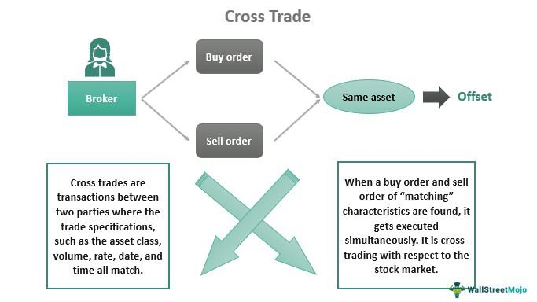

Cross trading is an intricate practice within financial markets, characterized by the execution of trades between clients of the same asset manager without utilizing a centralized exchange. This method is primarily employed to enhance trading efficiency and reduce transaction costs. Unlike traditional exchanges, where trades might incur significant fees and market impact, cross trading offers a pathway to optimize transactions, particularly for institutional investors handling large portfolios. By not exposing trades to public exchanges, participants can maintain discretion and privacy, thus potentially avoiding adverse market movements arising from large trade disclosures.

However, cross trading is not without its complexities, particularly concerning regulations. Different jurisdictions impose varied rules to govern cross trading, focusing on transparency and fair treatment of all clients involved. For instance, in the United States, the Securities and Exchange Commission (SEC) mandates disclosure and consent requirements to mitigate potential conflicts of interest, whereas the European MiFID II framework emphasizes transparency and investor protection.



For investors aiming to optimize their trading strategies and minimize transaction costs, understanding cross trading becomes crucial. The dynamic interplay of benefits and risks associated with this practice requires informed decision-making to navigate the financial landscapes effectively. This article will examine the nuances of cross trading, covering its benefits, risks, regulatory aspects, and its increasing role in algorithmic trading. Furthermore, we will discuss technological advancements that are reshaping the cross trading landscape and predict future trends, offering insights into strategic adaptation necessary for participants in evolving global markets.

## Table of Contents

## What is Cross Trading?

Cross trading is a trading practice where buy and sell orders for the same security are matched within a brokerage firm's client base, circumventing the use of a centralized public exchange. The process enables the direct transfer of assets between different portfolios managed by the same asset manager, offering a streamlined alternative to typical market transactions.

This practice is particularly beneficial for institutional investors managing extensive portfolios. By executing trades internally, cross trading helps minimize market impact. When large orders are placed openly on the market, they can lead to price fluctuations, adversely affecting the execution price. However, cross trading allows these large transactions to occur without altering the market price, thereby optimizing liquidity management.

One of the primary advantages of cross trading is the reduction in transaction costs. By avoiding exchange fees and minimizing the bid-ask spreads typically involved in public market transactions, asset managers can achieve considerable cost savings. This cost-effectiveness is crucial for investors seeking to enhance their returns by reducing ancillary expenses.

Despite these benefits, cross trading raises several regulatory and ethical concerns. The practice can create conflicts of interest, particularly if one client's trade is favored over another's, potentially undermining fair trading practices. There is also a lack of transparency inherent in cross trading, as these trades do not appear on public order [books](/wiki/algo-trading-books), leading to potential discrepancies in reported market prices.

To ensure fair treatment, asset managers engaging in cross trading must adhere to strict regulatory guidelines, which mandate transparency and the equitable treatment of all clients involved. As a result, cross trading represents a balancing act between achieving operational efficiency and maintaining ethical trading standards.

## Benefits and Risks of Cross Trading

Cross trading can provide significant advantages, particularly in the form of reduced transaction costs. By bypassing centralized exchanges, market participants can avoid exchange fees that typically add to trading expenses. Moreover, this practice allows for the minimization of the bid-ask spread, which is the difference between the highest price a buyer is willing to pay and the lowest price a seller is willing to accept. For large institutional investors, who manage substantial portfolios, these cost savings can be substantial, enhancing overall portfolio efficiency.

One of the key benefits of cross trading is the privacy and discretion it offers. For investors looking to execute large trades, conducting these transactions off-exchange helps prevent noticeable impacts on market prices that could result from revealing their trading intentions. This element of discretion is paramount for those requiring confidentiality, reducing market exposure until the trade is settled.

However, cross trading is not without its risks. A primary concern is the potential for conflicts of interest. Since trades are executed within the same brokerage's client base, there is a risk that the broker may prioritize certain clients over others, leading to unequal treatment. This can result in trades not reflecting true market conditions, thus disadvantaging certain participants.

Additionally, cross trading can expose markets to potential price manipulation. Without the oversight of a centralized exchange, there's a risk that prices could be intentionally distorted to benefit specific clients. This lack of transparency can undermine the overall integrity of financial markets and lead to a decline in investor confidence.

To mitigate these risks, stringent regulatory frameworks and robust compliance mechanisms are necessary. Such measures ensure that cross trading is conducted fairly and that conflicts of interest are adequately managed. These precautions are vital to maintaining the legitimacy and efficiency of cross trades, thereby safeguarding the interests of all market participants.

## Regulatory Perspective on Cross Trading

Regulations governing cross trading differ significantly across jurisdictions, highlighting the importance of transparency and fair treatment for all clients involved. In the United States, the Securities and Exchange Commission (SEC) mandates disclosure and consent requirements for cross trades. This regulatory framework is designed to prevent conflicts of interest and ensure that all clients receive equitable treatment. The SEC's regulations require asset managers to disclose their cross trading policies and obtain informed consent from involved parties. This approach aims to eliminate any potential for favoritism or self-dealing, thereby maintaining market integrity and investor confidence.

In Europe, the regulatory landscape is shaped by the Markets in Financial Instruments Directive II (MiFID II), which also places a strong emphasis on transparency and fair trading practices. MiFID II requires investment firms to establish rigorous systems and controls to prevent conflicts of interest, ensuring that cross trades are executed at terms that are fair to all parties. The directive obliges firms to regularly report cross trading activities to both regulators and clients, reinforcing accountability and investor protection.

These regulatory frameworks share common goals: safeguarding market integrity, protecting investor interests, and ensuring equitable execution of trades. As financial markets continue to evolve, ongoing regulatory updates are expected to address emerging challenges and technological advancements in cross trading. By maintaining stringent oversight, regulators aim to balance the operational efficiencies offered by cross trading with the need for ethical practices and market stability.

## Cross Trading and Algorithmic Trading

Algorithmic trading platforms increasingly facilitate cross trading by efficiently matching buy and sell orders through automated systems. These platforms are instrumental in addressing some core challenges associated with manual cross trading, such as issues of conflicting interests and the high likelihood of human error.

Algorithmic systems enhance the efficiency of cross trading by ensuring that transactions are executed at fair market values. These systems leverage advanced data analysis to assess large volumes of market data in real-time. This capability enables the detection of optimal trading opportunities and execution at precise market prices, minimizing the risk of price manipulation.

The implementation of these systems involves sophisticated algorithms capable of processing multiple variables simultaneously, such as market trends, historical data, and real-time market fluctuations. This multi-faceted analysis aids in maintaining the integrity of cross trading by providing a transparent and reliable trading environment.

Furthermore, algorithmic platforms operate with a high degree of precision due to their ability to implement complex algorithms that account for a wide range of trading conditions. An example of such an algorithm in [algorithmic trading](/wiki/algorithmic-trading) is the Volume-Weighted Average Price (VWAP) algorithm, which ensures trades comply with market conditions by executing transactions close to the average price based on [volume](/wiki/volume-trading-strategy) and time. 

Here is a basic implementation of VWAP in Python:

```python
def calculate_vwap(prices, volumes):
    total_turnover = sum(p * v for p, v in zip(prices, volumes))
    total_volume = sum(volumes)
    return total_turnover / total_volume if total_volume != 0 else 0

prices = [100, 102, 101, 99]
volumes = [200, 150, 300, 250]

vwap = calculate_vwap(prices, volumes)
print("VWAP:", vwap)
```

This snippet calculates the VWAP by dividing the total turnover by the total volume, which assists in ensuring trades are executed at optimal, unbiased prices throughout the trading period.

In conclusion, algorithmic trading systems are pivotal in advancing the cross trading landscape, ensuring trades are executed efficiently and ethically by leveraging real-time data analysis and mitigating human errors.

## Technological Advancements Impacting Cross Trading

Blockchain technology and smart contracts are playing pivotal roles in redefining cross trading dynamics by offering enhanced transparency and security. Blockchain, a decentralized ledger system, provides an immutable record of transactions, eliminating the opacity that often accompanies traditional cross trades. This ensures all parties involved have access to verifiable and transparent data, fostering trust and reducing the risk of fraud. Smart contracts, which are self-executing contracts with terms directly written into code, further facilitate secure transactions by only allowing trades to occur when predefined conditions are met. This automation reduces human error and increases efficiency, making the trading process more robust and reliable.

Artificial Intelligence (AI) and [machine learning](/wiki/machine-learning) are further enabling precision in predicting market trends, crucial for strategic decision-making. These technologies can analyze vast amounts of data in real-time, identifying patterns and insights that would be impossible for human traders to discern manually. This predictive capability allows traders to make informed decisions, optimizing cross trading strategies and adapting to market fluctuations swiftly. Python, for example, provides a flexible framework to implement machine learning models that can predict stock prices based on historical data. Here's a simple illustration:

```python
import numpy as np
from sklearn.model_selection import train_test_split
from sklearn.linear_model import LinearRegression

# Example data: time series data of stock prices
X = np.array([1, 2, 3, 4, 5]).reshape(-1, 1)  # Days
y = np.array([110, 115, 120, 125, 130])  # Stock prices

# Split data into training and test sets
X_train, X_test, y_train, y_test = train_test_split(X, y, test_size=0.2, random_state=42)

# Instantiate and train the model
model = LinearRegression()
model.fit(X_train, y_train)

# Predict future stock prices
predictions = model.predict(X_test)
```

Moreover, mobile trading platforms have significantly democratized access to cross trading. These platforms provide investors with direct access to trading systems from their smartphones, increasing market participation and [liquidity](/wiki/liquidity-risk-premium). Mobile applications expand the reach of cross trading beyond institutional investors to retail traders, enabling a more inclusive trading ecosystem. They offer user-friendly interfaces and real-time data access, allowing users to execute trades quickly and efficiently, thereby enhancing liquidity in the markets.

The integration of these technological advancements not only optimizes cross trading processes but also poses new challenges—such as the need for cybersecurity measures to protect digital transactions. As these technologies continue to evolve, they are expected to further refine cross trading, offering both opportunities and challenges that stakeholders must navigate.

## Future Trends and Predictions

Advancements in technology are poised to profoundly transform cross trading processes, with particular emphasis on [artificial intelligence](/wiki/ai-artificial-intelligence) (AI) and blockchain technology. AI facilitates the automation and optimization of cross trading by leveraging machine learning algorithms to analyze vast datasets, identify patterns, and predict market trends with enhanced accuracy. This technological shift allows for executing trades at optimal times and prices, minimizing human error and biases. Furthermore, AI-driven analytics can provide asset managers with deeper insights into trading behavior, thus enhancing decision-making processes.

Blockchain technology is another critical [factor](/wiki/factor-investing) expected to streamline cross trading. By offering a decentralized ledger, blockchain ensures enhanced transparency and security in transactions. This immutable record helps prevent fraud and makes auditing cross trades more efficient, thereby increasing trust among market participants. Smart contracts, a blockchain-based innovation, can automate the execution of cross trades by incorporating predefined rules and conditions, further improving efficiency and accuracy.

As these technologies advance, regulatory bodies may need to enhance oversight to mitigate risks of market abuse. With AI and blockchain facilitating more complex trading strategies, regulators are likely to develop new frameworks to ensure transparency, fairness, and compliance with ethical standards. This potential increase in oversight will aim to prevent practices that could undermine market integrity while still allowing the efficiency gains that cross trading offers.

The global financial markets are evolving towards increased interconnectivity, further contributing to the growing prevalence of cross trading. This interconnectedness necessitates ongoing scrutiny to strike a balance between leveraging the benefits of cross trading and addressing ethical concerns. As cross trades become more common, stakeholders—ranging from asset managers to regulators—must continually adapt strategies to navigate the complexities introduced by technological advancements and globalization.

The convergence of AI, blockchain, and evolving regulatory frameworks signifies a promising yet challenging future for cross trading. These dynamics underscore the need for market participants to remain agile and proactive in aligning with technological and regulatory developments to harness the full potential of cross trading.

## Conclusion

Cross trading presents a viable alternative to traditional trading methods by offering significant efficiency and cost benefits. By bypassing public exchanges, cross trading reduces transaction costs, such as exchange fees, and minimizes the impact of large trades on market prices. This can be particularly advantageous for institutional investors managing substantial portfolios, as it affords them the privacy to execute large-scale trades without altering prevailing market conditions.

However, the effectiveness of cross trading heavily depends on strict adherence to ethical standards and regulatory compliance. Transparent and fair practices are paramount to safeguarding investor interests and maintaining market integrity. For instance, regulatory bodies like the U.S. Securities and Exchange Commission (SEC) impose strict guidelines requiring disclosure and consent to prevent conflicts of interest and ensure equitable treatment for all clients involved in cross trades.

Looking forward, the trajectory of cross trading will likely be influenced by rapid technological advancements and regulatory adjustments. Technologies such as blockchain and artificial intelligence are poised to further streamline cross trading processes, enhancing transparency, security, and strategic decision-making capabilities. Concurrently, regulatory frameworks will evolve to address potential market abuses, mandating a balanced approach that enables operational efficiency while upholding ethical standards.

In summary, while cross trading offers numerous benefits, its continued success rests on a foundation of robust ethical practices and evolving regulatory frameworks. Strategic adaptation to emerging technologies and regulatory landscapes will be crucial for maintaining its viability and maximizing its potential benefits.

## References & Further Reading

[1]: Madhavan, A. (2000). ["Market microstructure: A survey."](https://www.sciencedirect.com/science/article/pii/S1386418100000070) Journal of Financial Markets, 3(3), 205-258.

[2]: Griffin, J. M., Harris, J. H., & Topaloglu, S. (2003). ["The Dynamics of Institutional and Individual Trading."](https://onlinelibrary.wiley.com/doi/abs/10.1046/j.1540-6261.2003.00606.x) Journal of Finance, 58(6), 2285-2320.

[3]: Naik, N. Y., & Yadav, P. K. (2003). ["Do Dealer Firms Manage Inventory on an Inventory-to-Inventory Basis?"](https://papers.ssrn.com/sol3/papers.cfm?abstract_id=1297050) Journal of Finance, 58(5), 2259-2290.

[4]: Securities and Exchange Commission. (2018). ["SEC Approves Rules to Enhance Transparency of Alternative Trading Systems Form ATS-N"]. [SEC.gov](https://www.sec.gov/).

[5]: European Securities and Markets Authority. (2017). ["MiFID II/MiFIR: European Commission and ESMA publish Q&As"]. [ESMA.europa.eu](https://www.esma.europa.eu/publications-and-data/interactive-single-rulebook/mifid-ii).

[6]: Lehmann, B. N. (2003). ["Some Desiderata for the Measurement of Price Discovery Across Markets."](https://www.semanticscholar.org/paper/Some-desiderata-for-the-measurement-of-price-across-Lehmann/3e724725818a56ac6f2f1920b243e0d614df310f) Review of Financial Studies, 6(1), 1-21.

[7]: Gomber, P., Arndt, B., Lutat, M., & Uhle, T. (2011). ["High-Frequency Trading."](https://papers.ssrn.com/sol3/papers.cfm?abstract_id=1858626) European Securities and Markets Authority Economic Paper.

[8]: Stoll, H. R. (2006). ["Electronic Trading in Stock Markets."](https://www.jstor.org/stable/pdf/30033638.pdf) Journal of Economic Perspectives, 20(1), 153-174.