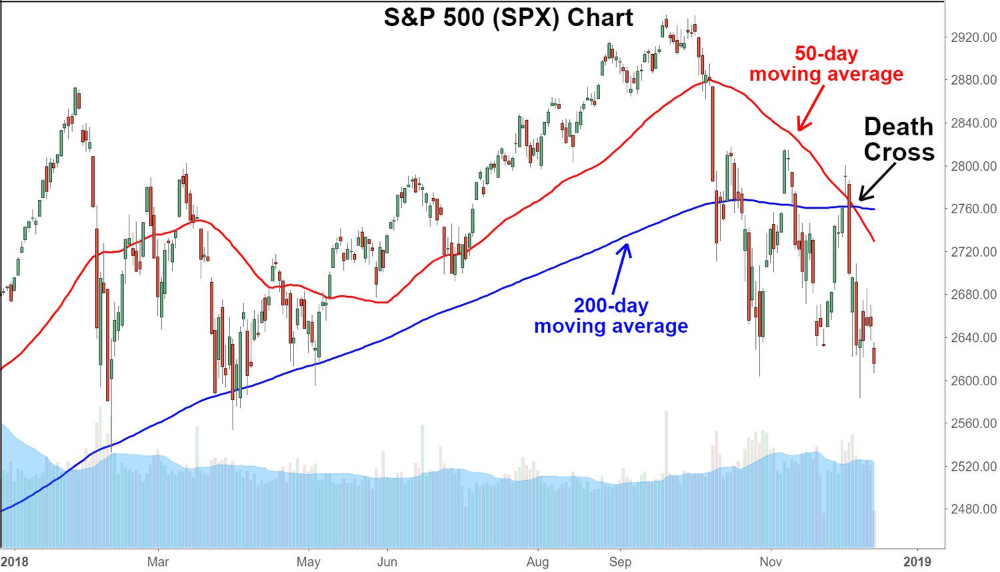

## Table of Contents

## What is cross trading in financial markets?

Cross trading in financial markets happens when a broker matches a buy order from one client with a sell order from another client without sending the orders to the open market. This means the trade happens directly between the two clients, and it can save time and reduce costs because it avoids the need to go through a public exchange.

However, cross trading can be controversial because it might not always get the best price for clients. If the broker does not properly handle the trades, one client might end up with a worse deal than they would have gotten on the open market. Because of this, there are strict rules and regulations to make sure cross trading is done fairly and transparently.

## How does cross trading differ from other types of trading?

Cross trading is different from other types of trading because it involves a broker directly matching a buyer and a seller from their own client list without using a public exchange. In regular trading, like on stock exchanges, buy and sell orders are sent to the market where they are matched with other orders from around the world. This means that in cross trading, the broker has more control over which orders get matched, and the trade happens more privately.

In contrast, other types of trading, such as market orders or limit orders, are more open and can lead to different results. With a market order, a trader wants to buy or sell immediately at the current market price, which can be found on public exchanges. A limit order sets a specific price at which the trader wants to buy or sell, and it waits in the market until that price is reached. Cross trading skips these public steps, which can be faster and cheaper but might not always get the best price for the clients involved.

## What are the basic mechanics of executing a cross trade?

To execute a cross trade, a broker first needs to find a buyer and a seller from their own clients who want to trade the same asset. The broker looks at the orders from their clients and sees if there is a match. For example, if one client wants to sell 100 shares of a stock and another client wants to buy 100 shares of the same stock, the broker can match these orders directly.

Once the broker finds a match, they check the prices that both clients are willing to accept. If the selling price and buying price are close enough, the broker can agree on a price that works for both clients. The broker then completes the trade without sending it to a public exchange. This way, the trade is done quickly and can save on fees, but the broker must make sure it's fair to both clients.

## What are the potential benefits of cross trading for investors?

Cross trading can help investors save money. When a broker matches a buyer and a seller directly, they don't have to pay the fees that come with trading on a public exchange. This means more money stays in the investors' pockets. Also, cross trading can happen faster because it doesn't need to go through the open market. This speed can be good for investors who want to make a trade quickly.

Another benefit is that cross trading can help investors keep their trading plans private. When trades happen on a public exchange, everyone can see what's happening. But with cross trading, only the broker and the clients involved know about the trade. This can be useful for big investors who don't want others to know what they are doing. Keeping trades private can help investors keep their strategies secret and maybe get a better deal in the future.

## What are the risks associated with cross trading?

Cross trading can be risky because it might not get the best price for investors. When a broker matches a buyer and a seller directly, they might not find the best price that's available on the open market. This means one investor could end up paying more than they should, or selling for less than they could get elsewhere. This risk is called "best execution" and it's something regulators watch closely to make sure brokers are treating their clients fairly.

Another risk is that cross trading can be used in ways that aren't fair. If a broker isn't careful, they might favor some clients over others, or use inside information to make trades that benefit them more than their clients. This can lead to conflicts of interest and even fraud. That's why there are strict rules to make sure cross trading is done honestly and openly, but these risks are still something investors need to be aware of.

## How is cross trading regulated in different markets around the world?

Cross trading is regulated differently in markets around the world, but the main goal is always to make sure it's fair and transparent. In the United States, the Securities and Exchange Commission (SEC) sets rules to make sure brokers give their clients the best deal possible when they do a cross trade. Brokers have to follow strict rules about how they match orders and report trades. They also have to make sure they aren't favoring one client over another. If they don't follow these rules, they can get in big trouble.

In Europe, the Markets in Financial Instruments Directive (MiFID) helps regulate cross trading. Like in the U.S., the rules aim to make sure investors get a fair deal and that brokers act honestly. Brokers in Europe have to show they are getting the best price for their clients and keep good records of their trades. Other countries have their own rules, but they all want to stop fraud and make sure cross trading is done the right way.

## What are the ethical considerations of cross trading?

Cross trading can bring up some big ethical questions because it's about fairness and trust. When a broker does a cross trade, they need to make sure both the buyer and the seller get a fair deal. If the broker isn't careful, they might end up favoring one client over another, which isn't right. This can happen if the broker doesn't look for the best price available or if they use inside information to make the trade. It's really important for brokers to be honest and clear about what they're doing so that everyone trusts them.

Another ethical issue is transparency. When trades happen on a public exchange, everyone can see what's going on. But with cross trading, only the broker and the clients know about the trade. This can be good for keeping strategies secret, but it can also lead to problems if the broker isn't open about what they're doing. Regulators around the world have rules to make sure cross trading is done in an ethical way, but it's still up to the brokers to follow these rules and treat their clients fairly.

## How can technology facilitate or impact cross trading?

Technology makes cross trading easier and faster. With computers and the internet, brokers can quickly look through their clients' orders to find matches. Special software can help them see if one client wants to sell something that another client wants to buy. This means brokers can do cross trades much faster than if they had to do everything by hand. Also, technology helps keep good records of all the trades, which is important for following the rules and making sure everything is done fairly.

But technology can also bring new challenges to cross trading. For example, if the software a broker uses isn't very good, it might miss out on finding the best price for clients. This can lead to one client getting a worse deal than they could have on the open market. Also, if the technology isn't secure, there's a risk that private information about the trades could leak out. This could hurt the trust between brokers and their clients. So, while technology can make cross trading better, it's important for brokers to use it carefully and make sure it's working well.

## What role do brokers and dealers play in cross trading?

Brokers and dealers are very important in cross trading. A broker's job is to find a buyer and a seller from their own list of clients who want to trade the same thing. When they find a match, the broker makes sure the trade happens directly between the two clients, without going to a public exchange. This can save time and money for the clients. Brokers need to make sure both the buyer and the seller get a fair deal and follow all the rules to keep everything honest and clear.

Dealers also play a part in cross trading, but they do it a bit differently. A dealer might buy the asset from one client and then sell it to another client. This means the dealer is in the middle of the trade, which can be useful if they can't find a direct match between clients. Dealers need to be careful to not take advantage of their position and must follow the same rules as brokers to make sure the trades are fair. Both brokers and dealers need to use technology to help them do cross trades quickly and keep good records to show they are doing everything the right way.

## Can you explain some advanced strategies used in cross trading?

In cross trading, one advanced strategy is called "order slicing." This is when a broker breaks up a big order into smaller pieces to make it easier to match with other clients' orders. For example, if a client wants to sell 1,000 shares of a stock, the broker might split it into smaller orders of 100 shares each. This can help the broker find more matches and get the trade done faster. It can also help keep the big order secret, so other traders don't know about it and try to take advantage.

Another strategy is "time prioritization." This means the broker looks at when the orders came in and tries to match the oldest orders first. This can be important for fairness, so clients who put in their orders earlier don't have to wait too long. It also helps keep things organized and makes sure the broker is treating all clients the same way. By using these advanced strategies, brokers can make cross trading work better for their clients and follow the rules more easily.

## How do market conditions affect the success of cross trading?

Market conditions can really change how well cross trading works. When the market is busy and lots of people are buying and selling, it's easier for a broker to find matches for cross trades. If lots of clients want to trade the same thing, the broker can quickly put buyers and sellers together. But if the market is slow and not many people are trading, it can be harder to find matches. This means cross trades might take longer or not happen at all, which can be frustrating for clients who want to trade quickly.

Also, the prices in the market can affect cross trading. If prices are moving around a lot, it can be tricky for a broker to find a price that works for both the buyer and the seller. The broker needs to make sure the price is fair and close to what's happening in the open market. If prices are stable, it's easier to agree on a price that everyone is happy with. So, the success of cross trading depends a lot on how busy the market is and how steady the prices are.

## What are some case studies or examples of successful and unsuccessful cross trading scenarios?

One successful cross trading scenario happened at a big investment firm. They had a client who wanted to sell 500 shares of a tech company's stock, and another client who wanted to buy the same amount of the same stock. The broker quickly matched these two orders and did the trade without going to the public market. Both clients were happy because the trade was fast and they saved on fees. The broker followed all the rules and made sure the price was fair for both sides, so it was a good example of how cross trading can work well.

On the other hand, an unsuccessful cross trading scenario happened at a smaller brokerage firm. They had a client who wanted to buy 200 shares of a popular stock, but they couldn't find a seller among their clients. The broker waited a long time, hoping to find a match, but the market was slow and no one wanted to sell. In the end, the client got tired of waiting and decided to buy the shares on the open market instead. This cost the client more money and showed how cross trading can fail if the market conditions aren't right.

These examples show that cross trading can be a good way to save time and money, but it depends a lot on finding the right matches and having the right market conditions. When everything lines up, cross trading can be a great tool for brokers and their clients. But if the market is slow or prices are moving a lot, it can be hard to make cross trading work well.

## References & Further Reading

[1]: Madhavan, A. (2000). ["Market microstructure: A survey."](https://www.sciencedirect.com/science/article/pii/S1386418100000070) Journal of Financial Markets, 3(3), 205-258.

[2]: Griffin, J. M., Harris, J. H., & Topaloglu, S. (2003). ["The Dynamics of Institutional and Individual Trading."](https://onlinelibrary.wiley.com/doi/abs/10.1046/j.1540-6261.2003.00606.x) Journal of Finance, 58(6), 2285-2320.

[3]: Naik, N. Y., & Yadav, P. K. (2003). ["Do Dealer Firms Manage Inventory on an Inventory-to-Inventory Basis?"](https://papers.ssrn.com/sol3/papers.cfm?abstract_id=1297050) Journal of Finance, 58(5), 2259-2290.

[4]: Securities and Exchange Commission. (2018). ["SEC Approves Rules to Enhance Transparency of Alternative Trading Systems Form ATS-N"]. [SEC.gov](https://www.sec.gov/).

[5]: European Securities and Markets Authority. (2017). ["MiFID II/MiFIR: European Commission and ESMA publish Q&As"]. [ESMA.europa.eu](https://www.esma.europa.eu/publications-and-data/interactive-single-rulebook/mifid-ii).

[6]: Lehmann, B. N. (2003). ["Some Desiderata for the Measurement of Price Discovery Across Markets."](https://www.semanticscholar.org/paper/Some-desiderata-for-the-measurement-of-price-across-Lehmann/3e724725818a56ac6f2f1920b243e0d614df310f) Review of Financial Studies, 6(1), 1-21.

[7]: Gomber, P., Arndt, B., Lutat, M., & Uhle, T. (2011). ["High-Frequency Trading."](https://papers.ssrn.com/sol3/papers.cfm?abstract_id=1858626) European Securities and Markets Authority Economic Paper.

[8]: Stoll, H. R. (2006). ["Electronic Trading in Stock Markets."](https://www.jstor.org/stable/pdf/30033638.pdf) Journal of Economic Perspectives, 20(1), 153-174.