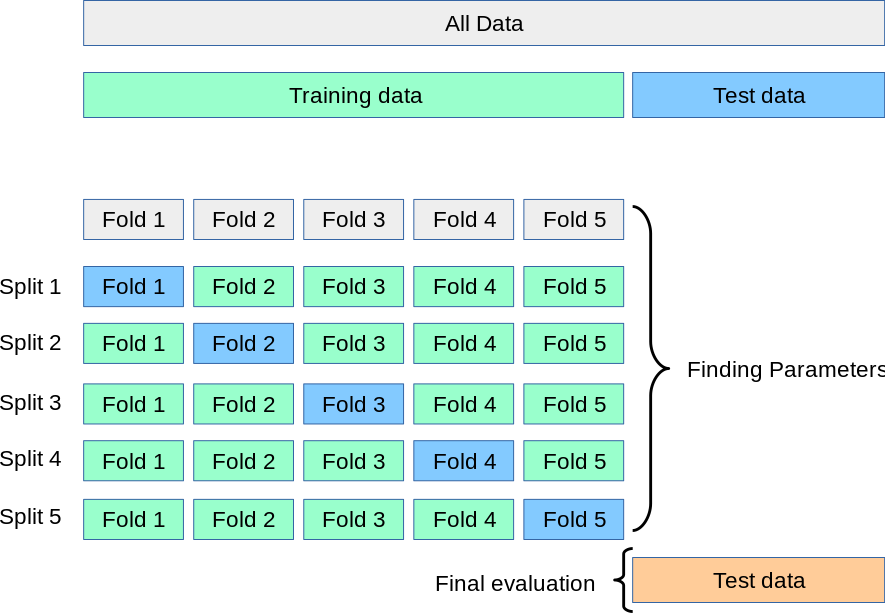

## Table of Contents

## What is cross-validation and why is it used in machine learning?

Cross-validation is a technique used in machine learning to check how well a model will work on new data. Imagine you're trying to guess how well a student will do on a test. Instead of just looking at one practice test, you'd want to look at several practice tests to get a better idea. Cross-validation does something similar by splitting the data into smaller parts, using some parts to train the model, and other parts to test it. This way, the model gets tested on different pieces of data, which helps to see if it's good at making predictions overall.

The reason cross-validation is used is to make sure the model isn't just good at remembering the training data but can also make good guesses on new, unseen data. Sometimes, a model might seem to work well on the data it was trained on, but when it sees new data, it doesn't do as well. This is called overfitting. By using cross-validation, we can catch this problem early. It helps us build models that are more reliable and perform better when they're used in the real world.

## How does cross-validation help in assessing model performance?

Cross-validation helps in assessing model performance by giving us a more accurate picture of how well the model will work on new data. It does this by splitting the available data into several smaller parts, or folds. The model is trained on all but one of these folds and then tested on the remaining fold. This process is repeated several times, with each fold getting a chance to be the test set. By doing this, we get multiple performance scores, which we can average to get a good idea of how well the model performs overall.

This method helps avoid a common problem called overfitting, where a model might do really well on the data it was trained on but poorly on new data. By testing the model on different parts of the data, cross-validation shows us if the model is just memorizing the training data or if it's learning patterns that can be applied to new data. This makes our assessment of the model's performance more reliable, helping us choose the best model for our needs.

## What are the different types of cross-validation techniques?

There are several types of cross-validation techniques, each with its own way of splitting the data. The most common one is called k-fold cross-validation. In k-fold cross-validation, the data is divided into k equal parts, or folds. The model is trained on k-1 of these folds and tested on the remaining fold. This process is repeated k times, with each fold getting a chance to be the test set. The results from all k tests are then averaged to get an overall performance score. This method works well when you have enough data and want a good estimate of how your model will perform.

Another type is called stratified k-fold cross-validation. This is similar to k-fold, but it makes sure that each fold has about the same percentage of samples from each class as the whole dataset. This is useful when you're working with data where some classes are much more common than others, which is known as imbalanced data. By keeping the class balance the same in each fold, you get a more accurate picture of how well your model works across all classes.

There's also leave-one-out cross-validation (LOOCV), which is a special case of k-fold where k equals the number of samples in the dataset. In LOOCV, the model is trained on all the data except one sample, and then tested on that one sample. This process is repeated for each sample in the dataset. LOOCV is very thorough but can be time-consuming, so it's best used when you have a small dataset. Each of these methods helps you check your model's performance in different ways, so you can pick the one that fits your needs best.

## Can you explain k-fold cross-validation and its benefits?

K-fold cross-validation is a way to check how good a [machine learning](/wiki/machine-learning) model is. Imagine you have a deck of cards, and you want to see if your model can guess the right card. Instead of using all the cards at once, you split the deck into, say, 5 equal parts, or folds. You use 4 parts to teach the model and the last part to test it. Then, you do this again, but this time you use a different part for testing. You keep doing this until each part has been used for testing once. At the end, you take all the scores from these tests and find the average. This gives you a good idea of how well your model will work with new cards.

The big benefit of k-fold cross-validation is that it helps make sure your model isn't just good at remembering the cards it's seen before but can also guess new cards well. This is important because sometimes a model can do really well on the cards it was trained on but not as well on new cards. This is called overfitting. By testing the model on different parts of the data, k-fold cross-validation helps you catch this problem. It also uses all the data for both training and testing, so you get a more accurate picture of how the model will perform in the real world.

## What is leave-one-out cross-validation and when is it appropriate to use?

Leave-one-out cross-validation, or LOOCV, is a way to check how good a model is. Imagine you have a bunch of balls, and you want to see if your model can guess the right ball. With LOOCV, you take out one ball at a time, teach the model with all the other balls, and then see if it can guess the one you took out. You do this for every ball in the bunch. At the end, you take all the guesses and see how well the model did overall. It's like giving the model a lot of little tests, one for each ball.

LOOCV is really good when you don't have a lot of balls, or data, to work with. Since you're using almost all the data to teach the model each time, you get a very accurate picture of how well it will guess new balls. But, it can take a long time because you have to do it for every single ball. So, it's best to use LOOCV when you have a small amount of data and you want to be really sure about how good your model is.

## How does stratified k-fold cross-validation differ from regular k-fold?

Stratified k-fold cross-validation is a bit different from regular k-fold because it makes sure each group, or fold, has the same mix of different types of data as the whole set. Imagine you have a bag of candies with different flavors. With regular k-fold, you might split the candies into groups without caring about the flavors. But with stratified k-fold, you make sure each group has the same percentage of each flavor as the whole bag. This is helpful when you have more of some flavors than others, and you want your model to learn about all flavors equally.

The main reason to use stratified k-fold instead of regular k-fold is when you have what's called imbalanced data. That means some types of data are much more common than others. For example, if you're trying to guess if an email is spam or not, and most emails are not spam, you want to make sure your model learns about both spam and not spam emails. By keeping the balance the same in each fold, stratified k-fold helps your model learn better and gives you a more accurate idea of how it will work with new data.

## What are the common pitfalls and challenges in implementing cross-validation?

One common challenge with cross-validation is that it can take a lot of time, especially if you have a lot of data or if your model takes a long time to train. Imagine you're trying to solve a puzzle, and each time you want to check if you're doing it right, you have to start over with most of the pieces. That can be slow and tiring. With cross-validation, you're doing this over and over again, so it can really add up. This is why people sometimes use simpler methods when they're in a hurry, even though cross-validation gives a better picture of how well the model will work.

Another pitfall is that cross-validation might not work well if your data is not mixed up properly. Think of it like trying to make a cake with all the ingredients in separate layers instead of mixed together. If your data is sorted in a certain way, like all the data from January first and then all from February, your model might learn the wrong things. It's important to shuffle your data before you split it into folds, so each fold is a good mix of all your data. If you don't, your model might seem to work well but then fail when it sees new data that's not in the same order.

Lastly, cross-validation can be tricky when you have very little data. If you only have a few pieces of a puzzle, splitting them into even smaller groups can make it hard to see the big picture. In these cases, methods like leave-one-out cross-validation can be used, but they still might not give you a clear idea of how well your model will work. It's a bit like trying to guess the whole story from just a few pages of a book. You might get some parts right, but you could miss important details.

## How can cross-validation be used to tune hyperparameters?

Cross-validation can help you find the best settings for your model, which are called hyperparameters. Think of hyperparameters like the knobs on a radio. You want to turn them to get the best sound, or in this case, the best performance from your model. To do this, you try different settings for the hyperparameters and use cross-validation to see how well the model works with each setting. You split your data into different parts, train the model on some parts, and test it on the others. You do this over and over with different settings until you find the ones that make your model work the best.

Once you have tried all the different settings, you look at the scores from the cross-validation tests. The setting that gives you the best average score is the one you should use. This way, you can be sure that your model will work well not just on the data you trained it on, but also on new data. It's like testing a recipe by making it several times with different amounts of ingredients until you find the mix that tastes the best. By using cross-validation to tune hyperparameters, you make your model more reliable and better at making predictions.

## What is nested cross-validation and how does it prevent overfitting?

Nested cross-validation is like doing cross-validation twice to make sure your model is really good. Imagine you're trying to pick the best toy from a bunch of toys. First, you use cross-validation to see which toy works best with different settings. Then, you use another layer of cross-validation to check if that toy really is the best when you use it on new data. This double-checking helps you be sure that you've picked the best toy and that it will work well even with toys you haven't seen before.

Nested cross-validation helps prevent overfitting by making sure your model isn't just good at remembering the data it was trained on. Overfitting is like memorizing a test instead of learning the subject. With nested cross-validation, the inner loop finds the best settings for your model, and the outer loop tests those settings on new data. This way, you can see if your model is really learning or just memorizing. By using this method, you get a more honest picture of how well your model will work in the real world, which helps you avoid [picking](/wiki/asset-class-picking) a model that only looks good on paper.

## How do you interpret the results from cross-validation?

When you do cross-validation, you get a bunch of scores that tell you how well your model is doing. Each score comes from testing the model on a different part of your data. To understand these results, you usually take the average of all the scores. This average gives you a good idea of how well your model will work with new data. If the average score is high, it means your model is doing a good job. If it's low, your model might need some work.

Sometimes, looking at just the average isn't enough. You might also want to see how much the scores change from one test to another. If the scores are very different each time, it could mean your model is not very stable. It might work well on some parts of the data but not on others. On the other hand, if the scores are pretty much the same each time, it's a sign that your model is reliable and will likely do well on new data too. By looking at both the average and how much the scores vary, you can get a full picture of how good your model really is.

## Can cross-validation be applied to time series data, and if so, how?

Yes, cross-validation can be used with time series data, but you need to be careful about how you split the data. With regular data, you can mix it all up and split it into random parts. But with time series data, like daily sales or weather reports, the order of the data matters. You can't just mix it up because what happens today can affect what happens tomorrow. So, instead of using random splits, you use something called time-based splits. This means you split the data into parts based on time, like using the first few months to train the model and the next month to test it.

When you do cross-validation with time series data, you usually move the split forward in time. For example, you might first train on January and February and test on March. Then, you train on January, February, and March and test on April. You keep doing this, moving the split forward each time, until you've used all your data. This way, you make sure your model learns from the past and can predict the future. It helps you see if your model can really understand time patterns and make good guesses about what will happen next.

## What advanced techniques exist for cross-validation in imbalanced datasets?

When you have imbalanced datasets, where some types of data are much more common than others, you need special ways to do cross-validation. One way is called stratified k-fold cross-validation. It's like making sure each group of data has the same mix of the different types as the whole set. Imagine you have a bag of candies with different flavors, and some flavors are much rarer than others. With stratified k-fold, you make sure each group of candies you test has the same percentage of each flavor as the whole bag. This helps your model learn about all the flavors, even the rare ones, so it can make better guesses.

Another technique is called SMOTE (Synthetic Minority Over-sampling Technique) combined with cross-validation. SMOTE makes more copies of the rare types of data, so your model has more to learn from. It's like adding more of the rare candies to your bag, so your model can see them more often. You then use cross-validation to check how well your model does with this new, balanced data. By doing this, you make sure your model is good at guessing all types of data, not just the common ones. This can help your model work better in the real world, where all types of data matter.

## What is Combinatorial Purged Cross-Validation?

Combinatorial Purged Cross-Validation (CPCV) is an advanced method designed to overcome some limitations inherent in traditional cross-validation, especially in the context of time-series data typical in financial markets. Traditional cross-validation often evaluates a single chronological path through the data, leading to potentially biased estimates of a model’s performance due to the structural changes inherent in financial markets. CPCV enhances the accuracy and reliability of these evaluations by employing combinatorial methods to generate multiple backtest paths.

The traditional cross-validation approach may neglect certain periods or sequences of events that could be critical in evaluating the robustness of a trading strategy. In contrast, CPCV involves creating numerous overlapping data splits that reflect diverse paths through the training data. This allows for a more comprehensive analysis of how a trading strategy might perform under varying market conditions.

### Key Concepts

CPCV incorporates the concepts of purging and embargoing to avoid data leakage, ensuring that the model is evaluated on truly unseen data. However, CPCV extends this by producing many combinations of training and test datasets through a systematic exploration of data splits. This combinatorial aspect is key to its effectiveness. For instance, given $N$ observations, one can generate several subsets by choosing different combinations of training and test datasets while maintaining the non-overlapping requirement of test periods induced by purging and embargoing.

### Mathematical Illustration

Consider a dataset with a sequence of observations $X = \{x_1, x_2, ..., x_N\}$. In a typical $K$-fold purged CV, the dataset is split into $K$ folds, with each fold being held out in turn as the test set:

$$
\text{Test fold: } F_i = \{x_j | j \in \mathcal{I}_i\}
$$
$$
\text{Training data: } T_i = X \setminus (F_i \cup \text{Purged data})
$$

In CPCV, instead of the sequential $K$-folds, various combinations are made such that:

$$
\text{Test combination: } C_{test} = \cup_{i=1}^{K} F_i\]
$$
\text{Training combination: } C_{train} = X \setminus C_{test}
$$

By exploring different combinations systematically, CPCV assesses model performance more thoroughly across potential test conditions.

### Enhancing Robustness and Risk Evaluation

CPCV aids in the investigation of a trading model over diverse market scenarios that may encompass bull, bear, and sideways markets. By doing so, it helps in evaluating the risk profile of a model comprehensively, offering insights into how sensitive a strategy is to different market conditions. This robustness check is crucial for understanding not just the average performance but the full distribution of outcomes a trading strategy might yield in live trading.

Through CPCV, portfolio managers and algorithmic traders can gather nuanced insights into the viability and risk of trading strategies, potentially avoiding costly overfitting that occurs due to static or overly optimistic [backtesting](/wiki/backtesting) procedures. By diversifying the evaluation paths, CPCV provides a richer, more realistic picture of expected performance, assisting in making informed decisions regarding the deployment of trading strategies in real-world markets.

## References & Further Reading

[1]: Bergstra, J., Bardenet, R., Bengio, Y., & Kégl, B. (2011). ["Algorithms for Hyper-Parameter Optimization."](https://papers.nips.cc/paper/4443-algorithms-for-hyper-parameter-optimization) Advances in Neural Information Processing Systems 24.

[2]: ["Advances in Financial Machine Learning"](https://www.amazon.com/Advances-Financial-Machine-Learning-Marcos/dp/1119482089) by Marcos Lopez de Prado

[3]: ["Evidence-Based Technical Analysis: Applying the Scientific Method and Statistical Inference to Trading Signals"](https://www.amazon.com/Evidence-Based-Technical-Analysis-Scientific-Statistical/dp/0470008741) by David Aronson

[4]: ["Machine Learning for Algorithmic Trading"](https://github.com/stefan-jansen/machine-learning-for-trading) by Stefan Jansen

[5]: ["Quantitative Trading: How to Build Your Own Algorithmic Trading Business"](https://books.google.com/books/about/Quantitative_Trading.html?id=j70yEAAAQBAJ) by Ernest P. Chan