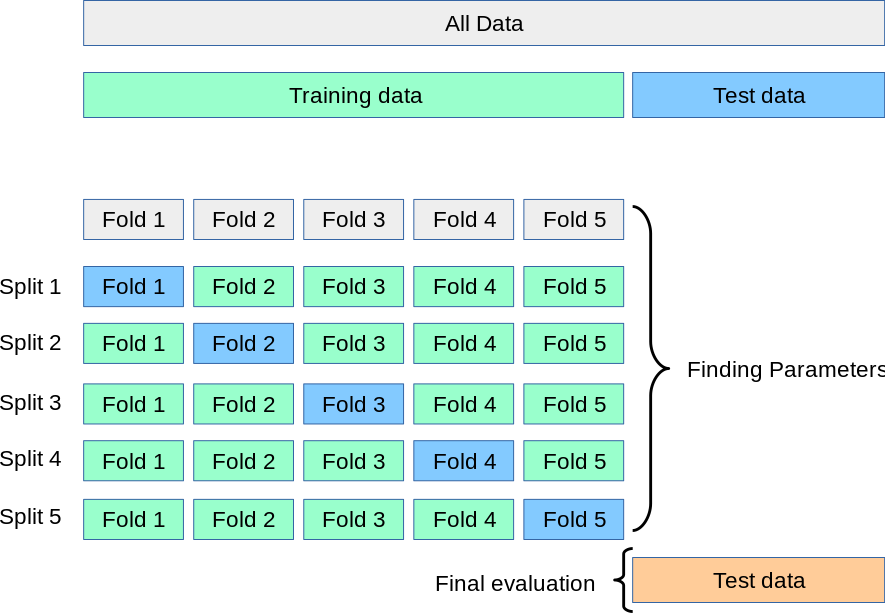

Algorithmic trading relies heavily on accurate model validation to manage the temporal nature and complexities of financial data. It necessitates an understanding of advanced statistical methods to ensure models are both robust and reliable when applied to market data. Traditional cross-validation techniques, common in other fields like general machine learning, often prove inadequate in the context of financial markets, primarily due to the risk of data leakage and the tendency to overfit models to historical data. 

Naïve application of methods such as k-fold cross-validation can overlook the chronological dependency inherent in financial time series, thus making predictions appear more optimistic than warranted. As such, there is a pressing need for specialized cross-validation approaches. These tailored methods address financial data's unique structure, encompassing methodological innovations such as Combinatorial Purged Cross-Validation (CPCV).



Adopting these advanced methodologies is crucial for quantitative analysts and traders seeking to validate trading strategies effectively. Cross-validation techniques tailored to financial data help in generating more credible evaluations of models, thus enhancing performance and trustworthiness. By understanding these specific cross-validation methods, practitioners can significantly improve the robustness of their trading algorithms.

This article delves into why traditional cross-validation methods might not suffice and underscores the importance of adopting advanced techniques like CPCV. It aims to provide insights into how quantitative analysts can enhance their algorithmic models' credibility by using appropriate validation strategies, ultimately leading to better-performing trading strategies in real-world applications.

## Table of Contents

## Understanding Cross-Validation in Algorithmic Trading

Cross-validation is a critical statistical method for estimating the performance and robustness of machine learning models. By training multiple models on various subsets of available data, it helps ensure that models can perform well on unseen data, which is particularly crucial in algorithmic trading. This technique is designed to mitigate overfitting, where a model may learn excessively from the training data, thereby failing to generalize to new data points. 

In general machine learning tasks, cross-validation involves standard approaches such as k-fold cross-validation. This method splits the dataset into k equally sized folds or subsets. The model is trained k times, each time using a different fold as the test set while the remaining folds form the training set. This process allows for a comprehensive assessment of the model's reliability, as every data point gets used for both training and testing, minimizing bias and variance.

However, [algorithmic trading](/wiki/algorithmic-trading) presents unique challenges for cross-validation techniques due to the sequential nature of financial time series data. Financial datasets are inherently temporal, with data points depending on previous observations. This sequential dependency means that the assumptions made by standard cross-validation methods, which often regard data points as independent and identically distributed, do not hold true.

For example, employing a straightforward k-fold cross-validation method on financial data could result in information leakage, where future data inadvertently influences the training process. Traditional methods need modification to maintain the chronological order and dependencies intrinsic to financial time series.

One common approach to adapt cross-validation for time series data is the use of rolling or expanding windows. This technique involves training the model on a rolling window of data and testing it on the subsequent timeframe, thereby preserving the temporal order and dependencies. Alternatively, the time series split is another method available in Python's scikit-learn library. This technique ensures that all training sets are earlier in time than the test sets, thereby respecting the chronological order of observations.

These adaptations are essential for financial model validation as they appropriately address the temporal dependencies in sequential data, making the predictive models more realistic and reliable. Ensuring that any validation approach used in algorithmic trading accounts for these unique challenges is vital for creating models that not only perform well on historical datasets but are also resilient in live trading scenarios.

## Challenges of Traditional Cross-Validation in Financial Data

Financial datasets often challenge the foundational assumptions of traditional cross-validation methods primarily due to temporal dependencies and non-stationarity. These characteristics can significantly compromise the reliability and accuracy of model validation in financial contexts. 

One major issue is data leakage. In time series analysis, particularly with financial data, the use of conventional cross-validation methods such as k-fold can inadvertently expose future information to the model. Since these methods often mix data across different time periods, they create scenarios where the model gets access to information it would not have in a real trading environment, leading to overly optimistic performance metrics. Data leakage can occur when the dataset is not correctly time-ordered, causing past models to inadvertently incorporate data from future events, which distorts the model’s true predictive performance.

Overfitting represents another significant challenge. Traditional cross-validation may lead models to memorize past data patterns rather than learning to generalize from them. This risk is elevated under financial contexts where models can be misled to detect patterns that are merely historical coincidences and do not necessarily predict future trends. The static division of data into training and testing sets in standard cross-validation does not always account for the evolving nature of financial markets, increasing the likelihood of overfitting.

Moreover, financial data often exhibits non-stationarity, wherein statistical properties such as mean and variance change over time. This non-stationarity violates the assumption of consistent distribution within the data, which traditional cross-validation methods rely on. As a result, these methods potentially misrepresent the model’s predictive power across different market conditions, failing to capture shifts in underlying financial processes.

To address these challenges, model validation in the context of financial datasets requires specialized techniques that consider temporal dynamics and adapt to non-stationary environments. Adjusted cross-validation approaches need to better simulate real-time trading scenarios to provide more reliable and robust evaluations of financial models.

## Combinatorial Purged Cross-Validation (CPCV)

Combinatorial Purged Cross-Validation (CPCV) is a sophisticated method designed to enhance the evaluation of trading models by overcoming the challenges faced by traditional cross-validation methods in time-series data. 

Traditional cross-validation methods often encounter issues with information leakage when applied to financial time series data. CPCV addresses this by purging overlapping data between training and testing splits, thus significantly reducing the chances of information leakage. A key technique within CPCV is the implementation of an "embargo" period, a strategic buffer that ensures no leakage of future information that could bias the model’s performance evaluation. 

CPCV is specifically tailored to maintain the chronological order of data, thereby respecting the temporal dependencies inherent in financial datasets. This is crucial as financial data is typically time-dependent, exhibiting trends and patterns that rely on the sequential nature of observations. By maintaining these sequences, CPCV allows for the construction of validation datasets that better resemble real-world conditions, which is essential for assessing the true predictive power of a model.

The combinatorial aspect of CPCV refers to its systematic approach in generating all possible train-test splits, subject to purging and embargo constraints. This exhaustive approach ensures that the model is tested under a variety of scenarios, improving the robustness of the validation process. This framework provides a more realistic simulation of trading environments, offering a reliable measure of a model’s performance and aiding in the design of more robust trading strategies.

The implementation of CPCV requires careful handling of the data to ensure the correct application of purging and embargo. Here is a simple illustration in Python that demonstrates how these processes can be configured:

```python
import numpy as np
from sklearn.model_selection import KFold

def cpcv(data, k, embargo_ratio):
    n = len(data)
    kf = KFold(n_splits=k)

    embargo_size = int(n * embargo_ratio)

    train_indices_list = []
    test_indices_list = []

    for train_indices, test_indices in kf.split(data):
        test_end = test_indices[-1]
        purge_start = test_end + 1
        if purge_start + embargo_size < n:
            train_indices = train_indices[train_indices < purge_start]
        train_indices_list.append(train_indices)
        test_indices_list.append(test_indices)

    return train_indices_list, test_indices_list

# Example data
data = np.arange(100)
train_indices_list, test_indices_list = cpcv(data, k=5, embargo_ratio=0.02)

```

The code above demonstrates how to divide data into multiple train-test splits while applying an embargo. As each fold is evaluated, an embargo ensures that future data does not bias the testing, a critical requirement for evaluating strategies in a time-series context.

In summary, CPCV enhances the credibility of model evaluation in algorithmic trading by simulating realistic trading environments, minimizing data leakage, and respecting the chronological nature of financial data. This makes CPCV a valuable tool for trading strategy development, offering a reliable framework for performance assessment.

## Implementing CPCV in Algorithmic Trading

Implementing Combinatorial Purged Cross-Validation (CPCV) in algorithmic trading involves a detailed approach to constructing train and test splits that respect the temporal sequence of financial data. The primary goal is to mitigate data leakage and preserve the chronological integrity of time-series data. Key to this implementation is managing the purging of overlapping data and setting an embargo period to ensure no leakage of information between the training and testing datasets.

### Tools and Libraries

Python, as a versatile programming language for data analysis, offers several tools for implementing CPCV. Specifically, libraries such as scikit-learn can be adapted to accommodate the unique requirements of CPCV. While scikit-learn provides a versatile `KFold` class, it must often be modified to create the purged and embargoed data splits necessary for CPCV. Custom implementations are frequently needed to handle the specifics of CPCV, especially concerning time-series data in finance.

### Implementation Process

1. **Defining Parameters:** The implementation begins by setting parameters such as the number of splits (n_splits), purge amount, and embargo period. These parameters determine how data is divided and which portions are excluded due to potential data leakage.

2. **Creating Splits:** Data is divided into sequential chunks, respecting the chronological order. Purging involves discarding a specified amount of data following each training set, effectively removing overlapping data from the testing set that could lead to leakage.

3. **Applying Embargo:** An embargo period ensures that data right before the test set is not used in training, further preventing leakage. The exact number of embargoed points depends on the specifics of the trading strategy and the expected temporal influence of past data on future predictions.

### Code Example

Below is a simplified Python pseudocode demonstrating the CPCV logic:

```python
import numpy as np

def combinatorial_purged_cross_validation(data, n_splits, purge, embargo):
    n_samples = len(data)
    split_size = n_samples // n_splits
    indices = np.arange(n_samples)

    for i in range(n_splits):
        test_start = i * split_size
        test_end = test_start + split_size

        # Purge and embargo calculation
        train_indices = np.concatenate([
            indices[max(0, test_start - embargo):test_start - purge],
            indices[test_end + embargo:n_samples]
        ])

        test_indices = indices[test_start:test_end]

        yield train_indices, test_indices

# Example usage
data = np.random.rand(100)  # Dummy data
splits = combinatorial_purged_cross_validation(data, n_splits=5, purge=2, embargo=2)
for train_idx, test_idx in splits:
    print(f"Train indices: {train_idx}, Test indices: {test_idx}")
```

### Computational Considerations

Implementing CPCV is computationally intensive as compared to traditional cross-validation methods. The need for multiple passes through the dataset, with careful management of purging and embargo, requires significant computational resources. Effective implementation necessitates expertise in handling time-series data and understanding financial domain intricacies.

Despite these challenges, CPCV ensures robust model validation. It is essential for the credibility and success of trading strategies as it provides a more realistic evaluation of how algorithms will perform on unseen data, closely simulating real-world trading conditions.

## Benefits and Challenges of CPCV

Combinatorial Purged Cross-Validation (CPCV) offers numerous advantages by simulating realistic trading environments, significantly enhancing the predictability of models used in algorithmic trading. This method reduces the risk of overfitting by appropriately accounting for the time dependencies inherent in financial data. By effectively purging overlapping data and employing an embargo period, CPCV ensures that models are validated under conditions that closely resemble real-world scenarios, leading to more reliable predictive analytics.

The comprehensive evaluation provided by CPCV aids in informed decision-making. It systematically assesses trading strategies across various conditions, thereby offering insights that are crucial for understanding potential performance under different market environments. By reflecting a broader spectrum of market dynamics, CPCV supports traders in crafting strategies that are robust and adaptable to changes.

However, the complexity and resource-intensive nature of CPCV must be acknowledged. The method demands a substantial computational overhead and significant expertise in setting appropriate embargo periods and managing data purges. Implementing CPCV requires careful handling of datasets to maintain chronologically oriented train/test splits, which can be challenging in practice. This complexity often necessitates proficiency in programming and an intimate understanding of time-series data characteristics.

Despite these challenges, the benefits of CPCV are compelling. The method provides an enhanced framework for validating trading models, offering a level of rigor necessary for developing effective and sustainable algorithms. For practitioners dedicated to improving model reliability and attaining robust trading strategies, CPCV stands as a valuable tool. Its ability to mitigate overfitting and data leakage bolsters the credibility and potential success of algorithmic models, making it an essential component of the quantitative analyst's toolkit.

## Concluding Remarks

Combinatorial Purged Cross-Validation (CPCV) is a significant development in the validation of models for algorithmic trading. Its primary advantage lies in its ability to mitigate common pitfalls such as overfitting and data leakage, which are prevalent in the analysis of financial time series. Overfitting can lead to models that appear accurate during [backtesting](/wiki/backtesting) but perform poorly in live trading environments due to their reliance on noise rather than genuine market patterns. By purging overlapping data and maintaining the chronological integrity of datasets, CPCV effectively circumvents these problems, thus enabling the development of more robust and realistic trading strategies.

As the landscape of financial markets continues to transform with the influx of rapid technological advancements and increased data availability, the application of sophisticated validation methods like CPCV is increasingly critical. These methods facilitate an unbiased assessment of an algorithm's predictive capabilities, ensuring that models are tested under conditions that closely mimic actual market scenarios. This realism is crucial for maintaining a competitive edge, as it supports the creation of strategies that are more likely to withstand the uncertainties and [volatility](/wiki/volatility-trading-strategies) inherent in financial markets.

Practitioners in the field of quantitative finance and algorithmic trading are encouraged to implement CPCV in their model validation processes. The adoption of CPCV not only enhances the credibility and reliability of algorithmic models but also contributes significantly to their performance. By aligning validation techniques with the intricate nature of financial datasets, CPCV empowers traders and analysts to optimize their strategy development, driving more informed decision-making and sustainable performance in trading activities.

## References & Further Reading

1. **'Advances in Financial Machine Learning' by Marcos Lopez de Prado**  
   This book is a comprehensive resource for understanding modern techniques in financial data analysis and algorithmic trading. Lopez de Prado emphasizes the importance of robust model validation techniques, such as Combinatorial Purged Cross-Validation (CPCV), for preventing data leakage and avoiding overfitting. His work is essential for quantitative analysts seeking advanced methodologies in time-series data handling, offering insights into how [machine learning](/wiki/machine-learning) models can be implemented for more reliable trading strategies.

2. **'Evidence-Based Technical Analysis' by David Aronson**  
   Aronson's book challenges traditional technical analysis by advocating for a scientific, evidence-based approach to trading. He stresses the necessity of rigorous backtesting and validation techniques to ensure that trading models are based on statistically sound principles rather than artifacts of data-mining. The book provides foundational insights that can be augmented with advanced techniques like CPCV for a more robust evaluation of trading models.

3. **'Machine Learning for Algorithmic Trading' by Stefan Jansen**  
   Jansen provides a practical guide to implementing machine learning techniques in trading. Covering a wide range of topics from data preprocessing to model deployment, the book is a hands-on resource that includes Python code snippets and detailed examples. This aligns well with implementing CPCV in trading systems, offering a practical framework and toolset for traders looking to enhance their algorithmic strategies with machine learning.

4. **'Quantitative Trading' by Ernest P. Chan**  
   Chan's work focuses on bridging the gap between theory and practice in algorithmic trading. By outlining a step-by-step approach to building automated trading systems, Chan covers crucial aspects such as risk management and backtesting strategies. The book is a valuable resource for traders seeking to apply quantitative methods to financial markets, highlighting the importance of robust validation techniques, such as CPCV, to ensure that trading algorithms perform reliably in real-world scenarios.