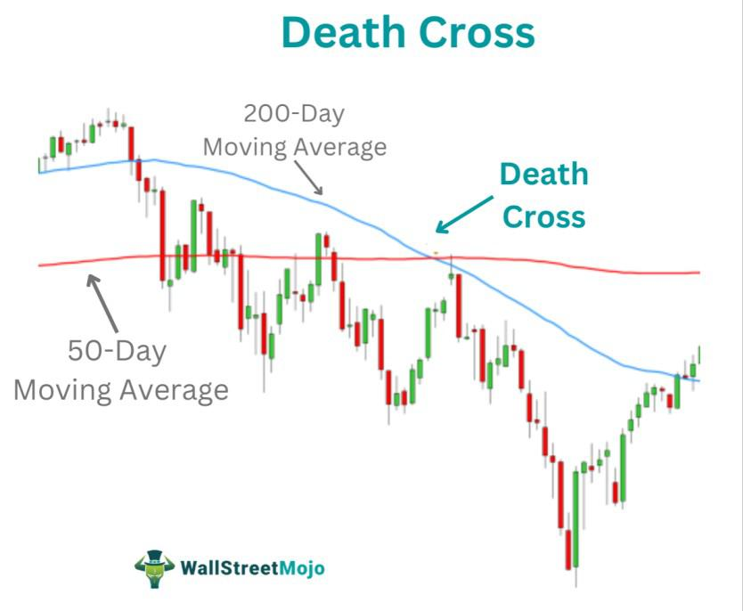

In the intricate world of financial markets, understanding the dynamics of crossed markets, market discrepancies, and trading mechanisms is paramount for successful trading. Crossed markets occur when the bid price of a security exceeds its ask price, which can create unique trading situations that require strategic navigation. Although rare, these scenarios often arise during periods of high volatility or in markets with low liquidity, underscoring the need for insight into these market phenomena.

Market discrepancies represent another vital aspect, often presenting lucrative opportunities for traders. These discrepancies can emerge from inefficiencies in pricing mechanisms or abrupt shifts in market conditions, providing fertile ground for those equipped with the knowledge to identify and exploit them effectively. Such opportunities are not merely a result of random fluctuations but are intricately connected to the fundamental nature of the markets themselves.



Algorithmic trading, a sophisticated advancement in the trading sector, leverages these market scenarios by employing automated systems and strategies. These systems are designed to identify and act on arbitrage opportunities and other financial market disparities with precision and speed that lie beyond human capability. By automating the trade execution process, algorithmic trading reduces human error and improves the efficiency of trading operations, thus enhancing the overall efficacy of market interactions.

This article provides a comprehensive overview of these components within algo trading, showcasing their interactions and highlighting the benefits they offer to traders and investors. For those looking to enhance their trading strategies with leading-edge techniques, understanding the nuances and utilities of crossed markets, market discrepancies, and trading mechanisms is crucial. Through this exploration, traders and investors can uncover strategies to not only capitalize on existing opportunities but also anticipate future trends and challenges in global markets.

## Table of Contents

## Understanding Crossed Markets

A crossed market occurs when the bid price of a security exceeds the ask price. This inversion leads to unconventional trading situations, as typically, the ask price is higher than the bid price to account for brokers' and dealers’ profit margins. Crossed markets are indicative of specific market conditions and can arise for various reasons, including volatile trading periods or in illiquid markets where securities are not traded frequently enough to maintain balanced pricing.

During high volatility, prices can fluctuate rapidly, causing temporary disconnects in the usual bid-ask relationship. For instance, in the milliseconds it takes to update prices, an eager buyer may place a bid that surpasses the current ask price due to expectations of further price increases. Similarly, in an illiquid market where trading volumes are low, price discrepancies may happen more frequently because the scarcity of transactions can lead to a lack of updated information, thus sometimes resulting in bid prices that unexpectedly surpass ask prices.

While crossed markets are rare and typically short-lived, their presence can offer both risks and opportunities. For traders, recognizing these situations promptly can be advantageous; they may indicate opportunities for [arbitrage](/wiki/arbitrage) where profits can be made by exploiting the temporary mispricing. However, understanding crossed markets is also vital for managing risks, as trading at prices that do not reflect current market values can result in financial losses. Furthermore, persistent crossed markets might suggest inefficiencies in price reporting or potential issues with market infrastructure that could require investigation and correction.

Overall, proficiency in identifying and interpreting crossed markets can enhance a trader's ability to handle unpredictable market conditions effectively, leveraging these scenarios for potential gain while ensuring robust risk management practices to mitigate potential downsides.

## Market Discrepancies and Trading Opportunities

Market discrepancies often present traders with profitable opportunities, particularly when these discrepancies result in price differentials across various platforms or asset classes. Such scenarios typically arise from inefficiencies in market pricing mechanisms or during rapid shifts in market conditions. Understanding these intricacies is essential for identifying actionable trading opportunities.

Price discrepancies can emerge due to several factors. One primary reason is the inefficiencies inherent in market pricing mechanisms. These inefficiencies might occur because of delays in information dissemination, differing valuation models, or temporary imbalances in supply and demand. For instance, during high [volatility](/wiki/volatility-trading-strategies), prices on different exchanges or between related assets may not reflect the underlying value immediately. This provides an opportunity for traders to buy undervalued assets or sell overvalued ones, thereby profiting from the eventual correction.

Additionally, rapid changes in market conditions, such as economic announcements or geopolitical events, can exacerbate market discrepancies. These changes can lead to significant price movements before markets have had a chance to adjust fully. In such circumstances, traders with sophisticated models and access to real-time data may capitalize on transient price disparities.

To effectively exploit market discrepancies, traders must maintain a deep understanding of the underlying market environments. This involves analyzing historical data to identify patterns, using statistical models to predict market movements, and staying informed about current events that could impact market dynamics. Tools and techniques like regression analysis or [machine learning](/wiki/machine-learning) algorithms can be applied to sift through vast amounts of market data to detect anomalies that indicate potential profit opportunities.

In Python, one might use libraries such as NumPy and pandas for data manipulation, along with scikit-learn for applying machine learning models to historical price data. Here's a simple example demonstrating how one might identify potential discrepancies using a basic moving average crossover strategy:

```python
import pandas as pd

# Load historical price data
prices = pd.read_csv('price_data.csv')

# Calculate short-term and long-term moving averages
short_term_ma = prices['Close'].rolling(window=10).mean()
long_term_ma = prices['Close'].rolling(window=50).mean()

# Identify potential discrepancies
discrepancies = short_term_ma - long_term_ma

# Generate trading signals when there's a crossover
signals = (short_term_ma > long_term_ma) & (short_term_ma.shift() <= long_term_ma.shift())

print("Trading Opportunities based on Discrepancies:")
print(prices[signals])
```

This code snippet calculates moving averages over two different time periods and identifies crossover points as potential trading signals. While this is a simplistic strategy, it exemplifies the need for quantitative methods to exploit market discrepancies effectively.

As markets become more integrated and efficient, the window to exploit such arbitrage opportunities may narrow. Thus, leveraging cutting-edge technology and maintaining a robust analytical framework becomes crucial for success in rapidly changing market landscapes.

## Trading Mechanisms in Algo Trading

Algorithmic trading, commonly referred to as algo trading, harnesses the power of sophisticated computational systems to exploit disparities in financial markets. At its core, algo trading involves the utilization of predefined rules and mathematical models to execute trades at speeds and frequencies that far exceed human capabilities. By leveraging these automated strategies, traders can effectively capture arbitrage opportunities, particularly in fragmented markets where price discrepancies might exist across different platforms or regions.

One of the key advantages of [algorithmic trading](/wiki/algorithmic-trading) is its ability to minimize human error. In traditional trading, human decisions are prone to emotional biases and fatigue, which can lead to mistakes. However, algorithms operate based solely on logic and data, devoid of emotions, ensuring consistent execution of predefined strategies. Additionally, the efficiency gained through algorithmic trading is substantial. Automated systems can process vast amounts of market data in real-time, identify potential trading opportunities, and execute multiple orders simultaneously. This level of efficiency is particularly valuable in high-frequency trading environments, where the speed of execution can be the difference between profit and loss.

These algorithms often incorporate elements of [artificial intelligence](/wiki/ai-artificial-intelligence) and machine learning to adapt to changing market conditions. By analyzing historical data and learning from past trades, these systems can continuously refine their strategies. This adaptability is crucial, especially in fast-paced markets where conditions can shift rapidly. The ability to identify and act on arbitrage opportunities swiftly ensures that traders remain competitive.

Moreover, algo trading is not merely about speed and accuracy; it also optimizes the overall trading process. Automated systems can be programmed to monitor various market indicators and execute trades based on complex strategies that would be cumbersome and near impossible for a human to perform manually. This can include strategies such as [statistical arbitrage](/wiki/statistical-arbitrage), mean reversion, and [momentum](/wiki/momentum) trading, among others.

In conclusion, algorithmic trading mechanisms provide a robust framework for exploiting financial market disparities. By reducing human error and enhancing trade execution efficiency, they enable traders to navigate complex market environments more effectively. As technology continues to advance, the capabilities and strategies within algo trading are likely to expand, offering even greater opportunities for traders.

## Cross-Market Arbitrage: Definition and Examples

Cross-market arbitrage involves the simultaneous purchase and sale of the same asset on different markets to capitalize on price discrepancies, thereby generating profit without exposure to significant market risk. This form of arbitrage typically extends beyond mere price differences within a single market and often encompasses multiple geographical regions and trading conditions. The fundamental principle relies on the law of one price, which states that in efficient markets, identical goods should sell for the same price when exchange rates are accounted for.

Unlike conventional arbitrage, which might deal with smaller inter-market prices within a single geographical region, cross-market arbitrage exploits a more extensive range of market conditions. These conditions may include differences in currency exchange rates, local regulations, time zones, or market [liquidity](/wiki/liquidity-risk-premium). For instance, if a stock is trading for $100 on the New York Stock Exchange (NYSE) and simultaneously trading for $102 on the London Stock Exchange (LSE), an arbitrageur could buy the stock on the NYSE and sell it on the LSE, assuming no transaction costs, and earn a profit of $2 per share.

Examples of cross-market arbitrage are evident in both currency and equity markets:

1. **Currency Arbitrage**: This involves trading currencies across different foreign exchange markets to profit from discrepancies in exchange rates. An arbitrageur might exploit triangular arbitrage opportunities, which arise when three currencies can be exchanged in a loop to produce a profit. For example, given currency pairs EUR/USD, USD/JPY, and EUR/JPY, if the exchange rates offer a profitable cycle, a trader could execute trades in sequence to lock in risk-free returns.

2. **Equity Arbitrage**: When the same company is listed on multiple stock exchanges, price discrepancies may occur. Arbitrageurs seek to profit by buying the stock on the exchange where it is undervalued and selling it where it is overvalued. This practice is common in American Depository Receipts (ADRs), where shares of a foreign corporation trade on a U.S. exchange and differ in pricing compared to their home country listing.

Cross-market arbitrage is highly dependent on advanced technology and the rapid execution of trades. The spread in prices might only exist for a brief moment, necessitating high-frequency trading ([HFT](/wiki/high-frequency-trading-strategies)) systems and sophisticated algorithms to detect and exploit these opportunities quickly. These technologies allow traders to operate at a scale and speed impossible to achieve manually, thus maintaining profitability even when margins per trade are narrow.

Python, for example, can be employed in developing such algorithms. A basic structure might involve using libraries like `pandas` for data manipulation and `numpy` for numerical operations. Here’s a simplified conceptual example illustrating how cross-market arbitrage might be programmed:

```python
import pandas as pd
import numpy as np

# Sample price data from two markets
market_data = {
    'NYSE': [100, 101, 102, 98],
    'LSE': [102, 100, 103, 97]
}

# Convert to DataFrame
df = pd.DataFrame(market_data)

# Calculate potential arbitrage profits
df['Arbitrage_Profit'] = df['LSE'] - df['NYSE']

# Identify arbitrage opportunities
arbitrage_opportunities = df[df['Arbitrage_Profit'] > 0]

print(arbitrage_opportunities)
```

This example identifies when the LSE price exceeds the NYSE price, signalling a potential arbitrage opportunity. However, this simple model does not consider transaction costs, market impact, or the time taken to execute trades, which are critical factors in practical scenarios.

In conclusion, cross-market arbitrage remains an integral strategy for traders looking to leverage global financial markets. Its successful implementation requires meticulous planning, a deep understanding of multiple financial environments, and cutting-edge technological resources.

## The Role of Technology in Arbitrage Trading

Advanced technology has become integral to successful arbitrage trading, particularly through the deployment of high-frequency trading (HFT) systems. These systems are designed to capitalize on the minute discrepancies and fleeting opportunities that manifest across varying markets. The primary advantage of high-frequency trading is its ability to execute a large number of orders at exceptionally rapid speeds, thereby minimizing the time gap in which arbitrage opportunities exist. 

High-frequency trading systems are sophisticated, employing real-time big data analysis and machine learning algorithms to identify trading anomalies. For instance, machine learning models can be trained to predict price movements based on historical data and real-time inputs, allowing for timely decisions on asset allocation. These technology-driven insights help traders identify arbitrage opportunities before they are corrected by market forces.

The competitive nature of arbitrage trading necessitates continuous investment in cutting-edge technological advancements. One core aspect of maintaining competitiveness is the relentless pursuit of minimizing latency – the delay between a trading signal being detected and the execution of a trade. Lower latency provides a significant edge in markets where price discrepancies are corrected in milliseconds. To achieve this, firms often invest in colocating their trading servers near exchange data centers and employing fiber optic connections and microwave transmission to ensure the fastest possible data transfer rates.

Additionally, the integration of advanced computational techniques, such as parallel processing and optimization algorithms, further enhances the efficiency and speed of trade execution. Python, a popular programming language in financial markets, offers libraries such as NumPy and pandas, which are extensively used for data manipulation and analysis in trading algorithms.

Here is a simple Python example demonstrating how high-frequency trading algorithms might employ data analysis:

```python
import numpy as np
import pandas as pd
from sklearn.ensemble import RandomForestRegressor
from sklearn.model_selection import train_test_split

# Sample data loading
data = pd.read_csv('market_data.csv')

# Feature and target variable selection
features = data[['price', 'volume', 'market_sentiment']]
target = data['future_price']

# Data splitting
X_train, X_test, y_train, y_test = train_test_split(features, target, test_size=0.2)

# Model training
model = RandomForestRegressor()
model.fit(X_train, y_train)

# Predictions
predictions = model.predict(X_test)
```

In this example, a RandomForestRegressor is used to predict future prices based on past trading data, aiding the identification of potential arbitrage opportunities. The continual adaptation and enhancement of such models are vital, driven by advancements in artificial intelligence and machine learning.

Ultimately, the role of technology in arbitrage trading can hardly be overstated. As markets evolve and become more efficient, the role of technology in identifying and executing trades at the right moment becomes increasingly critical, underscoring the need for traders to remain at the forefront of technological advancements.

## Challenges and Risk Management in Cross-Market Arbitrage

Cross-market arbitrage is a strategy that can yield significant profits by exploiting price differences of the same financial instrument across different markets. However, engaging in this type of arbitrage also presents substantial challenges that traders must manage effectively to ensure sustainable profitability.

One of the primary challenges in cross-market arbitrage is the increased efficiency of modern financial markets. As technology continues to advance, markets are becoming more integrated and efficient, reducing the potential for price discrepancies. This increased efficiency means that arbitrage opportunities are often fleeting and difficult to capture without the use of sophisticated algorithmic trading systems that can respond in real-time.

Moreover, competition in the field of arbitrage is intense. The proliferation of high-frequency trading (HFT) firms has heightened this competition, as these firms possess advanced technology capable of executing trades in milliseconds. This intense competition necessitates that arbitrageurs invest heavily in technology to minimize latency and maximize their ability to capitalize on the smallest of price differences.

Effective risk management is another crucial component of successful cross-market arbitrage. This involves addressing various risks such as transaction costs, execution risk, and regulatory concerns. Transaction costs can quickly erode potential profits, especially when executing trades on multiple exchanges. Therefore, minimizing these costs through strategic selection of trading venues and optimal execution strategies is essential.

Execution risk, which arises from the potential failure to execute trades as intended, can significantly impact the profitability of arbitrage strategies. This risk is often amplified by market volatility and requires robust systems capable of handling large volumes of trades seamlessly. In addition, regulatory concerns pose a unique challenge as financial regulations differ across jurisdictions. Compliance with such regulations not only prevents legal complications but also ensures the long-term viability of arbitrage strategies.

Managing these risks effectively involves a multifaceted approach that combines technological investment, strategic decision-making, and continuous adaptation to evolving market conditions. By addressing these challenges head-on, traders can develop sustainable and profitable cross-market arbitrage operations that leverage both the immense potential and the inherent complexities of this strategy.

## The Future of Algo Trading and Market Mechanisms

The future of algorithmic trading and market mechanisms is intricately linked to technological advancements and the regulatory landscape. As artificial intelligence (AI) and machine learning consolidate their roles in the financial sector, they are paving the way for novel trading strategies that may redefine market participation. These technologies enhance the capacity to process vast volumes of data at unprecedented speeds, thereby allowing for the identification of complex patterns and the execution of trades with improved precision and timing.

Artificial intelligence applications in trading have embraced the use of [deep learning](/wiki/deep-learning) models, which offer enhanced capabilities in pattern recognition and predictive analytics. For instance, these models can analyze historical price data and leverage natural language processing to extract sentiment from news articles and social media feeds. Such insights are invaluable for developing strategies that can anticipate market movements more accurately.

The integration of machine learning in algorithmic trading is further aided by advancements in big data analytics and cloud computing. These innovations provide the computational power needed to handle the extensive datasets typical of financial markets, ensuring that trading algorithms remain efficient and responsive. The ability to analyze data in real-time from global markets allows traders to optimize their strategies dynamically in response to evolving conditions.

However, these technological strides come with challenges, particularly around regulatory compliance and ethical considerations. As algorithms take on more autonomous roles, there is a growing need for transparency and accountability in algorithmic decision-making processes. Regulatory bodies worldwide are enhancing their frameworks to ensure fair and orderly markets and to mitigate systemic risks posed by high-frequency trading and potential flash crashes.

Traders must be agile and forward-thinking to capitalize on these technological advances and navigate the changing regulatory environments. Ensuring a competitive edge will likely involve a combination of technical expertise, strategic adaptation, and a deep understanding of both local and global market influences. The convergence of traditional trading expertise with cutting-edge technology is set to shape the future landscape of financial markets, offering exciting possibilities for innovation and growth. In summary, the evolution of trading strategies necessitates continuous learning and adaptation to leverage the full potential of artificial intelligence and machine learning.

## Conclusion

Crossed markets and market discrepancies offer distinct advantages for traders, as they provide avenues to capitalize on market inefficiencies. In such scenarios, algorithmic trading emerges as a crucial instrument, providing traders with the ability to swiftly analyze and respond to dynamic market conditions. By employing advanced algorithms, traders can execute strategies with precision and reduced latency, thus enhancing their competitiveness.

Amidst the inherent complexities of financial markets, staying informed and adaptive is critical. The fast-paced evolution of technology and regulations necessitates continuous learning and flexibility. Traders who actively engage with the latest advancements in machine learning and artificial intelligence, alongside monitoring regulatory changes, position themselves to maximize opportunities effectively. In essence, a proactive approach to staying abreast of developments and maintaining agility in strategy execution is essential for success in navigating the intricacies of modern trading environments.

## References & Further Reading

[1]: Bergstra, J., Bardenet, R., Bengio, Y., & Kégl, B. (2011). ["Algorithms for Hyper-Parameter Optimization."](https://dl.acm.org/doi/10.5555/2986459.2986743) Advances in Neural Information Processing Systems 24.

[2]: ["Advances in Financial Machine Learning"](https://www.amazon.com/Advances-Financial-Machine-Learning-Marcos/dp/1119482089) by Marcos Lopez de Prado

[3]: ["Evidence-Based Technical Analysis: Applying the Scientific Method and Statistical Inference to Trading Signals"](https://www.amazon.com/Evidence-Based-Technical-Analysis-Scientific-Statistical/dp/0470008741) by David Aronson

[4]: ["Machine Learning for Algorithmic Trading"](https://github.com/stefan-jansen/machine-learning-for-trading) by Stefan Jansen

[5]: ["Quantitative Trading: How to Build Your Own Algorithmic Trading Business"](https://www.amazon.com/Quantitative-Trading-Build-Algorithmic-Business/dp/1119800064) by Ernest P. Chan