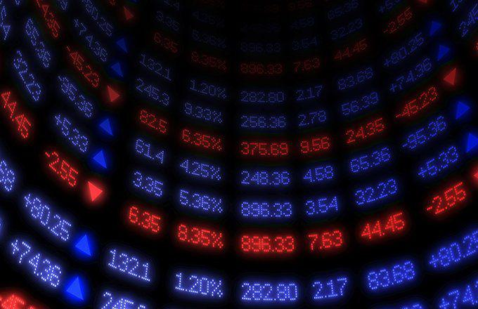

The financial markets provide a diverse array of investment opportunities, each characterized by distinct strategies and associated risks. Investors are often on a quest to optimize returns while managing exposure to market volatility. In this pursuit, crossover funds and algorithmic trading have emerged as pivotal areas of interest for those aiming to diversify their portfolios effectively.

Crossover funds represent a hybrid investment vehicle that combines elements of both public and private equity. By straddling the intersection of these two markets, they offer investors a unique chance to leverage the stability inherent in publicly traded securities, alongside the potential high-growth opportunities associated with private investments. This blend is particularly appealing to those with a long-term investment horizon, as it encapsulates higher risks in exchange for potentially greater rewards.



Algorithmic trading, on the other hand, utilizes sophisticated algorithms and computer systems to execute trades at speeds and efficiencies that surpass human capabilities. By employing predefined sets of rules and data-driven insights, algorithmic traders can pinpoint fleeting market opportunities that might otherwise go unnoticed. Widely adopted in modern markets, these algorithms enhance the trader's ability to respond swiftly to market signals, thereby optimizing trade execution and minimizing human error.

The synergy between crossover funds and algorithmic trading represents a contemporary strategy in finance. Employing algorithmic techniques to manage crossover fund investments can enable optimal entry and exit decisions, thereby enhancing the overall performance of the investment portfolio. With the constant evolution of financial markets, the integration of these elements offers a promising avenue for achieving superior returns while navigating the complexities of today's investment landscape.

Overall, this article aims to explore the intertwined roles and benefits of crossover funds and algorithmic trading within the context of modern financial markets, providing insights into how these innovative approaches can be harnessed for successful investment outcomes.

## Table of Contents

## Understanding Crossover Funds

Crossover funds represent a unique category of investment vehicles that encompass both public and private equity investments. By engaging in both sectors, these funds aim to leverage the comparative stability found in public equities, alongside the potential for substantial growth offered by private entities. This bifocal approach allows investors to potentially reap higher returns, mitigating some of the inherent volatilities through diversification across different equity types.

Investment in crossover funds typically involves a higher risk profile, aligning with strategies that are designed for investors possessing a long-term horizon. This time frame allows for the absorption of short-term market fluctuations and the realization of the growth potential from private equity, which often takes a longer period to mature and [exit](/wiki/exit-strategy) compared to its public counterpart.

Private equity investments generally include stakes in startups or early-stage companies, which, while riskier, offer opportunities for exponential growth. Public equity, on the other hand, consists of shares in companies listed on stock exchanges. These are usually more liquid and transparent, thereby offering a safety net against the illiquidity and opacity of private investments.

By combining these two asset classes, crossover funds aim to achieve a balanced portfolio that provides both income stability from established public companies and capital appreciation potential from burgeoning private enterprises. This strategic allocation requires an astute understanding of market conditions, as well as the economic cycles that can influence both sectors.

In practice, managing a crossover fund demands rigorous due diligence for private investments to ascertain the growth potential and alignment with overarching investment goals. For public investments, continual monitoring of the market landscape and corporate performances is essential to maintain portfolio stability.

Due to their complex nature and the level of scrutiny required, crossover funds are generally recommended for knowledgeable investors with a proclivity towards growth-oriented strategies and an acceptance of the associated risks. In summary, the multi-faceted nature of these funds offers a path to diversified growth, leveraging the inherent strengths of both public and private markets.

## Investment Strategies in Financial Markets

Investment strategies in financial markets are tailored to meet the diverse objectives and risk tolerances of individual investors. These strategies range widely, allowing investors to pursue different pathways based on their financial goals and market outlook. Among the various strategies, value investing, growth investing, and income-driven investments are some of the most prevalent.

Value investing involves identifying and purchasing stocks that appear to be undervalued by the market. Normally, investors employing this strategy seek to buy stocks at a discount, with the expectation that these undervalued assets will appreciate over time, providing substantial returns. Value investors typically rely on [fundamental analysis](/wiki/fundamental-analysis), assessing a company's financial health, and metrics such as the price-to-earnings ratio (P/E), to make informed decisions.

Growth investing, on the other hand, focuses on capital appreciation. Investors in this category target companies expected to grow at rates above the market average. These companies often reinvest earnings to fuel additional growth, and investors are usually less concerned with short-term earnings and more focused on long-term potential. Growth investments are characterized by their potential for high returns but also [carry](/wiki/carry-trading) a commensurate level of risk due to the reliance on future performance.

Income-driven investments cater to those seeking regular income streams over capital gains. This strategy typically involves investing in bonds, dividend-paying stocks, real estate investment trusts (REITs), and other income-generating assets. The focus here is on creating a steady cash flow that can either supplement other income sources or serve as a primary income stream for retirees.

Crossover funds represent an alignment with growth investment strategies, due to their dual focus on public and private equity, which provides both stabilization and expansive growth potential. These funds offer a hybrid approach—combining the relative security of public equities with the dynamic growth opportunities of private investment. This duality aligns with growth investors who aim to maximize yield and capital appreciation over an extended horizon. Consequently, crossover funds typically appeal to investors with a higher risk tolerance and a long-term investment perspective, seeking the potential high yield that comes with balancing these diverse equity types.

In conclusion, selecting the right investment strategy is pivotal and should be based on an investor's specific risk tolerance, investment horizon, and financial goals. Whether pursuing value, growth, or income-driven strategies, understanding the intricacies of each can guide investors in crafting a portfolio that aligns with their financial aspirations.

## The Role of Algorithmic Trading

Algorithmic trading utilizes computers and mathematical algorithms to automate the trading process. The primary advantage of this approach lies in its ability to execute trades with efficiency and speed, surpassing the capabilities of human traders. By minimizing human intervention, [algorithmic trading](/wiki/algorithmic-trading) eliminates emotional biases that often affect trading decisions, leading to more consistent and precise outcomes.

In the domain of algorithmic trading, strategies are designed to identify and capitalize on market opportunities. Among these strategies, the Simple Moving Average (SMA) Crossover is widely implemented to detect market trends and potential trading signals. The SMA Crossover method involves calculating two moving averages - one with a shorter period and another with a longer period. When the shorter-term average crosses above the longer-term average, it generates a buy signal, indicating a potential upward trend. Conversely, when the shorter-term average crosses below the longer-term average, it triggers a sell signal, anticipating a downward trend. This strategy leverages the principle of [momentum](/wiki/momentum), aiming to enter trades in the direction of established trends.

The formula for the Simple Moving Average is as follows:

$$
\text{SMA} = \frac{\sum_{i=1}^{n} P_{i}}{n}
$$

where $P_{i}$ represents the price at period $i$ and $n$ is the number of periods over which the average is calculated.

Algorithmic trading harnesses the speed and computational power of modern technology to react to market changes almost instantaneously. This capability is critical in capturing short-term market opportunities where timing is essential. For instance, in high-frequency trading, algorithms can execute a large [volume](/wiki/volume-trading-strategy) of trades at a fraction of a second, enabling traders to exploit small price discrepancies and capture [arbitrage](/wiki/arbitrage) opportunities.

Moreover, the deployment of algorithms allows for the analysis and integration of vast data sets, including historical prices, volume data, and even non-financial information such as news reports and social media sentiment. By processing these data inputs, algorithmic systems can refine their strategies to improve prediction accuracy and trading performance.

Python is a popular language for implementing algorithmic trading strategies due to its extensive libraries and supportive community. Below is a simple Python example illustrating a basic implementation of the SMA Crossover strategy:

```python
import pandas as pd

# Load historical price data
data = pd.read_csv('price_data.csv')
data['SMA_short'] = data['Close'].rolling(window=10).mean()
data['SMA_long'] = data['Close'].rolling(window=50).mean()

# Generate buy/sell signals
data['Signal'] = 0
data['Signal'][10:] = np.where(data['SMA_short'][10:] > data['SMA_long'][10:], 1, 0)
data['Position'] = data['Signal'].diff()

# Print buy/sell signals
print(data[['Close', 'SMA_short', 'SMA_long', 'Signal', 'Position']].head())
```

This script calculates 10-day and 50-day SMAs on historical closing prices and generates corresponding buy/sell signals based on crossovers. By extending such models and incorporating more sophisticated techniques, traders can enhance their strategies to navigate the complexities of financial markets more effectively.

## Integrating Crossover Funds with Algo Trading

The integration of crossover funds with algorithmic trading harnesses the synergy between diversified investment vehicles and advanced technology to optimize returns across various market segments. Crossover funds, which amalgamate both public and private equities, benefit from the precision and speed of algorithmic trading to enhance their investment strategies.

Automated systems are designed to assist in optimizing entry and exit points for investments in crossover funds, which is a critical [factor](/wiki/factor-investing) in maximizing performance. Algorithms analyze vast amounts of financial data rapidly, identifying patterns and making informed decisions that human traders may not discern as quickly. For instance, a Python-based algorithm could be structured to evaluate the [volatility](/wiki/volatility-trading-strategies) and momentum of fund components, employing statistical methods such as moving averages to predict optimal trade timings:

```python
import numpy as np
import pandas as pd

def moving_average_crossover(prices, short_window=40, long_window=100):
    signals = pd.DataFrame(index=prices.index)
    signals['price'] = prices
    signals['short_mavg'] = prices.rolling(window=short_window, min_periods=1, center=False).mean()
    signals['long_mavg'] = prices.rolling(window=long_window, min_periods=1, center=False).mean()
    signals['signal'] = 0.0
    signals['signal'][short_window:] = np.where(signals['short_mavg'][short_window:] > signals['long_mavg'][short_window:], 1.0, 0.0)   
    signals['positions'] = signals['signal'].diff()

    return signals
```

The code above demonstrates the use of a moving average crossover strategy, which is fundamental in identifying uptrend opportunities or bearish markets.

Considering risk factors is crucial since both the fund elements and the algorithmic systems require careful calibration to mitigate potential volatility. The volatile nature of equities, particularly in private markets, necessitates robust risk management strategies. Techniques such as volatility clustering and stress testing can adjust algorithm parameters dynamically, ensuring that trades align with the fund’s risk tolerance. Additionally, optimizing portfolio allocation through diversification and rebalancing are essential strategies for risk mitigation.

By integrating these advanced trading systems with crossover fund investments, portfolio managers can capture returns effectively while maintaining a controlled risk profile. This combination embodies a progressive approach to capturing returns from diverse financial market segments, maximizing the potential of crossover funds when enhanced with the precision of algorithmic trading.

## Risk Management and Optimization Strategies

Risk management forms a critical component of investment strategies, especially for high-risk vehicles like crossover funds melded with the precision of algorithmic trading. The combination of these two investment strategies demands meticulous attention to risk, given the volatile nature of financial markets and the unique characteristics of both crossover funds and algorithmic trading.

Diversifying algorithmic parameters serves as a foundational risk management technique. By adjusting parameters such as the time frame, order size, and risk thresholds, investors can adapt strategies to varying market conditions. This diversification ensures that algorithms do not become overly dependent on specific market patterns, thus reducing potential vulnerabilities. For instance, adjusting the moving average periods used in a Simple Moving Average (SMA) Crossover strategy can provide different signals on price trends, which might be more robust across different market conditions.

Implementing stop-loss and take-profit levels is another effective risk management technique. Stop-loss orders automatically trigger the sale of a security when it reaches a predetermined price, thereby limiting potential losses from adverse market movements. Similarly, take-profit levels allow investors to automatically sell an asset once it reaches a desired profit level. These automated measures help in maintaining disciplined trading by removing emotional decision-making from the process.

Continuous [backtesting](/wiki/backtesting) and strategy validation are essential to ensure that both the investment and trading strategies maintain their efficacy across diverse market scenarios. Backtesting involves running an algorithm through historical market data to evaluate its performance and identify any potential weaknesses. This process allows investors to fine-tune their strategies, ensuring they are robust and adaptable to changing market dynamics. Below is a simple Python example showing how backtesting might be setup for an SMA Crossover strategy:

```python
import pandas as pd

# Sample data loading of historical prices
data = pd.read_csv('historical_prices.csv', parse_dates=['Date'], index_col='Date')
data['SMA_50'] = data['Close'].rolling(window=50).mean()
data['SMA_200'] = data['Close'].rolling(window=200).mean()

# Signal generation
data['Signal'] = 0
data.loc[data['SMA_50'] > data['SMA_200'], 'Signal'] = 1
data.loc[data['SMA_50'] < data['SMA_200'], 'Signal'] = -1

# Strategy returns
data['Returns'] = data['Signal'].shift(1) * (data['Close'].pct_change())

# Calculate performance
performance = data['Returns'].cumsum()

print(f"Strategy cumulative performance: {performance[-1]}")
```

For successful integration of crossover funds and algo trading, continuous learning and adaptation are necessary. This includes monitoring algorithm performance, adjusting strategies, and employing optimization techniques to enhance returns while minimizing potential losses. Utilizing advanced [machine learning](/wiki/machine-learning) models for predictive analytics or employing Monte Carlo simulations to assess strategy robustness under different scenarios could be highly beneficial.

Ultimately, the intersection of risk management strategies with algorithmic trading and crossover funds requires a nuanced understanding and expertise. As markets evolve, so should the strategies that navigate them, ensuring that investors are positioned for long-term success despite inherent risks.

## Conclusion

Crossover funds and algorithmic trading together form a powerful duo that offers enhanced returns and broad market exposure by leveraging the strengths of both investment techniques. Crossover funds, with their unique combination of public and private investments, provide diversification and the potential for high growth, while algorithmic trading adds a layer of efficiency, speed, and precision in managing trades and optimizing investment outcomes.

Investors contemplating entry into these domains must equip themselves with a robust understanding of both strategy implementation and risk management. This involves not just a knowledge of financial markets and investment vehicles but also an appreciation for the technological tools and algorithms that drive modern trading practices. For instance, understanding how algorithms implement strategies such as the Simple Moving Average (SMA) Crossover to identify trends can be crucial for maximizing returns and minimizing risk. Risk management strategies, including the use of stop-loss orders and continuous backtesting of algorithms, play a critical role in protecting investments from market volatility and ensuring strategies remain resilient under different market conditions.

Overall, a strategic approach, coupled with technological proficiency, can pave the way for successful investment outcomes in today's dynamic financial landscapes. Investors must remain adaptive, continuously learning and integrating new tools and strategies to stay ahead. By doing so, they can effectively harness the combined power of crossover funds and algorithmic trading to achieve substantial financial growth and security.

## References & Further Reading

[1]: Christensen, B. J., Mehrotra, V., & Sen, A. (2020). ["Crossover Funds: Investment Dynamics and Market Impact."](https://www.researchgate.net/publication/344606046_The_effect_of_audit_materiality_disclosures_on_investors'_decision_making) Journal of Financial Markets.

[2]: Agarwal, V., & Naik, N. Y. (2004). ["Risks and Portfolio Decisions Involving Hedge Funds."](https://www.jstor.org/stable/1262669) The Review of Financial Studies.

[3]: Cartea, Á., Jaimungal, S., & Penalva, J. (2015). ["Algorithmic and High-Frequency Trading."](https://assets.cambridge.org/97811070/91146/frontmatter/9781107091146_frontmatter.pdf) Cambridge University Press.

[4]: Lopez de Prado, M. (2018). ["Advances in Financial Machine Learning."](https://www.amazon.com/Advances-Financial-Machine-Learning-Marcos/dp/1119482089) Wiley.

[5]: Chan, E. P. (2013). ["Algorithmic Trading: Winning Strategies and Their Rationale."](https://github.com/ftvision/quant_trading_echan_book) Wiley.

[6]: Aronson, D. R. (2007). ["Evidence-Based Technical Analysis: Applying the Scientific Method and Statistical Inference to Trading Signals."](https://onlinelibrary.wiley.com/doi/book/10.1002/9781118268315) Wiley.

[7]: Jansen, S. (2020). ["Machine Learning for Algorithmic Trading."](https://github.com/stefan-jansen/machine-learning-for-trading) Packt Publishing.