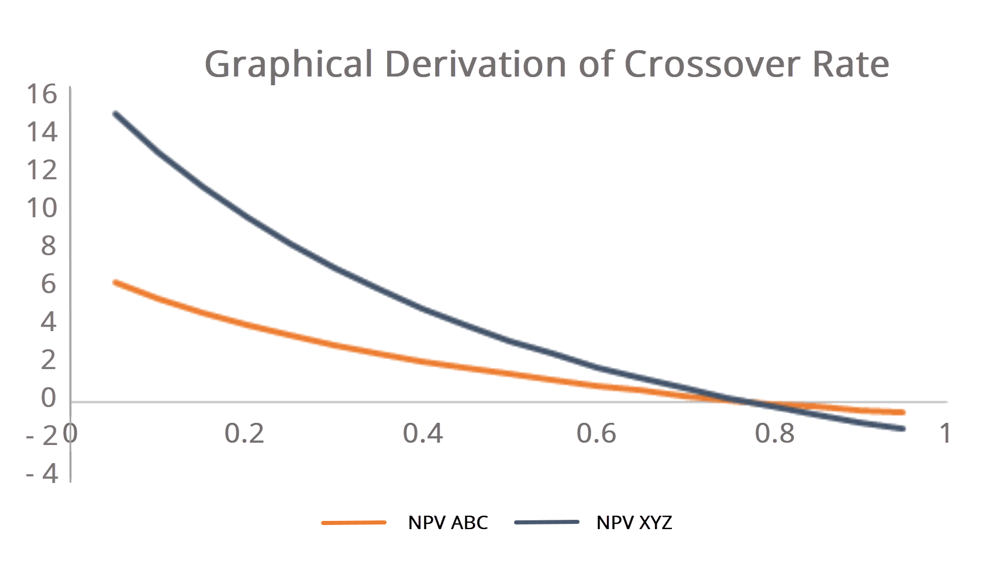

## Table of Contents

## What is a crossover fund?

A crossover fund is a type of investment fund that invests in both public and private companies. This means it can buy shares in companies that are listed on stock exchanges, as well as invest in companies that are not yet listed and are still privately owned. This flexibility allows the fund to take advantage of opportunities in different stages of a company's growth.

Crossover funds are popular because they can help investors diversify their portfolios. By investing in both public and private markets, these funds can potentially reduce risk and increase returns. They are often managed by experienced investors who have a deep understanding of both markets, which can be beneficial for those looking to invest in a variety of company types.

## How does a crossover fund differ from traditional venture capital and private equity funds?

A crossover fund is different from traditional venture capital and private equity funds because it can invest in both public and private companies. Venture capital funds usually focus on early-stage, private companies that have high growth potential but are not yet listed on stock exchanges. Private equity funds, on the other hand, often invest in more mature private companies, sometimes taking them over completely to improve their performance before selling them or taking them public. In contrast, a crossover fund has the flexibility to invest in companies at various stages of their development, from early-stage startups to established public companies.

This flexibility allows crossover funds to adapt to different market conditions and opportunities. For example, if the public market is doing well, the fund can invest more in public companies. If there are promising private companies, the fund can shift its focus there. This approach can help the fund manage risk and potentially increase returns by diversifying its investments across different types of companies. Traditional venture capital and private equity funds do not have this same level of flexibility, as they are more focused on specific stages of company growth.

## What are the typical investment stages that a crossover fund targets?

A crossover fund can invest in companies at different stages of their growth. This means they might put money into a brand new startup that is just getting started and has a lot of potential to grow. They can also invest in companies that are a bit older but still private, meaning they are not listed on a stock market yet. These companies might be looking to expand or need money to keep growing.

Crossover funds also have the ability to invest in companies that are already public, meaning their shares are traded on a stock exchange. These companies could be well-established and looking for ways to grow even more or to enter new markets. By being able to invest in both private and public companies, crossover funds can pick and choose the best opportunities at any stage of a company's life.

## What are the benefits of investing in a crossover fund for investors?

Investing in a crossover fund can be a smart choice for investors because it helps spread out risk. Since these funds put money into both private and public companies, they can balance out the ups and downs of the market. If one part of the market is not doing well, the other part might be doing better, which can help protect your investment. This kind of diversification is a big plus for investors who want to keep their money safe while still having the chance to make good returns.

Another benefit is that crossover funds can take advantage of opportunities at different stages of a company's growth. They can invest in new startups that might become big in the future, as well as in established companies that are already doing well. This flexibility means the fund can adjust its strategy based on what is happening in the market. Experienced managers of crossover funds know how to find the best deals in both private and public markets, which can lead to better returns for investors.

## What are the potential risks associated with crossover funds?

Investing in crossover funds comes with some risks that investors should be aware of. One main risk is that these funds invest in both private and public companies, which can be tricky. Private companies are not listed on stock exchanges, so it can be hard to know how well they are doing. If a private company does not do well, it might be hard to sell the investment or get your money back. Also, the value of private companies can be hard to figure out, which adds to the risk.

Another risk is that the public companies in a crossover fund can also go up and down in value. The stock market can be unpredictable, and if the market goes down, the value of the fund's investments in public companies can drop too. This can affect the overall value of the fund. Additionally, because crossover funds invest in different types of companies, managing these investments can be complicated. If the fund managers make bad choices, it could hurt the fund's performance.

Overall, while crossover funds offer the chance to diversify and potentially earn good returns, they also come with the risk of losing money. It's important for investors to understand these risks and think about how much risk they are comfortable taking before investing in a crossover fund.

## How do crossover funds select and manage their investments?

Crossover funds choose and handle their investments by looking at both private and public companies. They have teams of experts who study the market and find good opportunities. These experts look at things like how well a company is doing, its future plans, and the overall market conditions. They decide which companies to invest in based on this information. Sometimes, they might choose to invest in a new startup that has a lot of potential to grow. Other times, they might pick an established public company that is doing well and looking to expand.

Once they have chosen their investments, crossover funds need to manage them carefully. They keep a close eye on how the companies are doing and make changes to their investments as needed. If a private company they invested in starts to do really well, they might decide to invest more money in it. If a public company's stock price goes down, they might sell some of their shares to avoid losing too much money. The goal is to balance the risks and rewards of their investments, making sure they are always working towards growing the value of the fund for their investors.

## What is the role of a crossover fund in a company's lifecycle?

A crossover fund plays an important role in a company's lifecycle by providing money at different stages. When a company is just starting out and is private, a crossover fund might invest in it to help it grow. This early money can be used to develop new products, hire more people, or expand the business. As the company gets bigger and more successful, the fund can continue to support it by investing more money or helping it prepare to go public.

Once the company is listed on a stock exchange and becomes public, the crossover fund can still play a role. It can buy more shares in the company to help it keep growing or enter new markets. The fund's ability to invest in both private and public companies means it can stick with a company through different stages of its life, from when it's just a startup to when it's a big, established business. This ongoing support can be really helpful for a company's growth and success.

## Can you provide examples of successful investments made by crossover funds?

One example of a successful investment by a crossover fund is when T. Rowe Price, a well-known investment firm, invested in Tesla. They first bought shares in Tesla when it was still a private company back in 2010. They kept investing in Tesla even after it went public in 2010. Tesla grew a lot over the years, and T. Rowe Price made a lot of money from their investment. This shows how crossover funds can make smart choices by sticking with a company through different stages of its growth.

Another example is when Fidelity Investments, another big crossover fund, invested in Airbnb. They started investing in Airbnb when it was a private company in 2011. Even after Airbnb went public in 2020, Fidelity kept their investment. Airbnb became very successful, and Fidelity's investment paid off well. This shows how crossover funds can help companies grow by providing money at different times and sticking with them through their journey from private to public companies.

## How do crossover funds impact the valuation and liquidity of the companies they invest in?

When a crossover fund invests in a company, it can change how much the company is worth. If the fund invests in a private company, it often means that other investors start to see the company as more valuable. This is because the fund's investment can be seen as a vote of confidence. It can make the company's valuation go up because people think it has a bright future. For public companies, when a crossover fund buys a lot of shares, it can also push the stock price up. This is because more demand for the shares can make the price go higher.

Crossover funds can also affect how easy it is to buy or sell a company's shares, which is called liquidity. For private companies, getting money from a crossover fund can help them get ready to go public. Once they are public, it's easier for people to buy and sell their shares. For public companies, if a crossover fund keeps buying shares, it can make the stock more popular and easier to trade. This can help the company because more people are interested in buying and selling its shares. So, crossover funds can make a big difference in how much a company is worth and how easy it is to trade its shares.

## What are the key performance indicators that crossover funds use to measure success?

Crossover funds use several key performance indicators to see how well they are doing. One important indicator is the return on investment, which measures how much money the fund makes from its investments. They look at both the total return and the return compared to other funds or market indexes. Another key indicator is the fund's growth over time, which shows if the value of the fund is going up. They also pay attention to the risk they are taking, using measures like volatility to see how much the value of their investments goes up and down.

Another important indicator is the performance of individual investments within the fund. Crossover funds track how well the private companies they invest in are doing, looking at things like revenue growth and profitability. For public companies, they keep an eye on stock prices and dividends. They also consider how well they are diversifying their investments across different types of companies and stages of growth. This helps them manage risk and find the best opportunities. Overall, these indicators help crossover funds make smart decisions and show their investors how well they are doing.

## How do regulatory environments affect the operations of crossover funds?

Regulatory environments can have a big impact on how crossover funds work. Different countries have different rules about investing in private and public companies. For example, some places might have strict rules about how much money a fund can put into private companies or how it can buy and sell shares in public companies. These rules can make it harder for crossover funds to do what they want to do. They might need to spend more time and money making sure they follow all the rules, which can slow them down.

Also, regulations can change how crossover funds report their investments and how much they have to tell people about what they are doing. In some places, funds have to share a lot of information with the government or with their investors. This can make things more complicated for the fund managers. But, it can also help keep things fair and safe for everyone involved. So, crossover funds always need to keep an eye on the rules and be ready to change how they work if the rules change.

## What trends are currently shaping the future of crossover funds?

One big trend shaping the future of crossover funds is the growing interest in technology and innovation. More and more, these funds are looking to invest in tech startups and companies that are using new technology to grow. This is because technology is changing fast, and there are lots of opportunities to make money by investing in new tech companies. Crossover funds are well-positioned to take advantage of this because they can invest in these companies when they are private and then keep investing in them after they go public. This trend means that crossover funds need to have experts who understand technology and can find the best tech companies to invest in.

Another trend is the focus on sustainability and environmental, social, and governance (ESG) factors. Investors are becoming more interested in companies that are good for the planet and society. Crossover funds are starting to look for companies that meet these ESG standards, both when they are private and after they go public. This means that funds need to think about more than just making money; they also need to consider how their investments affect the world. As more people care about these issues, crossover funds that focus on sustainable and responsible investing are likely to do well in the future.

## What is the Role of Algorithmic Trading?

Algorithmic trading utilizes computers and mathematical algorithms to automate the trading process. The primary advantage of this approach lies in its ability to execute trades with efficiency and speed, surpassing the capabilities of human traders. By minimizing human intervention, [algorithmic trading](/wiki/algorithmic-trading) eliminates emotional biases that often affect trading decisions, leading to more consistent and precise outcomes.

In the domain of algorithmic trading, strategies are designed to identify and capitalize on market opportunities. Among these strategies, the Simple Moving Average (SMA) Crossover is widely implemented to detect market trends and potential trading signals. The SMA Crossover method involves calculating two moving averages - one with a shorter period and another with a longer period. When the shorter-term average crosses above the longer-term average, it generates a buy signal, indicating a potential upward trend. Conversely, when the shorter-term average crosses below the longer-term average, it triggers a sell signal, anticipating a downward trend. This strategy leverages the principle of [momentum](/wiki/momentum), aiming to enter trades in the direction of established trends.

The formula for the Simple Moving Average is as follows:

$$
\text{SMA} = \frac{\sum_{i=1}^{n} P_{i}}{n}
$$

where $P_{i}$ represents the price at period $i$ and $n$ is the number of periods over which the average is calculated.

Algorithmic trading harnesses the speed and computational power of modern technology to react to market changes almost instantaneously. This capability is critical in capturing short-term market opportunities where timing is essential. For instance, in high-frequency trading, algorithms can execute a large [volume](/wiki/volume-trading-strategy) of trades at a fraction of a second, enabling traders to exploit small price discrepancies and capture [arbitrage](/wiki/arbitrage) opportunities.

Moreover, the deployment of algorithms allows for the analysis and integration of vast data sets, including historical prices, volume data, and even non-financial information such as news reports and social media sentiment. By processing these data inputs, algorithmic systems can refine their strategies to improve prediction accuracy and trading performance.

Python is a popular language for implementing algorithmic trading strategies due to its extensive libraries and supportive community. Below is a simple Python example illustrating a basic implementation of the SMA Crossover strategy:

```python
import pandas as pd

# Load historical price data
data = pd.read_csv('price_data.csv')
data['SMA_short'] = data['Close'].rolling(window=10).mean()
data['SMA_long'] = data['Close'].rolling(window=50).mean()

# Generate buy/sell signals
data['Signal'] = 0
data['Signal'][10:] = np.where(data['SMA_short'][10:] > data['SMA_long'][10:], 1, 0)
data['Position'] = data['Signal'].diff()

# Print buy/sell signals
print(data[['Close', 'SMA_short', 'SMA_long', 'Signal', 'Position']].head())
```

This script calculates 10-day and 50-day SMAs on historical closing prices and generates corresponding buy/sell signals based on crossovers. By extending such models and incorporating more sophisticated techniques, traders can enhance their strategies to navigate the complexities of financial markets more effectively.

## References & Further Reading

[1]: Christensen, B. J., Mehrotra, V., & Sen, A. (2020). ["Crossover Funds: Investment Dynamics and Market Impact."](https://www.researchgate.net/publication/344606046_The_effect_of_audit_materiality_disclosures_on_investors'_decision_making) Journal of Financial Markets.

[2]: Agarwal, V., & Naik, N. Y. (2004). ["Risks and Portfolio Decisions Involving Hedge Funds."](https://www.jstor.org/stable/1262669) The Review of Financial Studies.

[3]: Cartea, Á., Jaimungal, S., & Penalva, J. (2015). ["Algorithmic and High-Frequency Trading."](https://assets.cambridge.org/97811070/91146/frontmatter/9781107091146_frontmatter.pdf) Cambridge University Press.

[4]: Lopez de Prado, M. (2018). ["Advances in Financial Machine Learning."](https://www.amazon.com/Advances-Financial-Machine-Learning-Marcos/dp/1119482089) Wiley.

[5]: Chan, E. P. (2013). ["Algorithmic Trading: Winning Strategies and Their Rationale."](https://github.com/ftvision/quant_trading_echan_book) Wiley.

[6]: Aronson, D. R. (2007). ["Evidence-Based Technical Analysis: Applying the Scientific Method and Statistical Inference to Trading Signals."](https://onlinelibrary.wiley.com/doi/book/10.1002/9781118268315) Wiley.

[7]: Jansen, S. (2020). ["Machine Learning for Algorithmic Trading."](https://github.com/stefan-jansen/machine-learning-for-trading) Packt Publishing.