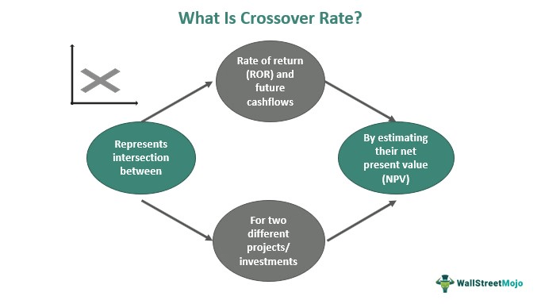

The landscape of financial markets has experienced significant transformation due to crossover investor strategies and algorithmic trading. Crossover investors are distinct in their ability to bridge public and private markets, seeking high returns by investing strategically across various stages of a company’s lifecycle. This multifaceted approach allows them to access opportunities that are not available to traditional investors, offering a competitive edge in both high-growth and established sectors.

Algorithmic trading, historically the preserve of large financial institutions, is now becoming increasingly accessible to retail investors. Innovations in technology have facilitated the democratization of trading tools, enabling precision and speed in trade execution. With the capacity to process vast amounts of data and execute trades at lightning speed, algorithmic trading systems can identify profitable opportunities and optimize investment outcomes.



This article explores the potential synergy between crossover investing and algorithmic trading. By combining the strategic nature of crossover investments with the technical prowess of algorithmic trading, investors can unlock enhanced investment outcomes. Such integration presents a powerful approach to navigating the complexities of modern financial markets.

## Table of Contents

## Understanding Crossover Investors

Crossover investors are distinguished by their ability to operate across both public and private financial markets, strategically investing from pre-IPO (Initial Public Offering) to post-IPO stages to maximize their returns. This approach allows them to capitalize on a broader array of opportunities compared to investors focusing solely on public or private markets. By engaging in multiple market phases, they aim to leverage transitional growth periods and benefit from valuation inflections.

Their investment strategy involves a multivehicle approach, deploying capital through various financial instruments including mutual funds, hedge funds, and private equity avenues. This multifaceted approach not only enhances the potential for higher returns but also provides a mechanism to diversify risk. By utilizing private equity investments, crossover investors can access high-growth firms at pre-IPO stages, thus enjoying early-stage valuation growth, while hedge funds offer the flexibility to react swiftly to market changes and optimize portfolio performance through a variety of strategies.

Crossover investing is particularly significant in the technology sector. This preference stems from the rapid growth and innovation typical of technology companies, which often experience significant valuation shifts during their lifecycle from private startups to publicly traded entities. This sector's dynamism creates numerous investment entry and exit points, aligning well with the crossover strategy.

To manage the inherent risks associated with market [volatility](/wiki/volatility-trading-strategies), crossover investors adopt a diversified approach. Diversification across both asset types and sectors reduces the impact of adverse market developments in a specific area, providing a buffer against unpredictable market conditions. This risk mitigation strategy is crucial for maintaining portfolio stability over time.

In conclusion, crossover investors' ability to navigate through different market territories with an adaptable and diverse approach positions them uniquely in the landscape of financial markets. By leveraging opportunities across both private and public markets, and employing a diversified investment strategy, they seek to optimize returns and manage market volatility effectively.

## Algorithmic Trading: A Game Changer

Algorithmic trading fundamentally enhances financial market operations by utilizing complex algorithms to automate trading based on predefined criteria, such as timing, price, or [volume](/wiki/volume-trading-strategy). This approach significantly optimizes trade execution, reducing human error and emotion-driven decisions. Algorithmic trading became accessible to retail investors with technological advancements, democratizing tools that enable precision and data-driven insights. This accessibility empowers smaller investors to leverage sophisticated strategies that were once the domain of large financial institutions.

Among the diverse strategies deployed in [algorithmic trading](/wiki/algorithmic-trading), three are particularly notable: [arbitrage](/wiki/arbitrage), trend-following, and market-making. Arbitrage involves exploiting price differentials of the same asset across different markets to gain a profit without significant risk. For instance, if a stock is underpriced on one exchange and overpriced on another, an algorithm can execute buy and sell orders simultaneously to capture the spread.

Trend-following strategies rely on algorithms to identify and capitalize on market [momentum](/wiki/momentum). These algorithms analyze historical market data, using indicators like moving averages, to predict and act on prevailing trends. This method hinges on the assumption that current upward or downward movements will continue for sufficient duration, affording profit opportunities.

Market-making requires algorithms to provide [liquidity](/wiki/liquidity-risk-premium) by quoting both buy and sell prices, [earning](/wiki/earning-announcement) a profit from the spread over numerous transactions. This strategy benefits from high volumes and volatility, playing a crucial role in maintaining smooth market operations and narrowing bid-ask spreads.

High-frequency trading ([HFT](/wiki/high-frequency-trading-strategies)) is a specialized subset of algorithmic trading characterized by executing a vast number of orders across milliseconds. This strategy exploits minimal price fluctuations and arbitrage opportunities, utilizing ultra-low latency connections. HFT systems, driven by powerful computers, analyze and react to market events faster than any human could, often securing competitive advantages in the process.

The integration of mathematical models and programming is indispensable in designing and refining these algorithms. For instance, Python, a popular language in financial analytics, offers libraries like NumPy and pandas to process financial data, identify trading patterns, and test strategies efficiently. An example of a simple moving average crossover strategy in Python might look like this:

```python
import pandas as pd

# Load your market data
data = pd.read_csv('market_data.csv')

# Calculate the short and long moving averages
data['short_ma'] = data['Close'].rolling(window=20).mean()
data['long_ma'] = data['Close'].rolling(window=50).mean()

# Generate trading signals
data['signal'] = 0
data['signal'][20:] = np.where(data['short_ma'][20:] > data['long_ma'][20:], 1, -1)

# Buy/Sell signals
data['positions'] = data['signal'].diff()

# Print to verify
print(data[['Close', 'short_ma', 'long_ma', 'signal', 'positions']].tail())
```

This algorithm identifies buy/sell signals based on the crossover of short and long moving averages, a staple strategy in algorithmic trading. As algorithmic trading continues to evolve, it propels both market efficiency and participant strategy sophistication, anchoring its role as an indispensable component in modern financial markets.

## Integrating Algo Trading with Crossover Investing

Crossover investors can significantly enhance their investment strategies by incorporating algorithmic trading, which brings precision and speed to the table. This integration allows investors to optimize entry and [exit](/wiki/exit-strategy) points in the market, minimizing the influence of emotions that often lead to suboptimal decisions. By leveraging algorithmic trading, transactions can be executed efficiently, taking advantage of microsecond-level market shifts that a human trader would find difficult to capture.

The synergy between algorithmic trading and crossover investing lies in the ability to blend long-term strategic planning with the exploitation of short-term market opportunities. Algorithms can swiftly analyze vast datasets and detect market patterns or anomalies, facilitating informed decision-making. This dual approach gives crossover investors a competitive advantage by not only planning for the future but also maximizing present opportunities.

Modern algorithmic trading platforms offer sophisticated tools that enable crossover investors to rapidly adjust their strategies in response to changing market conditions. Features such as real-time data analytics, [machine learning](/wiki/machine-learning) models, and advanced risk management systems empower investors to make data-driven decisions and improve their agility in the market. For instance, machine learning algorithms can be trained to predict market movements based on historical data, macroeconomic indicators, and news sentiment analysis.

Here is a simple Python example demonstrating the use of machine learning for predicting stock price movements:

```python
from sklearn.model_selection import train_test_split
from sklearn.ensemble import RandomForestClassifier
import pandas as pd

# Load the historical stock data
data = pd.read_csv('stock_data.csv')

# Define features and target
features = data[['Open', 'High', 'Low', 'Volume']]
target = data['PriceDirection']  # 1 for up, 0 for down

# Split the data
X_train, X_test, y_train, y_test = train_test_split(features, target, test_size=0.2, random_state=42)

# Initialize and train the model
model = RandomForestClassifier(n_estimators=100, random_state=42)
model.fit(X_train, y_train)

# Predict the price direction
predictions = model.predict(X_test)

# Evaluate the model's performance
accuracy = model.score(X_test, y_test)
print(f'Model Accuracy: {accuracy * 100:.2f}%')
```

By integrating such models, crossover investors can develop robust strategies that not only respond to immediate market conditions but also align with their long-term investment objectives. The technological sophistication of algorithmic platforms ensures that these strategies are adaptive and capable of navigating the complexities of financial markets effectively.

## Risks and Challenges

Both crossover investing and algorithmic trading involve considerable risks that participants must navigate skillfully. Market volatility poses a significant threat to both strategies, with sudden fluctuations capable of rapidly affecting asset valuations and investor returns. Systemic risks stemming from technological failures are also a pertinent concern, particularly as both strategies increasingly rely on complex technological infrastructures.

For crossover investors, a key risk is the need to closely monitor market sentiment. These investors bridge private and public markets, often holding positions in high-risk assets during pre-IPO and post-IPO stages. A sudden downturn or sentiment shift in these markets can lead to precipitous asset devaluations, potentially resulting in substantial financial losses. This requires crossover investors to maintain agility in their portfolios and the ability to pivot strategies swiftly to mitigate such risks.

Algorithmic traders face the risk of technological over-reliance, which can foster complacency. While algorithms offer precision and speed, they can also fail due to bugs, erroneous data feeds, or unexpected market conditions. Continuous oversight and refinement of these strategies are essential to ensure they remain effective and aligned with market conditions. This highlights the critical need for robust risk management frameworks that incorporate regular testing and optimization of algorithms to prevent costly errors.

Regulatory scrutiny is another ongoing challenge in the field of algorithmic trading. As these strategies affect market dynamics significantly, regulatory bodies worldwide continue developing rules to ensure fair trading practices. Traders need to stay abreast of evolving regulations and ensure compliance to avoid legal repercussions. This may involve adapting algorithms to adhere to new trading limits or reporting requirements, which can be both time-consuming and complex.

Overall, the intersection of crossover investing and algorithmic trading carries inherent risks that demand vigilance and adaptability. By recognizing these challenges and preparing to address them through technological resilience and regulatory compliance, investors can better position themselves to navigate the uncertainties of modern financial markets.

## Conclusion

The fusion of crossover investor strategies with algorithmic trading represents a transformative approach to navigating financial markets. This combination allows investors to apply the strategic insight of crossover investing with the efficiency and precision of algorithmic trading, thus maximizing their potential for substantial returns while effectively managing inherent risks. The agility provided by algorithmic systems enables investors to hedge against market volatility and capitalize on fleeting market opportunities with unprecedented speed and accuracy.

Furthermore, as the financial landscape continues to evolve, ongoing education and adaptation are pivotal for the successful implementation of these strategies. Investors who remain informed about technological advancements and regulatory changes can continuously refine their approaches, ensuring they align with emerging market dynamics. This proactive stance also aids in avoiding pitfalls associated with over-reliance on automated systems and maintaining compliance with evolving regulatory standards.

As technology further integrates into financial markets, both crossover investing and algorithmic trading are poised to play increasingly significant roles in shaping the future of investment strategies. These methodologies, supported by cutting-edge technologies such as [artificial intelligence](/wiki/ai-artificial-intelligence) and machine learning, present new possibilities for data-driven decision-making. Consequently, the ability to analyze vast datasets and execute trades in real-time is becoming a cornerstone of successful investment strategies. As a result, the integration of these two approaches not only enhances the capability to generate returns but also contributes to a more sophisticated, resilient investment process.

## References & Further Reading

[1]: Bergstra, J., Bardenet, R., Bengio, Y., & Kégl, B. (2011). ["Algorithms for Hyper-Parameter Optimization."](https://papers.nips.cc/paper/4443-algorithms-for-hyper-parameter-optimization) Advances in Neural Information Processing Systems 24.

[2]: ["Advances in Financial Machine Learning"](https://www.amazon.com/Advances-Financial-Machine-Learning-Marcos/dp/1119482089) by Marcos Lopez de Prado

[3]: ["Evidence-Based Technical Analysis: Applying the Scientific Method and Statistical Inference to Trading Signals"](https://www.amazon.com/Evidence-Based-Technical-Analysis-Scientific-Statistical/dp/0470008741) by David Aronson

[4]: ["Machine Learning for Algorithmic Trading"](https://github.com/stefan-jansen/machine-learning-for-trading) by Stefan Jansen

[5]: ["Quantitative Trading: How to Build Your Own Algorithmic Trading Business"](https://www.amazon.com/Quantitative-Trading-Build-Algorithmic-Business/dp/1119800064) by Ernest P. Chan