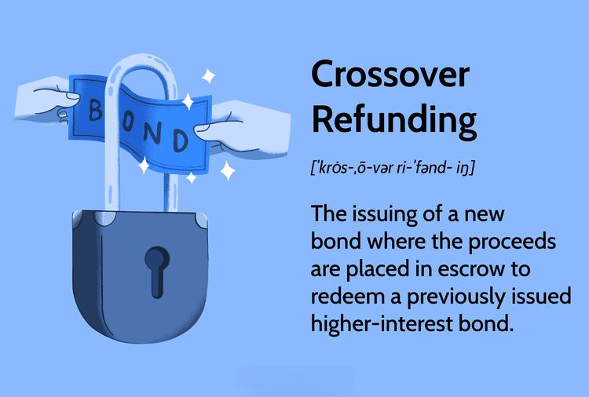

Crossover refunding within municipal bonds represents an evolving tactic in financial management, offering debt-handling flexibility and interest rate optimization. This approach specifically aids municipalities in replacing high-interest debt with lower-interest obligations, thus improving overall financial efficiency. The introduction and growth of algorithmic trading have further enhanced the potential for municipalities and investors to refine their strategies, as algorithms allow for precise market analyses and the execution of trades based on intricate, data-driven criteria.

In the context of financial innovation, understanding how an integration of crossover refunding and algorithmic trading can benefit stakeholders is crucial. Algorithmic trading involves using automatically executed strategies based on programmed instructions, and its application accentuates the timing and cost-effectiveness of bond-related transactions. This technological advancement ensures that trades are conducted at optimal points, thus maximizing returns while minimizing human error and time delays.

This article aims to clarify these complex yet rewarding strategies, highlighting their fundamental concepts, advantages, and potential challenges. Crossover refunding and algorithmic trading, when used together, have the potential to significantly transform municipal and investor-level financial strategies. By integrating traditional financial methodologies with modern technological innovations, stakeholders can achieve enhanced financial outcomes, thus broadening the horizon in contemporary finance. Understanding these mechanisms provides insights into optimizing financial performance and embracing future developments in the field.

## Table of Contents

## Understanding Crossover Refunding

Crossover refunding is a strategic financial maneuver employed by municipalities to enhance fiscal efficiency by managing existing debt obligations more effectively. This practice entails the issuance of new bonds, with the proceeds allocated to an escrow account, for the purpose of retiring older bonds that incur higher interest costs. The overarching goal is to capitalize on prevailing lower interest rates, thereby optimizing the municipality's financial obligations.

One of the critical elements of crossover refunding is the use of escrow accounts. These accounts serve as temporary repositories for the proceeds from the newly issued bonds until such a time when the older bonds can be called or redeemed. The timing of these transactions is often aligned with the call dates of the original higher-interest bonds. By securing the proceeds in an escrow account, municipalities can navigate the refinancing process with greater precision, ensuring that the refunding occurs under favorable conditions.

Interest rates play a pivotal role in the effectiveness of crossover refunding. Lower interest rates make it financially advantageous to replace older bonds with new, lower-cost debt instruments. This reduction in interest expenses directly contributes to decreased debt service costs, thereby improving the municipality's fiscal position. The savings realized through reduced interest payments can then be allocated to other critical public projects or services, amplifying the community's overall financial health.

Crossover refunding distinguishes itself from basic refunding through its inherent flexibility. It permits municipalities to manage their debt obligations judiciously, even prior to the expiration of the call protection period of the original bonds. This flexibility ensures that financial strategies remain adaptive and responsive to fluctuating market conditions.

The benefits realized from crossover refunding encompass reduced debt service costs, which translate to significant savings over the lifespan of the bonds. Additionally, this strategy improves the municipality's debt portfolio by allowing it to replace older liabilities with obligations that bear more favorable terms. In doing so, municipalities not only address current fiscal constraints but also enhance their long-term financial sustainability.

## Algorithmic Trading in the Bond Market

Algorithmic trading, often termed "algo trading," utilizes advanced software to execute trading strategies based on predetermined criteria and extensive data analysis. This approach is extensively applied in bond markets to refine the buying and selling procedures, thereby enabling investors to achieve optimal financial returns. 

In the bond markets, where the [volume](/wiki/volume-trading-strategy) and speed of transactions can be substantial, [algorithmic trading](/wiki/algorithmic-trading) provides a means to navigate and exploit market efficiencies. It employs sophisticated algorithms to analyze market data at high speeds, executing trades that adhere to specific pre-established parameters like timing, price, or quantity. This precision aids in reducing transaction costs and optimizing returns, particularly in volatile market conditions.

A significant leap in algo trading comes from the integration of [machine learning](/wiki/machine-learning) techniques, which contribute to the evolution of trading paradigms by enabling the development of more sophisticated trading strategies. Machine learning algorithms thrive on vast datasets, employing statistical methods to detect patterns and predict market movements. For example, a machine learning model may analyze historical bond market data to predict future trends, adjusting trading strategies accordingly to maximize profit potential.

Moreover, algorithmic trading supports the objectives of crossover refunding by identifying optimal moments to execute new bond issues. By analyzing [interest rate](/wiki/interest-rate-trading-strategies) trends, market [liquidity](/wiki/liquidity-risk-premium), and other relevant financial indicators, algorithmic trading can determine the most beneficial timing for such activities. This alignment enhances strategic decision-making processes, allowing municipalities and investors to exploit market conditions effectively.

Despite its advantages, algorithmic trading presents several challenges. Robust data analysis tools and comprehensive risk management frameworks are essential to ensure successful implementation. Without these, the potential for automated system errors increases, which can lead to significant financial losses. The algorithms must be meticulously coded and constantly monitored to prevent and mitigate such risks.

In essence, as technology and methodologies progress, algorithmic trading continues to redefine the landscape of bond markets. Its integration with traditional financial practices, like crossover refunding, paves the way for improved financial outcomes, underscoring the importance of advanced data analytics and precise execution in contemporary finance.

## Financial Advantages of Combining Strategies

Combining crossover refunding with algorithmic trading strategies offers significant financial advantages for both municipalities and investors by creating opportunities for cost savings and revenue enhancement. This combination enables a swift adaptation to fluctuating market conditions, ensuring financial strategies remain optimized. In employing crossover refunding, municipalities can issue new bonds at lower interest rates to redeem existing higher-interest bonds, thus reducing overall debt service costs. When combined with algorithmic trading, which utilizes sophisticated algorithms and real-time data analysis to determine optimal trade executions, municipalities gain a versatile toolset to skillfully navigate interest rate changes and market dynamics.

The financial agility offered by this synthesis allows for timely adjustments to interest rates, contributing to improved financial management for municipalities. They can manage debt more effectively by responding swiftly to market movements, thereby securing better borrowing terms and enhancing their fiscal resilience. This agility is further supported by algorithmic trading's capability to process large volumes of data quickly, identifying trends and opportunities that may not be evident through traditional analysis methods.

Investors also stand to benefit substantially from this integrated approach. By leveraging diverse and timely portfolio management made possible through algorithmic trading, investors can enhance their return on investment (ROI). Algorithmic strategies intelligently assess market conditions to execute trades at the most advantageous times, optimizing portfolio performance and risk management. The resultant portfolio diversity reduces exposure to individual asset risk while maximizing potential returns in varying market environments.

Moreover, synergistic technologies embedded within algorithmic trading processes can streamline the bond trading process, providing a significant competitive edge. These technologies facilitate faster transactions and reduced latency in trade executions, ensuring investors capture optimal pricing opportunities. By minimizing costs associated with trading and enhancing market liquidity, these tools enable both municipalities and investors to maintain a competitive standing in the financial marketplace.

In conclusion, the integration of crossover refunding and algorithmic trading represents a powerful convergence of strategy and technology. It provides substantial financial advantages, allowing stakeholders to navigate the complexities of the market with increased precision and confidence. The continuous innovation in financial technology promises further enhancements, reinforcing the potential benefits of these combined strategies in the evolving financial landscape.

## Risks and Considerations

Market [volatility](/wiki/volatility-trading-strategies) presents a significant risk when employing both crossover refunding and algorithmic trading strategies. Municipalities and investors engaging in these practices must consider various risk factors and implement effective management protocols to safeguard their financial interests.

Algorithmic trading requires extensive expertise in both software development and financial markets. This complexity can lead to automated errors if not carefully monitored. Errors might occur due to incorrect model assumptions, changes in market conditions, or unexpected data inputs. For example, an algorithm designed for a low-volatility market might perform poorly in more volatile conditions, potentially leading to significant financial losses. Therefore, regular audits and updates of trading algorithms are essential to ensure their alignment with current market conditions.

In crossover refunding, interest rate risk is a primary concern. When new bonds are issued to refinance existing higher-interest bonds, the issuer benefits from current lower rates. However, if interest rates increase unexpectedly after the new bonds are issued, the anticipated savings and benefits may diminish, affecting the issuer’s budget projections and debt management plans.

Continual regulatory changes may also impact the efficacy and legality of these financial strategies. Regulatory bodies frequently update rules and guidelines in response to evolving market environments, technological advancements, and financial crises. These changes can affect the feasibility of algorithmic trading and crossover refunding strategies, requiring stakeholders to stay informed and adapt to new compliance requirements.

Effective risk management and operational protocols are crucial in mitigating these vulnerabilities. This involves implementing robust data analysis tools, reinforcing risk management frameworks, and maintaining a comprehensive understanding of current regulations. For instance, stress testing, scenario analysis, and dynamic hedging can be employed to manage interest rate risk in crossover refunding, while algorithmic trading can benefit from real-time monitoring systems that flag potential anomalies and trigger manual intervention when necessary.

In conclusion, while the combination of crossover refunding and algorithmic trading offers potential financial advantages, it is not without inherent risks. An in-depth understanding of market dynamics, coupled with advanced technological and regulatory knowledge, is essential to effectively navigate these challenges.

## Future Prospects and Technological Integration

The future landscape of municipal finance and the bond market is anticipated to undergo profound changes, primarily driven by the integration of AI and algorithmic systems. The adoption of algorithms in bond trading is expected to increase, leveraging AI's capacity for processing vast amounts of data with speed and accuracy that surpasses human capabilities. This could lead to more precise modeling and decision-making tools, enhancing the timing and execution of trades.

Crossover refunding strategies may evolve alongside these technological advancements, incorporating more sophisticated financial instruments and hybridized models that combine traditional theories with modern computational techniques. This evolution could result in more flexible and adaptive refunding methods, which can better respond to fluctuating interest rates and market conditions.

Enhanced data analytics stand as a cornerstone for these developments. As predictive models become increasingly accurate, they offer significant opportunities for optimizing both trading strategies and refunding decisions. For example, advanced machine learning techniques could develop predictive algorithms that identify the most advantageous times to issue new bonds or refinance existing debt. Utilizing tools such as Python libraries (e.g., Pandas, NumPy, Scikit-learn), financial analysts could construct comprehensive models that process historical and real-time data to predict market movements and interest rate trends.

Municipalities are also poised to reap the benefits of blockchain technology, which promises greater transparency and efficiency in bond-related transactions. By employing blockchain, the immutable and decentralized nature of the technology could ensure that bond transactions are secure, transparent, and executed with fewer intermediaries. This could result in cost reductions and enhanced trust among investors and stakeholders.

The continuous evolution of technology offers expansive prospects for optimizing financial strategies. As new tech solutions emerge, they provide means for financial actors to operate more efficiently and effectively. Staying at the forefront of technological adoption allows for refining financial models, enhancing risk management protocols, and ultimately improving financial outcomes for municipal bonds and crossover refunding strategies. This adaptability and openness to innovation will be pivotal in capitalizing on emerging opportunities within the financial markets.

## Conclusion

The application and integration of crossover refunding and algorithmic trading stand to profoundly enhance municipal finance strategies. Crossover refunding, particularly when combined with advanced algorithmic trading, offers municipalities the opportunity to manage debt more effectively while optimizing returns. Despite the inherent risks associated with these practices, the fusion of traditional finance methods with cutting-edge technological innovations yields distinct financial advantages that are becoming increasingly significant in today's evolving market landscapes.

The integration of technology into financial strategies such as crossover refunding allows for more dynamic responses to market conditions. Algorithmic trading, powered by sophisticated data analysis and machine learning, equips investors with the tools for identifying optimal trade execution times. This technology-driven agility is crucial, given the unpredictability of financial markets. Municipalities, therefore, can benefit from timely adjustments to interest rates and debt servicing obligations, enhancing their overall financial health.

It is imperative for stakeholders to continuously engage with market trends and technological advancements, as these elements are integral to harnessing the full benefits of combining crossover refunding and algorithmic trading. The ever-evolving financial landscape demands adaptability, which, if well-executed, promises a horizon where fiscal stability and technological innovation coexist in harmony. Stakeholders who proactively embrace these advancements are likely to maximize potential gains and secure a competitive edge in the dynamic field of municipal finance.

As financial technologies continue to grow more sophisticated, the alignment of these innovative strategies points toward a future of increased efficiency and potential returns. The trajectory of financial markets underscores the necessity for rigorous engagement and strategic integration of crossover refunding with algorithmic trading. Remaining well-informed and adaptive is crucial for realizing the transformative impact these methods offer.

## References & Further Reading

[1]: Brandt, M. W. (2010). ["Portfolio Choice Problems"](https://scholars.duke.edu/publication/1056761). Annual Review of Financial Economics, 2, 37-71.

[2]: "The Fundamentals of Municipal Bonds" by The Securities Industry and Financial Markets Association (SIFMA).

[3]: Narang, R. K. (2013). ["Inside the Black Box: A Simple Guide to Quantitative and High-Frequency Trading"](https://onlinelibrary.wiley.com/doi/book/10.1002/9781118662717) (2nd ed.). Wiley.

[4]: "Algorithmic Trading and DMA: An introduction to direct access trading strategies" by Barry Johnson.

[5]: Chincarini, L. B. (2006). ["Quantitative Equity Portfolio Management"](https://archive.org/details/quantitativeequi0000chin_c9d6). McGraw-Hill Education.