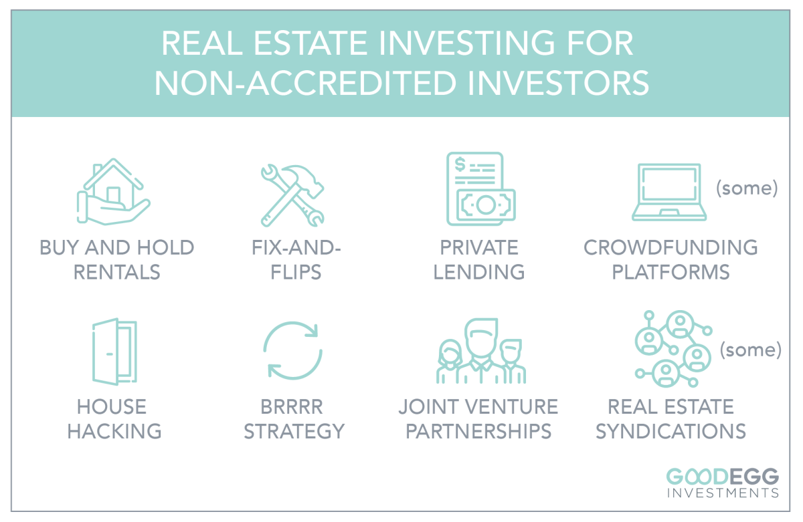

## Table of Contents

## What is crowdfunding and how does it work?

Crowdfunding is a way for people or groups to raise money for their projects or ideas by asking a lot of people to each give a small amount of money. It's like asking your friends and family for help, but on a much bigger scale, using the internet. People who want to start a project create a page on a crowdfunding website where they explain what they want to do and how much money they need. Then, anyone who likes the idea can give money to help make it happen.

There are different types of crowdfunding. Some platforms work on a reward basis, where people who give money get something back, like a product or a thank you gift. Other platforms are based on donations, where people give money just to support the cause without expecting anything in return. There are also platforms for lending money, where people give money and expect to get it back with interest. The key to successful crowdfunding is having a good idea and sharing it with as many people as possible to get their support.

## Who are non-accredited investors and what are their limitations?

Non-accredited investors are everyday people who don't meet the strict financial requirements set by the government to be considered "accredited." These requirements usually include having a high income or a lot of money and investments. Non-accredited investors can still invest in many things like stocks, mutual funds, and real estate, but they face more rules and limits compared to accredited investors.

One big limit for non-accredited investors is that they can't invest in certain private investments that are only open to accredited investors. These investments can be riskier but also have the potential for higher returns. To protect non-accredited investors, the government puts these limits in place because they believe these investors might not have the experience or money to handle the risks. So, while non-accredited investors have fewer options, the rules are meant to keep their money safer.

## What types of crowdfunding platforms are available for non-accredited investors?

There are a few types of crowdfunding platforms that non-accredited investors can use. The most common type is reward-based crowdfunding. On these platforms, people can give money to a project and get something in return, like a product or a thank-you gift. Popular sites like Kickstarter and Indiegogo are examples of this. Another type is donation-based crowdfunding, where people give money to support a cause or project without expecting anything back. Platforms like GoFundMe are used for this purpose.

There's also equity crowdfunding, but it's a bit different for non-accredited investors. Equity crowdfunding lets people invest money in a company and get a small piece of ownership in return. In the U.S., non-accredited investors can use platforms like Wefunder or StartEngine, but there are strict rules about how much they can invest. These rules are there to protect non-accredited investors from losing too much money on risky investments. So, while non-accredited investors can participate in equity crowdfunding, they need to be careful and follow the limits set by the law.

## How can non-accredited investors participate in crowdfunding?

Non-accredited investors can take part in crowdfunding by using different types of platforms. One common way is through reward-based crowdfunding on sites like Kickstarter and Indiegogo. Here, people can give money to a project they like and get something in return, like a product or a thank-you gift. Another way is through donation-based crowdfunding, where people support a cause or project without expecting anything back. Platforms like GoFundMe are used for this kind of crowdfunding.

Non-accredited investors can also try equity crowdfunding, where they invest money in a company and get a small piece of ownership in return. In the U.S., they can use platforms like Wefunder or StartEngine. But there are strict rules about how much non-accredited investors can invest in equity crowdfunding. These rules are there to protect them from losing too much money on risky investments. So, while they can participate, they need to be careful and follow the limits set by the law.

## What are the risks associated with crowdfunding for non-accredited investors?

Crowdfunding can be exciting for non-accredited investors, but it comes with risks. One big risk is that they might lose their money. This can happen if the project they invest in doesn't do well or doesn't finish. For example, if someone invests in a new product on a reward-based platform and the product never gets made, they might not get their money back or the reward they were promised.

Another risk is that non-accredited investors might not know much about the project they're investing in. They might not have the experience to understand if the project is a good idea or if it's too risky. This is especially true for equity crowdfunding, where they get a piece of a company. The rules limit how much non-accredited investors can invest to protect them, but they still need to be careful and do their homework before investing.

Overall, while crowdfunding can be a fun way to support new ideas and projects, non-accredited investors need to understand the risks. They should only invest money they can afford to lose and take the time to learn about the projects they're interested in. This way, they can enjoy the excitement of crowdfunding while being smart about their investments.

## What are the potential rewards and benefits of crowdfunding investments?

Crowdfunding can offer some great rewards for non-accredited investors. One big benefit is the chance to get new and cool products before anyone else. If you back a project on a reward-based platform like Kickstarter, you might get the product as a thank you for your support. This can be really exciting, especially if the product turns out to be popular. Another reward is the feeling of being part of something special. By supporting a project or cause you believe in, you can feel like you're making a difference and helping bring new ideas to life.

There are also financial benefits to consider. If you invest in equity crowdfunding, you might get a piece of the company you're supporting. If the company does well, the value of your investment could go up, and you could make money. Even though there are risks, the potential for a good return can be a big draw. Plus, crowdfunding lets you spread your money across different projects, which can help lower the risk compared to putting all your money into one thing. Overall, crowdfunding can be a fun and rewarding way to invest, as long as you're careful and understand what you're getting into.

## How can non-accredited investors assess the credibility of a crowdfunding project?

Non-accredited investors can assess the credibility of a crowdfunding project by looking at the team behind it. It's important to check if the people running the project have experience and a good track record. You can do this by reading their bios on the crowdfunding page and searching for them online to see what they've done before. If they have successfully completed similar projects or have a strong background in the field, that's a good sign. Also, look for any updates or comments they've posted. If they're clear and honest about their progress and challenges, it shows they're serious about making the project work.

Another way to check a project's credibility is to see what other people are saying about it. Look at the comments and feedback from other backers. If many people are excited and supportive, that's a positive sign. But if there are a lot of concerns or complaints, it might be a red flag. You can also check if the project has been featured in any news articles or blogs. If reputable sources are talking about it, it can add to its credibility. Lastly, make sure the project has a clear plan and realistic goals. If the timeline and budget seem reasonable, it's more likely to succeed.

## What are the legal and regulatory considerations for non-accredited investors in crowdfunding?

Non-accredited investors need to know about the rules that protect them when they invest in crowdfunding. In the U.S., the Securities and Exchange Commission (SEC) has rules that limit how much non-accredited investors can invest in equity crowdfunding. These rules are there to make sure people don't lose too much money on risky investments. For example, if you earn less than $107,000 a year, you can only invest up to $2,200 or 5% of your income or net worth, whichever is less. If you earn more, you can invest up to 10% of your income or net worth, but no more than $107,000. These limits help keep your money safe.

Another important thing to know is that different types of crowdfunding have different rules. Reward-based and donation-based crowdfunding don't have the same strict limits as equity crowdfunding, but they still have their own rules. For example, some platforms might have rules about when and how you can get your money back if a project fails. It's also important to read the terms and conditions of each platform carefully. They can tell you about any fees, how your personal information is used, and what happens if the project doesn't meet its goals. Knowing these rules can help you make smarter choices and avoid surprises.

## How does crowdfunding differ from traditional investment opportunities for non-accredited investors?

Crowdfunding is different from traditional investment opportunities because it lets non-accredited investors support projects and ideas they believe in, even if they don't have a lot of money. With traditional investments like stocks or mutual funds, you usually need to go through a broker or a financial institution. But with crowdfunding, you can go directly to a website, pick a project you like, and give money to help it happen. This makes it easier for everyday people to invest in new ideas and products.

Another big difference is the type of rewards you can get. In traditional investments, you might get money back through dividends or by selling your investment for more than you paid. But with crowdfunding, you can get rewards like new products, thank-you gifts, or even a piece of the company if you're doing equity crowdfunding. This can make investing more fun and personal. However, crowdfunding can be riskier because the projects might not succeed, so it's important to be careful and only invest money you can afford to lose.

## What strategies can non-accredited investors use to diversify their crowdfunding investments?

Non-accredited investors can diversify their crowdfunding investments by spreading their money across different types of projects. Instead of putting all their money into one project, they can choose a few different ones. This way, if one project doesn't work out, they won't lose all their money. They can invest in reward-based projects where they get a product, donation-based projects where they support a cause, and equity crowdfunding where they get a piece of a company. By mixing it up, they can lower their risk and still have the chance to support lots of different ideas.

Another strategy is to look at projects in different industries. For example, they can invest in tech projects, art projects, and health projects. This helps because if one industry has a tough time, the other industries might still do well. It's also a good idea to check how much money they're investing in each project. They should follow the rules about how much they can invest and make sure they're not putting too much money into any one project. By being careful and spreading their investments, non-accredited investors can enjoy the excitement of crowdfunding while keeping their money safe.

## How can non-accredited investors track and manage their crowdfunding investments effectively?

Non-accredited investors can track and manage their crowdfunding investments by keeping a record of all their investments. They should write down the name of each project, how much money they gave, and what kind of crowdfunding it is, like reward-based or equity crowdfunding. They can use a simple notebook or a spreadsheet on their computer to keep track of everything. It's also a good idea to check back on the crowdfunding platform to see how each project is doing. Many platforms have updates from the project creators, so investors can see if the project is moving forward or if there are any problems.

Another way to manage crowdfunding investments is to set reminders for important dates. For example, if they're waiting for a product from a reward-based project, they can set a reminder for when it's supposed to be delivered. If they've invested in an equity crowdfunding project, they might want to remind themselves to check the company's progress every few months. By staying organized and keeping up with their investments, non-accredited investors can make sure they don't miss out on any important updates and can enjoy the excitement of crowdfunding while being smart about their money.

## What advanced techniques can non-accredited investors use to maximize returns from crowdfunding?

Non-accredited investors can maximize their returns from crowdfunding by doing their homework on the projects they choose to invest in. They should look closely at the team behind the project, checking if they have experience and a good track record. Reading bios, searching online for past projects, and looking at how they communicate with backers can give clues about their credibility. It's also smart to read what other people are saying about the project. If many people are excited and supportive, that's a good sign. By choosing projects with strong teams and lots of support, investors can increase their chances of getting a good return.

Another technique is to spread their investments across different types of projects and industries. Instead of putting all their money into one project, they can invest smaller amounts in several projects. This way, if one project doesn't do well, they won't lose everything. They can mix reward-based projects, where they get a product, with equity crowdfunding, where they get a piece of a company. Investing in different industries, like tech, art, and health, can also help because if one industry struggles, others might still do well. By diversifying their investments and being careful about how much they invest in each project, non-accredited investors can lower their risk and improve their chances of making money from crowdfunding.

## What are Peer-to-Peer Lending Platforms?

Peer-to-peer (P2P) lending platforms facilitate the direct lending of money between individual investors and borrowers without the intervention of traditional financial institutions. These platforms act as intermediaries, providing a digital infrastructure where investors can browse and choose loans to fund, each with varying risk levels, interest rates, and terms.

### How P2P Lending Works

In a typical P2P lending model, investors sign up on a lending platform and create a profile. They can then access a marketplace of loan listings, where potential borrowers present their loan requests, detailing the loan amount, purpose, creditworthiness, and proposed [interest rate](/wiki/interest-rate-trading-strategies). Investors can choose to fund whole loans or parts of loans, thus spreading their investment across multiple borrowers to reduce risk.

The platform charges fees for facilitating the transactions and handling payment collections. Borrowers make fixed monthly payments, which include the principal and interest. Once received by the platform, these payments are distributed to the respective investors.

### Potential Returns

Returns from P2P lending can be attractive, often surpassing traditional savings accounts or certificates of deposit. The interest rates on these platforms typically range from 5% to 30%, depending on the borrower's credit risk. However, investors must account for default risks, which can affect overall returns.

To calculate expected returns, investors can use the formula for average loan yield $Y$:

$$
Y = \frac{\sum_{i=1}^{n} R_i \cdot L_i}{\sum_{i=1}^{n} L_i}
$$

where:
- $n$ is the total number of loans,
- $R_i$ is the return on the $i$-th loan, and
- $L_i$ is the loan amount invested in the $i$-th loan.

### Associated Risks

P2P lending is not without risks. The primary risk is borrower default, where the borrower fails to repay the loan. Platforms usually have mechanisms to mitigate this risk, such as credit scoring and recovery processes for late payments. Market risk and platform solvency risk, where the platform itself might face financial difficulties, can also impact investors.

Investors should be aware of the illiquid nature of P2P loans. Unlike stocks or bonds, loans cannot be easily sold before maturity unless the platform offers a secondary market, which might involve additional fees.

### Tools for Risk Assessment

P2P platforms provide various tools to help investors assess and manage the risk of their portfolios. Common tools include:

1. **Credit Scores and Reports:** Platforms often provide credit scores to indicate borrower reliability.

2. **Automated Investment Tools:** Many platforms offer algorithms that automatically distribute investments according to predefined risk preferences.

3. **Diversification Options:** Some platforms suggest diversification strategies to minimize risk, such as setting limits on the amount invested in a single loan.

4. **Secondary Markets:** Some platforms offer a secondary market for investors to buy or sell existing loans, allowing greater flexibility.

By using these tools, investors can make informed decisions, balance their portfolios, and adapt to changing market conditions, ultimately enhancing the potential for profitable returns while managing associated risks.

 to Algorithmic Trading for Non-Accredited Investors

Algorithmic trading, often referred to as algo trading, employs computer algorithms to execute securities trades at optimal speeds and prices, enabling retail investors to participate in markets previously dominated by institutional entities. These sophisticated algorithms are designed to [carry](/wiki/carry-trading) out trading strategies by processing various market signals and executing transactions based on predefined criteria.

One of the core components of [algorithmic trading](/wiki/algorithmic-trading) is the use of quantitative models to identify potential trading opportunities. These models are based on statistical data and historical market performance, facilitating the development of strategies that can predict price movements. This process typically involves various mathematical techniques such as moving averages, mean reversion, and [momentum](/wiki/momentum) strategies. For instance, a simple moving average crossover strategy might look like this in Python:

```python
import pandas as pd

# Fetch historical price data
data = pd.read_csv('historical_prices.csv')

# Calculate moving averages
short_window = 40
long_window = 100

data['Short_Mavg'] = data['Close'].rolling(window=short_window).mean()
data['Long_Mavg'] = data['Close'].rolling(window=long_window).mean()

# Generate signals
data['Signal'] = 0.0  
data['Signal'][short_window:] = np.where(data['Short_Mavg'][short_window:] 
                                          > data['Long_Mavg'][short_window:], 1.0, 0.0)   

# Identify trade entry and exit points
data['Positions'] = data['Signal'].diff()
```

For non-accredited investors, accessing algorithmic trading platforms has become more feasible, thanks to the proliferation of user-friendly applications and technology services. These platforms often provide APIs and tools that allow investors to backtest their strategies on historical data and execute them in live markets.

A significant advantage of algorithmic trading is its ability to process large volumes of data quickly and to execute trades with a precision that human traders cannot match. This efficiency leads to reduced transaction costs, minimized human error, and opportunities to capitalize on fleeting market inefficiencies. Additionally, algorithms can operate continuously without succumbing to emotional decision-making, which can enhance consistency in trading.

However, algo trading is not without its risks. The reliance on technology means that system failures or bugs can lead to significant financial losses. Furthermore, market conditions can change rapidly, rendering some algorithms ineffective if not regularly updated and monitored. Additionally, high-frequency trading, a subset of algorithmic trading, can lead to market [volatility](/wiki/volatility-trading-strategies) and has been a source of regulatory scrutiny.

Non-accredited investors should carefully evaluate the algo trading platforms available to them, considering factors such as fees, ease of use, and the ability to customize or create proprietary algorithms. They should also be aware of the legal and regulatory environment, ensuring compliance with securities laws and understanding the limits imposed on them by regulatory bodies.

In conclusion, while algorithmic trading offers retail investors unprecedented access to sophisticated trading strategies, it requires a solid understanding of both the underlying algorithms and the markets in which they operate. With careful consideration and strategic planning, non-accredited investors can leverage algorithmic trading to enhance their investment portfolios.

## References & Further Reading

[1]: Jumpstart Our Business Startups (JOBS) Act, 2012. U.S. Securities and Exchange Commission. ["Jumpstart Our Business Startups Act"](https://www.sec.gov/rules-regulations/jumpstart-our-business-startups-jobs-act)

[2]: Mollick, E. (2014). "The dynamics of crowdfunding: An exploratory study." Journal of Business Venturing, 29(1), 1-16. [Link to article](https://www.sciencedirect.com/science/article/pii/S088390261300058X)

[3]: Agrawal, A., Catalini, C., & Goldfarb, A. (2014). "Some Simple Economics of Crowdfunding." Innovation Policy and the Economy, 14(1), 63-97. [DOI: 10.1086/674024](https://www.researchgate.net/publication/272543487_Some_Simple_Economics_of_Crowdfunding)

[4]: ["Investing in Real Estate Crowdfunding: Understanding the Risks and Rewards"](https://www.investopedia.com/ask/answers/100214/what-real-estate-crowdfunding.asp) - Nasdaq

[5]: Lopez de Prado, M. (2018). ["Advances in Financial Machine Learning."](https://www.amazon.com/Advances-Financial-Machine-Learning-Marcos/dp/1119482089) John Wiley & Sons.

[6]: Broby, D. (2017). "The Use of Algorithmic Trading Strategies in Investment Management." Journal of Computational Finance, 10(4), 1-18. [Link to article](https://journals.sagepub.com/doi/10.1111/poms.13147?icid=int.sj-abstract.citing-articles.244)

[7]: Kaal, W. A., & Dell’Erba, M. (2014). "Peer-to-Peer Lending: New Regulatory Challenges for an Expanding Industry." University of St. Thomas Law Journal, 11(2), 501. [Link to article](https://ir.stthomas.edu/ustlj/vol11/iss2/4/)

[8]: Rehberger, K. (2019). ["Machine Learning for Algorithmic Trading"](https://github.com/PacktPublishing/Machine-Learning-for-Algorithmic-Trading-Second-Edition) by Stefan Jansen

[9]: Chan, E. P. (2009). ["Quantitative Trading: How to Build Your Own Algorithmic Trading Business."](https://github.com/ftvision/quant_trading_echan_book) John Wiley & Sons.