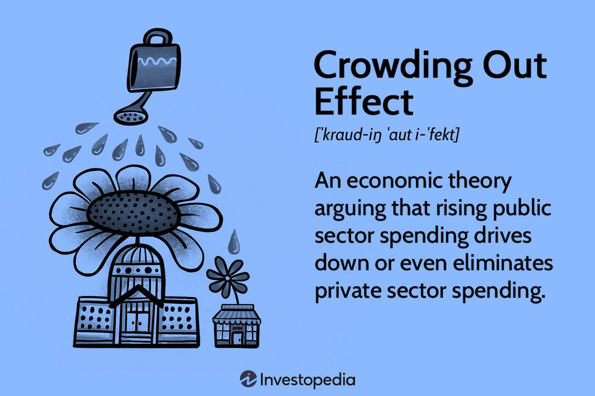

## Table of Contents

## What is institutional trading?

Institutional trading refers to the buying and selling of large quantities of securities by institutions, like banks, insurance companies, and mutual funds. These big players in the market have a lot of money to invest, so they trade in large volumes, which can impact the market prices of the securities they are trading.

Because they handle such large amounts, institutional traders often use sophisticated strategies and tools to manage their trades. They might use algorithms and computer programs to make quick and efficient trades. This type of trading is different from retail trading, where individual investors buy and sell smaller amounts of securities.

## What are crowding effects in financial markets?

Crowding effects in financial markets happen when lots of investors start buying the same thing at the same time. This can push up the price of that investment, like a stock or a bond, because there are so many people wanting to buy it. It's a bit like when everyone wants to get into a popular club, and the line gets really long, making it harder to get in.

When too many investors crowd into the same investment, it can create problems. If something goes wrong with that investment, everyone might want to sell at the same time, causing the price to drop quickly. This can lead to big losses for the investors and can even affect the whole market. It's important for investors to be aware of crowding effects and not just follow the crowd without thinking about the risks.

## How do crowding effects specifically impact institutional trading?

Crowding effects can be a big problem for institutional traders because they handle a lot of money. When many big investors like pension funds or hedge funds all buy the same thing, it can make the price go up a lot. This is because their trades are so big that they can move the market. If institutional traders see that a lot of other big players are buying something, they might want to buy it too, thinking it's a good investment. But if too many of them do this, it can create a bubble where the price is much higher than it should be.

When the bubble bursts, it can be really bad for institutional traders. If something goes wrong with the investment, everyone might want to sell at the same time. This can make the price drop really fast, and since institutional traders have so much money in the investment, they can lose a lot. It's like trying to get out of a crowded room in a hurry; everyone pushing to get out can cause a panic. Institutional traders need to be careful and think about the risks of following the crowd too closely.

## What are the common causes of crowding in institutional trading?

Crowding in institutional trading often happens because big investors see the same opportunities. They might all read the same reports or listen to the same experts who say a certain stock or bond is a good buy. When they see other big investors buying something, they might think it's a safe bet and want to buy it too. This can lead to a lot of big players putting their money into the same thing, making it crowded.

Another reason for crowding is when institutional traders use similar strategies or computer programs to make their trades. These programs might all pick the same investments based on the same data. When everyone's computer is telling them to buy the same thing, it can cause a lot of buying in one place. This can make the price go up a lot and create crowding in the market.

## Can you explain the difference between crowding and herding in trading?

Crowding and herding in trading are related but a bit different. Crowding happens when a lot of big investors, like banks or funds, all buy the same thing at the same time. This can make the price of that investment go up because there are so many people wanting to buy it. It's like when everyone wants to go to the same party, and the place gets really packed.

Herding is when investors start doing what everyone else is doing without thinking much about it. They see others buying something and think, "Oh, that must be a good idea, I'll do that too!" It's like following the crowd without checking if it's the right way to go. Herding can lead to crowding, but not all crowding comes from herding. Sometimes, big investors might all see the same good opportunity and decide to buy it, even if they're not just following the crowd.

## What are the potential risks associated with crowding effects in institutional trading?

Crowding effects in institutional trading can be risky. When a lot of big investors all buy the same thing, it can push the price up a lot. This can make the investment seem more valuable than it really is. If something goes wrong, like bad news about the company, everyone might want to sell at the same time. This can cause the price to drop really fast, leading to big losses for the investors. It's like when everyone tries to leave a crowded room at once; it can turn into a panic.

Another risk is that crowding can make the whole market less stable. If a lot of big investors are all in the same investments, any problem with those investments can affect the whole market. This can lead to more ups and downs in the market, making it harder for everyone to make good investment choices. Institutional traders need to be careful and think about these risks when they see a lot of other big players buying the same thing.

## How can institutional traders identify crowding effects in their strategies?

Institutional traders can identify crowding effects by looking at how much other big investors are buying the same things they are. They can use data to see if a lot of other big players are putting their money into the same stocks or bonds. If they see that many others are doing the same thing, it might be a sign of crowding. They can also pay attention to what other traders are saying or doing, like if everyone is talking about the same investment as a good buy.

Another way to spot crowding is by watching how the price of an investment changes. If the price goes up a lot in a short time, and it seems like it's because a lot of big investors are buying it, that could be a sign of crowding. Institutional traders can use special tools and computer programs to help them see these patterns and understand if the price is going up because of crowding. By keeping an eye on these signs, they can make better choices about when to buy or sell.

## What historical examples illustrate the impact of crowding effects in institutional trading?

One big example of crowding effects in institutional trading happened during the dot-com bubble in the late 1990s and early 2000s. A lot of big investors thought that internet companies were going to make a lot of money, so they all started buying their stocks. This made the prices of these stocks go up a lot, even though many of the companies were not making any profit yet. When people realized that these companies might not be as valuable as they thought, everyone wanted to sell at the same time. This caused the prices to drop really fast, and many investors lost a lot of money. It was a clear case of crowding where too many big investors were all in the same place, making the market unstable.

Another example is the 2008 financial crisis, where crowding effects played a big role. Many big banks and investors were buying the same kind of risky investments, like mortgage-backed securities. They thought these were safe bets because everyone else was buying them too. But when the housing market started to fall, these investments became worthless. Since so many big players had put their money into the same thing, it caused a huge panic when everyone tried to sell at once. This led to big losses and even caused some banks to fail, showing how dangerous crowding can be when too many big investors follow the same path.

## What strategies can institutional traders use to mitigate the risks of crowding?

Institutional traders can use different strategies to avoid the dangers of crowding. One way is to spread out their investments, so they don't have all their money in the same place. If they see that a lot of other big investors are buying the same thing, they might choose to buy something different. This can help them avoid big losses if everyone else decides to sell at the same time. Another strategy is to use special tools and computer programs to watch the market closely. These tools can help them see when a lot of other investors are crowding into the same investment, so they can make better choices about when to buy or sell.

Another way to manage the risks of crowding is for institutional traders to do their own research instead of just following what everyone else is doing. If they take the time to really understand an investment, they might find good opportunities that others are missing. This can help them avoid the crowded spots in the market. Also, they can talk to other traders and share information to get a better picture of what's happening. By being careful and thinking about the risks of crowding, institutional traders can make smarter choices and protect their investments better.

## How do regulatory frameworks address crowding effects in institutional trading?

Regulatory frameworks try to keep financial markets fair and safe. They do this by making rules that stop too much crowding from happening. For example, they might ask big investors to share information about what they are buying and selling. This way, everyone can see if too many big players are all going after the same thing. Regulators might also set limits on how much of one investment a big investor can buy, so they don't put all their money in one place and cause crowding.

Another way regulators help is by making sure that big investors use good practices when they trade. They might check to make sure that the computer programs big investors use are not making the market too crowded. They can also watch the market to see if crowding is happening and step in if it starts to cause problems. By doing these things, regulators try to keep the market stable and stop big investors from making choices that could hurt everyone.

## What role does technology play in managing or exacerbating crowding effects?

Technology plays a big role in both managing and making crowding effects worse in trading. On one hand, computer programs and special tools help big investors see when crowding is happening. These tools can look at a lot of data really fast and spot when a lot of other big players are buying the same thing. This helps traders make better choices and avoid crowded spots in the market. By using technology, they can spread out their investments and lower the risk of losing a lot of money if everyone decides to sell at the same time.

On the other hand, technology can also make crowding effects worse. When big investors use the same computer programs to pick their investments, these programs might all choose the same thing based on the same data. This can lead to a lot of buying in one place, making the price go up a lot and creating crowding. Also, if everyone is using technology to trade really fast, it can cause a big rush to buy or sell, which can make the market unstable. So, while technology helps manage crowding, it can also make it a bigger problem if not used carefully.

## What advanced quantitative methods are used to model and predict crowding effects in institutional trading?

Advanced quantitative methods help big investors understand and predict crowding effects in the market. One way they do this is by using big data and computer programs to look at lots of information really fast. These programs can spot patterns and see when a lot of other big investors are buying the same thing. They can also use math to figure out how likely it is that crowding will happen and how bad it might be. By doing this, traders can make better choices about where to put their money and avoid crowded spots in the market.

Another method is called network analysis. This is when traders use computers to look at how different investors are connected and how they affect each other. If a lot of big investors are all buying the same thing, network analysis can show how this might cause crowding. It's like drawing a map of who is doing what in the market. By understanding these connections, traders can predict when crowding might happen and take steps to protect their investments. These advanced methods help make the market safer and more stable by giving traders the tools they need to see and avoid crowding effects.

## References & Further Reading

[1]: Bucci, F., Mastromatteo, I., Eisler, Z., Lillo, F., & Bouchaud, J.-P. (2019). ["Co-impact: Crowding effects in institutional trading activity."](https://www.tandfonline.com/doi/full/10.1080/14697688.2019.1660398) Science Advances, 5(9).

[2]: Kyle, A. S., & Obizhaeva, A. A. (2016). ["Market Microstructure Invariants: Theory and Empirical Evidence."](https://onlinelibrary.wiley.com/doi/abs/10.3982/ECTA10486) Econometrica, 84(4), 1345-1404.

[3]: Kissell, R. (2014). ["The Science of Algorithmic Trading and Portfolio Management."](https://www.sciencedirect.com/book/9780124016897/the-science-of-algorithmic-trading-and-portfolio-management) Academic Press.

[4]: Hasbrouck, J. (2007). ["Empirical Market Microstructure: The Institutions, Economics, and Econometrics of Securities Trading."](https://academic.oup.com/book/52241) Oxford University Press.

[5]: Hens, T., & Schenk-Hoppé, K. R. (Editors). (2009). ["Handbook of Financial Markets: Dynamics and Evolution."](https://shop.elsevier.com/books/handbook-of-financial-markets-dynamics-and-evolution/hens/978-0-12-374258-2) Elsevier.

[6]: Hilpisch, Y. (2018). ["Python for Finance: Mastering Data-Driven Finance."](https://www.amazon.com/Python-Finance-Mastering-Data-Driven/dp/1492024333) O'Reilly Media.