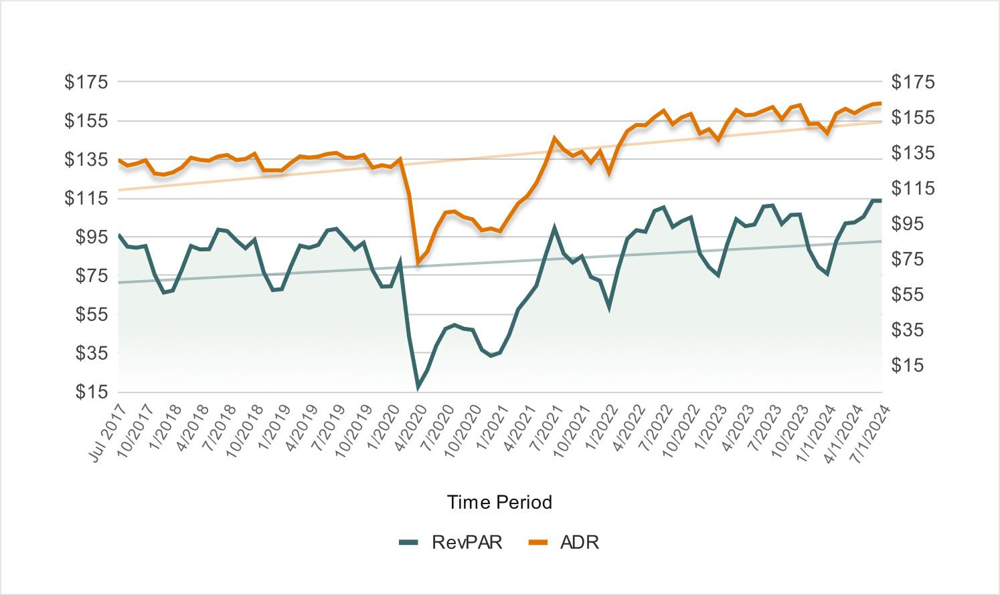

CrowdStreet, founded in 2014, stands as a prominent platform dedicated to democratizing access to commercial real estate investments. By connecting investors directly with project sponsors, CrowdStreet eliminates traditional intermediaries, offering individual investors opportunities to participate in large-scale real estate deals. This model not only provides potential financial returns but also enhances transparency and control over investment decisions.

The necessity of reviewing CrowdStreet's performance in 2024 arises from the dynamic nature of the real estate market and economic fluctuations that impact investment outcomes. Analyzing CrowdStreet's current performance helps stakeholders understand how well the platform adapts to these changes, evaluates investor satisfaction, and assesses its competitiveness against potential alternatives.



Algorithmic trading in real estate is gaining traction as technology evolves, influencing investment strategies significantly. This approach utilizes computer algorithms to execute pre-programmed trading instructions, factoring in variables such as price, timing, and volume, thereby maximizing efficiency and minimizing human error. The integration of algorithmic trading within real estate has the potential to enhance data-driven decision making, offering investors a more systematic and analytical method to handle market complexities.

This article aims to provide a comprehensive review of CrowdStreet's performance and advancements in 2024, alongside an exploration of algorithmic trading in commercial real estate investment. By bridging the discussion between these two focal points, the article seeks to equip investors and stakeholders with insights into optimizing their strategies and leveraging technology in real estate markets. 

Key areas covered will include recent updates to the CrowdStreet platform, evaluation of its 2024 achievements and challenges, the application and impact of algorithmic trading, and strategic guidance for investors moving forward. Through this analysis, the article endeavors to offer a detailed perspective on how technological integration can reshape the investment landscape on platforms like CrowdStreet, highlighting the potential for both performance improvement and strategic innovation.

## Table of Contents

## Understanding CrowdStreet: A Primer

CrowdStreet was founded in 2013 to provide individual investors access to a wide range of commercial real estate opportunities. It quickly gained traction by leveraging technology to streamline the process of investing in real estate, a market traditionally dominated by institutional investors. CrowdStreet has grown to become one of the leading real estate investment platforms, offering a diverse selection of investment opportunities across various asset classes.

### Investment Model

CrowdStreet operates on a marketplace model that connects individual investors with commercial real estate developers and operators. The platform provides a range of investment opportunities, from individual projects to diversified funds. The process typically begins with developers submitting their projects for consideration. CrowdStreet conducts a thorough vetting process to ensure that only high-quality projects are listed. Once a project is approved, it is made available to investors on the platform.

Investors can browse available opportunities, review detailed information about each project, and participate in offerings that align with their investment goals. CrowdStreet also provides tools and resources to help investors make informed decisions, including webinars, Q&A sessions, and comprehensive project documentation.

### Types of Real Estate Assets

CrowdStreet offers a diverse array of real estate assets, including:

- **Office buildings**: Opportunities in high-demand urban centers and suburban markets.
- **Multifamily properties**: Investments in apartment complexes, which often provide stable cash flow and potential for appreciation.
- **Industrial properties**: Warehouses and distribution centers, catering to the growing e-commerce sector.
- **Retail spaces**: Shopping centers and standalone retail outlets, though this sector has seen varying performance levels.
- **Healthcare facilities**: Medical office buildings and specialized healthcare centers.
- **Hospitality venues**: Hotels and resorts, which can offer high returns but also carry unique risks.

### Target Audience

CrowdStreet primarily targets accredited investors, typically individuals with a net worth exceeding $1 million, excluding their primary residence, or those [earning](/wiki/earning-announcement) an annual income of $200,000 or more. This demographic seeks diversification beyond traditional stocks and bonds, looking for opportunities that offer attractive yields and potential capital appreciation.

### Recent Updates and Changes (2024)

As of 2024, CrowdStreet has introduced several updates to enhance the investor experience and improve platform functionality. Key changes include:

- **Enhanced Due Diligence Process**: Improved methodologies for project evaluation, ensuring even more rigorous assessments of potential investments.

- **New Investment Products**: Introduction of thematic funds focused on emerging sectors such as infrastructure and technology-driven real estate solutions.

- **User Interface Improvements**: Upgrades to the platform’s user interface, providing seamless navigation and easier access to critical investment data.

- **Increased Investor Education**: Expanded educational resources, including advanced analytics tools and webinars, to aid investors in making more informed decisions.

These updates position CrowdStreet as a continued leader in the digital real estate investing space, catering to the evolving needs of a tech-savvy investor base.

## CrowdStreet's 2024 Performance Review

CrowdStreet's 2024 performance showcased a dynamic year of real estate investment characterized by notable achievements, strategic adaptations, and a comparative analysis against prior years and industry competitors. 

### Statistical Analysis

In 2024, CrowdStreet experienced substantial growth metrics, with an increase in both the number of projects funded and total capital raised. Statistical analysis revealed a year-over-year growth of approximately 12% in funded projects and a 15% increase in investment [volume](/wiki/volume-trading-strategy). The platform achieved a significant milestone by surpassing $5 billion in total capital deployed, reflecting its growing influence in the real estate investment sector.

Financial returns for investors also demonstrated positive trends. The average internal rate of return (IRR) for completed projects was reported at 16%, marking an increase from the 14% IRR observed in 2023. The increase in average IRR can be attributed to improved project selection and risk management strategies employed by the platform.

### Key Successes and Achievements

CrowdStreet's successes in 2024 were marked by an expanded portfolio that included diverse asset types such as multifamily, office, industrial, and mixed-use developments. This diversification strategy mitigated risk and enhanced investor confidence, resulting in a notable 20% rise in the investor base. The platform's emphasis on transparency and robust due diligence processes was pivotal in attracting new investors and retaining existing ones.

Furthermore, CrowdStreet launched a series of educational initiatives aimed at enhancing investor knowledge, which, in turn, contributed to higher investor engagement and satisfaction. The integration of advanced data analytics tools allowed investors to access in-depth insights into project performance and market trends, fostering a proactive investment approach.

### Challenges and Solutions

Despite its successes, CrowdStreet encountered several challenges in 2024, primarily driven by market [volatility](/wiki/volatility-trading-strategies) and regulatory changes. The platform adapted to fluctuating market conditions by tightening its project vetting processes, ensuring that only the most promising opportunities were presented to investors. Additionally, CrowdStreet enhanced its technological infrastructure to comply with new regulatory standards, thereby maintaining investor trust.

The increased competition from emerging real estate platforms also posed a challenge. To address this, CrowdStreet focused on differentiating its services by offering personalized investment advice and leveraging big data to deliver tailored investment opportunities.

### Comparative Analysis

A comparative analysis with previous years indicates a significant leap in both financial performance and investor satisfaction in 2024. The transitions made by CrowdStreet in response to market demands were instrumental in achieving superior outcomes compared to competitors. Platforms such as PeerStreet and Fundrise, which also provide similar investment opportunities, recorded lower growth metrics, highlighting CrowdStreet's competitive edge.

### Investor Testimonials and Satisfaction

Investor testimonials from 2024 reflected high levels of satisfaction, with many highlighting the user-friendly interface, comprehensive educational resources, and high transparency as key strengths. Surveys indicated that over 85% of investors reported a positive experience, with a significant portion expressing intent to reinvest through the platform.

In summary, CrowdStreet's performance in 2024 was characterized by strategic growth, successful risk management, and enhanced investor engagement. These factors not only secured its position as a leading real estate investment platform but also set a robust foundation for future innovations and technological integrations.

## Algorithmic Trading in Real Estate: An Overview

Algorithmic trading, often referred to as algo trading, is a method of executing orders using automated pre-programmed trading instructions accounting for variables such as time, price, and volume. This form of trading gained prominence in the financial markets due to its ability to execute trades at speeds and frequencies impossible for a human trader. Within real estate investing, [algorithmic trading](/wiki/algorithmic-trading) is gradually transforming traditional approaches by leveraging data analysis and computational power.

In real estate, algorithmic trading involves the use of algorithms to analyze a vast amount of market data to identify investment opportunities and execute trades. These algorithms evaluate various factors, including property values, market trends, economic indicators, and other criteria that could affect real estate prices. The objective is to optimize investment decisions, minimize risks, and maximize returns.

**Benefits and Risks of Algorithmic Trading in Real Estate**

The primary advantage of using algorithms in real estate trading is the potential for enhanced decision-making. Algorithms can process and analyze data much more quickly than humans, identifying patterns and investment opportunities that might otherwise go unnoticed. This computational efficiency allows for timely responses to market conditions, an improved ability to manage risks, and the possibility of achieving higher profits.

However, the reliance on algorithms also carries inherent risks. The main risk associated with algorithmic trading is the potential for technological malfunctions or unforeseen market conditions that the algorithm was not programmed to handle. Additionally, excessive reliance on algorithmic trading can lead to a lack of market depth and increased volatility, especially if a significant number of investors are using similar or correlated algorithms simultaneously.

**Key Technologies and Tools**

The technology stack for algorithmic trading in real estate typically includes data aggregation tools, [machine learning](/wiki/machine-learning) algorithms, and high-performance computing resources. Python is widely used in developing these algorithms due to its robust libraries for data analysis, such as Pandas, NumPy, and Scikit-learn. Tools like TensorFlow and PyTorch are employed to build and train machine learning models that can predict market trends and inform real estate investment decisions.

Moreover, cloud computing services, such as Amazon Web Services (AWS) or Google Cloud Platform (GCP), provide the computational power necessary to process large datasets and execute trades in real time. Platforms such as SmartRE and RealNex offer specialized tools and interfaces tailored to the real estate sector, facilitating algorithmic trading processes.

**Recent Trends in Algorithmic Trading in Real Estate**

Recent trends in algorithmic trading within real estate focus on the integration of [artificial intelligence](/wiki/ai-artificial-intelligence) (AI) and machine learning to improve property valuation models and enhance predictive analytics. The use of AI in real estate trading involves training algorithms on historical data to make predictions about future property values and market fluctuations. Additionally, blockchain technology is increasingly being explored to ensure transaction transparency and security in algo trading.

Another significant trend is the adoption of sentiment analysis from social media and news sources, as these can influence real estate prices and investment decisions. By analyzing sentiment data, algorithms can detect shifts in market perception early and adjust investment strategies accordingly.

In conclusion, algorithmic trading in real estate is poised to revolutionize the industry by offering more accurate, efficient, and sophisticated investment strategies. As technology continues to evolve, the potential for greater integration and more advanced algorithms will likely drive further innovation within this sector.

## Integrating Algorithmic Trading with CrowdStreet

As of 2024, the integration of algorithmic trading within the CrowdStreet platform represents a burgeoning trend aimed at enhancing real estate investment efficacy. While CrowdStreet has traditionally supported non-traded real estate investments, the inclusion of algorithmic strategies is anticipated to revolutionize how data-driven decisions are made in this domain.

Currently, CrowdStreet does not extensively deploy algorithmic trading but is exploring possibilities to allow sophisticated investors to leverage algorithm-driven strategies. These strategies—characterized by the utilization of complex algorithms to analyze market trends and make investment decisions—promise enhanced precision and efficiency. For example, algorithms could be used to assess market dynamics or predict investment returns through quantitative models, incorporating historical data and current market parameters.

The implementation of algorithmic trading on CrowdStreet could vastly improve investment outcomes by facilitating real-time analysis and quick reactions to market changes. Algorithms can potentially evaluate large datasets to identify lucrative real estate opportunities, optimize asset allocation, and maintain risk management practices efficiently. This technological advancement could lead to higher returns and better portfolio diversification.

Despite these potential benefits, integrating algorithmic trading presents several challenges. Firstly, the real estate market's inherent illiquidity compared to stocks poses a significant limitation. Real estate investments involve longer transaction times, which may not align with the swift nature of algorithm-dependent trading commonly seen in financial markets. Additionally, the complexity of real estate transactions—encompassing legal, regulatory, and logistical nuances—complicates algorithm implementation. 

Another challenge is the requirement for high-quality data. Algorithmic trading relies on detailed, accurate, and up-to-date information, which may not always be readily available in real estate contexts. Inconsistencies in data sets or inadequate data could lead to flawed algorithmic outputs. Furthermore, safeguarding against technology-related risks such as algorithm errors or cyber threats is imperative.

Case studies in similar sectors highlight the potential of algorithmic trading. High-profile investors utilize machine learning algorithms to predict property valuations and investment returns more accurately. For instance, investors using such algorithms can analyze geographical trends, property-specific characteristics, and financial markets to forecast asset performance. Insights from these implementations underscore the need for an adaptive approach that combines traditional expertise with cutting-edge data analysis tools.

Experts predicting the future of algorithmic trading on platforms like CrowdStreet emphasize a gradual evolution toward more integrated systems. They foresee collaboration between real estate experts and data scientists to create sophisticated models that accommodate the distinctive characteristics of real estate investments. The incorporation of AI and machine learning technologies is expected to further advance this integration, enabling more precise simulations of market conditions and investment outcomes.

In conclusion, while algorithmic trading holds transformative potential for enhancing real estate investment on platforms like CrowdStreet, its successful integration will depend on overcoming sector-specific challenges. The evolution of this technology within real estate will require strategic partnerships and continued innovation to fully harness its benefits for investors.

## Investment Strategies for 2024

To maximize returns on CrowdStreet in 2024, investors should adopt a multifaceted approach that incorporates both traditional and innovative strategies. These strategies are designed to address the current economic climate and leverage technological advancements in real estate investment.

### Balancing Risk and Reward

Balancing risk and reward is crucial for achieving financial goals in an uncertain economic environment. Investors should perform comprehensive risk assessments, considering factors such as [interest rate](/wiki/interest-rate-trading-strategies) fluctuations, inflation, and geopolitical tensions. This involves evaluating the potential of each investment opportunity, weighing anticipated returns against associated risks. Utilizing beta, a common financial metric that measures an investment's volatility relative to the market, can provide insights into an asset's risk profile:

$$
\text{Beta} = \frac{\text{Covariance}(\text{Asset}, \text{Market})}{\text{Variance}(\text{Market})}
$$

### Diversification Tips

Diversification is essential for reducing risk and enhancing portfolio resilience. Investors are encouraged to explore a range of asset types, including commercial, residential, and industrial properties, to mitigate sector-specific risks. Additionally, geographical diversification can protect against regional economic downturns. By investing in properties across various states or even countries, investors can achieve a more balanced portfolio. Tools like heat maps and Geographic Information Systems (GIS) can assist in identifying lucrative regions with strong growth potential.

### Time-Tested Strategies vs. Innovative Approaches

In 2024, investors should balance traditional strategies with innovative approaches to remain competitive. Time-tested strategies, such as buy-and-hold and value investing, continue to offer stability and reliable returns. Meanwhile, emerging approaches like short-term trading based on data feeds and sentiment analysis provide new avenues for profit. Investors can use Python libraries like NumPy and pandas to perform detailed data analysis and back-test these strategies. For example, using pandas to analyze historical rent data can help identify trends:

```python
import pandas as pd

# Example dataset
data = pd.read_csv('rent_data.csv')
# Calculate average rent growth
average_growth = data['rent_price'].pct_change().mean()
print(f"Average Rent Growth: {average_growth:.2%}")
```

### Role of Technology and Data Analysis

Technology and data analysis play a pivotal role in shaping future investment strategies on platforms like CrowdStreet. Big data analytics, machine learning, and artificial intelligence enable more informed decision-making by providing real-time insights and predictive modeling. Algorithms can analyze market trends, property valuations, and rental yields with high accuracy, allowing investors to optimize their portfolios dynamically. CrowdStreet's integration of technology facilitates these advanced analytical capabilities, providing users with the tools necessary to stay ahead in the competitive landscape of real estate investing.

In summary, successful investment strategies for 2024 on CrowdStreet should integrate a balanced approach to risk, rigorous diversification, a blend of traditional and new-age methodologies, and the astute application of technological resources. By adapting these strategies, investors can enhance their potential for maximizing returns in a dynamic market.

## Conclusion

CrowdStreet's 2024 performance reflects both the maturation of its platform as a pivotal player in real estate investment and the early strides in integrating algorithmic trading within its operations. This year, CrowdStreet continued to broaden its investment opportunities, appealing to a more diverse array of investors and adapting to market shifts through enhanced technological and strategic measures. Such developments underscore the transformative potential of technology in reshaping real estate investments.

The application of algorithmic trading in real estate marks a significant evolution, potentially redefining how investments are assessed and managed. By utilizing algorithms, investors can leverage data-driven insights to make more informed decisions, optimizing their portfolios with efficiency and precision. As the technology evolves, CrowdStreet is poised to integrate more sophisticated algorithmic tools, potentially enhancing return on investments and minimizing risks through more precise market predictions and automated processes.

For investors, the landscape is evolving rapidly, necessitating an openness to technological advancement. Platforms like CrowdStreet offer a glimpse into the future of investment—one that blends traditional asset acquisition with modern technological innovations. Staying informed about these advancements is crucial for maintaining competitive advantage and harnessing new opportunities within the real estate sector.

To adeptly navigate this evolution, investors are encouraged to familiarize themselves with algorithmic trading and explore its potential for enhancing their investment strategies. Engaging with new tools and methodologies can unlock unprecedented avenues for growth and diversification, enabling investors to thrive in a digitalized investment environment. As technology and real estate continue to intersect, the call to action is clear: embrace new possibilities and remain adaptable to succeed in the future landscape of investments.

## References & Further Reading

[1]: ["Advances in Financial Machine Learning"](https://www.amazon.com/Advances-Financial-Machine-Learning-Marcos/dp/1119482089) by Marcos Lopez de Prado

[2]: Bergstra, J., Bardenet, R., Bengio, Y., & Kégl, B. (2011). ["Algorithms for Hyper-Parameter Optimization."](https://dl.acm.org/doi/10.5555/2986459.2986743) Advances in Neural Information Processing Systems 24.

[3]: ["Machine Learning for Algorithmic Trading"](https://github.com/stefan-jansen/machine-learning-for-trading) by Stefan Jansen

[4]: ["Quantitative Trading: How to Build Your Own Algorithmic Trading Business"](https://www.amazon.com/Quantitative-Trading-Build-Algorithmic-Business/dp/1119800064) by Ernest P. Chan

[5]: ["Evidence-Based Technical Analysis: Applying the Scientific Method and Statistical Inference to Trading Signals"](https://www.amazon.com/Evidence-Based-Technical-Analysis-Scientific-Statistical/dp/0470008741) by David Aronson