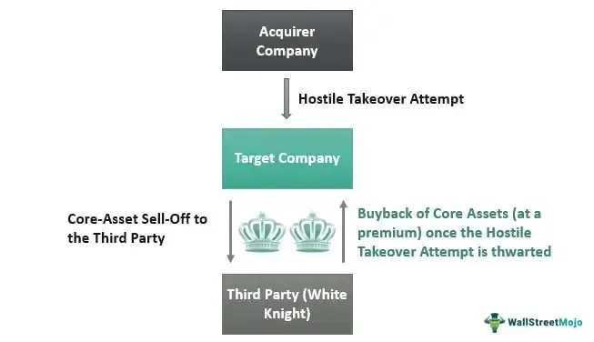

Algorithmic trading and the concept of 'crown jewels' present a deeply intertwined relationship in the corporate sphere, where the value of high-profile assets significantly influences business strategies and financial practices. The term 'crown jewels' refers to the most valuable and critical assets of a company, which may include intellectual property, key patents, proprietary technology, or important client contracts. These assets are fundamental not only to a corporation's current profitability but also to its long-term strategic positioning and future growth prospects.

Algorithmic trading, as a method of executing orders using automated and pre-programmed trading instructions, is increasingly prominent in modern finance due to its efficiency, speed, and ability to handle large data sets. The choice and structure of algorithms can be heavily impacted by the presence of a company's crown jewels. For instance, trading algorithms might carefully monitor variations in the valuation or status of these high-value assets, adjusting positions accordingly to protect or capitalize on these shifts.



Protecting crown jewels is essential in maintaining competitive advantage. The exposure or loss of these key assets can lead to significant disadvantage in business operations and market competition. In the context of algorithmic trading, the safeguarding of such assets becomes a multi-layered task involving risk management strategies and real-time data analytics. As trading algorithms incorporate artificial intelligence and advanced analytics, their ability to respond to changes or threats related to crown jewels is becoming an integral part of financial strategy.

The focus on preserving valuable corporate assets is magnified within the competitive landscape of business and finance, where companies constantly vie for dominance and market share. Algorithmic trading systems must not only be capable of adapting to shifts in the value of crown jewels but also in predicting potential risks or opportunities arising from them. This adaptability is key to ensuring that a company's strategic initiatives are aligned with its operational capabilities and long-term goals.

In summary, the relationship between algorithmic trading and crown jewels is complex, involving aspects of asset valuation, risk management, and strategic foresight. Automated trading processes and smart algorithms offer potentially significant insights and advantages by strategically managing these assets. The next sections will explore in greater detail how companies understand and capitalize on these interactions to secure and enhance their market position.

## Table of Contents

## Understanding the Term 'Crown Jewels' in Corporate Finance

The term "crown jewels" in corporate finance refers to a company's most valuable assets, which can significantly impact its profitability and prospects. These assets are considered core to the functioning and future growth of a business. A firm’s crown jewels can either be tangible, like physical infrastructure or machinery, or intangible, such as intellectual property portfolios, patents, and proprietary technologies.

Historically, the expression "crown jewels" is derived from the literal royal regalia used to symbolize a monarch's power and wealth, signifying assets of great importance and protection. In the corporate context, the term gained prominence as companies sought strategies to safeguard their most critical assets against competitive threats or hostile takeovers.

Crown jewels play a crucial role in a company’s competitive positioning and long-term strategy. For example, in the technology sector, firms like Apple and IBM might treat patents and proprietary software as their crown jewels, while in the pharmaceutical industry, patents for blockbuster drugs hold similar significance.

The “crown jewel defense” is a well-recognized strategy employed during hostile takeovers. This defensive mechanism involves selling off, or threatening to sell, the most valuable parts of the company to make an acquisition less attractive to a hostile bidder. By divesting key assets that a hostile party desires, the targeted company can discourage takeover attempts or negotiate more favorable terms. This defense can be executed through direct sale agreements or alterations in corporate structure, though it must be carefully considered due to potential regulatory and shareholder repercussions.

Selling crown jewels can have profound implications for a company's operations. While it might provide an immediate influx of capital or strategic benefits, the loss of these core assets can weaken the company's competitive position and long-term growth trajectory. It is crucial for corporations to meticulously assess the strategic significance and valuation of their crown jewels before any sale or divestiture, considering both immediate and future impacts on business sustainability.

In conclusion, understanding and strategically managing crown jewels is essential for companies to protect and enhance their profitability and future prospects, especially in industries where innovation and intellectual property are pivotal drivers of success.

## Algorithmic Trading: An Overview

Algorithmic trading has become increasingly integral to modern finance, leveraging computer algorithms to automate trading decisions and provide enhanced efficiency compared to traditional manual trading. This approach allows for the rapid and precise execution of trades, often based on complex mathematical models and large datasets, transforming how markets operate worldwide.

Algorithmic trading differs from manual trading primarily in its use of automation. Manual trading relies on human decision-making, which can be slower and susceptible to emotional biases. In contrast, [algorithmic trading](/wiki/algorithmic-trading) utilizes predetermined instructions or algorithms that can execute trades at speeds and frequencies beyond the capability of human traders. This automation enables market participants to capitalize on market inefficiencies, execute large volumes of trades simultaneously, and minimize human error.

One of the primary advantages of algorithmic trading is its ability to operate round-the-clock. Unlike human traders who have limited working hours, algorithms can continuously monitor markets and execute trades 24/7, responding to real-time data and market fluctuations instantly. Additionally, algorithmic trading excels at analyzing large datasets to identify trading signals and patterns that may be imperceptible to manual traders. This capability enhances the trader's ability to implement strategies with greater precision and [backtesting](/wiki/backtesting).

Backtesting plays a crucial role in the development and optimization of algorithmic trading strategies. This process involves applying a trading strategy to historical market data to assess its effectiveness and refine its parameters before implementing it in live markets. Backtesting allows traders to evaluate a strategy's potential performance, modify it as necessary, and identify any weaknesses or flaws that could result in financial losses.

Certain types of assets are particularly well-suited to algorithmic trading, notably those with high [liquidity](/wiki/liquidity-risk-premium) and trading [volume](/wiki/volume-trading-strategy). These assets, such as foreign exchange, stocks, and commodities, allow algorithms to execute trades quickly and at favorable prices without significantly impacting the market. High volume is preferred because it reduces the transaction costs and slippage associated with entering and exiting large positions, ensuring smoother and more efficient trade execution.

In conclusion, algorithmic trading offers significant advantages in speed, efficiency, and data analysis, reshaping finance by enabling more sophisticated and precise trading strategies. Its ability to process vast amounts of information and execute trades with minimal latency makes it a preferred choice for financial institutions and individual traders aiming to optimize their market operations. As financial markets continue to evolve, the role of algorithmic trading is likely to expand, driven by advancements in technology and increased access to data.

## The Connection Between Crown Jewels and Algorithmic Trading

The protection of a firm's crown jewels, particularly in the context of algorithmic trading, plays a critical role in shaping trading strategies. Crown jewels, comprising proprietary trading secrets, intellectual property, and high-value assets, are integral to a corporation’s competitive advantage and profitability. Their status significantly impacts trading algorithms and the decisions based on these algorithms.

Algorithmic trading strategies must incorporate robust protection mechanisms for crown jewels to safeguard against potential market manipulation. During mergers and acquisitions, these assets become prime targets, as they can influence the valuation and strategic direction of the involved entities. For instance, if a company is known to possess unique technological patents, competitors might pursue aggressive acquisition strategies not only for market expansion but also for the acquisition of said patents. Hence, when crown jewels are at stake, algorithms must assess the likelihood of such corporate maneuvers and adjust trading strategies accordingly.

Algorithms are inherently designed to react to shifts in a company's crown jewels' status or value. These shifts might be a result of changes in market perception, legal battles around patents, or innovative breakthroughs that enhance a firm’s asset value. An algorithm can be programmed to monitor real-time news feeds, legal rulings, or financial disclosures to identify, quantify, and respond to such changes. For instance, a sudden legal victory might spike the perceived value of a patent, urging an algorithm to execute trades that leverage the anticipated increase in stock value.

Regarding asset sales, these transactions can significantly sway market positions managed by algorithms. If a company decides to sell a segment considered part of its crown jewels, this action might signal a strategic shift or financial distress. An algorithm must be able to recognize such signs and adjust its predictions about the future performance and strategic direction of the company, adapting market positions to either hedge against potential losses or capitalize on new opportunities.

Moreover, the implementation of algorithms that process trading data in real-time allows for swift adaptation to news and external factors affecting a company's valuable assets. This real-time processing ensures that algorithms adjust exposure levels promptly. As an example, changes in the regulatory landscape can alter the value perception of certain assets, necessitating a recalibration of associated trading strategies.

The intricate link between crown jewel asset management and algorithmic trading strategies mandates continuous refinement and real-time adaptability of algorithms. These systems must not only protect but also capitalize on fluctuations in a company's asset portfolio. As the business landscape evolves, the alignment between asset management strategies and trading algorithms will be pivotal in securing competitive advantages and maintaining market stability.

## Implementing Protective Strategies in Algorithmic Trading

Implementing protective strategies in algorithmic trading involves leveraging advanced computational techniques to mitigate risks associated with fluctuations in a company's crown jewels. These algorithms can dynamically adjust trading strategies in response to market conditions, ensuring the stability and profitability of trading operations.

Algorithmic systems can safeguard against [volatility](/wiki/volatility-trading-strategies) in asset value by employing a variety of techniques. One effective approach is the use of hedging strategies, where algorithms automatically enter offsetting trades to counteract potential losses from asset value changes. For example, if a company's patent portfolio is deemed a crown jewel, and its value is expected to be highly volatile due to a pending legal case, an algorithm could short stocks in correlated industries to hedge against adverse outcomes.

The role of real-time data monitoring is crucial in maintaining awareness of market condition shifts. Algorithms are designed to process vast datasets in real-time, using techniques such as [machine learning](/wiki/machine-learning) and natural language processing to parse news feeds, social media, and financial reports. This capability allows algorithms to detect market sentiment changes or sudden asset value shifts, prompting quick adjustments to trading strategies. For instance, sentiment analysis algorithms can quantify public sentiment towards an asset by analyzing data from platforms like Twitter or financial news, providing actionable insights into potential market movements.

Algorithms also play a critical role in anticipating or reacting to takeover attempts or significant asset transactions. By setting predefined rules or using predictive modeling, algorithms can detect unusual trading patterns often associated with insider trading or merger announcements. For example, if a surge in trading volume and price movement is detected in a company's stock, this could trigger an alert for a potential takeover bid, prompting an algorithm to adjust its trading position to capitalize on potential price surges.

The adaptability of algorithms is essential in managing corporate strategy shifts. Adaptive algorithms can be programmed to learn from historical data and continuously refine their strategies in response to new data inputs. This adaptability ensures that trading strategies remain aligned with corporate goals even when there are significant shifts in business focus or asset composition. For instance, if a company decides to pivot away from a traditional business line and focuses on innovative technologies, algorithms can be updated to adjust trading parameters to align investments with the new strategic direction.

Python's flexibility makes it an ideal language for implementing such dynamic trading algorithms. Libraries like NumPy and Pandas enable the efficient handling and analysis of large datasets, while Scikit-learn provides machine learning functionalities for predictive analytics. Here is an example of a simple Python script leveraging real-time data monitoring to adjust trading based on asset volatility:

```python
import numpy as np
import pandas as pd
from sklearn.linear_model import LinearRegression

# Simulate real-time data input for asset and market indices
asset_values = np.random.normal(loc=100, scale=5, size=1000)
market_indices = np.random.normal(loc=1000, scale=50, size=1000)

# Calculate asset volatility
asset_volatility = np.std(asset_values)

# Linear regression to predict asset value changes based on market indices
model = LinearRegression()
model.fit(market_indices.reshape(-1, 1), asset_values)

# Predictive adjustment of trading strategy
predicted_change = model.predict(np.array([1050]).reshape(-1, 1))
if predicted_change > asset_volatility:
    print("Adjust trading strategy to mitigate risk.")
else:
    print("Maintain current trading strategy.")
```

By employing these protective strategies, firms can confidently navigate the complexities of equity markets, safeguard their crown jewels, and maintain a competitive edge in the ever-evolving financial landscape.

## Case Studies and Practical Applications

When examining the interplay between algorithmic trading and corporate 'crown jewels,' practical applications and case studies illustrate how firms utilize advanced trading systems to protect and capitalize on their most valuable assets. These examples shed light on crafting and deploying trading algorithms designed to leverage a company's unique strengths.

**Case Studies Overview**

Instances where algorithmic trading leverages 'crown jewels' often highlight assets like proprietary technologies, patents, or strategic market positions that fundamentally impact trading strategies. Consider a technology firm possessing a significant patent portfolio. The anticipation of new patent releases can be programmed into trading algorithms to adjust positions in response to market speculation. For example, if public information suggests an impending breakthrough, algorithms might increase stock holdings to benefit from potential price surges.

One notable case study includes a biopharmaceutical company whose algorithms emphasized patent news and drug approval statuses. By integrating real-time analytics into their trading systems, the company could swiftly respond to updates from regulatory bodies, optimizing trades to minimize risks associated with unexpected approvals or rejections.

**Algorithm Development and Backtesting**

When constructing algorithms for organizations with high-value assets, understanding the intrinsic factors that affect those assets is essential. Firstly, the data sources that feed into these algorithms must be carefully curated. For firms with significant intellectual property, data might encompass patent office releases, competitor analysis reports, and trends in technology adoption rates.

The following is a pseudocode framework for developing such an algorithm:

```python
import pandas as pd
import numpy as np

# Assume we have a dataset 'asset_data.csv' containing timestamps and asset valuations
data = pd.read_csv('asset_data.csv')

# Function to generate buy/sell signals based on patent news impact
def signal_generation(data):
    data['signal'] = np.where(data['patent_news'] > threshold, 'buy', 'hold')
    data['signal'] = np.where(data['patent_news'] < -threshold, 'sell', data['signal'])
    return data

threshold = 0.05  # Set the threshold for news impact significance
data = signal_generation(data)
```

**Algorithmic Trading Platforms like TQuant Lab**

Platforms such as TQuant Lab facilitate strategic asset management by providing environments for developing, testing, and deploying trade algorithms. They allow integration of business-specific metrics, such as intellectual property value, into their algorithmic logic. This adaptability enables firms to anchor trading decisions firmly within the context of their crown jewels.

For example, TQuant Lab supports advanced backtesting capabilities. By simulating trades using historical data and factoring in specific asset conditions (e.g., patent expiry, product launch timelines), firms optimize algorithms to handle potential market scenarios.

**Actionable Insights**

For effective integration of asset-specific considerations, firms should:

1. Continuously Update Data Inputs: Ensure that data inputs, such as economic forecasts and relevant sector news, are current to maintain algorithm accuracy.

2. Implement Real-Time Monitoring: Employ systems that monitor and react to material asset-related news, allowing for immediate algorithmic reactions.

3. Customize Risk Management: Tailor risk management protocols within algorithms to align with the specific volatility associated with key assets.

Maintaining a competitive edge in automated trading requires algorithms that not only track market trends but also account for the intrinsic value of a company's crown jewels. Tailoring these systems to reflect asset-specific dynamics ensures that firms can both protect and exploit their most valuable resources effectively.

## Conclusion

The synergy between crown jewels and algorithmic trading forms a pivotal intersection in corporate finance and strategic management. Crown jewels, representing a firm's most valuable assets, become critical factors in shaping algorithmic trading strategies. By integrating information concerning these high-value assets, algorithms can optimize trading decisions, hedging risks associated with potential changes in asset value.

Corporations and investors that embrace algorithmic strategies stand to benefit significantly in the future. These algorithms are not only adept at processing large volumes of data but are also instrumental in anticipating market movements. As the financial landscape becomes increasingly competitive, leveraging algorithmic insights can provide a substantial edge, aiding in the swift execution of trades and the identification of market opportunities.

Asset protection remains paramount even as the landscape of automated trading evolves. As algorithms play an expanded role in asset management, safeguarding a company’s crown jewels becomes crucial. The development of sophisticated algorithms capable of real-time monitoring and analysis ensures that any shifts in the value or status of these assets are promptly addressed, reducing the risk of loss during periods of volatility.

Ongoing assessment and innovation in trading algorithms are essential to maintaining a competitive edge. Continuous adaptation of algorithms to reflect changes in market conditions, asset status, and corporate strategies ensures that these systems remain efficient and effective. By incorporating asset-specific considerations into their design, algorithms can become powerful tools in preserving the integrity and value of a corporation's most prized assets.

Ultimately, algorithmic trading has the potential to drive strategic insights and secure competitive advantages for corporations. By harnessing the power of technology to manage and protect high-value assets, companies can make informed decisions that align with their long-term objectives, securing their market position and enhancing profitability. As the financial industry continues to evolve, the alignment of crown jewels with sophisticated algorithmic strategies will remain a cornerstone of robust corporate governance and strategic success.

## Further Reading

For readers interested in exploring financial strategies for safeguarding corporate crown jewels and understanding the implications of algorithmic trading on corporate finance, several resources are available. 

### Articles and Journals

1. **"Algorithmic Trading and Stock Price Dynamics"** by Albert S. Kyle and Anna A. Obizhaeva. This paper examines how algorithmic trading influences stock price fluctuations and implications for corporate financial strategies. The full paper can be accessed at [SSRN](https://papers.ssrn.com/sol3/papers.cfm?abstract_id=1701189).

2. **"Defensive Strategies against Hostile Takeovers: Insights into the Crown Jewel Defense"** – An article providing an analysis of various defensive financial tactics, including the use of the crown jewel defense in hostile takeovers, is found in the Harvard Business Review. While the specific article isn't available for free, many universities and libraries provide access to this and similar articles.

3. **"The Impact of Algorithmic Trading on Market Quality: Some Myths and Realities"** by Thierry Foucault, Johan Hombert, and Ioanid Rosu, published in the Trends in Finance series. This research discusses the effects of algorithmic trading on financial markets, which indirectly affects corporate financial strategies and asset management. Available at [SSRN](https://papers.ssrn.com/sol3/papers.cfm?abstract_id=2427357).

### Books

1. **"Flash Boys: A Wall Street Revolt"** by Michael Lewis – This book provides an engaging narrative on high-frequency trading, showcasing how trades are made in milliseconds and how this influences market dynamics and corporate strategies.

2. **"The Art of Strategy: A Game Theorist's Guide to Success in Business and Life"** by Avinash K. Dixit and Barry J. Nalebuff – While not exclusively about finance, this book covers strategic thinking applicable to financial defenses like the crown jewel strategy.

### Case Studies

1. **"Case Studies in Corporate Finance"** by Robert F. Bruner – This comprehensive resource offers detailed case studies that include discussions on safeguarding corporate assets and implementing defensive strategies.

2. **"Algorithmic Trading Practices and Defensive Corporate Strategies"** – Another insightful collection of case studies often featured in journals such as the Journal of Corporate Finance, examining how firms incorporate algorithmic trading insights into protecting corporate assets.

### Online Resources

1. **Investopedia** – Provides a wide array of articles on both algorithmic trading and corporate takeover defenses, offering a foundational understanding and examples of defensive strategies in action.

The landscape of finance is vast and rapidly evolving, with numerous publications and resources available to further one's understanding of corporate asset protection and strategic implications of algorithmic trading.

## References & Further Reading

[1]: Kyle, A. S., & Obizhaeva, A. A. ["Algorithmic Trading and Stock Price Dynamics."](https://www.jstor.org/stable/43866470) SSRN.

[2]: Foucault, T., Hombert, J., & Rosu, I. ["The Impact of Algorithmic Trading on Market Quality: Some Myths and Realities."](https://papers.ssrn.com/sol3/papers.cfm?abstract_id=2188822) SSRN.

[3]: Lewis, M. ["Flash Boys: A Wall Street Revolt."](https://en.wikipedia.org/wiki/Flash_Boys) W.W. Norton & Company.

[4]: Dixit, A. K., & Nalebuff, B. J. ["The Art of Strategy: A Game Theorist's Guide to Success in Business and Life."](https://www.amazon.com/Art-Strategy-Theorists-Success-Business/dp/0393337170) W.W. Norton & Company.

[5]: Bruner, R. F. ["Case Studies in Corporate Finance."](https://archive.org/details/casestudiesinfin0004brun) McGraw-Hill Education.