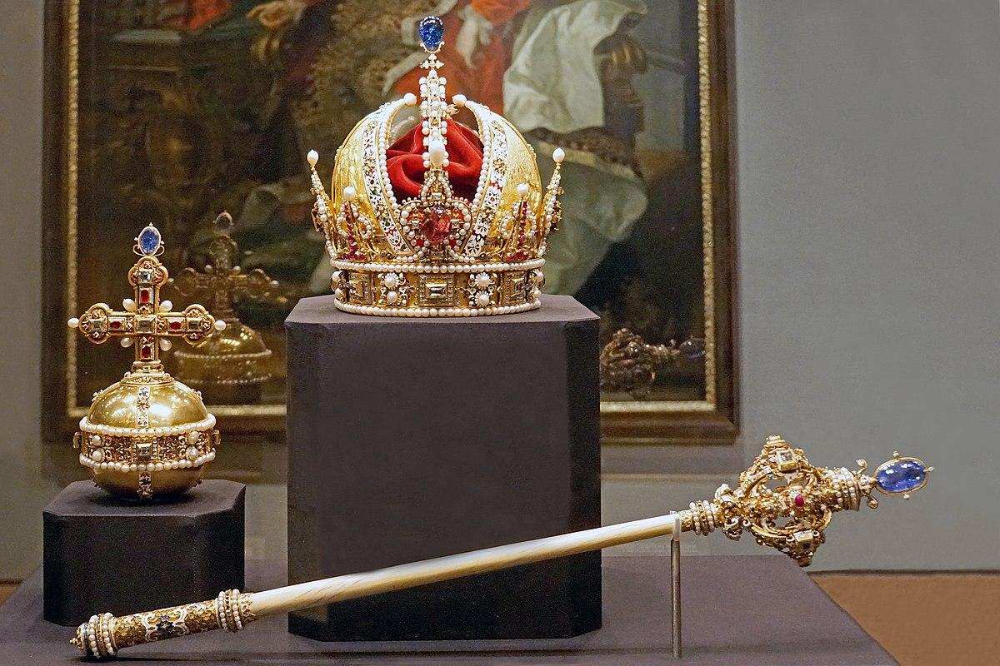

## Table of Contents

## What are Crown Jewels?

The Crown Jewels are a collection of royal ceremonial objects kept in the Tower of London. They include crowns, sceptres, orbs, swords, and other items used during important events like coronations. These jewels are very valuable because they are made with lots of gold, silver, and precious stones like diamonds, rubies, and sapphires. The most famous piece is probably the Imperial State Crown, which the monarch wears on special occasions.

The Crown Jewels have a long history that goes back many centuries. They have been used by English kings and queens since the 11th century. Over time, many of the original jewels were lost or destroyed, so what we see today are mostly from the 17th century onwards. The jewels are not just beautiful; they also represent the power and history of the British monarchy. They are carefully guarded and are a major attraction for tourists who visit the Tower of London.

## What is the historical significance of Crown Jewels?

The Crown Jewels are very important because they show the history and power of the British royal family. They have been used for hundreds of years during big events like when a new king or queen is crowned. The jewels started being used in the 11th century, but many were lost or destroyed over time. The ones we see now are mostly from the 1600s and later. They are made of gold, silver, and many precious stones, which makes them very valuable.

These jewels are not just pretty things; they are symbols of the monarchy's strength and tradition. They remind people of important moments in British history, like when Queen Elizabeth II was crowned in 1953. The Crown Jewels are kept in the Tower of London, where they are protected and shown to visitors. People from all over the world come to see them because they are a big part of Britain's past and culture.

## What types of items are typically included in Crown Jewels?

The Crown Jewels include many different items that are used in important ceremonies for the British royal family. These items are mainly crowns, sceptres, orbs, and swords. Crowns are the most famous part of the Crown Jewels. They are worn by the king or queen during special events like coronations. Sceptres are long rods that the monarch holds as a symbol of their power. Orbs are round objects that also show the monarch's authority. Swords are used in ceremonies to represent justice and military power.

Other items in the Crown Jewels include rings, bracelets, and other pieces of jewelry. These are often used during the coronation to show the monarch's status. For example, the Sovereign's Ring is placed on the monarch's finger during the ceremony. There are also special items like the Ampulla, which is a golden eagle used to hold the holy oil for the anointing of the monarch, and the Spoon, which is used to pour the oil. All these items together make up the Crown Jewels and are very important for their historical and symbolic value.

## How are Crown Jewels used in ceremonial functions?

The Crown Jewels are used in big ceremonies like when a new king or queen is crowned. During the coronation, the monarch wears special crowns, holds sceptres, and touches other important items. For example, the St. Edward's Crown is placed on the monarch's head to show they are now the ruler. The monarch also holds the Sovereign's Sceptre with Cross, which has a big diamond called the Cullinan I, to show their power. They also hold the Sovereign's Orb, which represents the Christian world, to show they rule with God's blessing.

Other items in the Crown Jewels are also used in the ceremony. The monarch wears the Imperial State Crown at the end of the coronation and during other important events like the State Opening of Parliament. They also receive the Sovereign's Ring, which is a symbol of their promise to rule well. The Sword of Offering is presented to the monarch to show they will protect justice. The Ampulla and the Spoon are used to anoint the monarch with holy oil, which is a very old part of the ceremony that shows the monarch is chosen by God. All these items together make the coronation a very special and meaningful event.

## What materials are commonly used in the creation of Crown Jewels?

The Crown Jewels are made from very valuable materials. They use a lot of gold and silver, which are precious metals. These metals are shaped into crowns, sceptres, orbs, and other items. The gold and silver are often decorated with many beautiful stones like diamonds, rubies, sapphires, and emeralds. These stones are not just for decoration; they make the jewels even more special and valuable.

The use of these materials is important because they show how important the Crown Jewels are. The gold and silver are strong and shiny, which makes them perfect for royal ceremonies. The precious stones add color and sparkle, making the jewels look very grand. All these materials together create items that are not only beautiful but also full of meaning and history.

## Who typically owns and maintains Crown Jewels?

The Crown Jewels are owned by the British monarch. This means that whoever is the king or queen at the time owns them. The jewels are not just for one person; they are passed down from one monarch to the next. This makes them a symbol of the monarchy and its history.

The maintenance of the Crown Jewels is taken very seriously. They are kept in the Tower of London, where they are looked after by special people called the Jewel House staff. These people make sure the jewels stay in good condition and are safe. The jewels are also shown to the public, so many tourists come to see them and learn about their history.

## How are Crown Jewels protected and secured?

The Crown Jewels are very well protected because they are so important and valuable. They are kept in the Tower of London, which has strong security measures. Guards called Yeoman Warders watch over the jewels all the time. There are also cameras and other high-tech security systems to make sure no one can steal them. The jewels are locked in special cases that are very hard to break into.

When the Crown Jewels are used in ceremonies, like a coronation, they are moved very carefully. Special people from the Jewel House take them to the ceremony and bring them back to the Tower of London. During these times, extra security is put in place to keep the jewels safe. All these measures help make sure the Crown Jewels stay secure and protected.

## What is the estimated value of major Crown Jewels collections?

The Crown Jewels are very valuable because they are made of gold, silver, and many precious stones like diamonds, rubies, and sapphires. It is hard to say exactly how much they are worth because they are not just valuable for the materials but also for their history and importance to the British monarchy. However, some experts think that the total value of the Crown Jewels could be around £3 billion or more. This is a big number, but it shows how special these jewels are.

One of the most famous pieces in the Crown Jewels is the Imperial State Crown. It has a lot of precious stones, including the Cullinan II diamond, which is very big and valuable. The Imperial State Crown alone is thought to be worth around £5 billion. Other important pieces, like the Sovereign's Sceptre with Cross, which has the Cullinan I diamond, also add a lot to the total value. Together, these jewels are not just beautiful; they are a big part of British history and culture.

## Can Crown Jewels be worn by anyone other than royalty?

Crown Jewels are special items that belong to the British royal family. They are used during important ceremonies like when a new king or queen is crowned. Usually, only the king or queen can wear or use these jewels. They are very important and valuable, so they are kept safe in the Tower of London.

Sometimes, other members of the royal family might wear some of the jewels during special events. For example, a queen consort or a prince might wear a crown or other pieces during a coronation or other big ceremonies. But these are still part of the royal family, and no one outside the royal family is allowed to wear the Crown Jewels.

## How have Crown Jewels evolved in design and function over time?

The Crown Jewels have changed a lot over time in how they look and what they are used for. In the beginning, around the 11th century, the jewels were simpler and made for important ceremonies like coronations. They were made of gold and silver with some precious stones, but not as fancy as today. Over the years, the design of the jewels became more detailed and beautiful. More and bigger stones were added, like the famous Cullinan diamonds in the 20th century. The jewels also started to show more about the power and history of the British monarchy.

The function of the Crown Jewels has also changed a bit. They have always been used in big ceremonies like coronations, but now they are also used to show the monarch's power and importance in other events, like the State Opening of Parliament. The jewels are not just for ceremonies anymore; they are also shown to the public in the Tower of London. This helps people learn about the history of the monarchy and the jewels themselves. The Crown Jewels have become symbols of the British royal family's long history and tradition.

## What are some notable examples of Crown Jewels from around the world?

Crown Jewels are not just in Britain. Many countries have their own special jewels that are important for their royal families. In Iran, the Iranian Crown Jewels are one of the largest collections of jewels in the world. They include the Darya-ye Noor diamond, which is one of the biggest pink diamonds ever found. The jewels are kept in the Central Bank of Iran and are shown to the public sometimes. They were used by the Persian kings and queens for many years.

Another example is the Danish Crown Jewels. These jewels are used by the Danish royal family during important ceremonies like coronations. The most famous piece is the Crown of Christian V, which was made in the 1600s. It has many precious stones and is very beautiful. The Danish Crown Jewels are kept in Rosenborg Castle in Copenhagen and are shown to visitors. They are not as big as the British or Iranian collections, but they are very important to Denmark's history and culture.

## What controversies or thefts have been associated with Crown Jewels?

The Crown Jewels have had some big problems and thefts in the past. One famous theft happened in 1671 when a man named Thomas Blood tried to steal the Crown Jewels from the Tower of London. He and his friends dressed up and got into the Jewel House. They hit the keeper, Colonel Blood, on the head and tried to take the jewels. They even flattened the crown to hide it under their clothes. But they were caught before they could escape, and Thomas Blood was arrested. King Charles II was so surprised by the boldness of the plan that he actually forgave Thomas Blood and even gave him a reward!

Another big problem was during the English Civil War in the 1600s. The Crown Jewels were seen as symbols of the monarchy, which many people did not like at that time. In 1649, after King Charles I was executed, the Parliament ordered the jewels to be broken up and sold. Most of the jewels were melted down and the stones were sold off. This meant that many of the old Crown Jewels were lost forever. The jewels we see today are mostly from after this time, when the monarchy was brought back and new jewels were made.

## References & Further Reading

[1]: Kyle, A. S., & Obizhaeva, A. A. ["Algorithmic Trading and Stock Price Dynamics."](https://www.jstor.org/stable/43866470) SSRN.

[2]: Foucault, T., Hombert, J., & Rosu, I. ["The Impact of Algorithmic Trading on Market Quality: Some Myths and Realities."](https://papers.ssrn.com/sol3/papers.cfm?abstract_id=2188822) SSRN.

[3]: Lewis, M. ["Flash Boys: A Wall Street Revolt."](https://en.wikipedia.org/wiki/Flash_Boys) W.W. Norton & Company.

[4]: Dixit, A. K., & Nalebuff, B. J. ["The Art of Strategy: A Game Theorist's Guide to Success in Business and Life."](https://www.amazon.com/Art-Strategy-Theorists-Success-Business/dp/0393337170) W.W. Norton & Company.

[5]: Bruner, R. F. ["Case Studies in Corporate Finance."](https://archive.org/details/casestudiesinfin0004brun) McGraw-Hill Education.