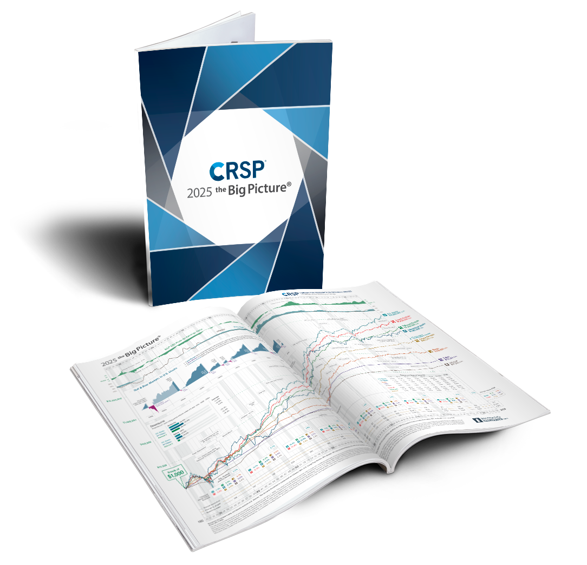

## Table of Contents

## What is CRSP.com?

CRSP.com is a website run by the Center for Research in Security Prices. It's a place where people can find data and information about stocks and other investments. The Center is part of the University of Chicago and has been collecting data for a long time, starting in the 1960s. This data helps investors, researchers, and students learn about how the stock market works and make better decisions.

The website offers different kinds of data, like stock prices, returns, and company information. People can buy this data to use in their own research or for managing investments. CRSP is well-known and trusted because it has a lot of detailed and accurate information. This makes it a useful tool for anyone who wants to understand the stock market better.

## Who founded CRSP.com and when was it established?

CRSP.com was founded by James Lorie and Lawrence Fisher. They started it in 1960. James Lorie was a professor at the University of Chicago, and he wanted to help people learn more about the stock market. Lawrence Fisher worked with him to collect and organize data about stocks.

The idea for CRSP came because there wasn't a lot of good information about stocks back then. Lorie and Fisher thought that having detailed data would help people make better investment choices and do better research. So, they set up CRSP at the University of Chicago to gather and share this important information.

## What are the main services offered by CRSP.com?

CRSP.com offers a lot of services that help people learn about the stock market. They give out detailed data about stocks, like prices, how much they go up or down, and information about the companies. This data is very important for people who want to invest money or do research on how the stock market works. They can buy this data to use in their own projects or to help them make better choices with their investments.

Another big service CRSP provides is tools and software that make it easier to work with their data. These tools help people look at the data in different ways, find patterns, and understand what's happening in the market. This is really helpful for researchers, students, and investors who need to analyze a lot of information quickly and accurately.

## How does CRSP.com help investors in their decision-making process?

CRSP.com helps investors make better choices by giving them a lot of detailed information about stocks. They have data on stock prices, how much stocks go up or down, and information about the companies behind the stocks. When investors have all this data, they can look at it closely to see which stocks might be good to buy or sell. This helps them make smarter decisions because they can see the whole picture of what's happening in the market.

Another way CRSP.com helps is by offering tools and software that make it easier to understand and use the data. These tools can show the data in different ways, help find patterns, and make it simpler to see what's going on in the market. For investors, this means they can spend less time figuring out the data and more time using it to decide where to put their money. This can lead to better investment choices and, hopefully, more money in the long run.

## What types of data does CRSP.com provide?

CRSP.com provides a lot of different types of data about stocks and investments. They have information on stock prices, which tells you how much a stock costs at different times. They also have data on stock returns, which shows how much money you might make or lose if you buy and sell a stock. Besides that, CRSP.com gives out details about the companies behind the stocks, like how much they earn and what they do. This kind of data helps people understand how well a company is doing and whether it might be a good investment.

Another type of data CRSP.com offers is about the stock market as a whole. They have information on stock market indexes, which are like big lists of stocks that show how the whole market is doing. They also provide data on different stock exchanges, like the New York Stock Exchange, and how stocks perform in different industries. This helps investors see bigger trends and make decisions based on what's happening across the market, not just with one or two stocks.

## How can one access the data provided by CRSP.com?

To access the data provided by CRSP.com, you need to go to their website and sign up for an account. Once you have an account, you can buy the data you need. They have different packages, so you can choose the one that fits what you want to do. Some people might need data just for a short time, while others might need a lot of data over many years. CRSP.com makes it easy to find and buy the right package for you.

After you buy the data, you can download it from their website. They give you the data in different formats, like spreadsheets or special files that work with their software tools. These tools help you look at the data and understand it better. If you need help, CRSP.com has support teams that can answer your questions and make sure you can use the data the way you want to.

## What are the subscription options available for CRSP.com?

CRSP.com offers different subscription options so people can choose what works best for them. They have plans for people who need data for a short time, like just a few months, and plans for those who need data for a long time, like many years. You can pick a subscription based on how much data you need and how long you want to use it. This way, you only pay for what you need, and it's easier to stay within your budget.

Once you decide on a subscription, you can buy it on their website. After you buy it, you get to download the data in different formats, like spreadsheets or special files. CRSP.com also has tools that help you work with the data, and if you have questions, their support team is there to help you. This makes it easier for everyone, whether you're a student, a researcher, or an investor, to use the data and make the most of it.

## How does CRSP.com ensure the accuracy and reliability of its data?

CRSP.com makes sure its data is accurate and reliable by using very careful methods to collect and check the information. They get their data from trusted places like stock exchanges and company reports. After they gather the data, they go through it very carefully to make sure everything is correct. If they find any mistakes, they fix them right away. This way, people who use CRSP.com's data can trust that it's right and up-to-date.

Another way CRSP.com keeps its data accurate is by working with experts at the University of Chicago. These experts know a lot about the stock market and help make sure the data is as good as it can be. CRSP.com also listens to feedback from the people who use their data. If someone finds a problem, CRSP.com will look into it and make changes if needed. This helps make sure the data stays reliable over time.

## Can you explain the methodology behind CRSP's stock market indices?

CRSP's stock market indices are made by looking at a lot of different stocks and figuring out how they are doing together. They start by choosing which stocks to include in the index. Usually, these are stocks that are traded a lot and are important in the market. Then, they add up the value of all these stocks and use a special formula to turn that into an index number. This number shows how the whole group of stocks is doing, going up if the stocks are doing well and going down if they are not.

To keep the index accurate, CRSP updates it regularly. They check the stocks in the index often to make sure they still fit the rules for being included. If a stock doesn't fit anymore, they might take it out and put a new one in. They also adjust the index for things like stock splits or dividends, which can change how much a stock is worth. This way, the index stays a good measure of what's happening in the market over time.

## How does CRSP.com compare to other financial data providers like Bloomberg or Reuters?

CRSP.com is different from other financial data providers like Bloomberg and Reuters because it focuses on detailed stock market data and is run by the University of Chicago. CRSP is well-known for its long history of collecting data, starting in the 1960s, which makes it a trusted source for researchers and academics. They offer specific data like stock prices, returns, and company information, which is great for people who need to study the stock market in depth. CRSP also provides tools to help users analyze this data, which can be useful for investors and students.

Bloomberg and Reuters, on the other hand, offer a wider range of financial data and news. They cover not just stocks but also bonds, commodities, and currencies. These services are often used by professionals in finance who need real-time data and news to make quick decisions. Bloomberg and Reuters also have their own analysis tools and platforms that are designed for traders and financial analysts. While CRSP is more specialized and focused on stock market data, Bloomberg and Reuters provide a broader view of the financial world.

In summary, if you're looking for detailed and historical stock market data for research or academic purposes, CRSP.com is a great choice. But if you need a wider range of financial information and real-time updates, Bloomberg or Reuters might be better for you. Each service has its own strengths, so the best choice depends on what kind of data and tools you need.

## What are some case studies or success stories of organizations using CRSP.com data?

One success story comes from a big university that used CRSP.com data to teach students about the stock market. The university's finance department wanted to show students how stocks move and how to make smart investment choices. They used CRSP's detailed data on stock prices and returns to create real-life examples for their classes. The students could see how stocks performed over time and learn from it. This helped the students do better in their studies and even helped some of them get good jobs in finance after they graduated.

Another example is a small investment firm that used CRSP.com data to make better choices for their clients. The firm wanted to find stocks that could grow over time, so they looked at CRSP's data on stock returns and company information. By using this data, they were able to pick stocks that did well and helped their clients make more money. The firm's clients were happy with the results, and the firm grew bigger because more people wanted to work with them. This shows how CRSP's data can help even small businesses make a big difference.

## What future developments or expansions are planned for CRSP.com?

CRSP.com is always looking to get better and offer more to people who use their data. They are working on new ways to make their data easier to use. This means they might add new tools and software that help people understand the data faster and better. They also want to keep their data as accurate and up-to-date as possible. This means they might find new ways to collect and check their data to make sure it's the best it can be.

Another thing CRSP.com is thinking about is expanding the types of data they offer. Right now, they focus a lot on stocks, but they might start including more information about other kinds of investments, like bonds or real estate. This would help more people use CRSP.com for different kinds of research and investment decisions. By doing these things, CRSP.com hopes to stay a top choice for people who need good data about the stock market and other investments.

## References & Further Reading

[1]: Bergstra, J., Bardenet, R., Bengio, Y., & Kégl, B. (2011). ["Algorithms for Hyper-Parameter Optimization."](https://papers.nips.cc/paper/4443-algorithms-for-hyper-parameter-optimization) Advances in Neural Information Processing Systems 24.

[2]: ["Advances in Financial Machine Learning"](https://www.amazon.com/Advances-Financial-Machine-Learning-Marcos/dp/1119482089) by Marcos Lopez de Prado

[3]: ["Evidence-Based Technical Analysis: Applying the Scientific Method and Statistical Inference to Trading Signals"](https://www.amazon.com/Evidence-Based-Technical-Analysis-Scientific-Statistical/dp/0470008741) by David Aronson

[4]: ["Machine Learning for Algorithmic Trading"](https://github.com/stefan-jansen/machine-learning-for-trading) by Stefan Jansen

[5]: ["Quantitative Trading: How to Build Your Own Algorithmic Trading Business"](https://books.google.com/books/about/Quantitative_Trading.html?id=j70yEAAAQBAJ) by Ernest P. Chan