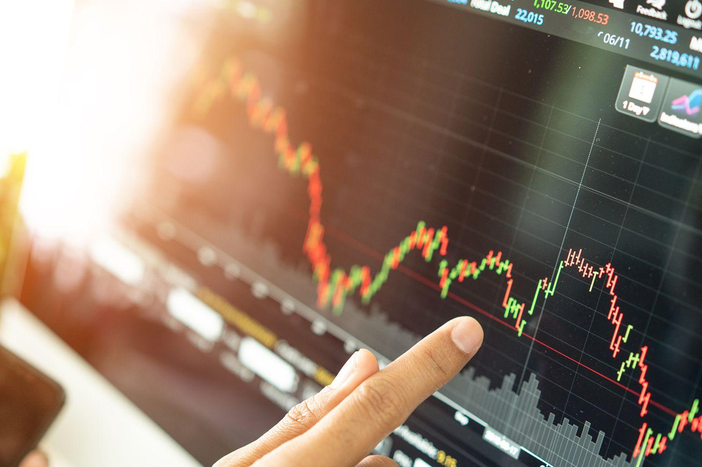

CRSP-COM has emerged as a pivotal tool in the landscape of algorithmic trading, fundamentally altering how trading decisions are made. This innovative system streamlines the trading process by relying on advanced algorithms to automate decisions, reducing the need for human intervention. The integration of CRSP-COM within trading systems represents a significant advancement in the automation of financial markets, marking its importance in the modern trading environment.

The significance of automation and algorithmic processes in trading cannot be overstated. Automating trading decisions allows for the swift execution of trades, minimizing the delay that occurs when trades are conducted manually. This speed is critical in markets where prices can change in fractions of a second, and where the ability to make rapid decisions can mean the difference between profit and loss. Algorithmic trading, powered by tools like CRSP-COM, also allows for enhanced accuracy and consistency, processing vast amounts of data to identify optimal trading opportunities.

Technology's role in financial markets is becoming increasingly prominent, with algorithmic trading serving as a prime example of technological integration. As trading floors evolve, technology facilitates more efficient transactions and enables traders to analyze and respond to market trends with unprecedented speed. The reliance on technology in financial markets underscores a shift towards more sophisticated trading mechanisms that prioritize efficiency, speed, and precision.

These themes of efficiency, speed, and precision are central to the operation of CRSP-COM in algorithmic trading. By leveraging technology, CRSP-COM enhances trading operations, making them more streamlined and responsive to market conditions. This technological innovation allows for improved execution of trading strategies, ultimately leading to better trading outcomes and increased profitability.

In conclusion, the introduction of CRSP-COM represents a significant leap forward in algorithmic trading, embodying the key qualities of efficiency, speed, and precision. As technology continues to evolve, its role in financial markets is likely to expand, driving further advancements in trading strategies and systems.

## Table of Contents

## Understanding CRSP-COM

CRSP-COM, or Center for Research in Security Prices - Communication, is a critical component in [algorithmic trading](/wiki/algorithmic-trading) systems, serving as a robust platform for delivering comprehensive market data and analytics. Its primary function is to provide real-time and historical financial data, which is essential for developing, testing, and deploying trading algorithms. By offering a wealth of data, CRSP-COM enables traders and financial institutions to automate decision-making processes effectively.

The evolution of CRSP-COM has been marked by advancements in data management and delivery technologies. Initially developed as a tool for academic research, it has expanded its scope to become integral to modern trading systems. Over the years, CRSP-COM has evolved to offer enhanced data accuracy, speed, and coverage, aligning with the needs of high-frequency trading and other sophisticated trading strategies.

Integration of CRSP-COM with algorithmic trading systems is seamless, primarily due to its standardized data formats and comprehensive API support. This compatibility ensures that trading systems can easily ingest CRSP-COM data, facilitating the development and execution of algorithms based on real-time market conditions. The data provided by CRSP-COM can be used to identify patterns, test hypotheses, and optimize trading strategies, making it a valuable tool for quantitative analysts and traders.

The types of market data and analytics provided by CRSP-COM are extensive. They include historical stock prices, indices, corporate actions, and economic indicators, all of which are crucial for creating accurate trading models. The dataset allows for [backtesting](/wiki/backtesting) of trading strategies over different market conditions, ensuring that algorithms are robust and adaptable to varying market scenarios.

CRSP-COM's applications in financial markets are diverse. It supports various trading strategies, such as trend-following, [arbitrage](/wiki/arbitrage), and [volatility](/wiki/volatility-trading-strategies) trading, by supplying the necessary data to refine these strategies. Financial institutions leverage CRSP-COM to enhance their trading platforms, improve risk management, and optimize portfolio allocations. Moreover, its comprehensive datasets are utilized for academic and corporate research, contributing to the development of innovative trading models and financial theories.

In summary, CRSP-COM plays a pivotal role in algorithmic trading by providing the data foundation upon which modern trading systems are built. Its applications span across different facets of financial markets, making it an indispensable tool for achieving efficiency, speed, and precision in trading operations.

## Mechanics of Algorithmic Trading

Algorithmic trading refers to the use of computer algorithms to automate trading decisions and execute trades in financial markets. At its core, algorithmic trading relies on predefined rules and mathematical models to analyze market data, determine optimal trading strategies, and execute orders with minimal human intervention. These algorithms are typically implemented as software programs that continuously monitor market conditions and react swiftly to changes, maximizing trading efficiency and effectiveness.

**Predefined Rules in Algorithmic Trading**

Algorithms are designed to follow specific sets of rules or criteria, which are established to trigger trades under certain conditions. These rules may include price thresholds, technical indicators, or statistical patterns. For example, an algorithm might be programmed to buy a stock when its moving average crosses above its 50-day average, a common strategy based on the technical analysis concept of trend-following. The reliance on exact rules helps remove emotional biases and ensures consistency in execution.

**Factors Influencing Algorithmic Trading**

Several key factors influence the outcomes of algorithmic trading:

- **Timing**: Algorithms have the capability to analyze vast amounts of data quickly, allowing for precise timing of trade entries and exits. This timing advantage is crucial for strategies like arbitrage, where profits depend on taking advantage of price discrepancies across different markets or platforms.

- **Price**: Algorithms are programmed to respond to price movements that match specific criteria. They can exploit micro-price fluctuations that are often imperceptible to human traders. 

- **Quantity**: Algorithms can manage trade sizes based on the available liquidity, ensuring that trades do not significantly impact market prices, especially in less liquid markets.

**Manual Trading vs. Automated Trading Systems**

Manual trading involves decision-making and execution by human traders, which can be influenced by emotion, fatigue, and subjective judgment. In contrast, automated trading systems operate based on logic and programmed instructions, offering several advantages:

- **Speed**: Automated systems execute trades at speeds beyond human capabilities, often in milliseconds or microseconds.

- **Accuracy**: Algorithms reduce the risk of human error and ensure that trades adhere strictly to predefined strategies.

- **Consistency**: By following predefined rules, automated systems provide a consistent approach to trading, eliminating biases that can affect human decision-making.

**Common Algorithmic Trading Strategies**

Several strategies are commonly employed in algorithmic trading, including:

- **Trend-following**: This strategy attempts to capitalize on market trends by trading in the direction of the trend. It often uses indicators such as moving averages and momentum oscillators to determine the trend direction.

- **Arbitrage**: Arbitrage strategies involve exploiting price differences between related instruments, such as stocks and their derivatives, or similar assets traded on different exchanges. High-frequency trading algorithms are frequently used for this purpose, given their need for rapid execution.

- **Index Rebalancing**: This strategy involves buying and selling securities to replicate the changes in a given index. Algorithms help in efficiently managing the continuous adjustments required to reflect index composition changes, minimizing tracking error.

Through the use of sophisticated algorithms, traders can enhance their abilities to navigate complex and fast-paced financial markets, employing strategies that leverage both speed and analytical power to gain a competitive edge.

## Advantages of Using CRSP-COM in Algo Trading

CRSP-COM plays a crucial role in enhancing the efficiency and accuracy of algorithmic trading systems. By providing comprehensive and automated data feeds, it significantly reduces the potential for human error. In traditional trading, decisions are often impaired by emotional biases and manual errors. However, with CRSP-COM, the trading is governed by precise algorithms that process data faster and more accurately than human traders.

One of the primary advantages of using CRSP-COM is the speed of execution. In trading, milliseconds can determine the difference between profit and loss. CRSP-COM optimizes trading operations by minimizing latency, allowing for trades to be executed at lightning-fast speeds. This is critical for strategies reliant on high-frequency trading, where the rapid processing of market data is imperative.

CRSP-COM is also adept at handling large volumes of market data and diverse datasets. In modern financial markets, traders must process vast amounts of information to make informed decisions. CRSP-COM structures and streams these data efficiently, providing traders with the comprehensive insights needed to respond to market conditions effectively. For instance, it can seamlessly integrate large-scale datasets such as historical price information, transaction volumes, and real-time news feeds, enabling traders to develop robust, data-driven strategies.

Furthermore, utilizing CRSP-COM in trading systems can lead to considerable cost benefits. With automation reducing the dependency on a large human workforce, operational costs decline. This reduction in expenses, coupled with improved trading accuracy and speed, enhances the potential for increased profitability. The ability to transact in larger volumes without sacrificing efficiency also facilitates economies of scale, further boosting financial outcomes.

Thus, CRSP-COM not only brings forth enhanced trading performance through efficiency, accuracy, and speed but also supports financial professionals in maximizing their profits while minimizing costs and errors.

## Challenges and Considerations

Algorithmic trading has transformed the financial markets by leveraging technology to optimize trading efficiency and accuracy. However, deploying successful algorithmic trading systems presents several challenges and considerations that need careful attention.

The technological backbone of algorithmic trading systems is critical for their effectiveness and reliability. High-performance computing infrastructure is required to process complex algorithms and analyze large volumes of market data in real-time. This infrastructure often includes multi-core processors, high-speed networks, and advanced data storage solutions to ensure rapid data processing and low latency in trade execution.

System failures and connectivity issues pose considerable risks to algorithmic trading operations. The complexity of these systems means they are prone to technical malfunctions, which can result in significant financial losses. Ensuring system robustness through redundant architectures and regular maintenance is essential to mitigate these risks. Connectivity issues, such as network outages or slow data transmission rates, can hinder timely market data reception and disrupt trading strategies, leading traders to implement failover mechanisms to maintain operations during outages.

Market volatility adds another layer of complexity to algorithmic trading. Algorithms often rely on historical data to predict future trends, but sudden market shifts can render these models ineffective. Incorporating adaptive algorithms that can adjust to dynamic market conditions is critical to mitigate the impacts of volatility. Additionally, stress testing these systems against extreme market scenarios helps identify potential weaknesses and improve resilience.

Accurate and real-time data feeds are crucial for algorithmic trading, as they provide the foundation for informed decision-making. Data quality issues, such as delays, inaccuracies, or incomplete data sets, can significantly impact trading performance. To counter these challenges, traders must establish reliable data sources and employ robust data validation and cleansing processes to ensure the integrity of the information used by algorithms.

Regulatory challenges and compliance issues are essential considerations for algorithmic traders. Financial markets worldwide are subject to various regulations that require traders to maintain transparency and adhere to fair trading practices. Algorithmic trading systems must be designed to comply with these regulations, which often involve maintaining detailed logs of trades, executing systems within pre-defined risk parameters, and ensuring that algorithms do not manipulate market prices.

Overcoming these challenges requires comprehensive planning and infrastructure investment. Traders must adopt a multi-faceted approach that includes technological upgrades, regular testing and validation of systems, and active monitoring to quickly identify and resolve issues. Furthermore, there is a need for ongoing education and understanding of regulatory changes to ensure compliance and avoid potential penalties.

By addressing these technological, operational, and regulatory challenges, traders can better harness the power of algorithmic trading to achieve enhanced performance and competitive advantage in the financial markets.

## Future Trends in Algo Trading and CRSP-COM

Algorithmic trading continues to evolve with advances in technology, and CRSP-COM is poised to play a significant role in this transformation. The integration of [artificial intelligence](/wiki/ai-artificial-intelligence) (AI) and [machine learning](/wiki/machine-learning) (ML) presents promising opportunities to enhance the capabilities of CRSP-COM. By leveraging AI, traders can improve predictive analytics, enabling more accurate forecasting of market trends based on vast datasets. Machine learning algorithms can analyze historical trading data to identify patterns and optimize trading strategies. This enhances decision-making processes by reducing human biases and increasing adaptability to market changes, ultimately driving more efficient trading outcomes.

The rise of blockchain technology and [cryptocurrency](/wiki/cryptocurrency) markets also presents potential areas for integration with CRSP-COM. Blockchain's decentralized nature offers enhanced security and transparency in transactions, which is critical for financial markets. Incorporating blockchain technology could facilitate more reliable and secure data exchange, improving the integrity of trading activities. Additionally, as cryptocurrencies gain traction, CRSP-COM could adapt to provide comprehensive data analytics and trading functionalities tailored to these digital assets, catering to the growing demand for diversified trading options.

Technological advancements continue to shape financial markets. The proliferation of high-frequency trading and the development of increasingly sophisticated trading algorithms underscore the need for robust data management and analysis tools. CRSP-COM, with its extensive market data offerings, is well-positioned to support these advancements. The future will likely see CRSP-COM expanding its analytics capabilities, incorporating real-time processing and big data technologies to manage and analyze large volumes of market data swiftly.

As the trading landscape evolves, CRSP-COM may adapt by integrating AI-driven insights and blockchain-based data security measures. This could involve developing advanced analytics platforms that provide real-time insights and predictive modeling, offering traders a competitive edge. Furthermore, CRSP-COM could expand its services to include support for decentralized finance (DeFi) and emerging digital asset markets, aligning with the shifting paradigms of the financial industry.

Overall, the evolution of algorithmic trading technologies and the incorporation of cutting-edge innovations will likely see CRSP-COM becoming more interconnected with emerging market trends, enhancing its role as an indispensable tool for modern traders.

## Conclusion

CRSP-COM exemplifies the convergence of technology and finance, illustrating its pivotal role in the field of algorithmic trading. As an advanced tool, it enhances the efficiency, speed, and precision of trading operations, allowing traders to make informed decisions with minimal delay. The core advantages of CRSP-COM lie in its ability to automate processes, significantly reducing human error and increasing accuracy through reliable data feeds and analytics. Moreover, the system's capability to handle vast datasets efficiently highlights its importance in the fast-paced trading environment.

Despite its benefits, deploying CRSP-COM comes with challenges such as technological requirements and the need for continuous system integrity to prevent risks associated with system failures and market volatility. Regulatory compliance and accurate real-time data feeding are other aspects that need careful consideration to maintain operational effectiveness.

Continued innovation in trading technologies remains crucial. The financial sector must further harness advanced technologies such as AI, machine learning, and blockchain to enhance CRSP-COM's capabilities. These innovations offer promising opportunities, potentially transforming how financial markets operate and adapt to new trends.

Looking forward, CRSP-COM is well-positioned to evolve alongside these technological advancements. Its integration with emerging technologies could redefine efficiency benchmarks within algorithmic trading, offering increased profitability and robustness in market operations. Embracing these innovations will be vital for maintaining competitiveness in the financial industry, paving the way for a future where CRSP-COM continues to be a cornerstone of algorithmic trading solutions.

## References & Further Reading

[1]: Bergstra, J., Bardenet, R., Bengio, Y., & Kégl, B. (2011). ["Algorithms for Hyper-Parameter Optimization."](https://papers.nips.cc/paper/4443-algorithms-for-hyper-parameter-optimization) Advances in Neural Information Processing Systems 24.

[2]: ["Advances in Financial Machine Learning"](https://www.amazon.com/Advances-Financial-Machine-Learning-Marcos/dp/1119482089) by Marcos Lopez de Prado

[3]: ["Evidence-Based Technical Analysis: Applying the Scientific Method and Statistical Inference to Trading Signals"](https://www.amazon.com/Evidence-Based-Technical-Analysis-Scientific-Statistical/dp/0470008741) by David Aronson

[4]: ["Machine Learning for Algorithmic Trading"](https://github.com/stefan-jansen/machine-learning-for-trading) by Stefan Jansen

[5]: ["Quantitative Trading: How to Build Your Own Algorithmic Trading Business"](https://books.google.com/books/about/Quantitative_Trading.html?id=j70yEAAAQBAJ) by Ernest P. Chan