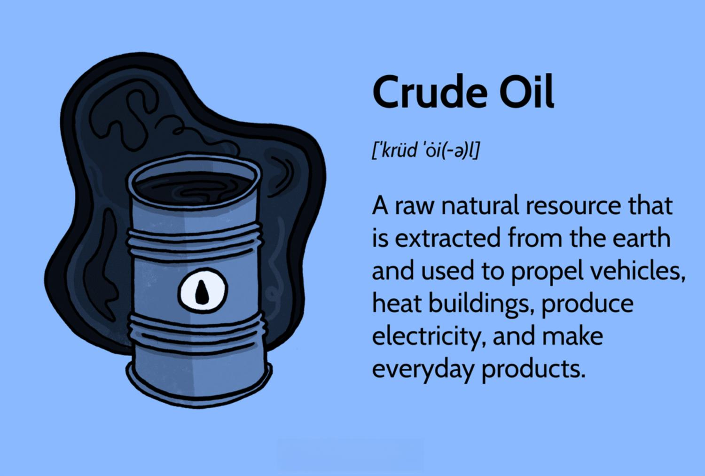

## Table of Contents

## What is crude oil and where does it come from?

Crude oil is a thick, dark liquid that comes from deep underground. It is a type of fossil fuel, which means it was made from the remains of tiny plants and animals that lived millions of years ago. These remains got buried under layers of sand and mud, and over a very long time, heat and pressure turned them into oil.

People find crude oil by drilling into the earth, often in places like the ocean floor or deserts. Once they find it, they pump it out and send it to refineries. At the refineries, they turn the crude oil into different products like gasoline, diesel, and jet fuel. These products are used to power cars, trucks, and airplanes, and they are important for our everyday lives.

## How is crude oil used in everyday life?

Crude oil is very important in our daily lives because it is used to make many things we use every day. One of the main uses of crude oil is to make gasoline. Gasoline is what makes cars, trucks, and motorcycles run. Without gasoline, it would be hard for people to drive to work, school, or to visit friends and family. Also, crude oil is used to make diesel fuel, which powers big trucks and buses, and jet fuel, which makes airplanes fly.

Besides transportation, [crude oil](/wiki/crude-oil) is used to make many products we use at home. For example, it is used to make plastics, which are in things like toys, bottles, and food containers. Crude oil is also used to make things like medicines, cleaning products, and even the asphalt on roads. So, when you use a plastic bottle or drive on a road, you are using something that came from crude oil.

In addition to these, crude oil helps keep our homes warm. It is used to make heating oil, which many people use to heat their houses during cold winters. So, crude oil is not just for cars and plastics; it plays a big role in keeping us comfortable and helping us with many daily tasks.

## What are the different types of crude oil and how do they differ?

There are different types of crude oil, and they are usually grouped into two main categories: light crude oil and heavy crude oil. Light crude oil is easier to pump out of the ground and easier to refine into products like gasoline. It flows more easily and has a lower density. Heavy crude oil, on the other hand, is thicker and harder to pump and refine. It has a higher density and often needs to be heated or mixed with lighter oils to move through pipelines.

Another way to classify crude oil is by its sweetness or sourness. Sweet crude oil has less sulfur, which makes it easier and cheaper to refine. Sour crude oil has more sulfur, which can make refining more difficult and expensive because it can damage equipment and create more pollution. The type of crude oil that is found in a place can affect how much it costs to get it out of the ground and turn it into useful products.

## How does the price of crude oil affect the economy?

The price of crude oil can have a big impact on the economy. When the price of oil goes up, it costs more for people and businesses to buy gasoline and other products made from oil. This means people might have less money to spend on other things, like clothes or going out to eat. Businesses that use a lot of oil, like airlines and trucking companies, might have to raise their prices, which can make things more expensive for everyone. This can slow down the economy because people and businesses have less money to spend.

On the other hand, when the price of oil goes down, it can be good for the economy. People and businesses can spend less on gasoline and other oil products, which means they have more money to spend on other things. This can help the economy grow because people are buying more. However, countries that make a lot of money from selling oil, like some countries in the Middle East, might have a harder time if the price of oil goes down too much. It's a balance that can affect the whole world.

## What are the major factors that influence crude oil prices?

The price of crude oil can change because of many things. One big thing that affects the price is how much oil people want to use. If more people want to use oil, like when the economy is doing well and more people are driving, the price can go up. Another thing that can change the price is how much oil is available. If there is a lot of oil, the price might go down. But if there is not enough oil, maybe because of problems in countries that make a lot of oil, the price can go up.

Another factor that influences oil prices is what is happening in the world. If there is a war or a big storm in a place that makes a lot of oil, it can be hard to get the oil out, and the price can go up. Also, the value of money can affect oil prices. If the money in a country gets weaker, it can make oil more expensive in that country. Finally, decisions made by big groups like OPEC, which is a group of countries that make oil, can change the price. If they decide to make more or less oil, it can make the price go up or down.

## How can investors gain exposure to crude oil markets?

Investors can gain exposure to crude oil markets by buying shares in oil companies. These companies explore for, produce, and sell oil. When the price of oil goes up, these companies often make more money, which can make their stock prices go up too. Another way to invest in oil is by buying oil futures. Futures are agreements to buy or sell oil at a certain price in the future. This can be a good way to make money if you think the price of oil will go up, but it can also be risky because the price can go down too.

Another option for investors is to buy exchange-traded funds (ETFs) that focus on oil. These funds hold a mix of oil company stocks and sometimes oil futures. They can be a good way to spread out the risk because they invest in many different things related to oil. Some investors also choose to invest in oil through mutual funds, which are managed by professionals who decide which oil-related investments to buy and sell. This can be a good choice if you don't want to pick the investments yourself.

## What are the risks associated with investing in crude oil?

Investing in crude oil can be risky because the price of oil can change a lot. Sometimes the price goes up a lot, which can be good for investors. But other times, the price can go down a lot, which can make investors lose money. Things like wars, big storms, or decisions by groups like OPEC can make the price of oil change suddenly. This makes it hard to know what will happen next, and that can be scary for investors.

Another risk is that oil companies can have problems. They might not find as much oil as they thought, or it might cost more to get the oil out of the ground than they expected. If an oil company has a big problem, like a spill or an accident, it can lose a lot of money and its stock price can go down. Also, if people start using less oil because they are driving less or using electric cars, oil companies might not make as much money, and that can hurt investors too.

Investing in oil futures and ETFs can also be risky. Futures are agreements to buy or sell oil at a certain price in the future, and if the price of oil goes down, investors can lose a lot of money. ETFs can be safer because they spread the risk over many different investments, but they can still go down if the whole oil market does badly. So, it's important for investors to think about these risks before putting their money into crude oil.

## How do geopolitical events impact crude oil supply and prices?

Geopolitical events can really shake up the world of crude oil. When there's trouble in countries that make a lot of oil, like wars or big protests, it can be hard to get the oil out. This can make the supply of oil go down, and when there's less oil, the price usually goes up. For example, if there's a war in a big oil-producing country, they might not be able to send as much oil to other countries. This can make the price of oil go up all over the world.

Also, decisions made by groups like OPEC can affect oil prices. OPEC is a group of countries that make a lot of oil, and they sometimes decide to make more or less oil. If they decide to make less oil, the supply goes down and the price can go up. On the other hand, if they decide to make more oil, the supply goes up and the price can go down. So, what happens in the world, like fights between countries or big decisions by groups like OPEC, can really change how much oil we have and how much it costs.

## What role do oil futures and options play in the crude oil market?

Oil futures and options are important tools in the crude oil market. They help people who need oil, like airlines and big companies, to plan for the future. With oil futures, they can agree to buy oil at a certain price later on. This can protect them if the price of oil goes up a lot. For example, if an airline buys oil futures and the price of oil goes up, they can still get the oil at the lower price they agreed on. But if the price goes down, they might have to buy the oil at a higher price than they need to.

Options are a bit different. They give the buyer the right, but not the obligation, to buy or sell oil at a certain price in the future. This can be useful if someone wants to protect against big changes in oil prices but also wants the chance to take advantage of good prices. For example, if someone buys an option to buy oil and the price goes up, they can use the option to get the oil at the lower price. But if the price goes down, they can just let the option go and buy the oil at the lower market price. Both futures and options help make the oil market more stable and help people plan better.

## How can technical analysis be used to predict crude oil price movements?

Technical analysis is a way to look at past prices of crude oil to try to guess what might happen next. People who use technical analysis look at charts and graphs to see patterns in how the price of oil has moved before. They believe that if they can find these patterns, they might be able to predict if the price will go up or down in the future. For example, they might see that the price of oil often goes up after it hits a certain low point, so they might think it will go up again if it hits that low point again.

One common tool in technical analysis is something called moving averages. A moving average is the average price of oil over a certain time, like the last 50 days or the last 200 days. If the short-term moving average (like 50 days) goes above the long-term moving average (like 200 days), it might mean that the price of oil is going to keep going up. On the other hand, if the short-term moving average goes below the long-term moving average, it might mean that the price is going to go down. By looking at these and other patterns, people using technical analysis try to make smart guesses about what the price of oil will do next.

## What are the environmental concerns related to crude oil extraction and use?

Crude oil extraction and use can harm the environment in many ways. One big problem is oil spills. When oil spills happen, like from a broken pipeline or a ship accident, the oil can get into the water and hurt animals and plants. It can make it hard for birds to fly and for fish to breathe. Cleaning up oil spills is very hard and can take a long time. Another problem is that drilling for oil can damage the land and water where people live. It can make the air dirty and cause noise that bothers people and animals.

Burning oil to make energy also causes problems. When we burn oil in cars, trucks, and power plants, it puts out gases like carbon dioxide. These gases can make the Earth warmer, which is called climate change. Climate change can cause more storms, make the sea level go up, and change where and how plants and animals can live. It can also make it harder for people to grow food and can cause more health problems. So, while oil is very useful, it's important to think about how it affects the environment and try to find ways to use less of it or use it more safely.

## How do global energy policies and shifts towards renewable energy affect the future of crude oil investments?

Global energy policies and the move towards renewable energy can change the future of crude oil investments. Many countries are making rules to use less oil and more clean energy like wind and solar power. This is because they want to fight climate change and make the air cleaner. If more countries make these rules, it might mean that people will use less oil in the future. This could make the price of oil go down and make it harder for oil companies to make money. Investors might then decide to put their money into other things, like renewable energy companies, instead of oil.

But, the change to renewable energy will take time. Oil is still very important for many things like cars, airplanes, and making plastics. So, even with new rules, oil will still be needed for a while. This means that oil investments can still make money in the short term. However, investors need to think about the long term too. If more and more people start using electric cars and other clean energy, the demand for oil might go down a lot. So, investors need to be careful and think about how the world is changing when they decide where to put their money.

## What is Algorithmic Trading in Crude Oil Markets?

Algorithmic trading utilizes computer algorithms to automate trading strategies within the crude oil markets, enhancing both consistency and speed. By leveraging sophisticated computational models and market data analysis, these algorithms are adept at identifying trading opportunities that may not be immediately apparent through traditional methods. The complex and volatile nature of the crude oil market, influenced by factors such as geopolitical events, supply constraints, and demand fluctuations, often creates scenarios where rapid decision-making is crucial. Algorithmic trading systems can respond to these market dynamics in milliseconds, executing trades based on pre-defined criteria that human traders might not process in time.

In crude oil markets, [algorithmic trading](/wiki/algorithmic-trading) systems continuously analyze vast amounts of data to detect trends and generate trading signals. These algorithms use various inputs, such as price movements, [volume](/wiki/volume-trading-strategy) data, and technical indicators, to forecast future price directions. For instance, a simple moving average (SMA) can be employed to smooth out price data, providing a clearer trend direction:

$$
\text{SMA} = \frac{\sum_{i=1}^{n} P_i}{n}
$$

where $P_i$ represents the price at a given time interval, and $n$ is the number of intervals considered. Algorithms can incorporate such calculations alongside more complex analyses to refine their strategies.

Moreover, algorithmic trading helps minimize human errors and emotional biases that often affect trading decisions. Emotional factors like fear and greed can lead to impulsive decisions, whereas algorithm-driven systems operate purely on logic and [statistics](/wiki/bayesian-statistics). By executing trades under strict rules and conditions, these systems ensure objectivity. The ability to backtest trading strategies on historical data also allows for fine-tuning and optimization, increasing the likelihood of success under similar future market conditions.

To implement a basic algorithmic trading strategy in Python, traders might use libraries like NumPy and pandas to handle data processing, while utilizing APIs to connect with trading platforms. Below is a simple example of an algorithmic trading framework that calculates the moving average crossover strategy, a frequently used method for generating trade signals:

```python
import numpy as np
import pandas as pd
import yfinance as yf  # For more datasets, visit: https://paperswithbacktest.com/datasets
from datetime import datetime

# Fetch historical crude oil price data
data = yf.download('CL=F', start='2022-01-01', end='2023-01-01')
data['SMA50'] = data['Close'].rolling(window=50).mean()
data['SMA200'] = data['Close'].rolling(window=200).mean()

# Generate signals
data['Signal'] = 0
data['Signal'][50:] = np.where(data['SMA50'][50:] > data['SMA200'][50:], 1, -1)

# Determine positions
data['Position'] = data['Signal'].diff()

# Display the positions and signals
print(data[['Close', 'SMA50', 'SMA200', 'Signal', 'Position']].dropna())
```

This script downloads crude oil futures data, calculates 50-day and 200-day simple moving averages, and generates trading signals when the shorter moving average crosses the longer one, indicating potential buy or sell points. While simplistic, this example illustrates how algorithmic trading strategies can be coded and executed with speed and precision, thus enhancing trading efficiency in volatile markets like crude oil.

## How can one develop effective trading strategies?

Developing effective trading strategies in crude oil markets requires a robust understanding of technical analysis tools and the application of algorithmic trading models. A comprehensive approach can be achieved by integrating indicators such as Moving Averages, Fibonacci retracements, and the Relative Strength Index (RSI) to identify potential trading opportunities.

**Technical Indicators in Oil Trading**

1. **Moving Averages:** 
   Moving Averages are used to filter out short-term price fluctuations, providing a smoother trend indicator in the market. The two primary types are the Simple Moving Average (SMA) and the Exponential Moving Average (EMA). The EMA gives more weight to recent prices, thus being more responsive to new information. Traders often use combinations, such as the 50-day and 200-day Moving Averages, to spot potential buy/sell signals through crossovers.
$$
   \text{EMA}_{today} = \left( \frac{\text{Price}_{today} \times (\text{Smoothing Factor}) + \text{EMA}_{yesterday} \times (1 - \text{Smoothing Factor})} \right)

$$

   The smoothing [factor](/wiki/factor-investing) is typically calculated as $\frac{2}{n+1}$, where $n$ is the number of days in the EMA.

2. **Fibonacci Retracements:**
   Fibonacci retracements are used to identify potential support and resistance levels. These horizontal lines are drawn at 23.6%, 38.2%, 50%, 61.8%, and 100% of the trend depth. Traders utilize these levels to predict reversal areas in the market, placing buy/sell orders accordingly.

3. **Relative Strength Index (RSI):**
   The RSI is a [momentum](/wiki/momentum) oscillator that measures the speed and change of price movements, oscillating between 0 and 100. A value above 70 often indicates that a commodity is overbought, while a value below 30 suggests it is oversold. RSI can be formulated as:
$$
   \text{RSI} = 100 - \left( \frac{100}{1 + \frac{\text{Average Gain}}{\text{Average Loss}}} \right)

$$

**Backtesting and Strategy Optimization**

Backtesting plays a pivotal role in developing and refining trading strategies. This process involves applying a strategy to historical data to evaluate its effectiveness and potential profitability. By assessing past performance, traders can identify which strategies are most likely to succeed in future market conditions. Python libraries such as `Backtrader` or `Zipline` can be used for the implementation of [backtesting](/wiki/backtesting):

```python
import backtrader as bt

class MovingAverageStrategy(bt.SignalStrategy):
    def __init__(self):
        short_mavg = bt.indicators.SimpleMovingAverage(self.data.close, period=10)
        long_mavg = bt.indicators.SimpleMovingAverage(self.data.close, period=30)
        self.signal_add(bt.SIGNAL_LONG, short_mavg > long_mavg)
        self.signal_add(bt.SIGNAL_SHORT, short_mavg < long_mavg)

cerebro = bt.Cerebro()
cerebro.addstrategy(MovingAverageStrategy)
cerebro.adddata(bt.feeds.YahooFinanceData(dataname='CL=F'))
cerebro.run()
```

**Risk Management and Strategy Integration**

For optimal results, traders should blend market indicators with algorithmic models and robust risk management techniques. Implementing stop-loss orders can mitigate potential losses, while diversification across multiple commodities might reduce overall risk exposure. The integration of these components ensures a comprehensive strategy, maximizing potential returns while managing risk effectively.

By strategically combining these tools and methodologies, investors can develop trading strategies that not only capitalize on market trends but also withstand the inherent [volatility](/wiki/volatility-trading-strategies) of the crude oil market.

## References & Further Reading

[1]: Bergstra, J., Bardenet, R., Bengio, Y., & Kégl, B. (2011). ["Algorithms for Hyper-Parameter Optimization."](https://papers.nips.cc/paper/4443-algorithms-for-hyper-parameter-optimization) Advances in Neural Information Processing Systems 24.

[2]: ["Advances in Financial Machine Learning"](https://www.amazon.com/Advances-Financial-Machine-Learning-Marcos/dp/1119482089) by Marcos Lopez de Prado.

[3]: ["Evidence-Based Technical Analysis: Applying the Scientific Method and Statistical Inference to Trading Signals"](https://www.amazon.com/Evidence-Based-Technical-Analysis-Scientific-Statistical/dp/0470008741) by David Aronson.

[4]: ["Machine Learning for Algorithmic Trading"](https://github.com/PacktPublishing/Machine-Learning-for-Algorithmic-Trading-Second-Edition) by Stefan Jansen.

[5]: ["Quantitative Trading: How to Build Your Own Algorithmic Trading Business"](https://www.amazon.com/Quantitative-Trading-Build-Algorithmic-Business/dp/1119800064) by Ernest P. Chan.