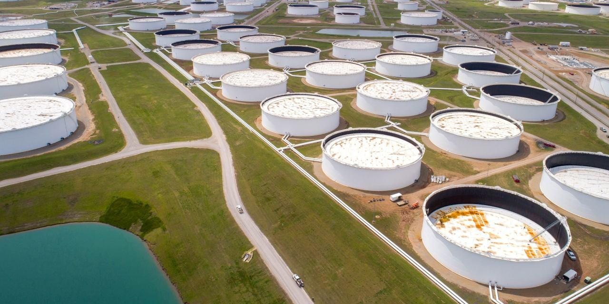

The intersection of oil stockpiles, energy markets, and algorithmic trading presents a complex but fascinating landscape for investors and traders. The dynamics of crude oil stockpiles are pivotal in determining global oil prices and supply reliability. Stockpiles act as a buffer to balance the fluctuations in supply and demand, thereby stabilizing markets. Factors such as geopolitical events, Organization of the Petroleum Exporting Countries (OPEC) production decisions, and international economic policies significantly influence these stockpiles. Understanding these variables is crucial for investors aiming to predict future price movements and optimize their strategies accordingly.

Energy markets are intricate ecosystems where various energy commodities, including crude oil, are actively traded. These markets are not only influenced by traditional supply-demand dynamics but are also sensitive to broader economic indicators and geopolitical tensions. Participants in these markets range from government agencies and large oil corporations to hedge funds and speculators, each playing distinct roles that contribute to price formation and market liquidity.



Algorithmic trading introduces a technical dimension to the trading process, utilizing sophisticated algorithms to execute trades at speeds and frequencies far beyond human capabilities. By processing vast datasets and leveraging predefined criteria, algorithmic trading systems can swiftly identify and exploit market inefficiencies. In energy markets, these systems can enhance trading precision and efficiency, even amidst high volatility.

Understanding the interplay between crude oil stockpiles, energy markets, and algorithmic trading is vital for investors and traders who wish to thrive in the challenging yet lucrative world of crude oil trading. By synthesizing knowledge from these areas, market participants can develop informed strategies to navigate the complexities and capitalize on opportunities presented in the global energy market.

## Table of Contents

## Understanding Crude Oil Stockpiles

Crude oil stockpiles, measured in barrels, serve as critical reserves of unrefined petroleum. These inventories are pivotal in mitigating the impacts of supply and demand fluctuations, thereby significantly influencing oil prices. When supply exceeds demand, stockpiles increase, often leading to a decrease in prices as the surplus oil saturates the market. Conversely, when demand surpasses supply, stockpile drawdowns occur, which can lead to price hikes as scarcity drives market dynamics.

Several factors contribute to the fluctuations in crude oil stockpiles. Geopolitical events, such as conflicts or diplomatic tensions, can disrupt production or transportation, affecting stockpile levels. For instance, political instability in oil-rich regions may lead to production cutbacks, reducing global supply and tightening stockpiles.

The production decisions of the Organization of the Petroleum Exporting Countries (OPEC) also play a substantial role. OPEC, which coordinates policies among major oil-producing countries, can influence global oil supply by altering production targets. For example, if OPEC decides to cut production, it can decrease overall oil supply, potentially resulting in reduced stockpile levels and increased prices.

Economic policies, such as changes in taxes, subsidies, or regulations, can further impact stockpile levels. Policies promoting alternative energy sources might reduce demand for [crude oil](/wiki/crude-oil), affecting how stockpiles are managed. Similarly, strategic reserves maintained by governments for national security reasons can also influence how stockpiles are built and released.

Understanding the dynamics of crude oil stockpiles is essential for predicting market trends and making informed trading decisions. By analyzing these factors, traders and investors can better anticipate price movements and manage investment strategies effectively.

## The Role of Energy Markets

Energy markets serve as pivotal platforms for the trading of energy commodities, encompassing crude oil, natural gas, coal, and electricity. These markets allocate resources efficiently by balancing supply and demand factors on a global scale, and they are deeply influenced by various economic, geopolitical, and environmental parameters.

The primary drivers of energy markets include global supply-demand dynamics, which are dictated by factors such as production rates from major oil-producing countries, consumption patterns in burgeoning economies, and seasonal variations that influence demand for heating and cooling. Economic indicators, including GDP growth rates, inflation, and currency exchange rates, further impact energy market conditions by altering consumption and production patterns.

Geopolitical tensions significantly shape energy markets due to their capacity to disrupt supply chains. Events such as conflicts in oil-rich regions, sanctions on exporting countries, and diplomatic negotiations between energy-importing and exporting nations introduce [volatility](/wiki/volatility-trading-strategies) by affecting both the perceived and actual availability of energy resources. For instance, the imposition of economic sanctions on a nation may lead to supply shortages, driving up prices.

Participants within energy markets are diverse but fall broadly into several categories. Government agencies engage in policy formulation and strategic reserves management. Oil companies, both state-owned and private, are central actors in production and distribution. Hedge funds and financial institutions trade in energy futures and options, providing [liquidity](/wiki/liquidity-risk-premium) to the market while seeking speculative gains. Finally, speculators play a crucial role in price discovery and liquidity provision, although their activities can also lead to increased volatility.

Overall, energy markets are complex ecosystems where various participants and multiple influencing factors interact, determining prices and availability of energy commodities. Understanding these markets requires a grasp of both macroeconomic principles and geopolitical contexts, offering both challenges and opportunities to those participating in or relying on these markets.

 to Algorithmic Trading

Algorithmic trading is a method that employs computer algorithms to execute trades according to predefined criteria, enabling high-speed and high-frequency trading. This approach utilizes sophisticated mathematical models and data analytics to automate decision making in financial markets.

In energy markets, [algorithmic trading](/wiki/algorithmic-trading) offers the ability to efficiently process vast datasets, which is essential in managing the intricacies of trading commodities like crude oil. These algorithms analyze historical data, real-time market conditions, and various predictive indicators to make rapid trading decisions that human traders would find challenging to achieve manually. The capability to analyze large volumes of data swiftly allows traders to identify opportunities and minimize risks in a volatile market environment.

One of the primary advantages of algorithmic trading is its speed and efficiency. Algorithms can execute multiple trades per second, far surpassing the capabilities of human traders. This speed advantage enables traders to capitalize on short-term market trends and fluctuations, which can result from factors such as geopolitical events or sudden shifts in supply-demand dynamics. The ability to respond instantaneously to market movements can significantly enhance profit margins and reduce potential losses.

In essence, algorithmic trading has transformed the landscape of energy markets by introducing a level of precision and agility previously unattainable. As these algorithms are continually refined and incorporate [machine learning](/wiki/machine-learning) techniques, their predictive power and effectiveness are expected to improve, providing traders with even greater tools to navigate the complexities of crude oil trading.

## Algo-Trading Strategies in Crude Oil

Statistical [arbitrage](/wiki/arbitrage) in crude oil trading involves exploiting the price differences between related energy assets, such as West Texas Intermediate (WTI) and Brent Crude. This strategy relies on identifying temporary anomalies in the pricing of these related commodities, with the assumption that prices will return to their historical relationship over time. Traders utilizing [statistical arbitrage](/wiki/statistical-arbitrage) commonly employ quantitative models to detect these discrepancies, taking positions in both the overvalued and undervalued assets to profit from the convergence.

Momentum trading strategies focus on the continuation of existing trends in crude oil prices. This approach assumes that assets that have performed well in the past will continue to do so in the near future. Traders employing [momentum](/wiki/momentum) strategies often use technical indicators, such as moving averages or relative strength indices, to identify the strength and direction of a trend. Python code for calculating a simple moving average (SMA) might look like this:

```python
import pandas as pd

# Sample data: A pandas DataFrame with crude oil prices
prices = pd.DataFrame({'Date': ['2023-01-01', '2023-01-02', '2023-01-03'], 
                       'WTI': [75, 76, 78], 
                       'Brent': [80, 81, 83]})

# Calculate a simple moving average for a defined window
def simple_moving_average(data, window_size):
    return data.rolling(window=window_size).mean()

# Example: Calculate the 2-day simple moving average
wti_sma = simple_moving_average(prices['WTI'], window_size=2)
print(wti_sma)
```

Event-driven strategies in crude oil trading seek to capitalize on market-moving events such as geopolitical developments or macroeconomic data releases. These strategies require a robust understanding of how events affect supply and demand dynamics in the oil industry. For instance, a sudden geopolitical conflict in a major oil-producing region might cause traders to anticipate supply disruptions, leading them to go long on crude oil futures. Conversely, the release of data indicating an increase in global oil inventories might prompt a short position.

In summary, these algo-trading strategies harness quantitative models and real-time data analysis to make informed trading decisions in the crude oil market. They allow traders to leverage price differentials, trend persistence, and critical market events to optimize their crude oil trading portfolios.

## The Impact of Algo-Trading on Energy Markets

Algorithmic trading, commonly known as algo-trading, has revolutionized financial and commodity markets, including energy markets. This method utilizes complex algorithms to execute trades at speeds and frequencies that surpass human capabilities. One significant advantage of algo-trading in energy markets is the increased market efficiency. Algorithms can process large datasets rapidly, enabling traders to make informed decisions quickly. This high-speed trading helps to enhance liquidity and reduce bid-ask spreads, leading to more efficient price discovery in the energy markets.

However, the rise of algo-trading also presents notable challenges. One concern is the potential for market manipulation. The ability of sophisticated algorithms to execute a large [volume](/wiki/volume-trading-strategy) of trades in a fraction of a second can be exploited to influence market prices unfairly. For example, practices such as "spoofing," where traders place fake orders to create an illusion of demand or supply, can distort the market dynamics and lead to artificial price movements.

To address these risks, regulatory bodies have implemented frameworks designed to ensure fair and transparent trading practices. The Markets in Financial Instruments Directive II (MiFID II), introduced by the European Union, aims to mitigate the risks associated with algorithmic trading. MiFID II mandates strict regulatory requirements, such as the implementation of robust risk controls, greater transparency in trading activities, and the obligation for firms to maintain records of their trading strategies. These regulations help to prevent market abuse and promote confidence in trading systems.

Despite the challenges posed by algo-trading, it offers significant opportunities for profit in energy markets. The ability to analyze market trends and respond swiftly to new information gives algo-traders a competitive edge. Algorithms can detect trading signals and execute orders based on accurate, data-driven insights, allowing traders to capitalize on short-term market fluctuations. This systematic approach to trading facilitates informed decision-making, reducing the emotional biases that can affect human traders.

Algorithmic trading has also enabled the development of innovative trading strategies, such as statistical arbitrage and event-driven trading. These strategies leverage the computational power of algorithms to identify pricing inefficiencies and react to market events respectively. By optimizing trading strategies through continuous refinement of algorithms, traders can maintain adaptability and resilience in the ever-changing energy markets.

In summary, while algo-trading has introduced complexities and potential risks into energy markets, it has also significantly enhanced their efficiency and provided opportunities for profit. Regulatory frameworks like MiFID II play a crucial role in ensuring that the advantages of algorithmic trading are realized without compromising market integrity. As technology continues to evolve, the sophistication and impact of algo-trading in energy markets are expected to grow, necessitating ongoing efforts to balance innovation with regulation.

## Risks and Opportunities in Algo Trading

Crude oil trading is characterized by significant price volatility, a [factor](/wiki/factor-investing) that presents both risks and opportunities for algorithmic trading. This volatility stems from various influences, including geopolitical tensions, changes in supply and demand, and macroeconomic indicators. To successfully navigate such a turbulent landscape, algorithmic trading systems must possess the flexibility to adapt swiftly to market fluctuations.

One of the primary risks in algorithmic trading is the potential for regulatory changes. Regulations can alter the trading environment, potentially invalidating existing strategies or necessitating costly adaptations. For instance, frameworks like MiFID II have been established to enhance market transparency and impose risk controls, which can affect algorithmic trading operations. Traders must stay informed about regulatory developments to mitigate these risks effectively.

Model inaccuracies also pose a significant challenge. The development of an effective trading algorithm requires accurate modeling of market conditions. However, models can be based on historical data, which may not account for unexpected events or unprecedented market conditions. When the assumptions underlying a model do not align with current market realities, the resulting trades can lead to substantial losses.

Technological failures, such as hardware malfunctions or network connectivity issues, represent another risk factor. Given the high-frequency nature of algorithmic trading, even minor technical glitches can result in significant financial loss. Ensuring robust, fault-tolerant systems with comprehensive contingency plans is essential to minimize this risk.

On the other hand, crude oil's inherent volatility offers substantial opportunities. Well-designed algorithms can capitalize on rapid price movements, exploiting short-term market inefficiencies for profit. This requires algorithms to identify and respond to these price movements faster than human traders could manage manually. For instance, employing momentum trading strategies that detect trends early can yield significant returns.

Moreover, advancements in machine learning and [artificial intelligence](/wiki/ai-artificial-intelligence) continue to open new avenues for optimizing trading strategies. By analyzing vast datasets more effectively, machine learning algorithms can uncover hidden patterns and correlations that traditional models may overlook. This capability enhances prediction accuracy and supports more informed decision-making.

In conclusion, while the high volatility of crude oil markets introduces considerable risks for algorithmic trading, it also presents lucrative opportunities. Success in these markets hinges upon maintaining adaptive, resilient systems capable of leveraging market volatility, all while remaining compliant with evolving regulations and advancing technological capabilities.

## The Future of Crude Oil Trading

The integration of machine learning and artificial intelligence (AI) into algorithmic trading represents a transformative shift in crude oil trading, promising to significantly enhance trading efficiency and strategic insight. Machine learning algorithms can analyze vast datasets far quicker than traditional analytical methods, enabling traders to identify patterns and correlations that were previously difficult to uncover. By employing predictive analytics, these technologies can foresee market trends and make informed decisions, thus optimizing trading strategies and maximizing returns.

As the energy industry evolves, the fusion of conventional resources with innovative trading methodologies becomes paramount. Traditional trading practices, reliant on fundamental principles of supply and demand, are increasingly complemented by sophisticated computational strategies. This amalgamation ensures more informed decision-making processes, enhancing the trader's ability to respond to rapidly changing market conditions. For instance, natural language processing (NLP) can assess news feeds and social media for sentiment analysis, providing real-time insights into factors that might influence oil prices.

Investors must remain proactive by leveraging these technological advancements while ensuring compliance with regulatory frameworks. Regulatory bodies are increasingly vigilant about the ethical implications and risks associated with AI-driven trading, such as market manipulation and systemic risk. Guidelines and requirements, such as those set forth by the European Securities and Markets Authority (ESMA) under MiFID II, necessitate transparency and accountability in algorithmic trading systems. Adhering to these standards is crucial, not only for legal compliance but also for maintaining market integrity and investor trust.

The future of crude oil trading hinges on a synergy between cutting-edge technologies and traditional market fundamentals, offering a competitive edge to those who can seamlessly integrate these elements into their trading operations. Traders who can navigate the intricacies of algorithms and regulations, while exploiting the potential of machine learning and AI, will be well-positioned to capitalize on the volatile, yet rewarding, nature of global crude oil markets.

## Conclusion

The convergence of crude oil stockpiles, energy markets, and algorithmic trading creates a dynamic but rewarding landscape for investors. Understanding these interconnected components is essential for effectively managing trading strategies within the global energy market. Crude oil stockpiles, acting as a buffer against supply-demand fluctuations, directly influence pricing, which is a critical factor for energy market participants. The intricacies of energy markets are driven by geopolitical events, economic policies, and OPEC's production decisions, all of which affect oil prices and consequently, trading decisions.

Algorithmic trading, with its capacity for high-speed data processing and execution, enhances market efficiency but also presents risks such as market manipulation and regulatory challenges. Regulations like MiFID II aim to mitigate these risks through increased transparency and control mechanisms. Despite these challenges, algorithmic trading presents lucrative opportunities, allowing investors to capitalize on short-term market trends and volatility by leveraging sophisticated algorithms and vast datasets.

As technology and markets continue to advance, staying informed and adaptable becomes increasingly important. The integration of machine learning and AI into algorithmic trading is likely to further improve trading accuracy and efficiency, offering a competitive edge to those who harness these innovations. Investors are encouraged to embrace technological advancements while adhering to evolving regulatory standards to maximize their potential returns and maintain their foothold in the ever-evolving energy sector. By mastering these elements, traders can successfully navigate the complexities of crude oil trading and seize rewarding opportunities in this volatile market.

## References & Further Reading

[1]: Kaufman, P. J. (2013). ["Trading Systems and Methods"](https://www.amazon.com/Trading-Systems-Methods-Website-Wiley/dp/1118043561). Wiley.

[2]: Lopez de Prado, M. (2018). ["Advances in Financial Machine Learning"](https://www.amazon.com/Advances-Financial-Machine-Learning-Marcos/dp/1119482089). Wiley.

[3]: Aronson, D. R. (2007). ["Evidence-Based Technical Analysis: Applying the Scientific Method and Statistical Inference to Trading Signals"](https://onlinelibrary.wiley.com/doi/book/10.1002/9781118268315). Wiley.

[4]: Jansen, S. (2020). ["Machine Learning for Algorithmic Trading: Predictive models to extract signals from market and alternative data for systematic trading strategies with Python"](https://github.com/stefan-jansen/machine-learning-for-trading). Packt Publishing.

[5]: Chan, E. P. (2008). ["Quantitative Trading: How to Build Your Own Algorithmic Trading Business"](https://github.com/ftvision/quant_trading_echan_book). Wiley.