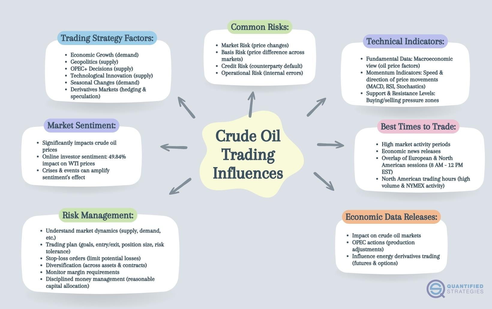

## Table of Contents

## What is crude oil and why is it important in global trade?

Crude oil is a natural liquid found deep in the earth. It is made up of hydrocarbons, which are the main parts of gasoline and other fuels. People get crude oil from the ground by drilling into oil wells. Once they have the oil, they send it to refineries. At the refineries, they clean and separate the oil into different products like gasoline, diesel, and jet fuel.

Crude oil is very important in global trade because it is used to make many things we use every day. Cars, trucks, and airplanes all need oil products to run. Many countries buy and sell crude oil, which makes it a big part of the world's economy. When the price of oil goes up or down, it can affect the cost of many other things. This is why people pay close attention to what is happening with oil prices and supplies around the world.

## How does the crude oil market function and who are the main players?

The crude oil market works like a big trading system where countries and companies buy and sell oil. The price of oil can change every day based on how much oil people want and how much is available. If there is a lot of oil but not many people want it, the price goes down. If there is not enough oil but a lot of people need it, the price goes up. People trade oil on special markets called exchanges, like the New York Mercantile Exchange (NYMEX) and the Intercontinental Exchange (ICE). These places help set the price of oil that everyone follows.

The main players in the [crude oil](/wiki/crude-oil) market are oil-producing countries, oil companies, and traders. Countries like Saudi Arabia, Russia, and the United States produce a lot of oil and have a big say in the market. They often work together in groups like OPEC (Organization of the Petroleum Exporting Countries) to decide how much oil to produce. Oil companies, like ExxonMobil and Shell, find, drill, and sell oil. They also buy oil from other countries to sell to customers. Traders buy and sell oil to make money from the changing prices. They help move oil from where it is produced to where it is needed.

## What are the basic principles of trading crude oil?

Trading crude oil involves buying and selling oil or oil contracts to make money. The basic idea is to buy oil when the price is low and sell it when the price goes up. Traders use different tools and information to guess where the price might go next. They look at things like how much oil countries are producing, how much people are using, and what is happening in the world that could change the price of oil. For example, if there is a war or a big storm, it might affect how much oil is available and push the price up.

The main places where people trade oil are called exchanges. These are like big markets where traders from all over the world can buy and sell oil. The two biggest exchanges for oil are the New York Mercantile Exchange (NYMEX) and the Intercontinental Exchange (ICE). On these exchanges, traders can buy and sell something called futures contracts. A futures contract is a promise to buy or sell oil at a certain price on a certain date in the future. This helps traders plan and manage the risks of the oil price going up or down.

## What are the different types of crude oil and how do they affect trading strategies?

There are different types of crude oil, and the main ones are light sweet crude and heavy sour crude. Light sweet crude is easier to turn into gasoline and other products because it has less sulfur and is lighter. It usually costs more because it is easier to use. Heavy sour crude has more sulfur and is thicker, so it is harder to turn into useful products. It usually costs less because it needs more work to use.

These different types of crude oil affect trading strategies because traders need to think about what kind of oil they are buying and selling. If a trader thinks the demand for gasoline will go up, they might want to buy more light sweet crude because it is easier to turn into gasoline. But if they think the demand for heavy products like asphalt will go up, they might want to buy more heavy sour crude. Traders also need to think about where the oil is coming from and where it is going because some places can only use certain types of oil. So, knowing the different types of crude oil helps traders make better choices about what to buy and sell.

## How do geopolitical events impact crude oil prices and trading?

Geopolitical events can have a big impact on crude oil prices and trading. When there is conflict or tension in oil-producing countries, it can make people worried that there might not be enough oil. For example, if there is a war or political trouble in a country like Saudi Arabia or Iran, it can make the price of oil go up because people think there might be less oil coming from those places. Also, if countries put sanctions or restrictions on other countries that produce oil, it can make the supply of oil smaller and push the price up.

Traders pay close attention to what is happening around the world because it can change the price of oil very quickly. If there is news about a problem in an oil-producing country, traders might start buying more oil to protect themselves from the price going up. On the other hand, if there is good news, like a new peace agreement or a new oil deal, the price might go down because people feel safer about the supply of oil. So, understanding what is happening in the world is very important for people who trade oil.

## What are the key economic indicators to watch when trading crude oil?

When trading crude oil, it's important to keep an eye on a few key economic indicators. One of the main ones is the Gross Domestic Product (GDP) of major countries. GDP shows how well a country's economy is doing. If a country's GDP is growing, it usually means more people are using oil because they are driving more, flying more, and using more energy. So, if the GDP of big countries like the United States or China is going up, it can push the price of oil up too.

Another important indicator is the level of inflation. Inflation is when the prices of things go up over time. When inflation goes up, the price of oil often goes up too because it costs more to produce and transport oil. Traders also watch the strength of the US dollar because oil is usually bought and sold in dollars. If the dollar gets weaker, oil can become cheaper for people using other currencies, which can increase demand and push the price up.

Lastly, traders should pay attention to oil inventory levels. These are reports that show how much oil is being stored in places like the United States. If the inventory levels are going down, it means people are using more oil than is being produced, which can make the price go up. If the inventory levels are going up, it means there is more oil than people need, which can make the price go down. Keeping an eye on these indicators can help traders make better decisions about when to buy and sell oil.

## What are the most common trading strategies for crude oil?

One common trading strategy for crude oil is called [trend following](/wiki/trend-following). This means traders look at the price of oil over time and try to find patterns. If they see the price is going up, they might buy oil because they think it will keep going up. If they see the price is going down, they might sell oil because they think it will keep going down. Traders use charts and other tools to help them see these trends and make their decisions.

Another strategy is called mean reversion. This is when traders think the price of oil will go back to a normal level after it goes too high or too low. If the price of oil is much higher than usual, traders might sell oil because they think it will go back down. If the price is much lower than usual, they might buy oil because they think it will go back up. This strategy is based on the idea that prices don't stay too far from normal for too long.

A third strategy is called spread trading. This is when traders buy and sell different types of oil at the same time. For example, they might buy light sweet crude and sell heavy sour crude. They do this because they think the difference in price between the two types of oil will change. If the difference gets smaller, they can make money. This strategy can be less risky than just buying or selling one type of oil because it depends on the difference in prices, not just the price going up or down.

## How can technical analysis be used in developing a crude oil trading strategy?

Technical analysis is a way to look at past prices of crude oil to help decide when to buy or sell. Traders use charts and special tools to find patterns in the price of oil. For example, they might look for things like support and resistance levels. Support is a price where the oil price stops going down and starts to go up again. Resistance is a price where the oil price stops going up and starts to go down again. By finding these levels, traders can guess where the price might go next and make their trading decisions based on that.

Another important part of technical analysis is using indicators like moving averages and the Relative Strength Index (RSI). Moving averages help smooth out the price data and show the general direction of the price over time. If a short-term moving average crosses above a long-term moving average, it might be a good time to buy because it suggests the price is starting to go up. The RSI helps traders see if the oil price is overbought or oversold. If the RSI is very high, it might mean the price is too high and could go down soon. If the RSI is very low, it might mean the price is too low and could go up soon. By using these tools, traders can develop a strategy that helps them make better guesses about where the price of oil might go next.

## What role does fundamental analysis play in crude oil trading?

Fundamental analysis looks at the real things that can change the price of crude oil, like how much oil countries are making, how much people are using, and what is happening in the world. Traders use this information to guess where the price might go. For example, if a big oil-producing country like Saudi Arabia decides to make less oil, the price might go up because there is less oil to go around. Or if a report comes out saying that people are using more oil than expected, the price might go up too because more people want the oil.

This kind of analysis is important because it helps traders understand the big picture. They look at things like the economy of big countries, how strong the US dollar is, and if there are any wars or problems in oil-producing places. By keeping an eye on these things, traders can make better choices about when to buy or sell oil. For example, if the economy of a big country like China is growing fast, traders might think more people will use oil and decide to buy more.

## How do futures and options work in the context of crude oil trading?

Futures and options are special kinds of contracts that people use when trading crude oil. A futures contract is a promise to buy or sell oil at a certain price on a certain date in the future. For example, a trader might buy a futures contract to buy oil in three months at today's price. If the price of oil goes up in those three months, the trader can buy the oil at the lower price they agreed on and then sell it at the higher price, making money. If the price goes down, the trader loses money. Futures help traders plan and manage the risk of the oil price changing.

Options are a bit different. An option gives the trader the right, but not the obligation, to buy or sell oil at a certain price before a certain date. There are two kinds of options: a call option and a put option. A call option lets the trader buy oil at a set price, while a put option lets the trader sell oil at a set price. Traders buy options to protect themselves from big changes in the price of oil. For example, if a trader thinks the price of oil might go up a lot, they can buy a call option. If the price does go up, they can use the option to buy the oil at the lower price and make money. If the price stays the same or goes down, they can just let the option expire and not lose much money.

## What are the risks associated with crude oil trading and how can they be managed?

Trading crude oil can be risky because the price of oil can change a lot very quickly. Things like wars, storms, or changes in how much oil countries make can make the price go up or down fast. If a trader buys oil and the price goes down a lot, they can lose money. Also, using futures and options can be risky because they are promises about what the price will be in the future, and no one knows for sure what will happen. If the price goes the wrong way, traders can lose more money than they put in.

To manage these risks, traders can use different strategies. One way is to use stop-loss orders, which automatically sell oil if the price goes down to a certain level. This can help limit how much money a trader can lose. Another way is to diversify, which means not putting all their money into just oil. Traders can invest in other things too, so if the price of oil goes down, they might still make money from other investments. Using options can also help because they give traders the right to buy or sell oil at a set price, which can protect them if the price changes a lot.

## How can algorithmic trading enhance crude oil trading strategies for advanced traders?

Algorithmic trading can make crude oil trading better for advanced traders by using computer programs to buy and sell oil automatically. These programs can look at a lot of information very quickly and make decisions based on rules that the traders set up. For example, if a trader wants to buy oil when the price goes above a certain level and sell it when it goes below another level, the computer can do this without the trader having to watch the market all the time. This can help traders take advantage of small changes in the price of oil that they might miss if they were trading by hand.

Another way [algorithmic trading](/wiki/algorithmic-trading) helps is by taking away some of the emotions that can make trading hard. When people trade, they can sometimes make bad choices because they are scared or excited. But a computer program doesn't feel emotions, so it can stick to the plan and make decisions based on the rules, not feelings. This can lead to more consistent trading and help traders make more money over time. By using these computer programs, advanced traders can improve their strategies and manage the risks of trading crude oil better.

## How can one develop a crude oil trading strategy?

Developing a crude oil trading strategy utilizing algorithmic trading begins with a comprehensive analysis of historical data. This data is instrumental in identifying recurring patterns and indicators that significantly influence price movements. A variety of technical indicators are frequently employed in the formulation of these strategies.

One of the most commonly used indicators is the moving average. The moving average helps smooth out price data by creating a constantly updated average price. It can reveal the direction of the trend and potential support and resistance levels. For example, the simple moving average (SMA) is calculated as:

$$
\text{SMA} = \frac{P_1 + P_2 + \ldots + P_n}{n}
$$

where $P$ represents the price points over $n$ periods. 

Another essential tool is the stochastic oscillator, which measures the current price relative to its price range over a specific period. It produces values between 0 and 100, where values above 80 may indicate overbought conditions, and values below 20 may indicate oversold conditions.

Fibonacci retracement levels are also pivotal in crude oil trading strategies. These levels are used to identify potential reversal points by drawing horizontal lines at key Fibonacci levels (23.6%, 38.2%, 50%, 61.8%, and 100%) from a significant price range.

Integral to any trading strategy is robust risk management. Implementing risk management involves setting stop-loss orders to limit potential losses. This predefined price level automatically closes a position when reached, thereby protecting the trader from excessive loss. Similarly, position sizing rules help manage the amount invested in any given trade. A common approach is the fixed percentage risk model, where a trader might risk only 1-2% of their total capital on any single trade.

Python can be a useful tool in developing and testing such strategies. A simple example of calculating an SMA in Python might look like this:

```python
import pandas as pd

def calculate_sma(prices, window):
    sma = prices.rolling(window=window).mean()
    return sma

prices = pd.Series([50, 55, 53, 54, 58, 60, 62])
sma_3 = calculate_sma(prices, 3)
print(sma_3)
```

This function uses the `pandas` library to compute a simple moving average over a three-period window. By using these tools and techniques, traders can construct a systematic and disciplined approach to trading crude oil algorithmically, improving their chances of success in the volatile oil market.

## References & Further Reading

[1]: Bergstra, J., Bardenet, R., Bengio, Y., & Kégl, B. (2011). ["Algorithms for Hyper-Parameter Optimization."](https://papers.nips.cc/paper/4443-algorithms-for-hyper-parameter-optimization) Advances in Neural Information Processing Systems 24.

[2]: ["Advances in Financial Machine Learning"](https://books.google.com/books/about/Advances_in_Financial_Machine_Learning.html?id=oU9KDwAAQBAJ) by Marcos Lopez de Prado

[3]: ["Evidence-Based Technical Analysis: Applying the Scientific Method and Statistical Inference to Trading Signals"](https://www.amazon.com/Evidence-Based-Technical-Analysis-Scientific-Statistical/dp/0470008741) by David Aronson

[4]: ["Machine Learning for Algorithmic Trading"](https://github.com/stefan-jansen/machine-learning-for-trading) by Stefan Jansen

[5]: ["Quantitative Trading: How to Build Your Own Algorithmic Trading Business"](https://books.google.com/books/about/Quantitative_Trading.html?id=j70yEAAAQBAJ) by Ernest P. Chan