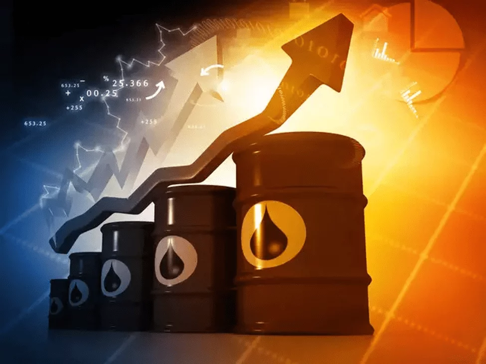

Crude oil trading, often referred to as trading in "black gold," is a pivotal activity in the global financial markets. As one of the most actively traded commodities, crude oil holds a significant place due to its essential role in the global economy. It is not only a primary energy source but also a critical ingredient in various industries, making its market highly influential and closely watched by traders, investors, and economists alike.

The purpose of this article is to provide an in-depth exploration of crude oil trading strategies. We will deep dive into the nuances of what crude oil is as a commodity, understand its profound impact on global markets, and navigate through the various aspects of trading it. This includes examining different types of crude oil contracts, particularly futures, and offering practical guides on how to trade them effectively.

The article will also cover a range of trading strategies tailored specifically to the crude oil market. These strategies will be dissected step-by-step, from fundamental analysis approaches that consider global geopolitical and economic factors, to technical analysis strategies that focus on market data and trends. Additionally, we'll discuss the crucial aspects of market sentiment and its impact on crude oil prices, and emphasize the importance of risk management in trading this volatile commodity.

# Understanding Crude Oil

Crude oil, often referred to as "black gold," is a naturally occurring, unrefined petroleum product composed of hydrocarbon deposits and other organic materials. As a commodity, it is extracted from the earth and refined into various products like gasoline, diesel, petrochemicals, and other essential materials. Crude oil is classified based on its geographical origin (like Brent or West Texas Intermediate) and its physical characteristics (such as density and sulfur content).

In the global markets, crude oil holds a place of paramount importance due to its extensive use in various sectors, making it a highly influential commodity. It is a primary energy source for transportation, heating, and electricity generation, and also a key raw material in the chemical and manufacturing industries. The pervasive use of oil derivatives makes crude oil prices a critical economic indicator, influencing inflation rates, trade balances, and even the monetary policies of nations.

The price of crude oil in the global market is shaped by a complex interplay of factors. Supply and demand dynamics are at the forefront, affected by global economic growth, technological advancements in energy, and geopolitical events. OPEC's (Organization of the Petroleum Exporting Countries) production decisions significantly impact oil supply and, consequently, prices. Political stability in oil-rich regions, international trade agreements, and environmental policies also play crucial roles in the crude oil market.

Crude oil's significance in the global economy extends beyond just being a commodity; it is also a vital financial asset. The oil market's volatility and liquidity make it an attractive arena for traders and investors. However, this also means that crude oil prices are susceptible to rapid changes, influenced by global events and market sentiments. Hence, trading in crude oil requires not only an understanding of the commodity itself but also a keen awareness of the broader economic and geopolitical landscape.

# Crude Oil Contracts and Futures

## Types of Crude Oil Contracts

In the world of crude oil trading, traders have access to various types of contracts, each offering different mechanisms and opportunities. Understanding these contracts is crucial for anyone looking to navigate this market effectively.

**Futures Contracts:** The most common and popular form for trading crude oil, futures contracts, are agreements to buy or sell a specific quantity of crude oil at a predetermined price on a specified date in the future. These contracts are standardized in terms of quality, quantity, and transaction date and are traded on futures exchanges like the New York Mercantile Exchange (NYMEX) and the Intercontinental Exchange (ICE). Futures are used both for hedging against price fluctuations and speculative trading. They are leveraged instruments, meaning traders can control large contract values with a relatively small amount of capital.

**Spot Contracts:** Unlike futures, spot contracts involve the immediate purchase or sale of crude oil at current market prices. These transactions usually occur in physical markets and are settled with the actual delivery of oil. Spot contracts are more prevalent among end-users of oil, like refineries or companies that need physical oil for production.

**Forward Contracts:** Similar to futures, forward contracts involve an agreement to buy or sell oil at a future date, but these contracts are not standardized and are traded over-the-counter (OTC) rather than on exchanges. This means they can be customized to suit the specific needs of the buyer and seller but come with higher counterparty risk.

**Options on Futures Contracts:** These give the holder the right, but not the obligation, to buy (call option) or sell (put option) a futures contract at a specified price before a certain date. Options can be used to speculate on price movements or hedge against potential price changes in the futures market.

**Swap Contracts:** Swaps are financial derivatives where two parties exchange cash flows based on a predetermined formula linked to the price of crude oil. These are used primarily for hedging and are also traded OTC.

Each of these contract types caters to different trading strategies and risk profiles. For instance, futures and options are preferred for their liquidity and the ability to use leverage, whereas forwards and swaps are favored for hedging customized exposures in the physical market. Understanding these differences is crucial for traders in making informed decisions that align with their trading objectives and risk tolerance.

## How to Trade Crude Oil Futures

Trading crude oil futures can be a dynamic and potentially rewarding endeavor, but it requires a solid understanding of the market and a strategic approach. Here’s a beginner-friendly guide to get started in crude oil futures trading:

- **Educate Yourself:** Before diving into trading, gain a thorough understanding of what crude oil futures are. Learn about the basics of futures contracts, how they work, and the specific characteristics of crude oil markets. Understand the factors that influence crude oil prices, including geopolitical events, supply and demand dynamics, and economic indicators.
- **Choose a Broker:** Select a broker that offers access to the commodities markets and specifically crude oil futures. Look for brokers that are reputable, regulated, and provide a platform with the tools and resources necessary for trading crude oil. Compare commission rates, platform features, and educational resources.
- **Set Up a Trading Account:** Once you've chosen a broker, set up a trading account. This will involve providing some personal information and possibly financial details for account verification and suitability. Make sure to understand the margin requirements for trading crude oil futures, as these can vary by broker.
- **Start with a Demo Account:** Many brokers offer demo or practice accounts. Use these to practice trading crude oil futures without risking real money. This step is crucial for gaining experience with the market’s volatility and testing trading strategies.
- **Develop a Trading Plan:** A well-thought-out trading plan is essential. This should include your investment goals, risk tolerance, trading strategies, and criteria for entering and exiting trades. Decide whether you'll use fundamental analysis, technical analysis, or a combination of both to make trading decisions.
- **Implement Risk Management Techniques:** Due to the high volatility in the crude oil market, effective risk management is crucial. Use tools like stop-loss orders to limit potential losses. Only invest capital you can afford to lose, and avoid over-leveraging your positions.
- **Stay Informed and Updated:** The crude oil market is highly sensitive to global events. Stay informed about news and developments that could affect the market. This includes monitoring inventory reports, OPEC meetings, geopolitical tensions in oil-rich regions, and economic data releases.
- **Begin Trading:** Start by placing small trades to get a feel for the market. Monitor your trades and analyze their performance. Keep a trading journal to record your decisions and their outcomes, which can be invaluable for refining your strategies.
- **Review and Adapt:** Regularly review your trading performance and strategies. The crude oil market can change rapidly, and what worked yesterday may not work today. Be prepared to adapt your strategies to align with current market conditions.

Remember, trading crude oil futures involves significant risk and is not suitable for everyone. It requires continuous learning, patience, and discipline. As a beginner, take your time to learn and gradually build your trading experience.

# Crude Oil Trading Strategies

Crude oil, with its dynamic and volatile nature, offers a variety of trading strategies, each suited to different trading styles and market conditions. Here’s an overview of various strategies specific to crude oil trading:

## Trend-Following Strategies

These strategies involve identifying and following the direction of the market trend. Traders using this approach look for signals that indicate the continuation of a current trend in crude oil prices, such as higher highs and higher lows in an uptrend. Tools like moving averages and trendlines are commonly used.

## Range Trading

In range trading, traders capitalize on crude oil prices moving within a defined range. They buy at the lower end of the range (support) and sell at the upper end (resistance). This strategy is effective in markets lacking a clear trend and exhibiting sideways movements.

Step-by-step guide:

- **Identify the Range:** Look for periods where crude oil prices are moving sideways within a defined range. The top of the range serves as resistance, and the bottom serves as support.
- **Trading Entries:** When the price hits the bottom of the range, consider a buy position, anticipating that the price will move back up towards the top. Conversely, when the price hits the top of the range, consider a sell position.
- **Stop-Loss and Take-Profit:** Place a stop-loss just outside the range to protect against breakout moves. Set the take-profit near the opposite end of the range.

## Breakout Trading

This strategy focuses on identifying significant price movements or breakouts from a defined range or pattern. Traders enter a long position when the price breaks above resistance or a short position when it breaks below support, anticipating a strong price move in the direction of the breakout.

Step-by-step guide:

- **Identify Potential Breakouts:** Monitor crude oil prices for patterns that typically precede breakouts, such as triangles, flags, or tight price consolidations.
- **Confirm the Breakout:** Volume is key in confirming breakouts. Look for a significant increase in volume as the price breaks through a key resistance or support level.
- **Entry Point and Position Sizing:** Enter the trade as soon as the price breaks through and closes beyond the key level. Adjust your position size based on the volatility and your risk tolerance.
- **Stop-Loss and Take-Profit:** Place a stop-loss just inside the breakout level to minimize losses if the breakout fails. The take-profit should be set based on previous price swings or using a risk-reward ratio.

## Pullback Strategy

A pullback strategy involves entering the market after a price retracement within a larger trend. Traders look for temporary reversals (pullbacks) to enter at a more favorable price in the direction of the prevailing trend.

Step-by-step guide:

- **Identify the Trend:** Start by identifying the prevailing trend in the crude oil market using tools like moving averages or trendlines. Look for an established uptrend or downtrend.
- **Wait for a Pullback:** Once the trend is identified, wait for a pullback or retracement in the opposite direction of the trend. This pullback is a temporary reversal in prices and should not break the overall trend structure.
- **Entry Point:** Look for signs that the pullback is ending and the main trend is resuming. This could be a reversal candlestick pattern or when an indicator like the RSI moves out of the overbought/oversold territory.
- **Set Stop-Loss and Take-Profit:** Enter the trade at the end of the pullback. Place a stop-loss just below the lowest point of the pullback in an uptrend or above the highest point in a downtrend. Set a take-profit target in line with the prevailing trend.

## Scalping

Scalping is a short-term strategy where traders aim to make small profits from minor price changes. It requires a high level of attention and quick decision-making to capitalize on small movements in crude oil prices.

## Fundamental Analysis

This strategy focuses on the underlying factors that affect the supply and demand of crude oil. Traders analyze geopolitical events, OPEC decisions, inventory data, and macroeconomic indicators to predict price movements.

Fundamental analysis involves evaluating the intrinsic value of crude oil based on economic, financial, and other qualitative and quantitative factors. This analysis looks at the broader picture affecting the oil market.

Key factors include factors such as geopolitical events, OPEC policies, production levels, global economic health, supply and demand dynamics, and inventory data. Political stability in oil-producing countries and major policy decisions also play a significant role.

Traders using fundamental analysis aim to predict long-term price movements. It’s particularly useful for position trading or long-term investment decisions.

## Technical Analysis

Contrary to fundamental analysis, technical analysis relies on historical price data and chart patterns. Traders use a variety of technical indicators, like the Relative Strength Index (RSI) or Bollinger Bands, to forecast future price movements.

Technical analysis is based on the idea that historical price actions and market data can indicate future market behavior. It focuses on price charts and trading volumes to identify patterns and trends.

Key tools includes the use of indicators like moving averages, RSI (Relative Strength Index), MACD (Moving Average Convergence Divergence), and chart patterns like head and shoulders, triangles, or candlestick patterns.

This analysis is widely used for short-term trading decisions. It’s popular among day traders and swing traders who focus on short-term price movements.

## Hedging

In hedging, traders take an opposite position in the futures market to their position in the physical market to offset potential losses. This strategy is commonly used by companies involved in oil production or consumption to protect against price volatility.

Each of these strategies requires a unique set of skills and an understanding of the crude oil market. It's crucial for traders to assess their risk tolerance, trading goals, and the current market environment before choosing a strategy. Furthermore, combining different strategies and adapting them to changing market conditions can often lead to more effective trading outcomes.

# Analyzing the Crude Oil Market

## Factors Influencing Crude Oil Prices

Crude oil prices are influenced by a complex interplay of global factors. Understanding these factors is essential for traders to anticipate market movements and develop effective trading strategies.

1. **Supply and Demand Dynamics:** The most fundamental factor affecting crude oil prices is the balance between supply and demand. An oversupply, possibly due to increased production by oil-producing countries, can lead to lower prices. Conversely, a surge in demand, often linked to global economic growth, tends to push prices higher.
2. **Geopolitical Events:** Political instability in key oil-producing regions can significantly impact crude oil prices. Conflicts, wars, or political unrest in countries like Saudi Arabia, Iran, or Russia can lead to fears of supply disruptions, driving prices up. Peaceful resolutions or stable conditions, on the other hand, can have the opposite effect.
3. **OPEC Policies:** The Organization of the Petroleum Exporting Countries (OPEC) plays a crucial role in determining crude oil prices. Decisions made by OPEC regarding oil production levels can drastically influence global oil supply. A decision to cut production usually leads to a price increase, while a decision to increase production can cause prices to fall.
4. **Economic Indicators:** Global economic health influences crude oil prices. Strong economic growth leads to increased demand for energy, pushing prices up. Economic downturns, however, tend to decrease demand, leading to lower prices.
5. **Currency Fluctuations:** Since crude oil is primarily traded in U.S. dollars, fluctuations in the dollar's value can affect oil prices. A stronger dollar makes oil more expensive in other currencies, potentially reducing demand and lowering prices. Conversely, a weaker dollar can lead to higher oil prices.
6. **Technological Advances:** Advances in technology, such as improvements in fracking or renewable energy sources, can also influence crude oil prices. Enhanced oil recovery techniques can increase supply, potentially lowering prices, while significant breakthroughs in alternative energy can reduce dependence on oil, also impacting demand.
7. **Market Speculation:** Traders’ perceptions and speculative activities can influence oil prices. If traders believe oil prices will rise, their buying activity can drive prices up. Conversely, selling off oil futures in anticipation of a price drop can lead to lower prices.
8. **Environmental Policies and Regulations:** Global environmental policies, aimed at reducing carbon emissions, can influence crude oil demand. Policies favoring renewable energy sources can decrease demand for oil, potentially lowering prices.

Each of these factors can have a varying impact on crude oil prices, and often, it is the combination of several factors that drives the market. Successful crude oil traders keep a close eye on these elements, understanding how each can signal changes in market trends and price movements.

## Understanding Market Sentiment

Understanding market sentiment is a critical aspect of trading in the crude oil market. Market sentiment refers to the overall attitude of investors toward a particular market or asset. In crude oil trading, sentiment can significantly influence price movements, often independent of the fundamental supply and demand dynamics. Here’s how traders can gauge and interpret market sentiment:

1. **News and Reports Analysis:** Keep abreast of global news, especially events impacting oil-producing regions, policy decisions by OPEC, and economic data releases. News about geopolitical tensions, natural disasters, or changes in energy policies can shift market sentiment rapidly.
2. **Inventory Data:** Reports such as the U.S. Energy Information Administration (EIA) weekly inventory data provide insights into supply levels. High inventory levels might indicate oversupply, potentially leading to bearish sentiment, while low levels can lead to bullish sentiment.
3. **Market Commentaries and Analysis:** Follow commentaries from industry experts and analysts. Insights from seasoned market participants can offer valuable perspectives on the prevailing sentiment.
4. **Technical Indicators:** Certain technical indicators can be useful for gauging sentiment. For example, the Relative Strength Index (RSI) can indicate overbought or oversold conditions, while moving averages can show whether the sentiment is bullish or bearish based on price trends.
5. **Trading Volumes:** High trading volumes can signify strong market sentiment, either bullish or bearish, depending on the direction of the trend. Conversely, low volumes might suggest a lack of conviction in the current price trend.
6. **Futures Market Data:** The futures market, including the Commitments of Traders (COT) report, provides insights into the positions held by different types of traders. A large number of long positions by commercial traders might indicate bullish sentiment, while a predominance of short positions could signal bearish sentiment.
7. **Social Media and Forums:** Discussions on social media platforms and trading forums can also be a source of market sentiment. However, traders should approach these sources with caution, as the opinions expressed may not always be based on rigorous analysis.
8. **Economic Indicators:** Global economic indicators like GDP growth rates, employment data, and manufacturing indexes can influence investor sentiment about future oil demand, thereby affecting crude oil prices.

Interpreting market sentiment involves synthesizing information from multiple sources. It requires not just understanding the current mood of the market but also being able to anticipate how sentiment might change in response to new information. Successful crude oil traders often combine sentiment analysis with technical and fundamental analysis to develop a well-rounded view of the market. This approach enables them to make more informed trading decisions in the often volatile crude oil market.

# Risk Management in Crude Oil Trading

In crude oil trading, risk management is not just a part of the strategy; it is the foundation upon which successful trading is built. Due to the inherent volatility and unpredictability of the crude oil market, implementing effective risk management techniques is crucial for both preserving capital and maximizing profits.

**Understanding Leverage and Its Risks:** Crude oil futures are typically traded with leverage, which means traders can control large positions with a relatively small amount of capital. While leverage can amplify profits, it also magnifies losses. It is essential for traders to understand the degree of leverage they are taking on and ensure it aligns with their risk tolerance.

**Setting Stop-Loss Orders:** One of the most effective risk management tools in trading is the use of stop-loss orders. A stop-loss order automatically closes a position at a predetermined price level to limit potential losses. In volatile markets like crude oil, stop-losses can protect traders from significant and unexpected market movements.

**Position Sizing:** Proper position sizing is critical to managing risk. It involves determining the right amount of capital to allocate to a trade based on the specific risk involved. A common rule of thumb is not to risk more than a small percentage of the total trading capital on a single trade.

**Diversification:** Although diversification is more challenging within the narrow scope of crude oil trading, traders can still diversify their strategies and timeframes. For example, mixing short-term trades with longer-term positions can spread risk.

**Using Hedging Techniques:** Hedging involves taking an offsetting or opposite position to a primary trade to reduce risk. In crude oil trading, this could mean using futures contracts to hedge against a physical position in oil, or trading different oil-related assets that may have inverse price correlations.

**Regular Market Analysis:** Staying informed about market conditions, geopolitical events, and supply-demand dynamics is a form of risk management. By keeping abreast of factors that could impact oil prices, traders can make more informed decisions and adjust their strategies accordingly.

**Implementing Risk-Reward Ratios:** Before entering a trade, consider the potential risk versus the potential reward. A common strategy is to seek trades where the potential reward justifies the risk, such as a 3:1 risk-reward ratio.

**Emotional Discipline:** Risk management is not just about technical tools and strategies; it also involves managing one’s emotions. Traders should avoid emotional decisions driven by fear or greed and adhere to their trading plan.

**Continuous Learning and Adaptation:** The crude oil market is dynamic and ever-changing. Continuous learning and adapting to new market conditions are part of effective risk management.

By employing these risk management techniques and tools, traders can navigate the complex and often turbulent waters of crude oil trading with greater confidence and control. Effective risk management not only minimizes the chances of significant losses but also contributes to a more disciplined, consistent, and ultimately profitable trading approach.

# Choosing Between Brent and WTI

In the realm of crude oil trading, two major benchmarks dominate the market: Brent Crude and West Texas Intermediate (WTI). Understanding the differences between these two types of crude oil is crucial for traders, as each has unique characteristics that influence trading strategies.

**Differences Between Brent and WTI:**

- **Source and Composition:** Brent Crude, named after the Brent oilfield in the North Sea, is a blend of crude oil from 15 different oil fields in the North Sea. It is a light, sweet crude oil, but slightly heavier and less sweet than WTI. WTI, sourced primarily from U.S. oil fields, particularly in Texas, Oklahoma, and Louisiana, is known for being very light and sweet, making it ideal for gasoline refining.
- **Price Benchmarks:** Brent Crude acts as a benchmark for European, African, and Middle Eastern crude oil, influencing approximately two-thirds of the world's traded crude oil supply. WTI, on the other hand, is the main benchmark for crude oil in the United States.
- **Market Drivers:** Brent is more sensitive to geopolitical events and supply changes in the North Sea and other parts of the globe. WTI, meanwhile, is more influenced by U.S. market factors, such as domestic supply and demand dynamics.
- **Trading Liquidity and Volatility:** Both Brent and WTI are highly liquid markets, but WTI typically exhibits slightly higher short-term volatility, partly due to the frequent release of U.S. inventory data.

**How to Choose Between Trading Brent and WTI:**

- **Assess Market Conditions:** Consider the current state of global geopolitics, especially events that could affect European and Middle Eastern oil supplies (which impact Brent) or U.S. oil inventories and production (which affect WTI).
- **Consider the Spread:** The price difference (spread) between Brent and WTI can indicate supply and demand imbalances, offering trading opportunities. For example, a widening spread might suggest greater demand for Brent relative to WTI, or vice versa.
- **Align with Trading Style:** If your trading style is more suited to markets with higher volatility and frequent trading opportunities based on domestic factors, WTI might be the better choice. If you prefer a market that is more responsive to international events, then Brent could be more suitable.
- **Leverage Market Analysis Tools:** Utilize tools like technical analysis and fundamental analysis to assess which type of crude might offer better opportunities based on current market trends and future forecasts.
- **Diversification:** Experienced traders might choose to trade both types of oil to diversify their portfolios and capitalize on different market conditions.

In summary, the choice between trading Brent or WTI should be based on a trader’s understanding of each type’s unique characteristics and how they align with current market conditions, trading strategy, and personal risk tolerance. Keeping abreast of global economic and political developments is also crucial, as these can significantly impact the relative pricing and trading dynamics of Brent and WTI crude oil.

# Seasonality and Market Trends

Seasonality and long-term market trends are significant factors in crude oil trading, influencing the development of effective trading strategies.

## Seasonality in Crude Oil Markets

**Seasonal Demand Patterns:** Crude oil demand often fluctuates with the seasons. For instance, in the U.S., gasoline demand typically increases in the summer due to the driving season, while heating oil demand peaks in the winter. These patterns can impact crude oil prices.

**Refinery Maintenance:** Refineries often undergo maintenance in the spring and fall, which can affect crude oil supply levels. Reduced refinery activity can lead to increased crude oil inventories, potentially lowering prices.

**Strategic Inventory Builds and Draws:** Many countries build up strategic oil reserves or release them at different times of the year, influencing crude oil supply and prices.

## Long-Term Market Trends:

**Global Economic Growth:** Long-term trends in global economic growth can significantly impact crude oil demand. Rising economies generally increase demand for energy, including crude oil, pushing prices up.

**Technological and Regulatory Changes:** Advances in renewable energy technology and regulatory changes aimed at reducing carbon emissions can reduce dependence on crude oil over time, affecting long-term demand and price trends.

**Geopolitical Stability:** Long-term trends in geopolitical stability in major oil-producing regions can also impact crude oil prices. Prolonged periods of instability can lead to sustained price increases due to concerns about supply disruptions.

## Implications for Trading Strategies

**Seasonal Trading Strategies:** Traders can develop strategies based on predictable seasonal patterns. For example, buying crude oil futures ahead of the summer driving season might be profitable if historical data shows consistent price increases during this period.

**Trend Analysis:** Understanding long-term trends can help in making more informed trading decisions. For example, a long-term upward trend in crude oil prices might indicate a bullish market, suggesting strategies that favor long positions.

**Adaptive Strategies:** Successful traders adapt their strategies in response to both seasonal changes and evolving long-term trends. This might involve adjusting position sizes, entry and exit points, and risk management tactics depending on the time of year or the current long-term market trend.

**Diversification:** To mitigate risks associated with seasonality and long-term trends, traders might diversify their portfolios. This could involve trading different energy commodities or using different financial instruments.

**Continuous Monitoring:** Seasonality and long-term trends in the crude oil market aren't static. Continuous monitoring of market conditions, technological advancements, and geopolitical events is crucial to adapt trading strategies effectively.

In conclusion, both seasonality and long-term market trends play a crucial role in shaping crude oil trading strategies. Successful traders recognize these patterns and trends, integrating them into their trading approach to make more informed decisions and optimize their trading outcomes.

# Conclusion

In conclusion, mastering crude oil trading requires a comprehensive understanding of various elements that make this market both challenging and rewarding. The key points covered in this article serve as a foundation for anyone looking to navigate the complexities of crude oil trading effectively.

Crude oil is more than just a commodity; it's a critical component of global markets, influencing economies and geopolitics. Its characteristics and the roles of major types like Brent and WTI are fundamental knowledge for traders.

A variety of contracts, especially futures, offer traders a way to participate in crude oil markets without physically handling the commodity. Understanding how these contracts work is crucial for effective trading.

Various trading strategies, including Pullback, Range Trading, and Breakout Trading, can be adapted to suit individual trading styles and market conditions. Both fundamental and technical analysis play essential roles in strategy development.

Staying abreast of factors influencing crude oil prices, such as geopolitical events and supply-demand dynamics, is essential. Additionally, understanding market sentiment provides insights into market trends and potential price movements.

In trading crude oil, success comes from a blend of thorough market knowledge, strategic planning, and risk management. Stay informed, remain adaptable, and always be prepared for the volatility and opportunities that the world of 'Black Gold' presents. For further learning, consider exploring books, webinars, and online courses that deep dive deeper into specific aspects of crude oil trading.

💡 **Read more:**

- Trading strategies papers with code on [Equities](https://wiki.paperswithbacktest.com/trading-strategies/equities), [Cryptocurrencies](https://wiki.paperswithbacktest.com/trading-strategies/cryptocurrencies), [Commodities](https://wiki.paperswithbacktest.com/trading-strategies/commodities), [Currencies](https://wiki.paperswithbacktest.com/trading-strategies/currencies), [Bonds](https://wiki.paperswithbacktest.com/trading-strategies/bonds), [Options](https://wiki.paperswithbacktest.com/trading-strategies/options)
- [A curated list](https://github.com/paperswithbacktest/awesome-systematic-trading) of awesome libraries, packages, strategies, books, blogs, and tutorials for systematic trading
- [A bunch of datasets](https://huggingface.co/paperswithbacktest) for quantitative trading
- [A website to help you](https://paperswithbacktest.com/) become a quant trader and achieve financial independence

# Frequently Asked Questions

**How do I start trading crude oil?**

Begin by educating yourself about the crude oil market and its influencing factors. Next, choose a reliable trading platform, familiarize yourself with different types of crude oil contracts (like futures), and decide on a trading strategy that suits your risk tolerance and investment goals.

**What are the risks involved in crude oil trading?**

The main risks include market volatility, geopolitical events, changes in supply and demand dynamics, and price fluctuations driven by global economic conditions. Traders must also be aware of the financial risks associated with the use of leverage.

**Should I focus on Brent or WTI crude oil?**

This depends on your market analysis and which crude oil type aligns with your trading strategy. Brent crude is used as a global benchmark and is influenced by global factors, while WTI is more influenced by U.S. market factors.

**How important is technical analysis in crude oil trading?**

Technical analysis is a crucial tool, especially for short-term trading strategies. It helps in identifying trends, chart patterns, and potential entry and exit points. However, it should be used alongside fundamental analysis for a comprehensive market view.

**Can I trade crude oil without owning the physical commodity?**

Yes, most traders participate in the crude oil market through derivatives like futures and options, which don’t require owning the physical commodity.

**How do seasonal patterns affect crude oil prices?**

Seasonal patterns, such as increased demand for heating oil in winter or gasoline in summer, can significantly impact crude oil prices. Traders often use these patterns to inform their trading strategies.

**What is the best way to manage risk in crude oil trading?**

Effective risk management techniques include setting stop-loss orders, position sizing, diversifying trading strategies, and staying updated with global economic and political developments. Emotional discipline and continuous learning are also key.

**Is algorithmic trading used in crude oil markets?**

Yes, algorithmic trading is increasingly popular in the crude oil market. It involves using computer algorithms to execute trades based on predefined criteria and can be beneficial for high-frequency trading and exploiting market inefficiencies.

**What impact do global events have on crude oil prices?**

Global events, especially geopolitical tensions in oil-producing regions, can significantly impact crude oil prices. Traders must monitor global news and analyze how such events may affect supply and demand.

**Where can I find reliable information for crude oil trading?**

Reliable sources include financial news websites, market analysis reports, official data from organizations like OPEC and the EIA, and economic calendars for tracking events that might impact the crude oil market.

# References & Further Reading

- ["The Prize: The Epic Quest for Oil, Money, and Power"](https://en.wikipedia.org/wiki/The_Prize:_The_Epic_Quest_for_Oil,_Money,_and_Power) by Daniel Yergin: A comprehensive history of oil and its impact on world economics and politics.
- ["Oil 101"](https://www.amazon.com/Oil-101-Morgan-Downey/dp/0982039204) by Morgan Downey: An essential guide to the oil industry, including its technical and economic aspects.
- ["Trading Natural Gas: Cash, Futures, Options and Swaps"](https://www.amazon.com/Trading-Natural-Gas-Futures-Options/dp/0878147098) by Fletcher J. Sturm: Focuses on natural gas but provides valuable insights applicable to crude oil trading.