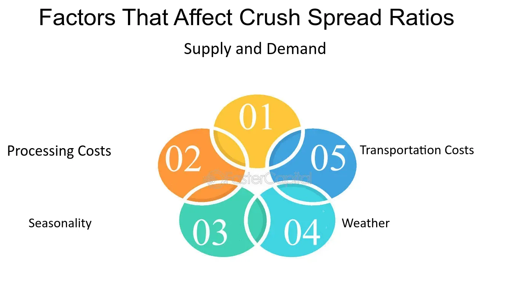

## Table of Contents

## What is a crush spread?

A crush spread is a trading strategy used in the agriculture industry, specifically with soybeans. It involves buying soybean futures and then selling soybean oil and meal futures. The idea is to profit from the difference in price between the soybeans and the products made from them, like oil and meal. This strategy is called a "crush" spread because it represents the process of crushing soybeans to extract oil and meal.

Farmers and traders use the crush spread to manage risk and predict market trends. If the price of soybeans goes up more than the price of soybean oil and meal, the trader might lose money. But if the price of the oil and meal goes up more than the soybeans, the trader could make a profit. It's a way to hedge against price changes in the soybean market and can be a useful tool for those involved in soybean production and trading.

## How is the crush spread calculated?

The crush spread is calculated by figuring out the difference between the cost of soybeans and the value of the products made from them, like soybean oil and soybean meal. To do this, you start by looking at the price of soybean futures. Then, you look at the prices of soybean oil and meal futures. The basic idea is to subtract the cost of the soybeans from the combined value of the oil and meal.

For example, if soybeans are trading at $10 per bushel, soybean oil at $0.30 per pound, and soybean meal at $300 per ton, you need to convert these into common units. Let's say one bushel of soybeans makes 11 pounds of oil and 44 pounds of meal. So, you would calculate the value of the oil and meal from one bushel of soybeans: 11 pounds of oil at $0.30 per pound is $3.30, and 44 pounds of meal at $0.0682 per pound (since $300 per ton is $0.15 per pound, and 44 pounds is 0.44 of a ton) is $3.00. Adding these together gives you $6.30. The crush spread would then be $6.30 minus $10, which equals a negative $3.70 per bushel. This negative number means the cost of the soybeans is more than the value of the oil and meal they produce, which is not profitable.

## What are the components involved in a crush spread?

A crush spread involves three main parts: soybeans, soybean oil, and soybean meal. These are all connected because soybeans are crushed to make oil and meal. When you do a crush spread, you are buying soybean futures and selling soybean oil and meal futures. The goal is to make money from the difference in price between the soybeans and the products made from them.

To figure out the crush spread, you need to know the price of soybean futures, soybean oil futures, and soybean meal futures. You then calculate how much oil and meal you get from one bushel of soybeans and use those numbers to find out if the value of the oil and meal is more or less than the cost of the soybeans. This helps farmers and traders guess what might happen in the market and decide if they can make money from crushing soybeans.

## Why is crush spread analysis important for traders?

Crush spread analysis is important for traders because it helps them understand if they can make money from soybeans. By looking at the prices of soybeans, soybean oil, and soybean meal, traders can see if the cost of soybeans is less than the value of the oil and meal made from them. If it is, they might decide to buy soybeans and sell the oil and meal, hoping to make a profit from the difference.

This analysis also helps traders guess what might happen in the market. If they think the price of soybeans will go up a lot, they might not want to do a crush spread because it could lose them money. But if they think the price of oil and meal will go up more than soybeans, a crush spread could be a good choice. This way, traders can plan their moves and manage the risks of buying and selling in the soybean market.

## Can you explain the basic economics behind the crush spread?

The crush spread is a way to see if it's a good idea to turn soybeans into oil and meal. It's like a math problem where you take the price of soybeans and compare it to the price of the oil and meal you get from crushing them. If the value of the oil and meal is more than the cost of the soybeans, you might make money by doing the crush spread. But if the cost of soybeans is more than the value of the oil and meal, you might lose money. It's all about figuring out if you can make more money by selling the oil and meal than you spend on the soybeans.

This kind of analysis is important because it helps people in the soybean business make smart choices. If they think the price of soybeans will go up a lot, they might not want to crush them right away because they could make more money by selling the soybeans as they are. But if they think the price of oil and meal will go up more than soybeans, then crushing the soybeans and selling the oil and meal could be a better idea. By understanding the crush spread, farmers and traders can decide when it's the right time to buy soybeans and sell the products made from them, helping them manage their risks and plan their business moves.

## What are the common strategies used in trading crush spreads?

Traders use different ways to make money with crush spreads. One way is to buy soybeans and sell soybean oil and meal at the same time. They do this if they think the price of soybeans will stay the same or go down, but the price of oil and meal will go up. This can help them make money from the difference between the cost of soybeans and the value of the oil and meal. Another way is to use options instead of futures. Options give traders the right, but not the obligation, to buy or sell at a certain price. This can be less risky because they can choose not to do the trade if the prices move in a way they don't like.

Another strategy is called a reverse crush spread. This is when traders sell soybeans and buy soybean oil and meal. They do this if they think the price of soybeans will go up more than the price of oil and meal. This can be a good way to make money if they are right about the prices. Traders also use crush spreads to hedge, which means they use it to protect themselves from big changes in prices. For example, a farmer might use a crush spread to make sure they don't lose too much money if the price of soybeans goes down a lot. By using these strategies, traders can try to make money and manage their risks in the soybean market.

## How does seasonal variation affect the crush spread?

Seasonal changes can have a big impact on the crush spread. In the soybean business, there are times of the year when soybeans are harvested and when they are planted. When soybeans are harvested, there are a lot of them, so the price might go down. But if people are using a lot of soybean oil and meal during that time, like for making food or feeding animals, the price of those products might go up. This can make the crush spread more profitable because the value of the oil and meal is higher than the cost of the soybeans.

On the other hand, during times when soybeans are not being harvested, the supply might be lower, which can make the price of soybeans go up. If there is less demand for soybean oil and meal during these times, their prices might not go up as much. This could make the crush spread less profitable because the cost of the soybeans is higher than the value of the oil and meal. Traders need to pay attention to these seasonal patterns to make smart decisions about when to buy and sell soybeans, oil, and meal.

## What are the key factors that influence the crush spread?

The crush spread is affected by many things, but the main ones are the prices of soybeans, soybean oil, and soybean meal. If the price of soybeans goes up a lot, the crush spread might not be as good because the cost of the soybeans is higher than the value of the oil and meal. But if the price of soybean oil and meal goes up more than soybeans, the crush spread can be more profitable. The supply and demand for these products also play a big role. If there are a lot of soybeans but not much demand for oil and meal, the crush spread might not be good. But if there is a lot of demand for oil and meal and not many soybeans, the crush spread could be better.

Another important [factor](/wiki/factor-investing) is the cost of processing soybeans into oil and meal. If it costs a lot to crush the soybeans, it can make the crush spread less profitable. Seasonal changes also affect the crush spread. During harvest time, there are more soybeans, which can make their price go down. But if people need a lot of oil and meal during that time, their prices might go up, making the crush spread better. Traders need to watch all these things to decide when it's a good time to do a crush spread and make money from it.

## How can historical data be used to predict future crush spread movements?

Historical data is a helpful tool for traders who want to guess what might happen with the crush spread in the future. By looking at past prices of soybeans, soybean oil, and soybean meal, traders can see patterns and trends. For example, if they notice that the crush spread tends to be good during certain times of the year, like after the soybean harvest, they might decide to do a crush spread at those times again. Historical data can also show how the crush spread reacts to big events, like changes in the weather or new laws about farming. This information helps traders make better guesses about what the crush spread might do next.

Another way historical data helps is by showing how the crush spread has changed over time. Traders can use this information to make models that predict future prices. These models take into account things like past supply and demand, seasonal changes, and even world events that might affect soybean prices. By using these models, traders can plan their moves and decide if it's a good time to buy soybeans and sell oil and meal. While no one can predict the future perfectly, looking at historical data gives traders a better chance of making smart decisions about the crush spread.

## What are the risks associated with crush spread trading?

Trading crush spreads can be risky because the prices of soybeans, soybean oil, and soybean meal can change a lot. If the price of soybeans goes up more than the price of oil and meal, traders might lose money. This can happen because of many things like bad weather, changes in what people want to buy, or new laws about farming. Traders need to be ready for these changes and have a plan to handle them.

Another risk is that the cost of crushing soybeans into oil and meal can go up. If it costs more to process the soybeans, it can make the crush spread less profitable. Traders also need to think about how seasonal changes can affect the crush spread. For example, during harvest time, there might be a lot of soybeans, which can make their price go down. But if people don't need as much oil and meal during that time, the crush spread might not be good. Traders need to watch all these things carefully to make smart choices and manage their risks.

## How do global market conditions impact the crush spread?

Global market conditions can have a big impact on the crush spread. If there is a lot of demand for soybeans, soybean oil, or soybean meal around the world, the prices can go up. For example, if countries like China need more soybeans to feed their animals, they might buy a lot of them, which can make the price of soybeans go up. On the other hand, if there is a lot of soybean oil being made in other countries, the price of soybean oil might go down. This can make the crush spread less profitable because the value of the oil and meal might not be as high as the cost of the soybeans.

Another way global market conditions affect the crush spread is through changes in trade policies and tariffs. If a country puts a tax on soybeans coming from another country, it can make the price of soybeans go up in that country. This can change the crush spread because the cost of soybeans might be higher than the value of the oil and meal. Also, if there are problems with shipping soybeans around the world, like if there are not enough ships or if there are delays, it can affect the supply and demand for soybeans, oil, and meal. Traders need to keep an eye on these global conditions to make smart decisions about the crush spread.

## What advanced analytical tools or models are used in expert crush spread analysis?

Experts use special computer programs and math models to understand the crush spread better. One popular tool is called regression analysis. This helps them see how the prices of soybeans, soybean oil, and soybean meal change together over time. They can use this to guess what might happen in the future. Another tool is time series analysis, which looks at how prices have changed in the past to predict what they might do next. These tools help traders make better guesses about the crush spread and plan their trades.

Another important model is the Monte Carlo simulation. This is a way to test different things that could happen with the crush spread. The computer runs many different scenarios to see how the crush spread might change if the prices of soybeans, oil, and meal go up or down in different ways. This helps traders understand the risks and see what might happen if they do a crush spread. By using these advanced tools, experts can make smarter decisions and manage their risks better in the soybean market.

## What is a Crush Spread?

A crush spread is a trading strategy utilized in the agricultural commodities market, specifically targeting the soybean processing chain, involving soybeans, soybean oil, and soybean meal. This strategy is used primarily to hedge against price [volatility](/wiki/volatility-trading-strategies) associated with the soybean market and to enhance profit margins for processors and traders.

The crush spread derives its name from the process of "crushing" soybeans into their derivative products: soybean oil and soybean meal. Traders and processors often use this spread as a measure of profitability, reflecting the difference between the cost of raw soybeans and the combined sales value of its derived products, soybean oil and soybean meal. The basic formula for the crush spread can be represented as follows:

$$
\text{Crush Spread} = (\text{Price of Soybean Oil} \times \text{Oil Yield}) + (\text{Price of Soybean Meal} \times \text{Meal Yield}) - \text{Price of Soybeans}
$$

Typically, a standard bushel of soybeans yields approximately 11 pounds of soybean oil and 44 pounds of soybean meal. These yields are integral components in calculating the effectiveness of the crush spread.

When comparing crush spreads to other spread strategies like the crack spread in oil refining, both strategies involve converting a raw commodity into finished goods and are used to manage processing margins. However, the crush spread is unique to the agricultural sector, dealing with soybeans and their derivatives, whereas the crack spread deals with [crude oil](/wiki/crude-oil) and petroleum products such as gasoline and heating oil.

The components of the soybean crush spread consist of:

1. **Soybeans:** The raw agricultural product that undergoes processing.
2. **Soybean Oil:** One of the primary products obtained from processing soybeans, used in cooking, biodiesel, and various industrial applications.
3. **Soybean Meal:** The remaining product after oil extraction, primarily used as animal feed due to its high protein content.

Crush spreads are vital in hedging against price volatility within the soybean market. Traders and processors can mitigate the risk associated with fluctuating prices by locking in crush spread trades. This strategy protects against adverse market movements, ensuring that the processing margin remains stable. Profitability is secured by effectively balancing the input costs (soybeans) with the revenue generated from the outputs (soybean oil and soybean meal).

Moreover, by utilizing crush spreads, market participants can capitalize on opportunities presented by discrepancies between expected and actual market prices, thereby optimizing their profit margins. In an environment characterized by significant price swings, having a reliable hedging mechanism like crush spreads is crucial for maintaining financial stability and achieving consistent gains in the agricultural commodities market.

## What are the Mechanics of Crush Spreads?

Crush spreads are a vital component in agricultural futures trading, particularly within the soybean market. The crush spread strategy involves the simultaneous buying and selling of soybeans, soybean oil, and soybean meal futures contracts. This strategy allows traders to hedge against price volatility and capture profit margins from processing soybeans into its derivative products. 

### Breakdown of Crush Spreads Calculation

A crush spread is calculated using the prices of soybean futures and the futures prices of the products obtained from crushing soybeans: soybean meal and soybean oil. The formula for a basic crush spread can be given as:

$$
\text{Crush Spread} = (\text{Soybean Meal Price} \times \text{Multiplier}) + (\text{Soybean Oil Price} \times \text{Multiplier}) - (\text{Soybean Price} \times \text{Units})
$$

Here, the multipliers convert the prices of soybean meal and oil to reflect their respective yield ratios from soybean processing. These ratios are standard in the industry, typically representing the quantities obtained from crushing a bushel of soybeans.

### Gross Processing Margin

The gross processing margin (GPM) represents the difference between the cost of raw soybeans and the total value of the processed products—soybean oil and soybean meal. This margin is crucial for processing plants as it reflects their potential profitability. A higher GPM suggests a profitable opportunity for processors to capitalize on favorable price differences through crush spreads. The GPM can be succinctly expressed as:

$$
\text{GPM} = \text{Total Value of Products} - \text{Cost of Soybeans}
$$

### Executing a Long and Short Crush Spread

To execute a **long crush spread**, a trader would:
1. Buy futures on soybean meal and soybean oil.
2. Sell futures on soybeans.

This strategy profits from an increase in the margin, implying either a rise in product prices or a drop in soybean prices.

Conversely, a **short crush spread** involves:
1. Selling futures on soybean meal and soybean oil.
2. Buying futures on soybeans.

This position gains from a decrease in the margin, capturing profits when product prices fall relative to soybean costs.

### Real-World Example

Consider a scenario where the futures prices are as follows:
- Soybeans at $9.75 per bushel.
- Soybean meal at $300 per short ton.
- Soybean oil at $0.31 per pound.

For simplification, presuming a standard industry yield, from one bushel of soybeans, a processor can produce 44 pounds (0.022 short tons) of soybean meal and 11 pounds of soybean oil. Hence, the crush spread would be calculated by:

$$
\text{Crush Spread} = (300 \times 0.022) + (0.31 \times 11) - (9.75)
$$

Calculating this:

$$
\text{Soybean Meal Value} = 300 \times 0.022 = 6.6
$$
$$
\text{Soybean Oil Value} = 0.31 \times 11 = 3.41
$$
$$
\text{Total Product Value} = 6.6 + 3.41 = 10.01
$$
$$
\text{Crush Spread} = 10.01 - 9.75 = 0.26
$$

A positive crush spread of $0.26 indicates a profitable opportunity from processing soybeans into its derivatives. Understanding and calculating these spreads allow traders and processors to manage price risks effectively, ultimately maximizing their profitability in a volatile market.

## References & Further Reading

[1]: Hull, J. C. (2012). ["Options, Futures, and Other Derivatives"](https://www.semanticscholar.org/paper/Options%2C-Futures%2C-and-Other-Derivatives-Hull/89bdee500c8623864fc9eb7a471546aa713acc44) (8th ed.). Pearson Education.

[2]: Achelis, S. B. (2001). ["Technical Analysis from A to Z"](https://archive.org/details/technicalanalysi00ache) (2nd ed.). McGraw Hill.

[3]: Porteous, S. D., & Lord, J. L. (2002). ["Commodity Exchanges and Futures Trading: Principles and Operating Methods."](https://archive.org/details/commodityexchang0000juli)

[4]: Murphy, J. J. (1999). ["Technical Analysis of the Financial Markets: A Comprehensive Guide to Trading Methods and Applications."](https://archive.org/details/technicalanalysi0000murp) New York Institute of Finance.

[5]: Irwin, S. H., & Sanders, D. R. (2012). ["Financialization and Structural Change in Commodity Futures Markets."](https://caia.org/sites/default/files/membersonly/Financialization_and_Structural_Change_in_Commodity_Future_Markets.pdf) Journal of Agricultural and Applied Economics, 44(3).

[6]: Chan, E. P. (2009). ["Quantitative Trading: How to Build Your Own Algorithmic Trading Business"](https://github.com/ftvision/quant_trading_echan_book). John Wiley & Sons.

[7]: Kaminski, V. (2004). "The Economics of Commodity Trading Firms." [Global Commodities: A History and Evolution](https://www.bauer.uh.edu/spirrong/economics-commodity-trading-firms.pdf). Cambridge Resources International.

[8]: Lopez de Prado, M. M. (2018). ["Advances in Financial Machine Learning"](https://www.amazon.com/Advances-Financial-Machine-Learning-Marcos/dp/1119482089). Wiley.