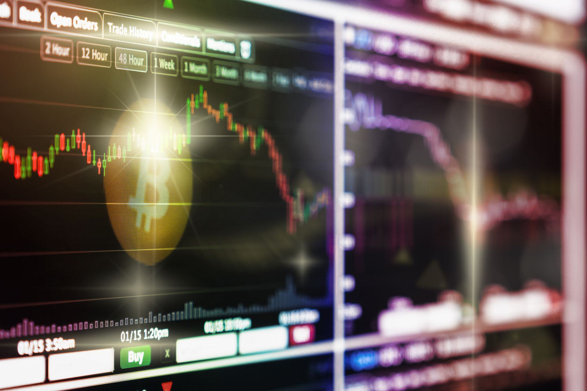

Digital asset management within cryptocurrency involves the structured handling of digital assets such as Bitcoin, Ethereum, and other tokens that are part of a rapidly expanding economic landscape. As the market continues to evolve, the need for efficient and effective management of these assets has become paramount. Successful digital asset management can significantly enhance the achievement of financial objectives, offering investors the ability to harness market trends and mitigate risks.

The expansion of the cryptocurrency market has underscored the importance of sophisticated asset management strategies. With the advent of diverse investment opportunities including not only cryptocurrencies but also non-fungible tokens (NFTs) and decentralized finance (DeFi) platforms, investors are increasingly tasked with optimizing their portfolios to align with their financial goals. Digital asset management plays a critical role by providing the necessary tools and frameworks to track, analyze, and make informed decisions on crypto holdings, positioning investors to capitalize on the dynamic nature of digital markets.

The landscape of cryptocurrency management has seen significant transformation over the years. Initially, managing crypto assets was largely an ad-hoc affair, with investors relying on basic wallets and spreadsheets. However, as the market matured, the need for more sophisticated management tools emerged. Today's digital asset managers use platforms that offer integrated solutions including portfolio tracking, risk assessment, and reporting capabilities, thereby revolutionizing the manner in which investors engage with their digital holdings.

Looking ahead, the introduction of algorithmic trading and the integration of artificial intelligence into digital asset management are setting new benchmarks in the industry. Algorithmic trading, employing pre-programmed strategies, enables rapid transaction execution that can leverage market efficiencies and fluctuations. The subsequent sections will explore the depth of crypto management techniques, giving particular attention to forward-thinking strategies such as algorithmic trading that contribute to robust digital asset management practices.

## Table of Contents

## Understanding Digital Asset Management

Digital asset management in the context of cryptocurrency refers to the systematic approach to managing digital currencies and related assets. These assets can include cryptocurrencies like Bitcoin and Ethereum, tokens such as those used in decentralized finance (DeFi) platforms, and non-fungible tokens (NFTs), which represent ownership of unique digital items or content on the blockchain.

Cryptocurrencies are digital or virtual currencies that use cryptography for security and operate on decentralized networks based on blockchain technology. Bitcoin, the first and most well-known cryptocurrency, paved the way for thousands of others, each with unique features and use cases. Tokens, on the other hand, are digital assets created and managed on existing blockchains, primarily Ethereum. They can represent a wide array of assets, from commodities to voting rights and are often used to facilitate transactions within specific blockchain ecosystems. NFTs are specialized tokens on a blockchain that certify uniqueness and scarcity, making them ideal for representing items like art, music, and collectibles.

Digital asset management for cryptocurrencies differs significantly from traditional asset management. Traditional asset management deals with physical or financial assets like stocks, bonds, and real estate, utilizing financial institutions like banks and brokerages. In contrast, digital asset management relies heavily on blockchain technology, decentralized exchanges, and crypto wallets. Furthermore, it often bypasses traditional financial intermediaries, offering direct access and control to individual investors.

Several tools and platforms assist in managing crypto assets, providing essential services such as secure storage, transaction tracking, and portfolio management. Crypto wallets, both hardware and software-based, are crucial for securely storing cryptocurrencies. Portfolio management tools offer analytics and tracking features that help investors monitor their asset performance and make informed decisions. Additionally, platforms like decentralized exchanges (DEXs) enable peer-to-peer trading directly from users' wallets, reducing reliance on centralized bodies.

The benefits of digital asset management are apparent for both individual and institutional investors. For individuals, it offers greater control, transparency, and the potential for high returns. Investors can directly manage their portfolio, eliminating middlemen and lowering fees. Institutional investors, on the other hand, can leverage the scalability and automation provided by advanced trading platforms, which offer secure solutions for handling large volumes of transactions efficiently.

In conclusion, understanding digital asset management is key to optimizing investments in the rapidly evolving [cryptocurrency](/wiki/cryptocurrency) landscape. It empowers both individual and institutional participants to navigate the digital economy more effectively, harnessing the potential of blockchain technologies and the unique opportunities they present.

## Goals of Cryptocurrency Management

Effective cryptocurrency management involves several key objectives that are crucial for optimizing investment outcomes in the dynamic and often volatile world of digital assets. The primary goals typically focus on maximizing returns, managing risks, ensuring security, and maintaining a well-diversified portfolio. These goals can differ significantly depending on the investor's profile and objectives.

### Variability in Investor Goals

For long-term investors, the primary aim is generally wealth accumulation over an extended period. This approach often involves a buy-and-hold strategy, where investors focus on assets with strong fundamentals and the potential for sustained growth. By contrast, short-term investors may prioritize capitalizing on market [volatility](/wiki/volatility-trading-strategies) to achieve quicker gains. These traders typically engage in frequent buying and selling, utilizing technical analysis and market trends to inform their decisions. The different time horizons of these investment strategies shape the methods and tools investors use to manage their crypto portfolios.

### Importance of Diversification

Diversification is a fundamental principle in crypto management, aimed at reducing exposure to any single asset's risks. A well-diversified portfolio typically includes a mix of various cryptocurrencies, tokens, and possibly non-fungible tokens (NFTs). This mix helps spread risk and potentially improves returns, as different assets may react differently to the same market conditions. The formula for calculating the expected portfolio return, $E(R_p)$, is given by:

$$
E(R_p) = \sum_{i=1}^{n} w_i \cdot E(R_i)
$$

where $w_i$ is the weight of the $i$-th asset in the portfolio and $E(R_i)$ is the expected return of the $i$-th asset.

### Risk Management and Security

Managing risk and ensuring security are integral to protecting investments from market fluctuations and cyber threats. Effective risk management strategies include setting stop-loss orders, using hedging techniques, and regularly monitoring the market. Security practices involve safeguarding digital assets against unauthorized access through hardware wallets, two-[factor](/wiki/factor-investing) authentication (2FA), and adhering to best practices for key management. Given the prevalence of hacking and fraud efforts, securing digital assets is as critical as the investment strategies applied.

### Setting Clear Objectives

Clear investment objectives are essential for successful cryptocurrency management. Goals help define the criteria for asset selection and determine the strategies employed. For instance, an investor focused on [earning](/wiki/earning-announcement) passive income may opt for assets that offer staking rewards or interest-bearing accounts. Setting objectives aids in maintaining discipline, particularly in volatile markets, by providing a framework for decision-making. Python can be used to simulate various investment scenarios to help in setting realistic and attainable goals.

By aligning these goals with comprehensive strategies, investors can navigate the complexities of the cryptocurrency landscape more effectively, enhancing their potential for success while managing risks prudently.

## Role of Algorithmic Trading in Crypto Management

Algorithmic trading, often referred to as algo trading, involves the use of computer programs to execute trading strategies based on predefined algorithms. In the context of cryptocurrency markets, [algorithmic trading](/wiki/algorithmic-trading) plays a crucial role in making investment decisions and executing trades at optimal prices without manual intervention. The primary advantage of this approach lies in its ability to execute trades at speeds and frequencies that are impossible for a human trader to match.

### Enhancing Efficiency in Crypto Management

Algorithmic trading enhances the efficiency of crypto management by enabling rapid decision-making and execution. This efficiency is achieved through automated processes that can analyze large volumes of market data to identify trading opportunities. For instance, algorithms can be programmed to conduct [arbitrage](/wiki/arbitrage) by exploiting price differences across various crypto exchanges, ensuring that trades are executed in fractions of a second, thus maximizing profit margins. Additionally, they can monitor multiple markets simultaneously, optimizing portfolio allocations and rebalancing strategies in real-time.

### Benefits of AI and Machine Learning

Incorporating [artificial intelligence](/wiki/ai-artificial-intelligence) (AI) and [machine learning](/wiki/machine-learning) (ML) into trading strategies offers significant advantages. These technologies enhance predictive analytics by processing historical data to gain insights into market trends and price patterns. Advanced neural networks and other ML models can identify complex patterns and correlations that are not immediately apparent, providing traders with a competitive edge. Through continuous learning, AI-driven systems can adapt to market changes, self-optimizing to improve performance consistently.

### Challenges and Risks

Despite its advantages, algorithmic trading poses several challenges and risks. The reliance on technology means that system malfunctions can lead to significant financial losses. Additionally, algorithms may behave unpredictably in unforeseen market conditions, potentially executing trades incorrectly. The quantification of risk in highly volatile markets, such as cryptocurrency, adds another layer of complexity. Ensuring robust risk management protocols and fail-safes are essential components in mitigating these risks.

### Popular Platforms and Tools

Numerous platforms facilitate algorithmic trading in the crypto space. Popular tools include:

1. **3Commas**: A platform offering features like automated trading bots, portfolio tracking, and backtesting.
2. **Cryptohopper**: Provides algorithmic trading solutions with customizable templates and backtesting capabilities.
3. **HaasOnline**: Known for advanced trade bots that integrate with numerous exchanges, offering a wide range of customization.
4. **QuantConnect**: This platform caters to both individual and institutional traders by providing a flexible algorithmic trading environment.

These tools not only aid in the automation of trades but also provide analytics, historical data access, and [backtesting](/wiki/backtesting) capabilities, enabling traders to develop and refine strategies before implementation.

In conclusion, while algorithmic trading offers immense potential in optimizing crypto asset management through speed, precision, and the incorporation of advanced AI techniques, it demands stringent risk management to safeguard against possible pitfalls.

## Choosing the Right Crypto Management Tools

Selecting the appropriate tools for managing crypto assets is a critical step in ensuring efficient and secure handling of digital resources. Here we explore the vital criteria, platform comparisons, features, integration with financial systems, and user-friendliness alongside security considerations.

**Criteria for Selecting Effective Crypto Asset Management Tools**

When choosing a crypto management tool, several key criteria should be taken into account:

1. **Security**: A top priority, tools must offer robust security features such as two-factor authentication, encryption protocols, and cold storage options.

2. **User-Friendliness**: The interface should be intuitive, catering to both novice and experienced users, allowing for easy navigation and management of portfolios.

3. **Functionality**: The tool should offer comprehensive features including real-time tracking, analytics, and reporting to effectively monitor asset performance and market conditions.

4. **Cost**: Consideration of subscription fees, transaction costs, and any hidden charges is crucial for assessing the long-term viability of the tool.

5. **Customer Support**: Responsive and knowledgeable support can enhance user experience and provide necessary assistance during critical times.

**Comparison of Various Platforms and Apps**

A myriad of platforms and applications cater to digital asset management, each with distinct features:

- **Blockfolio**: Known for its user-friendly mobile interface, it offers real-time portfolio tracking and market insights.

- **CoinTracker**: Provides tax reporting features alongside portfolio management, suitable for investors prioritizing compliance and financial documentation.

- **CryptoCompare**: Offers a broad range of data analytics and portfolio tools, ideal for those focused on market research and data-driven investment decisions.

- **Zerion**: Focused on decentralized finance (DeFi) assets, Zerion allows users to manage DeFi portfolios and offers insights into various DeFi projects.

**Features to Look for in a Crypto Management Tool**

Effective management tools possess certain key features:

- **Real-Time Tracking**: Real-time price updates and portfolio performance metrics are essential for making timely investment decisions.

- **Analytics**: Tools should offer comprehensive analytics to assess historical performance, volatility, and potential risks in the portfolio.

- **Integration Capabilities**: The ability to integrate with exchanges, wallets, and other financial systems streamlines the management process and enriches functionality.

- **Automation and Alerts**: Automated trade execution and customizable alerts can help in efficiently managing assets without constant manual input.

**Integration with Other Financial Management Systems**

Integration is crucial for a cohesive financial management strategy. Tools that can seamlessly interface with traditional banks, brokerage accounts, and accounting software provide a holistic view of one's financial landscape, allowing for better asset allocation and risk management.

**User-Friendliness and Security**

Balancing user-friendliness with security is paramount. Tools must not compromise on security for the sake of convenience. Highlighted security measures might include multi-signature support, hardware wallet compatibility, and regular security audits. An intuitive user interface ensures that users of all skill levels can effectively utilize the tool without compromising on security practices.

In conclusion, selecting the right crypto management tool involves a comprehensive evaluation of several factors including security, functionality, user-friendliness, and integration capabilities. By prioritizing these elements, investors can optimize their digital asset management strategies effectively.

## Future Trends in Crypto Asset Management

### Future Trends in Crypto Asset Management

Digital asset management (DAM) is evolving rapidly as technology advances and the cryptocurrency market matures. The future of DAM is likely to be characterized by enhanced technological integration, regulatory shifts, the emergence of new asset types, and continued innovation.

**Technological Advancements and Their Impact**

The future of digital asset management will be heavily influenced by developments in technology. Technologies such as artificial intelligence (AI) and machine learning (ML) are expected to play a pivotal role in optimizing investment strategies. AI can process vast amounts of data to identify trends and predict market movements more accurately, while ML algorithms can continuously learn and adapt to new information, enhancing decision-making processes.

Moreover, the integration of big data analytics will allow investors to gain deeper insights into market behavior, potentially leading to more informed investment strategies. Blockchain itself will continue to evolve, with improvements in scalability and efficiency potentially enabling new applications for asset management.

**Regulatory Developments and Implications**

Regulatory changes are inevitable as governments worldwide strive to establish frameworks for cryptocurrency management. These regulations may introduce compliance requirements that will influence how digital assets are managed. While regulations aim to provide security and trust, they could also pose challenges by limiting certain investment opportunities or imposing additional operational complexities.

Stringent regulations might lead to more centralized platforms offering DAM services, as these platforms would be better equipped to ensure compliance. On the other hand, regulations could also foster innovation by creating a more stable and secure investment environment, potentially encouraging institutional interest.

**Emergence of New Digital Assets**

As the crypto market expands, new types of digital assets are likely to emerge. Non-fungible tokens (NFTs) have already shown potential beyond art and collectibles, extending to domains like real estate and intellectual property rights. The management of these assets will require new strategies and tools, including those that can handle fractional ownership and digital rights management.

Decentralized finance (DeFi) platforms might give rise to novel financial instruments, necessitating advanced asset management solutions that can track and optimize these investments efficiently. It's plausible that we’ll see traditional financial products being tokenized, thereby blending conventional finance with blockchain technologies and creating hybrid models of asset management.

**Innovation in Asset Management Tools**

Innovation is essential in keeping DAM tools relevant and efficient. Future tools are anticipated to offer greater integration capabilities, allowing seamless connectivity with both traditional finance systems and other crypto services. Features such as real-time analytics, predictive insights, and automated compliance checks are expected to become standard.

The user experience will likely be a focal point, with innovations aimed at making complex asset management processes more intuitive and accessible. User-friendly interfaces and enhanced security protocols will be crucial in attracting a broader audience and fostering trust among users.

**Integration of Blockchain in Traditional Frameworks**

Blockchain technology's role will likely extend beyond cryptocurrencies into traditional asset management frameworks. The immutable and transparent nature of blockchain can enhance the efficiency, security, and traceability of traditional asset management processes. For instance, blockchain can streamline settlement processes, reduce fraud, and lower transaction costs.

The integration might involve hybrid models where traditional assets are tokenized and managed on blockchain platforms, combining the best of both worlds. This cross-pollination of ideas could revolutionize asset management, offering greater flexibility and new avenues for investment.

In conclusion, the future of crypto asset management is poised for significant transformation driven by technological advancements and regulatory frameworks. As the landscape evolves, investors and institutions must adapt by leveraging emerging tools and strategies that blend innovation with traditional principles.

## Conclusion

Effective digital asset management is crucial in achieving cryptocurrency investment goals. As the crypto landscape evolves, managing digital assets with precision and strategic foresight becomes indispensable for both individual and institutional investors. Efficient management practices include diversification, risk assessment, and the utilization of advanced technological tools.

In the ever-changing cryptocurrency market, continuous learning and adaptation are essential. Investors must stay informed about new developments, regulatory changes, and emerging technologies that can impact asset management strategies. This ongoing education ensures that investors are well-prepared to adjust their tactics and capitalize on opportunities as they arise.

The integration of technology plays a significant role in optimizing crypto investments. Tools such as algorithmic trading platforms, AI, and machine learning enhance market analysis, trade execution, and portfolio management, leading to improved investment outcomes. Leveraging these technologies not only streamlines the management process but also helps mitigate risks and maximize returns.

As the crypto ecosystem expands, exploring and selecting the right crypto management tools becomes vital. Investors are encouraged to identify tools that align with their specific investment goals and provide real-time data, analytics, and security. By embracing the right technological solutions, investors can better navigate the complexities of the cryptocurrency market and achieve their financial objectives effectively.

## References & Further Reading

[1]: Bergstra, J., Bardenet, R., Bengio, Y., & Kégl, B. (2011). ["Algorithms for Hyper-Parameter Optimization."](https://papers.nips.cc/paper/4443-algorithms-for-hyper-parameter-optimization) Advances in Neural Information Processing Systems 24.

[2]: ["Advances in Financial Machine Learning"](https://www.amazon.com/Advances-Financial-Machine-Learning-Marcos/dp/1119482089) by Marcos Lopez de Prado

[3]: ["Evidence-Based Technical Analysis: Applying the Scientific Method and Statistical Inference to Trading Signals"](https://www.amazon.com/Evidence-Based-Technical-Analysis-Scientific-Statistical/dp/0470008741) by David Aronson

[4]: ["Machine Learning for Algorithmic Trading"](https://github.com/PacktPublishing/Machine-Learning-for-Algorithmic-Trading-Second-Edition) by Stefan Jansen

[5]: ["Quantitative Trading: How to Build Your Own Algorithmic Trading Business"](https://books.google.com/books/about/Quantitative_Trading.html?id=j70yEAAAQBAJ) by Ernest P. Chan