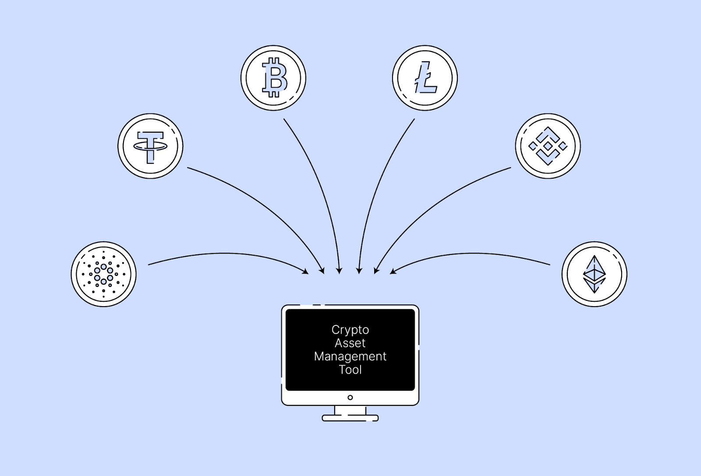

## Table of Contents

## What are crypto assets and why are they important?

Crypto assets are digital or virtual currencies that use cryptography to secure their transactions and to control the creation of new units. They are decentralized, meaning they are not controlled by any government or central bank. The most well-known crypto asset is Bitcoin, but there are many others like Ethereum, Litecoin, and Ripple. People can use crypto assets to buy things online, send money to others, or even invest in them, hoping their value will go up.

Crypto assets are important for several reasons. First, they offer a new way to handle money that is not controlled by traditional banks or governments. This can be very helpful in countries where the local currency is unstable or where people don't trust their banks. Second, crypto assets can make sending money across borders faster and cheaper than traditional methods. This is because they don't need to go through banks or other middlemen. Finally, the technology behind crypto assets, called blockchain, has many potential uses beyond just money, like keeping records or verifying identities securely and transparently.

## How does crypto asset management differ from traditional asset management?

Crypto asset management is different from traditional asset management because it deals with digital currencies instead of stocks, bonds, or real estate. In traditional asset management, people invest in things they can touch or see, like a house or a company's shares. But with crypto assets, you're investing in something that only exists online and is secured by complex math. This means that managing crypto assets involves understanding technology and cybersecurity, not just finance.

Another big difference is how crypto assets are bought, sold, and stored. Traditional assets are usually managed through banks or investment firms, and you might get a physical certificate or a statement showing your ownership. With crypto assets, you use digital wallets and online exchanges. This can be riskier because if you lose your digital keys or if an exchange gets hacked, you could lose all your money. So, managing crypto assets often requires more technical know-how and vigilance to keep them safe.

Lastly, the rules and regulations around crypto assets are still developing, unlike those for traditional assets which are well-established. This means that managing crypto assets can be more uncertain and riskier. People who manage crypto assets need to stay updated on new laws and be ready to adapt quickly. This is different from traditional asset management, where the rules are clearer and more stable.

## What are the basic steps to start managing crypto assets?

To start managing crypto assets, the first thing you need to do is learn about them. Understand what cryptocurrencies are, how they work, and the risks involved. It's important to know that crypto assets can be very up and down in value, so you need to be ready for that. Once you feel comfortable with the basics, the next step is to choose a reputable exchange where you can buy and sell cryptocurrencies. Look for exchanges that are well-known and have good security measures in place to protect your money.

After picking an exchange, you'll need to set up a digital wallet to store your crypto assets. There are different types of wallets, like software wallets on your computer or phone, and hardware wallets that are like a USB drive. Choose one that fits your needs and is secure. Once your wallet is set up, you can start buying crypto assets on the exchange and transferring them to your wallet. Remember to keep your wallet's private keys safe and never share them with anyone. Managing crypto assets also means keeping an eye on the market and staying updated on news that might affect the value of your assets.

## What are the most common types of crypto assets one can manage?

The most common types of crypto assets you can manage are Bitcoin and Ethereum. Bitcoin is the first and most well-known cryptocurrency. It's often called digital gold because people see it as a safe way to store value over time. Ethereum, on the other hand, is not just a currency but also a platform for creating other cryptocurrencies and apps. It uses something called smart contracts, which are like automatic agreements that happen when certain conditions are met.

Besides Bitcoin and Ethereum, there are many other types of crypto assets. Litecoin is similar to Bitcoin but is designed to be faster and cheaper for everyday use. Ripple is used mainly by banks to move money quickly around the world. There are also stablecoins, like Tether and USD Coin, which are tied to the value of real-world currencies like the US dollar, making them less up and down in value. Each of these crypto assets has its own features and uses, so it's important to understand them before you start managing them.

## How can one securely store and manage crypto assets?

To securely store and manage crypto assets, you need to use a digital wallet. There are two main types of wallets: hot wallets and cold wallets. Hot wallets are connected to the internet, like the ones you might use on your phone or computer. They are easy to use but can be risky because hackers might try to steal your crypto assets. Cold wallets, on the other hand, are not connected to the internet. They are like a USB drive that you keep offline, making them much safer. It's a good idea to use a cold wallet for most of your crypto assets and keep just a small amount in a hot wallet for everyday use.

Managing your crypto assets also means keeping them safe from scams and mistakes. Always double-check the address you're sending your crypto assets to, because once you send them, you can't get them back. Use strong passwords and enable two-factor authentication on your accounts to add an extra layer of security. It's also smart to keep your private keys, which are like the secret codes to your crypto assets, written down on paper and stored in a safe place. Never share your private keys with anyone. By taking these steps, you can help protect your crypto assets and manage them securely.

## What are the key risks associated with managing crypto assets?

Managing crypto assets can be risky because their value can go up and down a lot. One day, your crypto assets might be worth a lot of money, and the next day, they might be worth much less. This is called volatility. It can be exciting but also stressful. Another risk is that the rules about crypto assets are still changing. Governments might decide to make new laws that could affect how you can use or sell your crypto assets. This makes it hard to know what might happen in the future.

Another big risk is security. Since crypto assets are digital, they can be stolen by hackers. If someone gets your private keys, which are like the secret codes to your crypto assets, they can take all your money. You also have to be careful about scams. Some people might try to trick you into sending them your crypto assets by promising to give you more in return. It's important to be careful and not trust anyone who asks for your private keys or tries to rush you into making a decision.

## What strategies can be used for effective crypto asset portfolio management?

To manage your crypto asset portfolio effectively, it's important to spread your money across different types of crypto assets. This is called diversification. If you put all your money into just one type of crypto asset and its value goes down, you could lose a lot. But if you have different kinds, like some Bitcoin, some Ethereum, and maybe a stablecoin, the risk is spread out. It's also a good idea to keep an eye on the market and news that might affect the value of your crypto assets. If you see that one of your crypto assets is doing really well, you might want to sell some of it and buy more of another that's not doing as well. This is called rebalancing, and it can help you keep your portfolio in good shape.

Another strategy is to think about how much risk you're okay with. Some people like to take big risks and try to make a lot of money quickly, but others prefer to be more careful. If you're more cautious, you might want to put more of your money into stablecoins, which don't go up and down in value as much. If you like taking risks, you might want to try investing in newer or smaller crypto assets that could grow a lot. It's also important to keep learning about crypto assets and the technology behind them. The more you know, the better decisions you can make about managing your portfolio.

## How do regulatory environments impact crypto asset management?

The rules and laws about crypto assets can really change how you manage them. In some countries, the government might say it's okay to use crypto assets, but they have strict rules about how you can buy, sell, or trade them. This means you need to be careful and follow these rules, or you could get in trouble. For example, you might need to report your crypto assets on your taxes or only use certain exchanges that the government says are safe. If the rules are not clear or keep changing, it can be hard to know what to do, and this makes managing your crypto assets more risky.

On the other hand, some places might not have many rules about crypto assets yet. This can make it easier to buy and sell them, but it also means there's more risk. Without strong rules, it's easier for people to scam you or for hackers to steal your money. As more countries start making rules about crypto assets, you need to keep up with the news and be ready to change how you manage your portfolio. Knowing the rules in your country and how they might change can help you make better decisions and keep your crypto assets safe.

## What advanced tools and platforms are available for crypto asset management?

There are many advanced tools and platforms that can help you manage your crypto assets better. One popular tool is a crypto portfolio tracker, like CoinGecko or CoinMarketCap. These websites let you keep an eye on all your crypto assets in one place, showing you how much they're worth and how they're doing compared to other cryptocurrencies. Another useful tool is a crypto tax software, like CryptoTrader.Tax or CoinLedger, which helps you figure out how much you owe in taxes on your crypto gains. These tools can make it easier to keep track of everything and make sure you're following the rules.

Some platforms offer more advanced features for managing your crypto assets. For example, decentralized finance (DeFi) platforms like Uniswap or Aave let you lend, borrow, or trade your crypto assets without a middleman like a bank. These platforms use smart contracts to make sure everything happens automatically and safely. There are also trading bots, like 3Commas or Cryptohopper, which can buy and sell your crypto assets for you based on rules you set up. These bots can help you make money even when you're not watching the market all the time. By using these advanced tools and platforms, you can manage your crypto assets more effectively and take advantage of new opportunities in the crypto world.

## How can one assess the performance of their crypto asset portfolio?

To assess the performance of your crypto asset portfolio, you need to look at how much your crypto assets are worth now compared to when you bought them. You can do this by checking the current price of each crypto asset and multiplying it by how many you own. This will tell you the total value of your portfolio. It's also helpful to keep track of this over time so you can see if your portfolio is growing or shrinking. Websites like CoinGecko or CoinMarketCap can help you do this easily because they show you the prices of different crypto assets and let you add your own portfolio to track it.

Another way to assess your portfolio's performance is to compare it to other things, like the overall crypto market or a specific index like the Bitcoin Dominance Index. If your portfolio is doing better than the market, that's a good sign. You can also look at how each crypto asset in your portfolio is doing on its own. If some are going up a lot and others are going down, you might want to change how much you have in each one. This is called rebalancing, and it can help you keep your portfolio in good shape. By keeping an eye on these things, you can make better decisions about managing your crypto assets.

## What are the tax implications of managing crypto assets?

When you manage crypto assets, you need to think about taxes. In many places, if you make money from your crypto assets, you have to pay taxes on it. This can happen if you sell your crypto assets for more than you paid for them, or if you use them to buy things. The money you make is called a capital gain, and you have to report it on your taxes. Sometimes, you might also have to pay taxes on the crypto assets you get as income, like if someone pays you in Bitcoin for a job. It's important to keep good records of all your crypto transactions so you can figure out what you owe.

Different countries have different rules about crypto taxes, so it's a good idea to learn about the rules where you live. Some places might tax crypto assets as property, while others might see them more like money. If you're not sure about the rules, you might want to talk to a tax professional who knows about crypto assets. They can help you understand what you need to do and make sure you're following the law. Keeping up with changes in tax laws is also important because they can affect how you manage your crypto assets.

## What future trends should crypto asset managers be aware of?

Crypto asset managers should keep an eye on a few big trends that could change how they work. One trend is the growing use of decentralized finance, or DeFi. DeFi lets people do things like lending, borrowing, and trading without using banks or other middlemen. This could make managing crypto assets easier and open up new ways to make money. Another trend is the rise of new types of crypto assets, like non-fungible tokens (NFTs). NFTs are unique digital items that can be bought and sold, and they're becoming more popular. Crypto asset managers might need to learn how to handle these new kinds of assets.

Another important trend is the increasing focus on regulation. Governments around the world are starting to make more rules about crypto assets, and these rules can affect how you manage your portfolio. It's important to stay updated on these changes so you can follow the law and make smart decisions. Finally, the technology behind crypto assets, like blockchain, is always improving. New technologies could make crypto assets safer and easier to use, or they might bring new challenges. Keeping up with these tech trends can help crypto asset managers stay ahead of the game and manage their portfolios better.

## What are the Goals of Cryptocurrency Management?

Effective cryptocurrency management involves several key objectives that are crucial for optimizing investment outcomes in the dynamic and often volatile world of digital assets. The primary goals typically focus on maximizing returns, managing risks, ensuring security, and maintaining a well-diversified portfolio. These goals can differ significantly depending on the investor's profile and objectives.

### Variability in Investor Goals

For long-term investors, the primary aim is generally wealth accumulation over an extended period. This approach often involves a buy-and-hold strategy, where investors focus on assets with strong fundamentals and the potential for sustained growth. By contrast, short-term investors may prioritize capitalizing on market [volatility](/wiki/volatility-trading-strategies) to achieve quicker gains. These traders typically engage in frequent buying and selling, utilizing technical analysis and market trends to inform their decisions. The different time horizons of these investment strategies shape the methods and tools investors use to manage their crypto portfolios.

### Importance of Diversification

Diversification is a fundamental principle in crypto management, aimed at reducing exposure to any single asset's risks. A well-diversified portfolio typically includes a mix of various cryptocurrencies, tokens, and possibly non-fungible tokens (NFTs). This mix helps spread risk and potentially improves returns, as different assets may react differently to the same market conditions. The formula for calculating the expected portfolio return, $E(R_p)$, is given by:

$$
E(R_p) = \sum_{i=1}^{n} w_i \cdot E(R_i)
$$

where $w_i$ is the weight of the $i$-th asset in the portfolio and $E(R_i)$ is the expected return of the $i$-th asset.

### Risk Management and Security

Managing risk and ensuring security are integral to protecting investments from market fluctuations and cyber threats. Effective risk management strategies include setting stop-loss orders, using hedging techniques, and regularly monitoring the market. Security practices involve safeguarding digital assets against unauthorized access through hardware wallets, two-[factor](/wiki/factor-investing) authentication (2FA), and adhering to best practices for key management. Given the prevalence of hacking and fraud efforts, securing digital assets is as critical as the investment strategies applied.

### Setting Clear Objectives

Clear investment objectives are essential for successful cryptocurrency management. Goals help define the criteria for asset selection and determine the strategies employed. For instance, an investor focused on [earning](/wiki/earning-announcement) passive income may opt for assets that offer staking rewards or interest-bearing accounts. Setting objectives aids in maintaining discipline, particularly in volatile markets, by providing a framework for decision-making. Python can be used to simulate various investment scenarios to help in setting realistic and attainable goals.

By aligning these goals with comprehensive strategies, investors can navigate the complexities of the cryptocurrency landscape more effectively, enhancing their potential for success while managing risks prudently.

## References & Further Reading

[1]: Bergstra, J., Bardenet, R., Bengio, Y., & Kégl, B. (2011). ["Algorithms for Hyper-Parameter Optimization."](https://papers.nips.cc/paper/4443-algorithms-for-hyper-parameter-optimization) Advances in Neural Information Processing Systems 24.

[2]: ["Advances in Financial Machine Learning"](https://www.amazon.com/Advances-Financial-Machine-Learning-Marcos/dp/1119482089) by Marcos Lopez de Prado

[3]: ["Evidence-Based Technical Analysis: Applying the Scientific Method and Statistical Inference to Trading Signals"](https://www.amazon.com/Evidence-Based-Technical-Analysis-Scientific-Statistical/dp/0470008741) by David Aronson

[4]: ["Machine Learning for Algorithmic Trading"](https://github.com/PacktPublishing/Machine-Learning-for-Algorithmic-Trading-Second-Edition) by Stefan Jansen

[5]: ["Quantitative Trading: How to Build Your Own Algorithmic Trading Business"](https://books.google.com/books/about/Quantitative_Trading.html?id=j70yEAAAQBAJ) by Ernest P. Chan