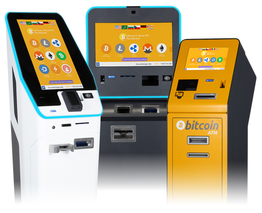

## Table of Contents

## What is a Crypto Automated Teller Machine (ATM)?

A Crypto Automated Teller Machine, or Crypto ATM, is a special kind of machine that lets you buy or sell cryptocurrencies like Bitcoin and Ethereum. It works a lot like a regular ATM, where you can use cash or a card to do your transactions. You go to the machine, follow the instructions on the screen, and then you can either put in cash to buy cryptocurrency or sell your cryptocurrency and get cash back.

Crypto ATMs are useful because they make it easy for people to deal with cryptocurrencies without needing to use a computer or a smartphone to go through an online exchange. They are often found in busy places like shopping centers or convenience stores. This makes it convenient for people who want to quickly buy or sell their digital money without waiting for bank transfers or dealing with complicated online platforms.

## How does a Crypto ATM work?

When you use a Crypto ATM, you start by going to the machine and following the instructions on the screen. You'll need to scan your wallet's QR code, which is like a special barcode that holds your digital money address. If you want to buy cryptocurrency, you put cash into the machine. The ATM will then send the amount of cryptocurrency you bought to your wallet. If you want to sell, you tell the machine how much cryptocurrency you want to sell, and it will give you cash back.

Crypto ATMs are easy to use because they work a lot like regular ATMs. They have screens that guide you through each step, so you don't need to be a tech expert to use them. They are often found in places where lots of people go, like shopping malls or convenience stores. This makes it simple and quick for anyone to buy or sell their digital money without needing to use a computer or wait for bank transfers.

## Where can I find a Crypto ATM?

You can find a Crypto ATM in many places where lots of people go, like shopping malls, convenience stores, or even some gas stations. These machines are put in busy spots so it's easy for anyone to use them without having to go out of their way.

To find a Crypto ATM near you, you can use websites or apps that show where these machines are located. Just type in your city or zip code, and the site will show you a map with the closest Crypto ATMs. This makes it simple to find one when you need to buy or sell your digital money.

## What cryptocurrencies can be used at a Crypto ATM?

Crypto ATMs usually support a variety of cryptocurrencies, but the most common ones you'll find are Bitcoin and Ethereum. These are the big names in the world of digital money, so many ATMs will let you buy or sell them. Some machines might also work with other popular cryptocurrencies like Litecoin or Bitcoin Cash.

The exact cryptocurrencies a Crypto ATM can handle depends on the company that owns the machine. Different companies might support different digital currencies, so it's a good idea to check the ATM's screen or the company's website before you go. This way, you can make sure the ATM supports the cryptocurrency you want to use.

## What are the fees associated with using a Crypto ATM?

Using a Crypto ATM comes with fees that can make your transaction more expensive. The fees can be different depending on the ATM and the company that runs it. Usually, you'll have to pay a fee for each transaction, which is a percentage of the amount you're buying or selling. For example, if you want to buy $100 worth of Bitcoin, the ATM might charge you a 5% fee, so you'd end up paying $105.

The fees can be higher than what you'd pay if you used an online exchange. This is because Crypto ATMs are more convenient and easier to use, so the companies charge more for that convenience. It's a good idea to check the fees before you use a Crypto ATM, so you know how much extra you'll have to pay. This way, you can decide if it's worth it or if you'd rather use a different way to buy or sell your digital money.

## How do I buy cryptocurrency using a Crypto ATM?

To buy cryptocurrency using a Crypto ATM, you start by finding a machine near you. Once you're at the ATM, you'll see a screen that guides you through the steps. First, you need to scan your wallet's QR code, which is like a special barcode that tells the ATM where to send your digital money. Then, you put cash into the machine. The ATM will show you how much cryptocurrency you'll get for your money, including any fees they charge.

After you put in your cash and confirm the amount, the ATM will process your transaction. This might take a few minutes. Once it's done, the cryptocurrency you bought will be sent to your wallet. The screen will show you that the transaction is complete, and you can check your wallet to make sure the money is there. It's a simple way to buy digital money without needing a computer or waiting for bank transfers.

## How do I sell cryptocurrency using a Crypto ATM?

To sell cryptocurrency using a Crypto ATM, start by finding a machine near you. When you get to the ATM, follow the instructions on the screen. You'll need to scan your wallet's QR code, which is like a special barcode that tells the ATM where to take the digital money from. Then, you tell the machine how much cryptocurrency you want to sell. The ATM will show you how much cash you'll get back, including any fees they charge.

After you confirm the amount, the ATM will process your transaction. This might take a few minutes. Once it's done, the ATM will give you the cash. The screen will show you that the transaction is complete, and you can count your money to make sure it's right. It's an easy way to turn your digital money into cash without needing a computer or waiting for bank transfers.

## What are the security features of a Crypto ATM?

Crypto ATMs have several security features to keep your transactions safe. When you use the machine, you'll need to scan your wallet's QR code. This is like a special barcode that makes sure the money goes to the right place. The ATM also uses secure connections to send your digital money, so it's hard for anyone to steal it while it's being transferred. Plus, the machines often have cameras that watch the area around them, which can help stop people from trying to do anything bad.

Another important security feature is that Crypto ATMs are usually in busy places where lots of people are around. This makes it less likely that someone will try to mess with the machine or bother you while you're using it. The companies that own the ATMs also keep an eye on them all the time, so they can spot any strange activity and take care of it quickly. All these things work together to make sure your money stays safe when you're buying or selling cryptocurrency at an ATM.

## What are the regulatory considerations for Crypto ATMs?

Crypto ATMs have to follow rules set by different countries and places. These rules can be different depending on where the ATM is. Some places might need the people who own the ATMs to get special licenses or follow strict rules about how they work. They might also have to report to the government about the transactions that happen at their ATMs. This is to stop people from using the machines to do bad things, like money laundering or fraud.

The rules can also change over time as more people start using Crypto ATMs. Governments might decide to make new laws or change old ones to keep up with how fast the world of digital money is growing. It's important for the companies that own these ATMs to always check the rules in the places where they have machines. This way, they can make sure they're doing everything right and helping to keep the use of cryptocurrencies safe and fair for everyone.

## How do Crypto ATMs integrate with existing financial systems?

Crypto ATMs work together with the regular money world by letting people use cash or cards to buy or sell digital money. When you put cash into a Crypto ATM to buy cryptocurrency, the machine sends that digital money to your wallet. If you want to sell your cryptocurrency and get cash, the ATM takes the digital money from your wallet and gives you cash back. This way, Crypto ATMs act like a bridge between the world of digital money and the money you use every day.

The machines also have to follow the rules set by banks and governments. They need to make sure that the transactions are safe and that no one is using them to do bad things, like money laundering. This means that Crypto ATMs often have to connect with banking systems to check if the money being used is okay. By working with these systems, Crypto ATMs help make sure that people can use digital money easily and safely, while still following the rules that keep our financial world running smoothly.

## What are the future trends and developments for Crypto ATMs?

In the future, Crypto ATMs might become even more popular and easier to use. As more people start using digital money, we might see more of these machines in places like shopping centers, airports, and even smaller stores. They could also start supporting more types of cryptocurrencies, not just the big ones like Bitcoin and Ethereum. This would make it easier for people to buy and sell all sorts of digital money. Plus, the machines might get better technology, like faster transaction times and better ways to keep your money safe.

Another big change could be how Crypto ATMs work with other financial systems. Right now, they help connect the world of digital money with regular money. In the future, they might connect even better with banks and other financial services. This could make it easier to move money between your bank account and your digital wallet. Also, as governments make more rules about digital money, Crypto ATMs will have to follow these new rules to make sure everything stays safe and fair. This means they'll need to keep up with changes in the law to keep working well.

## How can businesses benefit from installing a Crypto ATM?

Businesses can benefit a lot from installing a Crypto ATM. It can bring in more customers because some people like to use digital money. When people come to use the ATM, they might also buy things from the store. This can help the business make more money. Plus, having a Crypto ATM can make the business look modern and up-to-date, which can attract even more customers who are into new technology.

Another way businesses can benefit is by getting a part of the fees that the Crypto ATM charges. Every time someone uses the machine, the business can earn some money from the transaction fees. This can add up over time and give the business extra income. Also, by offering a service that's hard to find in some places, the business can stand out from others and become a go-to spot for people who want to use digital money.

## References & Further Reading

[1]: Easley, D., López de Prado, M. M., & O'Hara, M. (2012). ["The Volume Clock: Insights into the High-Frequency Paradigm."](https://papers.ssrn.com/sol3/papers.cfm?abstract_id=2034858) The Review of Financial Studies, 25(5), 1457-1493.

[2]: Narayanan, A., Bonneau, J., Felten, E., Miller, A., & Goldfeder, S. (2016). ["Bitcoin and Cryptocurrency Technologies: A Comprehensive Introduction."](https://press.princeton.edu/books/hardcover/9780691171692/bitcoin-and-cryptocurrency-technologies) Princeton University Press.

[3]: Antonopoulos, A. M. (2017). ["The Internet of Money Volume Two: A Collection of Talks by Andreas M. Antonopoulos."](https://www.amazon.com/Internet-Money-Andreas-M-Antonopoulos/dp/194791006X) Merkle Bloom LLC.

[4]: Weiner, A. (2018). ["Algorithmic Trading: Winning Strategies and Their Rationale."](https://www.wiley.com/en-us/Algorithmic+Trading%3A+Winning+Strategies+and+Their+Rationale-p-9781118460146) John Wiley & Sons.

[5]: Swan, M. (2015). ["Blockchain: Blueprint for a New Economy."](https://dl.acm.org/doi/book/10.5555/3006358) O'Reilly Media.