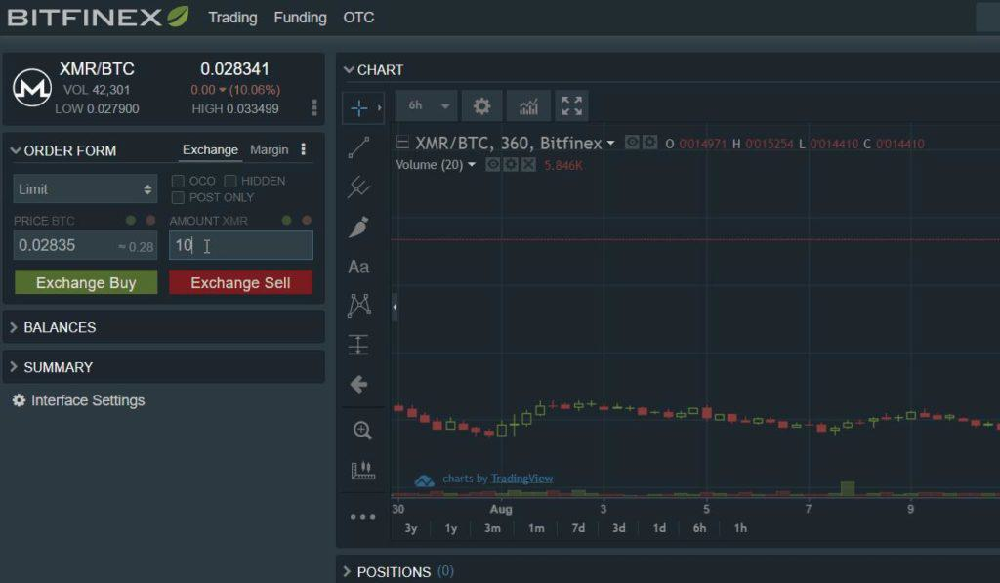

In 2024, the digital finance sector continues to undergo transformative developments, with exchanges like Crypto.com at the forefront. This article provides a comprehensive analysis of Crypto.com, highlighting its expanded suite of services and its pivotal role in cryptocurrency trading and investing. Since its inception in 2016, Crypto.com has evolved substantially, anchoring itself as a significant player in the global crypto market. Offering a wide array of financial services, beyond traditional buying and selling, it enhances the investment capabilities of millions of users worldwide.

A prominent trend reshaping the cryptocurrency landscape is the rise of algorithmic trading. As more traders and investors seek efficiency and precision, algorithmic trading has gained traction, enabling transactions to be executed based on pre-set rules without human intervention. This technological advancement enhances the potential for profit while minimizing emotional biases inherent in manual trading. Crypto.com supports this growing inclination with robust APIs and trading infrastructure designed for automated strategies.

The structure of the article follows a systematic approach to explore various facets of Crypto.com's operations and influence. Section 2 provides an overview of the platform's history, recent developments, and expanding market presence in 2024. Section 3 reviews the variety of cryptocurrencies available, highlighting the advantages of holding the native token, CRO. Section 4 dives into the mechanisms supporting algorithmic trading within the platform. The subsequent sections, 5 and 6, evaluate the user experience related to trading interfaces, fee structures, as well as security protocols and account management tools. Section 7 tackles customer support and user satisfaction, presenting insights into feedback and service effectiveness. Finally, Section 8 compares Crypto.com with its competitors, delineating its unique advantages and market position. The concluding section, 9, synthesizes the key points discussed and speculates on future directions within the rapidly evolving crypto ecosystem. 

This analysis not only presents an in-depth understanding of Crypto.com's resourcefulness in 2024 but also underscores the importance of staying informed in an industry characterized by rapid change and innovation.

## Table of Contents

## Overview of Crypto.com in 2025

Crypto.com, founded in 2016 by Kris Marszalek, has grown significantly over the years to establish itself as a prominent entity within the cryptocurrency ecosystem. Initially launched as Monaco Technologies GmbH, the company rebranded to Crypto.com in 2018 following the acquisition of the domain name. This strategic branding shift mirrored an evolving focus towards providing a comprehensive range of financial services in the cryptocurrency sector. By 2024, Crypto.com had expanded its global footprint, serving millions of users across over 90 countries, showcasing its extensive market presence and diverse user base.

A key factor in Crypto.com's ascent in the industry has been its commitment to offering a variety of services that cater to different segments of the cryptocurrency market. These services include cryptocurrency trading, payment solutions, and financial products like Visa cards that enable users to spend their cryptocurrency holdings seamlessly. Furthermore, the introduction of decentralized finance (DeFi) products and the ability to earn rewards through staking have positioned Crypto.com as a versatile platform catering to both retail and institutional investors.

In 2024, Crypto.com continued its trajectory of innovation and user-centric developments. Among the significant updates and changes were enhancements to its trading platform, which included an intuitive user interface and advanced trading features designed to improve the user experience. Additionally, in response to the ever-growing need for security in the [cryptocurrency](/wiki/cryptocurrency) space, Crypto.com bolstered its security protocols. This included offering insurance coverage on USD deposits and implementing sophisticated security measures such as multi-[factor](/wiki/factor-investing) authentication (MFA) and hardware security modules (HSMs) to help safeguard user funds.

The 2024 enhancements also extended towards expanding Crypto.com's ecosystem, most notably with increased support for newer cryptocurrencies and more comprehensive trading pairs. This expansion was part of a broader strategy to provide users with flexible and diverse trading options, thereby enhancing the platform's competitiveness in the market.

Moreover, Crypto.com's focus on sustainable growth is evident from its strategic partnerships and collaborations aimed at fostering a more inclusive digital financial ecosystem. By continually investing in technology and customer service initiatives, the company aims to further its mission of accelerating the world’s transition to cryptocurrency.

## Cryptocurrencies Available on Crypto.com

Crypto.com offers a diverse and extensive selection of cryptocurrencies, catering to a wide range of traders and investors. As of 2024, the platform supports over 250 cryptocurrencies, ensuring that users have access to both established and emerging digital assets. This range includes major players such as Bitcoin (BTC), Ethereum (ETH), and Binance Coin (BNB), as well as various altcoins and DeFi tokens. The wide array of choices makes Crypto.com an attractive option for those seeking to diversify their cryptocurrency portfolios.

Holding the native token, Cronos (CRO), provides numerous benefits for Crypto.com users. CRO holders are granted trading fee discounts, enhancing their cost-efficiency. The more CRO a user stakes on the platform, the greater the fee reduction they receive, which can significantly lower transaction costs. Moreover, CRO holders often gain access to exclusive rewards, promotions, and staking benefits, making it a valuable asset within the Crypto.com ecosystem.

Crypto.com supports a substantial number of trading pairs, allowing users to trade between various cryptocurrency combinations. Popular pairs include BTC/USDT, ETH/USDT, and CRO/BTC, among others. This wide range of trading pairs provides flexibility and convenience for traders, enabling seamless transactions and strategic portfolio adjustments.

In summary, Crypto.com stands out for its extensive list of supported cryptocurrencies and trading pairs, coupled with the advantages provided to CRO holders. This contributes to its position as a favored platform for both novice and experienced traders looking to explore and capitalize on the diverse opportunities within the cryptocurrency market.

## Algorithmic Trading and Crypto.com

Algorithmic trading involves the use of computer programs to execute trades at speeds and frequencies that are impossible for a human trader. These algorithms can follow set instructions—such as timing, price, quantity, or mathematical model—to systematically execute trading strategies. In cryptocurrency markets, [algorithmic trading](/wiki/algorithmic-trading) has become particularly significant due to the 24/7 nature of the markets, the [volatility](/wiki/volatility-trading-strategies) of digital assets, and the multitude of trading venues.

Crypto.com has embraced this evolution by offering robust support for algorithmic trading through its comprehensive APIs and sophisticated trading infrastructure. The platform provides various RESTful APIs and WebSocket interfaces that enable traders to access market data and execute trades automatically. These APIs support both spot and derivatives markets, allowing for the development of complex trading strategies that can take advantage of market inefficiencies or implement high-frequency trading strategies.

The APIs available on Crypto.com provide access to real-time [order book](/wiki/order-book-trading-strategies) data, historical and live market data, and tools for account management, thereby enabling users to write custom trading bots or integrate third-party trading tools. Such infrastructure is crucial for quantitative traders and institutional investors who rely on low latency and high-speed data transmission to maintain their edge in the market.

The increasing prevalence of automated trading systems has led to a growing trend in the cryptocurrency space, with more traders incorporating bots to capitalize on market opportunities. By automating trades, these systems can react instantly to market conditions and execute strategies continuously, without the need for human intervention. This can be particularly beneficial in a market characterized by rapid price changes and high volatility.

As the popularity of algorithmic trading continues to rise, Crypto.com’s infrastructure is well-positioned to cater to the needs of both retail and institutional traders. By offering a reliable and comprehensive set of tools for algorithmic trading, Crypto.com not only enhances its service offering but also contributes to the increasing sophistication and maturity of the cryptocurrency trading environment.

## Trading Experience and Fees

Crypto.com provides an intuitive trading experience through its mobile and web platforms, catering to both novice and experienced traders. The mobile app offers a streamlined interface, making it easy for users to navigate between features such as buying and selling cryptocurrencies, tracking price movements, and managing their portfolios. The app's design emphasizes user-friendliness, incorporating features like customizable tabs and real-time price alerts to enhance user engagement and decision-making. The web platform mirrors this accessibility, providing advanced trading tools such as charting interfaces with a variety of technical indicators, multiple order types, and detailed market analytics.

Crypto.com's fee structure is designed to be competitive within the cryptocurrency exchange market. Trading fees operate on a maker-taker model, with rates determined by a user's 30-[day trading](/wiki/day-trading-spy) [volume](/wiki/volume-trading-strategy) and whether they hold the native CRO token. Users who pay fees with CRO can receive substantial discounts, often reducing the effective fees significantly. For instance, as of 2024, base trading fees start at 0.10% for makers and 0.16% for takers. However, with the maximum discount available by holding CRO, these can be reduced to as low as 0.04% and 0.10%, respectively.

Withdrawal fees on Crypto.com vary according to the cryptocurrency in question. The platform regularly updates these fees to align with network costs, ensuring they remain competitive. For example, withdrawing Bitcoin might incur a fee equivalent to 0.0004 BTC, although this is subject to change based on blockchain conditions.

When compared to other leading exchanges, Crypto.com's fees are often more attractive. For instance, Coinbase, a significant market player, typically charges higher trading fees starting from 0.5%, dependent on the transaction size and method of purchase. Binance, another competitor, parallels Crypto.com's fees with a similar maker-taker structure, yet does not always offer the same level of discounting flexibility via a native token like CRO.

In summary, Crypto.com distinguishes itself by offering a user-friendly trading environment alongside a competitive fee structure, especially benefitting those who leverage the ecosystem's CRO token for fee reductions. This cost-effectiveness, coupled with an accessible interface, positions Crypto.com as a strong choice for cryptocurrency trading, particularly for users seeking to optimize their trading costs without compromising on platform functionality.

## Security and Account Management

Crypto.com has implemented a robust suite of security measures designed to protect users' assets and personal information. Central to these efforts is the use of multi-factor authentication (MFA), which requires users to confirm their identity through additional verification steps beyond the standard password entry. This typically involves a mobile device or app-based authenticator, enhancing the account's resilience against unauthorized access.

In addition to MFA, Crypto.com provides insurance coverage for USD deposits, adding an extra layer of financial security. This insurance ensures that, in the event of a security breach or technical malfunction, users' deposited funds are safeguarded against loss.

Opening an account on Crypto.com is a straightforward process, requiring potential users to provide a valid email address and create a secure password. Upon registering, users must complete a Know Your Customer (KYC) verification process, which involves submitting identification documents such as a passport or driver's license. This step is crucial for compliance with regulatory standards and to enhance the security of the platform against fraud and misuse.

Once the account is set up and verified, Crypto.com users have access to a range of tools designed for comprehensive account management. The platform offers a user-friendly interface for tracking trading activities, including detailed transaction histories and portfolio performance analytics. Users can set up various alerts and notifications to stay informed about market movements and account changes. Additionally, Crypto.com's mobile app and web platform allow seamless access to account settings, providing flexibility in managing security preferences and updating personal information.

Overall, Crypto.com's commitment to security and account management is evident through its advanced authentication measures, regulatory compliance in onboarding, and comprehensive tools for users to monitor and control their trading activities effectively.

## Customer Support and Satisfaction

Crypto.com has made notable strides in enhancing its customer support services, a crucial aspect for users navigating the often complex world of cryptocurrency trading. The platform offers multiple channels for customer assistance, including live chat, email support, and an extensive help center available on their website. These avenues aim to provide timely and effective resolutions to user inquiries.

User feedback regarding Crypto.com's customer support is mixed. Positive reviews often highlight the efficacy of the live chat feature, praising the prompt responses and the professionalism of the support team. However, some users express dissatisfaction with response times during peak periods, reporting delays and slower resolutions to complex issues. A common complaint revolves around the verification process, which some users find cumbersome and time-consuming. To address these issues, Crypto.com has initiated improvements such as expanding their support team and enhancing the efficiency of their verification systems.

Crypto.com has also introduced a priority support feature for its high-tier cardholders, indicating its commitment to refining user satisfaction through tailored services. Additionally, the platform actively collects user feedback through surveys and forums to identify pain points and implement necessary changes. These initiatives reflect Crypto.com's ongoing efforts to bolster its customer support framework, striving to balance efficiency with personalized service in their rapidly growing user base.

## Crypto.com vs. Competitors

Crypto.com distinguishes itself in the cryptocurrency exchange market by offering a comprehensive suite of services that rivals its major competitors, such as Coinbase. In terms of supported cryptocurrencies, Crypto.com provides access to over 250 different cryptocurrencies, including popular options like Bitcoin (BTC), Ethereum (ETH), and its native token, Cronos (CRO). In comparison, Coinbase offers a slightly narrower selection, although it includes most leading cryptocurrencies. This extensive array makes Crypto.com attractive to users seeking diverse investment opportunities.

When analyzing fees, Crypto.com implements a tiered fee structure, with trading fees starting at 0.1% for both maker and taker transactions. Fees can be further reduced by holding CRO tokens, which offers discounts up to 100% depending on the user's staking level. Conversely, Coinbase’s fee structure is more complex and generally higher, ranging from 0.5% to over 4.5% for certain transactions, which can deter high-volume traders seeking cost-effectiveness.

User experience on Crypto.com is characterized by its robust mobile application, which serves as a central hub for trading, wallet management, and accessing additional financial services like crypto credit cards, staking, and earn programs. Its interface is user-friendly, aimed at both beginners and seasoned traders. Coinbase also offers a mobile app with a focus on simplicity, especially appealing to newcomers. However, advanced traders may find Coinbase Pro’s detailed interface more suitable.

A distinctive aspect of Crypto.com is its integrated ecosystem that extends beyond the typical exchange functions. Its unique selling points include the Crypto.com Visa card, which offers cashback rewards paid in CRO tokens, thus encouraging users to engage further with the platform. Additionally, Crypto.com’s commitment to security is evident through its insured USD deposits and advanced security protocols, aligning with industry standards and reassuring users against potential cyber threats.

Relative to its competitors, Crypto.com’s market standing is strengthened by its strategic partnerships and expansions, continually increasing its global footprint. However, it faces substantial competition from platforms like Binance, which often undercuts fees and offers an even broader array of trading pairs and features.

In summary, Crypto.com maintains a competitive edge through its diversified services, lower fees (especially for CRO holders), and a commitment to enhancing user experience. Despite strong competition from giants like Coinbase and Binance, Crypto.com’s unique offerings and comprehensive approach position it as a formidable player in the cryptocurrency exchange market.

## Conclusion and Future Outlook

Crypto.com has established itself as a prominent player in the cryptocurrency trading and investing landscape as of 2024. Its robust platform supports an extensive range of cryptocurrencies, making it an attractive choice for both novice and seasoned traders. The native token, CRO, offers significant benefits such as fee discounts, enhancing user incentives and encouraging broader adoption.

Algorithmic trading has gained prominence in the cryptocurrency market, and Crypto.com has adapted well to this trend by providing efficient APIs and trading infrastructure. This has enabled users to leverage automated trading systems, harnessing speed and precision to optimize their trading outcomes.

The trading experience on Crypto.com remains streamlined, with user-friendly interfaces on both mobile and web platforms. Its competitive fee structure is a compelling advantage, often positioning it favorably against other major exchanges. Advanced security measures, including multi-factor authentication and insured USD deposits, are testament to Crypto.com's commitment to safeguarding user assets.

Despite facing challenges in customer support, Crypto.com has shown dedication to improving user satisfaction, which is evident from ongoing initiatives and upgrades. Compared to its competitors, Crypto.com offers a comprehensive range of services and competitive advantages, although it continues to face strong competition from other industry leaders like Coinbase.

Looking ahead, Crypto.com is well-positioned to grow amidst an ever-changing crypto environment. Its continuous enhancements and strategic offerings suggest a positive trajectory, bolstered by the increasing relevance of cryptocurrency as a mainstream financial asset. Users are encouraged to stay informed and critically assess their options when selecting exchanges, considering factors such as security, fees, and the overall trading experience offered by platforms like Crypto.com.

## References & Further Reading

[1]: Bergstra, J., Bardenet, R., Bengio, Y., & Kégl, B. (2011). ["Algorithms for Hyper-Parameter Optimization."](https://papers.nips.cc/paper/4443-algorithms-for-hyper-parameter-optimization) Advances in Neural Information Processing Systems 24.

[2]: ["Advances in Financial Machine Learning"](https://www.amazon.com/Advances-Financial-Machine-Learning-Marcos/dp/1119482089) by Marcos Lopez de Prado

[3]: ["Evidence-Based Technical Analysis: Applying the Scientific Method and Statistical Inference to Trading Signals"](https://www.amazon.com/Evidence-Based-Technical-Analysis-Scientific-Statistical/dp/0470008741) by David Aronson

[4]: ["Machine Learning for Algorithmic Trading"](https://github.com/stefan-jansen/machine-learning-for-trading) by Stefan Jansen

[5]: ["Quantitative Trading: How to Build Your Own Algorithmic Trading Business"](https://books.google.com/books/about/Quantitative_Trading.html?id=j70yEAAAQBAJ) by Ernest P. Chan