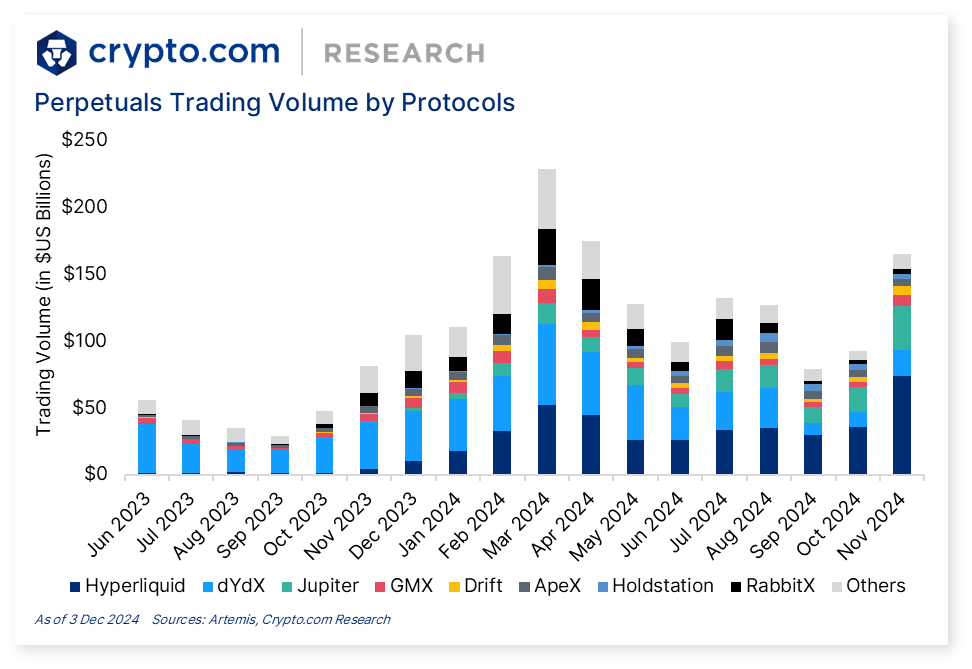

## Table of Contents

## What is Crypto.com and what services does it offer?

Crypto.com is a platform that helps people use cryptocurrencies in their everyday lives. It was created to make it easier for anyone to buy, sell, and use different types of digital money like Bitcoin and Ethereum. The company behind Crypto.com wants to make cryptocurrencies as common and easy to use as regular money.

Crypto.com offers many services to help with this goal. One of the main services is the Crypto.com Wallet, which lets you store and manage your cryptocurrencies safely. They also have a Visa card called the Crypto.com Visa Card, which allows you to spend your cryptocurrencies at places that accept Visa. Additionally, Crypto.com has an exchange where you can trade different cryptocurrencies and an app called Crypto.com Pay, which lets you pay for things using your digital money. All these services are designed to make using cryptocurrencies simple and convenient.

## How can a beginner start using Crypto.com?

To start using Crypto.com, a beginner should first download the Crypto.com app from their app store or visit the Crypto.com website. Once the app is installed, you'll need to sign up for an account. This involves providing some basic information like your name, email address, and creating a strong password. After signing up, you'll need to go through a verification process where you'll submit some documents to confirm your identity. This is a standard step to keep your account and the platform secure.

Once your account is set up and verified, you can start exploring the different services Crypto.com offers. You might want to begin by adding money to your account, which you can do by linking a bank account or using a credit/debit card. With funds in your account, you can buy your first [cryptocurrency](/wiki/cryptocurrency). The app makes this easy with a simple interface where you can choose which cryptocurrency you want to buy, like Bitcoin or Ethereum, and how much you want to spend. After you've bought some cryptocurrency, you can store it in the Crypto.com Wallet, use it to pay for things with Crypto.com Pay, or even get a Crypto.com Visa Card to spend it like regular money.

## What are the fees associated with using Crypto.com?

When you use Crypto.com, there are different fees you might have to pay depending on what you're doing. If you're buying or selling cryptocurrencies on the Crypto.com Exchange, the fee depends on how much you trade. If you trade a lot, the fee is smaller, but if you trade a little, the fee is bigger. Also, if you use a credit or debit card to add money to your account, there's a fee for that, usually around 3.5% of the amount you're adding. If you use a bank transfer, the fee is usually smaller or sometimes even free.

Another type of fee you might see is when you use the Crypto.com Visa Card. There are no fees for using the card to make purchases, but there can be fees for withdrawing cash from an ATM. The amount of this fee depends on which version of the card you have. Also, if you want to move your cryptocurrencies from Crypto.com to another wallet or exchange, there's a fee for that too, which depends on the type of cryptocurrency you're moving. It's good to check the fee details on the Crypto.com website or app before you do anything, so you know what to expect.

## How does Crypto.com ensure the security of user funds and data?

Crypto.com takes many steps to make sure your money and information are safe. They use strong encryption to protect your data when you're using the app or website. They also keep most of the cryptocurrencies in special secure storage, not connected to the internet, which makes it much harder for hackers to steal them. Plus, they have a team that works all the time to watch for anything suspicious and stop any attacks before they happen.

When you sign up, Crypto.com checks who you are to make sure you're really you. This is called identity verification, and it helps keep bad people out. They also have extra security features like two-[factor](/wiki/factor-investing) authentication, which means you need more than just a password to get into your account. This makes it a lot harder for someone else to get in, even if they know your password. By using these methods, Crypto.com tries to keep your money and information as safe as possible.

## What types of cryptocurrencies are supported on Crypto.com?

Crypto.com supports a wide variety of cryptocurrencies, which means you can buy, sell, and trade many different types of digital money on their platform. Some of the most popular ones you can find on Crypto.com include Bitcoin, Ethereum, and Litecoin. They also support newer cryptocurrencies like Cardano, Solana, and Dogecoin, which have become quite popular recently.

In addition to these well-known options, Crypto.com offers support for many other cryptocurrencies, including stablecoins like Tether (USDT) and USD Coin (USDC), which are designed to keep a steady value. They also have tokens from various blockchain projects, such as Chainlink, Polygon, and Binance Coin. With such a diverse range of supported cryptocurrencies, Crypto.com makes it easy for you to explore and invest in the world of digital money.

## How does the Crypto.com Visa Card work and what are its benefits?

The Crypto.com Visa Card is a special kind of credit card that lets you spend your cryptocurrencies just like regular money. When you use the card to buy things, the amount you spend gets taken out of your Crypto.com account in the form of cryptocurrencies like Bitcoin or Ethereum. The card works at any place that accepts Visa, which means you can use it at millions of stores, restaurants, and online shops around the world. To get a Crypto.com Visa Card, you need to apply for it through the Crypto.com app and meet certain requirements, like having a certain amount of cryptocurrency in your account.

One of the biggest benefits of the Crypto.com Visa Card is that it gives you cashback rewards every time you use it. Depending on which version of the card you have, you can get up to 5% back on your purchases, paid in the form of CRO, which is Crypto.com's own cryptocurrency. Another great thing about the card is that it doesn't charge any fees for spending, which means you can use it as much as you want without worrying about extra costs. Plus, if you like to travel, the card offers perks like free ATM withdrawals and airport lounge access, making it a handy tool for people who want to use their cryptocurrencies in everyday life.

## What are the staking options available on Crypto.com and their rewards?

Staking on Crypto.com means you lock up some of your cryptocurrencies to help support the network and earn rewards. The main cryptocurrency you can stake on Crypto.com is CRO, which is their own token. When you stake CRO, you get rewards based on how much you stake and for how long. The more CRO you stake and the longer you keep it staked, the higher your rewards can be. For example, if you stake CRO for 3 months, you might get a smaller reward than if you stake it for 6 months or a year. Staking is a way to earn passive income, and Crypto.com makes it easy to do right from their app.

The rewards for staking CRO can be pretty good. If you stake CRO for a longer time, like 6 months or a year, you can get an annual percentage rate (APR) that can be as high as 12% or even more. This means if you stake 100 CRO for a year at a 12% APR, you could earn 12 CRO as a reward. Besides [earning](/wiki/earning-announcement) CRO, staking also gives you other benefits like lower fees on the Crypto.com Exchange and better cashback rates on the Crypto.com Visa Card. So, staking not only helps you earn more CRO but also makes using other parts of the Crypto.com platform cheaper and more rewarding.

## How does Crypto.com's decentralized exchange (CEX) compare to its centralized exchange?

Crypto.com has both a centralized exchange (CEX) and a decentralized exchange (DEX). The centralized exchange is run by Crypto.com and works a lot like traditional financial platforms. You can buy, sell, and trade many different cryptocurrencies easily. It's user-friendly, and you can use it to do things like deposit money from a bank account or use a credit card. The fees on the centralized exchange can change based on how much you trade, but it's usually pretty straightforward. One thing to remember is that because it's centralized, Crypto.com has control over the platform and your funds are held by them, which might be a concern for some people.

The decentralized exchange, on the other hand, is different because it doesn't have a single company in control. Instead, it uses smart contracts on the blockchain to let people trade directly with each other. This means you keep control of your funds the whole time, which can feel safer for some people. However, using the DEX can be a bit more complicated than the CEX, and the fees can sometimes be higher because of how it works. Also, the DEX might not have as many cryptocurrencies to trade as the centralized exchange. So, while the DEX offers more control and privacy, the CEX is often easier to use and has more options for trading.

## What are the advanced trading features available on Crypto.com for expert users?

Crypto.com offers a range of advanced trading features for expert users who want more control and flexibility when trading cryptocurrencies. One of the main features is the ability to use stop-loss and take-profit orders. These tools let you set specific prices at which your trades will automatically close, helping you manage risk and lock in profits. Expert users can also use margin trading, which allows them to borrow money to trade with more than they have in their account. This can increase potential profits but also comes with higher risks, so it's important to understand it well before using it.

Another advanced feature on Crypto.com is the ability to trade using advanced order types like limit orders and market orders. Limit orders let you set a specific price at which you want to buy or sell a cryptocurrency, while market orders let you buy or sell at the current market price. Expert users can also access detailed trading charts and technical analysis tools to help them make better trading decisions. These tools show price movements and trends, making it easier to spot good trading opportunities. Overall, Crypto.com's advanced trading features give expert users the tools they need to trade more effectively and manage their investments more carefully.

## How does Crypto.com comply with regulatory requirements across different countries?

Crypto.com works hard to follow the rules in different countries where it operates. They know that laws about cryptocurrencies can be different everywhere, so they make sure to check and follow all the local rules. This means they work with regulators and get the right licenses to offer their services legally. For example, they might need to register with financial authorities in some places or follow special rules about how they handle money and data.

To make sure they are doing everything right, Crypto.com has a team that focuses on compliance. This team keeps an eye on changes in laws and makes sure that Crypto.com's services are always up to date with these rules. They also make sure that when you use Crypto.com, your information and money are protected according to the laws of your country. By doing all this, Crypto.com tries to be a safe and trustworthy place for people to use cryptocurrencies all over the world.

## What are the latest updates and future plans for Crypto.com in 2024?

In 2024, Crypto.com has been rolling out several updates to make their platform better and easier to use. They've added more cryptocurrencies to their list, so now you can buy and sell even more types of digital money. They've also made their app faster and more secure, which means it's quicker to do things like trading and checking your account. Plus, they've started offering new features like better staking options where you can earn more rewards by locking up your cryptocurrencies for a while. All these updates show that Crypto.com is always working to improve and give users more ways to use their money.

Looking ahead, Crypto.com has big plans for the future. They want to keep adding new cryptocurrencies and make their platform work even better. One of their goals is to help more people around the world use cryptocurrencies every day, so they're planning to get more licenses in different countries to make this happen. They also want to make their services even safer and easier to use, so they're working on new security features and ways to help users understand and use cryptocurrencies better. By doing all this, Crypto.com hopes to stay at the front of the cryptocurrency world and help more people enjoy the benefits of digital money.

## How does Crypto.com's performance and features compare to other major cryptocurrency platforms?

Crypto.com stands out among other major cryptocurrency platforms because it offers a wide range of services that make it easy for people to use cryptocurrencies every day. It has a user-friendly app where you can buy, sell, and trade many different types of digital money, like Bitcoin and Ethereum. The platform also offers a Visa card that lets you spend your cryptocurrencies at any place that accepts Visa, which is a big plus compared to some other platforms that don't have this feature. Plus, Crypto.com has staking options where you can earn rewards by locking up your cryptocurrencies, and they offer competitive fees, especially if you trade a lot. These features make Crypto.com a strong choice for both beginners and expert users.

Compared to platforms like Coinbase and Binance, Crypto.com has some unique benefits but also some differences. Coinbase is known for being very easy to use and is great for beginners, but it might have higher fees and fewer cryptocurrencies to trade than Crypto.com. Binance, on the other hand, is a powerhouse in the crypto world with a huge selection of cryptocurrencies and advanced trading features, but it can be a bit overwhelming for new users and has faced some regulatory issues in certain countries. Crypto.com tries to strike a balance by offering a wide range of cryptocurrencies, a user-friendly interface, and additional services like the Visa card, making it a versatile platform that can cater to a broad audience while still providing advanced features for expert traders.

## References & Further Reading

[1]: Bergstra, J., Bardenet, R., Bengio, Y., & Kégl, B. (2011). ["Algorithms for Hyper-Parameter Optimization."](https://papers.nips.cc/paper/4443-algorithms-for-hyper-parameter-optimization) Advances in Neural Information Processing Systems 24.

[2]: ["Advances in Financial Machine Learning"](https://www.amazon.com/Advances-Financial-Machine-Learning-Marcos/dp/1119482089) by Marcos Lopez de Prado

[3]: ["Evidence-Based Technical Analysis: Applying the Scientific Method and Statistical Inference to Trading Signals"](https://www.amazon.com/Evidence-Based-Technical-Analysis-Scientific-Statistical/dp/0470008741) by David Aronson

[4]: ["Machine Learning for Algorithmic Trading"](https://github.com/stefan-jansen/machine-learning-for-trading) by Stefan Jansen

[5]: ["Quantitative Trading: How to Build Your Own Algorithmic Trading Business"](https://books.google.com/books/about/Quantitative_Trading.html?id=j70yEAAAQBAJ) by Ernest P. Chan