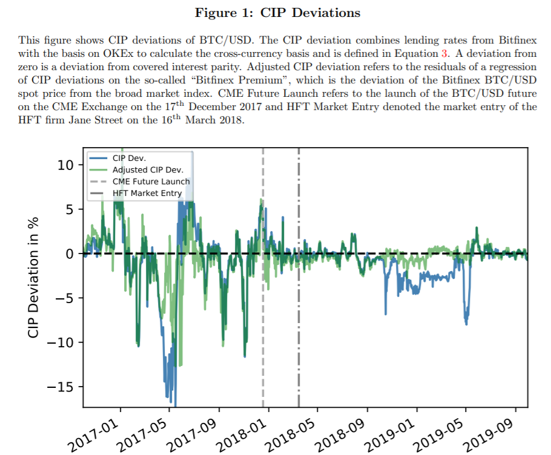

## Table of Contents

## What is Crypto Covered Interest Parity (CCIP)?

Crypto Covered Interest Parity (CCIP) is a concept that comes from the world of finance and applies to cryptocurrencies. It's about the idea that you should get the same return whether you invest in one cryptocurrency or another, as long as you can swap them back at the end. Imagine you have Bitcoin and you're thinking about swapping it for Ethereum for a while. If you can swap it back to Bitcoin at the end, the total return should be the same as if you had just kept your Bitcoin the whole time. This is because you can "cover" your investment by locking in the exchange rate for the future.

However, in the real world of cryptocurrencies, CCIP doesn't always hold true. This is because crypto markets can be very unpredictable and there are often big differences in how easy it is to borrow or lend different cryptocurrencies. Also, the costs of swapping between cryptocurrencies can change a lot. So, even if you lock in the exchange rate, the actual returns you get might be different from what you expected. This makes CCIP an interesting but tricky idea to use in the fast-moving world of cryptocurrencies.

## How does Crypto Covered Interest Parity relate to traditional Covered Interest Parity?

Crypto Covered Interest Parity (CCIP) and traditional Covered Interest Parity (CIP) both deal with the idea of getting the same return from different investments. In traditional CIP, you might have dollars and think about swapping them for euros for a while. If you can swap them back to dollars at the end, the total return should be the same as if you had just kept your dollars. This works because you can use financial tools like forward contracts to lock in the exchange rate for the future. CCIP is similar but applies to cryptocurrencies like Bitcoin and Ethereum instead of traditional currencies.

However, there are big differences between CCIP and CIP because the crypto world is much more unpredictable. In traditional markets, the costs of swapping currencies and the interest rates are usually more stable, making CIP more reliable. In contrast, the crypto market can change a lot, and it's often harder to borrow or lend cryptocurrencies. Also, the costs of swapping between cryptocurrencies can be very different from what you expect. So, while CCIP is based on the same idea as CIP, it's much harder to use in practice because of the wild nature of [cryptocurrency](/wiki/cryptocurrency) markets.

## What are Crypto Covered Interest Parity Deviations?

Crypto Covered Interest Parity Deviations happen when the idea of Crypto Covered Interest Parity (CCIP) doesn't work out as expected. CCIP says that if you swap one cryptocurrency for another and then swap it back, you should end up with the same return as if you had kept the first cryptocurrency all along. But in the real world of cryptocurrencies, things often don't go according to plan. The returns can be different because the crypto market is very unpredictable and the costs of swapping between cryptocurrencies can change a lot.

These deviations can be caused by many things. For example, it might be hard to borrow or lend certain cryptocurrencies, which can make the costs go up or down unexpectedly. Also, the exchange rates between cryptocurrencies can move a lot, making it tricky to lock in a good rate for the future. So, even if you try to use CCIP to plan your investments, the actual results might be different from what you expected, showing how challenging it can be to use CCIP in the fast-moving world of cryptocurrencies.

## What causes deviations in Crypto Covered Interest Parity?

Deviations in Crypto Covered Interest Parity happen because the world of cryptocurrencies is very unpredictable. When you try to swap one cryptocurrency for another and then swap it back, the returns can be different from what you expected. This is because the costs of swapping between cryptocurrencies can change a lot. Sometimes it's hard to borrow or lend certain cryptocurrencies, which can make the costs go up or down unexpectedly.

The exchange rates between cryptocurrencies can also move a lot, making it tricky to lock in a good rate for the future. This means that even if you try to use Crypto Covered Interest Parity to plan your investments, the actual results might not match your plans. The fast-moving nature of the crypto market makes it hard to predict what will happen, leading to these deviations.

## How can one identify Crypto Covered Interest Parity Deviations?

To spot Crypto Covered Interest Parity Deviations, you need to keep an eye on the returns from swapping one cryptocurrency for another and then swapping it back. If the total return is different from what you would have gotten by just holding onto the first cryptocurrency, that's a sign of a deviation. You can compare the actual returns with what you expected based on Crypto Covered Interest Parity to see if there's a difference.

These deviations can happen because the crypto market is very unpredictable. The costs of swapping between cryptocurrencies can change a lot, and it might be hard to borrow or lend certain cryptocurrencies. Also, the exchange rates between cryptocurrencies can move quickly, making it tough to lock in a good rate for the future. By watching these factors closely, you can identify when Crypto Covered Interest Parity isn't working as expected.

## What are the implications of Crypto Covered Interest Parity Deviations for cryptocurrency investors?

Crypto Covered Interest Parity Deviations can make things tricky for cryptocurrency investors. When the returns from swapping one cryptocurrency for another and then swapping it back are different from what you expected, it can mess up your investment plans. This means you might not get the returns you were hoping for, which can be frustrating and risky. Investors need to be careful and keep a close eye on the market to see if these deviations are happening.

Because the crypto market is so unpredictable, it's hard to know what will happen next. The costs of swapping between cryptocurrencies can change a lot, and it might be hard to borrow or lend certain cryptocurrencies. This can lead to unexpected costs and lower returns. So, investors need to be ready for surprises and maybe not rely too much on Crypto Covered Interest Parity when making their investment decisions.

## Can Crypto Covered Interest Parity Deviations be used for arbitrage opportunities?

Crypto Covered Interest Parity Deviations can sometimes be used for arbitrage opportunities. Arbitrage is when you buy something in one place and sell it in another place for a higher price, making a profit from the difference. If you see that the returns from swapping one cryptocurrency for another and then swapping it back are different from what you expected, you might be able to take advantage of this. For example, if you can swap Bitcoin for Ethereum and then swap it back to Bitcoin at a better rate than if you had just held onto Bitcoin, you could make a profit.

However, using Crypto Covered Interest Parity Deviations for arbitrage is not easy. The crypto market is very unpredictable, and the costs of swapping between cryptocurrencies can change a lot. It might be hard to borrow or lend certain cryptocurrencies, which can make the costs go up or down unexpectedly. So, even if you spot a deviation, it's not always possible to make a profit from it. You need to be quick and careful, and even then, there's no guarantee that you'll make money.

## How do market inefficiencies contribute to Crypto Covered Interest Parity Deviations?

Market inefficiencies play a big role in causing Crypto Covered Interest Parity Deviations. In a perfect world, swapping one cryptocurrency for another and then swapping it back should give you the same return as if you had just kept the first cryptocurrency. But the crypto market is far from perfect. It's full of inefficiencies like high transaction fees, slow processing times, and big differences in how easy it is to borrow or lend different cryptocurrencies. These inefficiencies can make the costs of swapping between cryptocurrencies go up or down unexpectedly, leading to deviations from what Crypto Covered Interest Parity predicts.

These inefficiencies can also make it hard to lock in a good exchange rate for the future. For example, if you want to swap Bitcoin for Ethereum and then swap it back later, the exchange rate might change a lot before you can do the second swap. This unpredictability means that even if you try to use Crypto Covered Interest Parity to plan your investments, the actual returns might be different from what you expected. So, market inefficiencies are a big reason why Crypto Covered Interest Parity Deviations happen, making it tricky for investors to rely on this concept in the fast-moving world of cryptocurrencies.

## What role do regulatory differences play in Crypto Covered Interest Parity Deviations?

Regulatory differences between countries can make Crypto Covered Interest Parity Deviations bigger. Different countries have different rules about cryptocurrencies. Some places might have strict rules that make it hard to buy, sell, or swap cryptocurrencies. This can make the costs of doing these things go up or down in unexpected ways. For example, if one country has high taxes on crypto transactions, it might be more expensive to swap cryptocurrencies there than in a country with lower taxes. This difference in costs can cause the returns from swapping one cryptocurrency for another and then swapping it back to be different from what you expected.

These regulatory differences can also affect how easy it is to borrow or lend cryptocurrencies. In some places, it might be really hard to get a loan in Bitcoin because of strict rules, while in other places, it might be easy. This can lead to big differences in the interest rates for borrowing or lending different cryptocurrencies, which can mess up the idea of Crypto Covered Interest Parity. So, when you're trying to use Crypto Covered Interest Parity to plan your investments, you need to think about how different rules in different countries might change the returns you get.

## How have Crypto Covered Interest Parity Deviations evolved over time?

Crypto Covered Interest Parity Deviations have changed a lot over time as the cryptocurrency market has grown and changed. In the early days of cryptocurrencies, there were big differences between what you expected to get from swapping one cryptocurrency for another and then swapping it back, and what you actually got. This was because the market was new and very unpredictable. There were not many people trading, and the costs of swapping between cryptocurrencies could change a lot. Also, it was hard to borrow or lend cryptocurrencies, which made the returns even more unpredictable.

As the crypto market has gotten bigger and more people have started trading, the deviations have become a bit smaller but are still there. Now, there are more ways to swap cryptocurrencies and more places to do it, which has made things a bit more predictable. But the market is still very fast-moving, and the costs of swapping can still change a lot. Also, different countries have different rules about cryptocurrencies, which can make the returns different from what you expect. So, even though the market has grown, Crypto Covered Interest Parity Deviations are still something investors need to watch out for.

## What advanced strategies can traders use to exploit Crypto Covered Interest Parity Deviations?

Traders can use some smart moves to take advantage of Crypto Covered Interest Parity Deviations. One way is to keep a close eye on the costs of swapping between different cryptocurrencies. If they notice that the cost to swap one cryptocurrency for another is lower in one place than another, they can buy the cheaper one and then sell it where it's more expensive. This is called arbitrage, and it can help them make a profit from the differences in costs. Another trick is to use financial tools like futures or options to lock in the exchange rate for the future. This can help them plan their swaps better and maybe make more money when the market changes.

Another strategy is to pay attention to how easy it is to borrow or lend different cryptocurrencies. If it's easier and cheaper to borrow one cryptocurrency than another, traders can use this to their advantage. They might borrow the cheaper one, swap it for another, and then swap it back later to make a profit. Also, traders can look at how different countries' rules about cryptocurrencies might affect the costs of swapping. By understanding these rules, they can find places where it's cheaper or easier to trade and use this to make more money. These strategies need a lot of watching and quick thinking, but they can help traders make the most of Crypto Covered Interest Parity Deviations.

## How do Crypto Covered Interest Parity Deviations impact the broader financial markets?

Crypto Covered Interest Parity Deviations can shake things up in the bigger world of money and finance. When people see that they can make money by swapping one cryptocurrency for another and then swapping it back, it can make more people want to trade cryptocurrencies. This can make the crypto market busier and more exciting. But it can also make the market more unpredictable, which might make people nervous about other kinds of money and investments too. If lots of people start moving their money around to try to make a profit from these deviations, it can affect the prices of other things like stocks and regular money.

These deviations can also make people think differently about how they invest their money. If they see that the rules about cryptocurrencies are different in different places, they might start looking for ways to use these differences to their advantage. This can make more money flow into the crypto market from other parts of the financial world. But it can also make things more complicated and risky. People might start using fancy tools like futures and options to try to make money from these deviations, which can make the whole financial system more connected to what's happening in the crypto world.

## What is Covered Interest Parity (CIP) and how does it work?

Covered Interest Parity (CIP) is a foundational concept in international finance that establishes a no-[arbitrage](/wiki/arbitrage) condition between interest rates, spot exchange rates, and forward exchange rates. In essence, CIP asserts that the returns on investments in different currencies should be equivalent when hedged against exchange rate risk using forward contracts.

### Definition and Explanation of CIP

CIP is expressed mathematically as:

$$
(1 + i_d) = \frac{F}{S} \times (1 + i_f)
$$

Where:
- $i_d$ is the domestic interest rate
- $i_f$ is the foreign interest rate
- $S$ is the current spot exchange rate (domestic currency per unit of foreign currency)
- $F$ is the forward exchange rate

The central idea of CIP is that any deviation in the above equality would provide an arbitrage opportunity. If the parity condition holds, it implies that for investors, there is no advantage in borrowing in one currency to invest in another currency, assuming that the foreign exchange risk is hedged using a forward contract.

### Importance in International Finance

CIP is a cornerstone of modern financial economics due to its implications in ensuring pricing integrity across currency markets. By aligning interest rates and forward rates, CIP helps maintain equilibrium in the foreign exchange markets, thus preventing arbitrage opportunities that can distort market prices.

In well-functioning markets, arbitrageurs would quickly exploit any disparities, buying undervalued assets and selling overvalued ones, correcting the pricing and restoring parity. This action reinforces CIP as a fundamental principle ensuring stability and coherence between cross-currency financial instruments.

### CIP Deviations and Their Implications

While CIP is theoretically robust, deviations do occur and can suggest inefficiencies within financial markets. Such discrepancies can arise from several factors, including transaction costs, capital controls, or differences in credit risk between two countries.

Market participants like arbitrageurs and high-frequency traders play a crucial role in correcting these deviations. When a deviation is identified, traders can capitalize by executing a series of trades that, after accounting for transaction costs and execution risks, yield a risk-free profit. For instance, if the actual forward rate differs from the rate implied by CIP, traders can lock in arbitrage trades to profit from the mismatch.

### Example of CIP Deviations

Consider a situation where the forward rate $F$ is higher than the theoretical rate implied by the spot rate and interest rates. In this case, an investor might borrow in the domestic market, convert the funds to the foreign currency at the spot rate, invest at the foreign [interest rate](/wiki/interest-rate-trading-strategies), and lock in the future exchange rate using the forward contract. The disparity provides an arbitrage gain, and as more traders exploit such opportunities, their actions converge the rates to restore parity.

In conclusion, CIP not only serves as a barometer of market efficiency but also as a tool for identifying arbitrage opportunities. Its deviations signal potential areas for profit while highlighting issues within financial markets that require correction.

## What is the role of algorithmic trading in market efficiency?

Algorithmic trading refers to the use of computer algorithms to execute trades based on pre-set criteria such as timing, price, or [volume](/wiki/volume-trading-strategy). It enables traders to automate and optimize trading decisions with precision and speed that surpass human capabilities, thereby playing a crucial role in identifying and exploiting market inefficiencies. The underpinning of [algorithmic trading](/wiki/algorithmic-trading) lies in its ability to analyze vast datasets and execute trades within milliseconds, drastically reducing latency and slippage (Chlistalla, 2011).

High-frequency trading ([HFT](/wiki/high-frequency-trading-strategies)) is a subset of algorithmic trading characterized by high turnover rates and extremely short-term investment horizons. Post-2018, the presence of HFTs in cryptocurrency markets has been instrumental in enhancing market efficiency. HFTs have the capability to provide [liquidity](/wiki/liquidity-risk-premium) by continually engaging in bid and offer quotes, which is essential for market stability. The increase in market participants using HFT strategies has contributed to tighter spreads and reduced bid-ask spreads, thereby facilitating a more robust trading environment (Brogaard et al., 2014).

A notable case study illustrating the influence of algorithmic trading firms on market parameters can be observed in their impact on liquidity, [volatility](/wiki/volatility-trading-strategies), and bid-ask spreads. Algorithmic trading firms, through sophisticated [machine learning](/wiki/machine-learning) and data analysis techniques, enhance liquidity by ensuring that market orders are met with corresponding buy or sell orders swiftly, thus reducing market impact. This increase in liquidity reduces volatility to an extent, as it narrows the bid-ask spread — the difference between the highest price a buyer is willing to pay and the lowest price a seller is willing to accept.

For example, consider a market where before the widespread adoption of HFT strategies, the average bid-ask spread is relatively wide due to fewer transactions. With the advent of HFTs, the pace and volume of transactions increase, resulting in a narrower bid-ask spread as demonstrated mathematically by the relation:

$$
\text{Bid-Ask Spread Reduction} = \frac{\text{Old Spread} - \text{New Spread}}{\text{Old Spread}} \times 100\%
$$

Suppose the old spread was 0.25% and the new spread with HFTs is 0.20%, the reduction in the spread would be calculated as:

```python
old_spread = 0.0025
new_spread = 0.0020
spread_reduction_percentage = ((old_spread - new_spread) / old_spread) * 100
spread_reduction_percentage
```

This increased liquidity and reduced volatility can improve market conditions for both institutional and retail investors, making the markets more accessible and less risky. Despite these contributions, criticisms of HFTs persist regarding potential exacerbation of flash crashes and market manipulation, signaling a need for regulatory oversight (Zhang, 2010).

In conclusion, algorithmic trading, and particularly HFTs, have significantly contributed to the efficiency of cryptocurrency markets by improving liquidity conditions, reducing volatility, and narrowing bid-ask spreads. These changes collectively enhance the robustness and attractiveness of cryptocurrency markets to a wider pool of investors, further integrating them into the global financial landscape.

## What are the differences and similarities between Crypto and Fiat Markets according to a comparative analysis?

Cryptocurrency markets and traditional fiat markets exhibit distinct dynamics, particularly concerning the adherence to Covered Interest Parity (CIP). In traditional fiat markets, such as the EUR/USD, CIP serves as a cornerstone of international finance, ensuring that arbitrage opportunities are minimized between countries. This parity is expressed by the equation: 

$$
(1 + i_d) = \frac{F}{S} \times (1 + i_f)
$$

where $i_d$ and $i_f$ represent the interest rates of the domestic and foreign countries, respectively, while $F$ and $S$ are the forward and spot exchange rates. The principle holds that the forward exchange rate should incorporate interest rate differentials, thereby equalizing the returns from domestic and foreign investments.

In contrast, the cryptocurrency markets present unique challenges to CIP adherence. One contributing [factor](/wiki/factor-investing) is the inherent credit risk associated with crypto transactions. Unlike fiat currencies, which are supported by governmental and institutional frameworks, cryptocurrencies lack a central authority. This absence of a backing entity introduces a credit risk premium into the market, potentially leading to CIP deviations.

Moreover, regulatory aspects further differentiate crypto markets from their fiat counterparts. Regulatory measures for fiat currencies are well-established, ensuring market standards and reducing the risk of disputes. In the crypto markets, regulatory frameworks are still evolving and vary significantly across jurisdictions, which can lead to discrepancies and inefficiencies in trading practices. This regulatory uncertainty can cause additional deviations from CIP as traders price in the risks associated with regulatory change or enforcement.

The independence of the crypto ecosystem from traditional financial systems also impacts CIP adherence. Cryptocurrencies often operate based on different economic and technical fundamentals. For instance, the decentralized nature and technology-based valuation of cryptocurrencies challenge the traditional exchange rate models. Furthermore, the supply and demand dynamics in crypto markets are influenced not only by economic indicators but also by technological developments, market sentiment, and speculative trading, which can lead to short-term inefficiencies.

In summary, while traditional fiat markets like the EUR/USD show adherence to CIP due to established credit risk assessments and robust regulatory frameworks, cryptocurrency markets diverge due to higher credit risks, regulatory variability, and their independent operational ecosystem. As these markets continue to evolve, understanding these fundamental differences is crucial for traders and investors aiming to capitalize on arbitrage opportunities while managing inherent risks.

## References & Further Reading

[1]: Zhang, F. X. (2010). ["High-Frequency Trading, Stock Volatility, and Price Discovery."](https://papers.ssrn.com/sol3/papers.cfm?abstract_id=1691679) SSRN Electronic Journal.

[2]: Brogaard, J., Hendershott, T., & Riordan, R. (2014). ["High-Frequency Trading and Price Discovery."](https://www.jstor.org/stable/24465658) The Review of Financial Studies.

[3]: Chlistalla, M. (2011). ["High-Frequency Trading: Better than Its Reputation?"](https://c.mql5.com/forextsd/forum/168/high-frequency_trading_-_better_than_its_reputation.pdf) Deutsche Bank Research.

[4]: Franz, C., & Valentin, H. ["Covered Interest Parity Deviations in the Crypto Market."](https://papers.ssrn.com/sol3/papers.cfm?abstract_id=3702212) Journal of Financial Markets.

[5]: ["Advances in Financial Machine Learning"](https://www.amazon.com/Advances-Financial-Machine-Learning-Marcos/dp/1119482089) by Marcos Lopez de Prado.