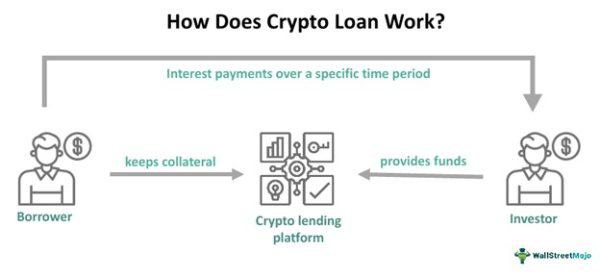

The world of cryptocurrency is transforming at an unprecedented rate, blending seamlessly with traditional financial systems to create novel opportunities and services. A burgeoning area within this transformation is crypto lending, which leverages blockchain technology to deliver innovative solutions for loans and investments. By providing a decentralized platform for lending and borrowing digital assets, crypto lending harnesses the unique capabilities of blockchain, such as transparency, security, and efficiency, thus altering the conventional dynamics of finance.

Crypto lending has emerged as a significant trend for investors seeking to optimize the use of their digital assets. Traditionally, digital assets like cryptocurrencies were held in portfolios without yielding any tangible returns. However, with the advent of crypto lending, asset owners can lend these digital currencies to others and earn interest, thereby increasing liquidity and utility. Lending platforms, both centralized and decentralized, facilitate this interaction by serving as intermediaries that manage the lending process through smart contracts. This technological advancement ensures the enforcement of lending terms and conditions without the need for a third-party authority, ensuring higher transparency and reduced costs.



This article explores the evolving landscape of crypto lending, categorizing various types of cryptocurrency loans that are gaining traction in the marketplace. By examining collateralized loans, crypto lines of credit, uncollateralized loans, and flash loans, we aim to provide a comprehensive overview of how blockchain is reshaping financial services. Furthermore, we investigate the intersection of algorithmic trading with crypto financing, highlighting the new avenues it opens for sophisticated investors. Algorithmic trading has carved out its own niche within the crypto world, providing automated and optimized trading strategies based on predefined criteria, and its integration with crypto lending platforms offers enhanced financial products and decision-making tools for users.

In summary, as blockchain technology continues to mature, its applications in crypto lending and algorithmic trading are likely to challenge and redefine traditional financial practices. The convergence of these technologies presents tantalizing prospects for higher returns and innovative financial solutions, but with inherent risks related to market volatility and regulatory landscapes. As such, participants in this evolving field must remain informed and vigilant in navigating the complexities of this promising yet volatile market.

## Table of Contents

## Understanding Crypto Lending

Crypto lending, an innovative application of blockchain technology, enables users to lend their digital assets in return for interest. This concept has gained traction due to its potential to provide liquidity and generate income from otherwise idle cryptocurrency holdings. The process is primarily facilitated by lending platforms, which can be categorized into two types: centralized and decentralized platforms. Each of these offers distinct operational models in terms of control, transparency, and user participation.

Centralized lending platforms operate similarly to traditional financial institutions, acting as intermediaries between lenders and borrowers. These platforms manage user funds and guarantee depositor security, often insuring against default risks. While this model offers a streamlined user experience and a higher degree of customer support, it also requires users to trust the platform's management, as the control over funds lies with the centralized entity.

Conversely, decentralized lending platforms operate on smart contracts, which eliminate the need for intermediaries by executing automated, trustless transactions on blockchain networks. These platforms provide greater transparency, as all transactions and interest rates are recorded on an immutable ledger accessible to all participants. However, the absence of central control requires users to engage more actively in managing their assets and understanding the protocols' technical intricacies.

In crypto lending, borrowers typically deposit their digital assets as collateral to access loans in either fiat currency or other cryptocurrencies. This collateral mechanism serves to protect lenders by ensuring that in the case of borrower default, the platform can liquidate the collateral to recover the loaned amount. Lenders, on the other hand, provide their assets to the platform in exchange for periodic interest payments, which are often higher than those obtainable through traditional savings accounts due to the inherent [volatility](/wiki/volatility-trading-strategies) and risk of digital currencies.

Platforms typically assess various factors before approving loans, such as the loan-to-value (LTV) ratio, which dictates the maximum loan amount based on the collateral's value. An LTV ratio is calculated as:

$$
\text{LTV} = \left( \frac{\text{Loan Amount}}{\text{Value of Collateral}} \right) \times 100
$$

Maintaining a favorable LTV ratio is crucial, as falling collateral values may trigger margin calls, requiring borrowers to provide additional assets or face liquidation.

Another key role in this ecosystem is that of the liquidators, who engage in [arbitrage](/wiki/arbitrage) opportunities, especially in decentralized platforms. These entities ensure that undercollateralized loans are liquidated promptly, maintaining platform solvency and stability.

Overall, crypto lending platforms, whether centralized or decentralized, provide an ecosystem where lenders can earn returns on their crypto holdings, and borrowers can access [liquidity](/wiki/liquidity-risk-premium) without selling their assets. This dynamic creates a symbiotic relationship that underpins the growing popularity and development of crypto financial services.

## Types of Cryptocurrency Loans

Cryptocurrency loans have evolved to encompass a variety of structures designed to meet different financial needs and risk appetites. These loans utilize blockchain technology to offer security, transparency, and efficiency. Below are the primary types of [cryptocurrency](/wiki/cryptocurrency) loans available today:

### Collateralized Loans
Collateralized loans are the predominant form of cryptocurrency loans, providing a secure way for borrowers to access liquidity while retaining ownership of their digital assets. In a collateralized loan, the borrower deposits a certain amount of cryptocurrency as collateral, which underpins the loan agreement. The value of the collateral must typically exceed the loan amount, with a common loan-to-value (LTV) ratio ranging from 50% to 70%. For example, if a borrower wishes to obtain a loan of $10,000, they might need to provide collateral worth $14,000 in cryptocurrency, assuming a 70% LTV ratio:

$$
\text{Collateral Required} = \frac{\text{Loan Amount}}{\text{LTV}}
$$

Borrowers must constantly monitor the value of their collateral due to the volatile nature of cryptocurrencies. A significant drop in collateral value can trigger margin calls, requiring borrowers to add more collateral or risk liquidation.

### Crypto Lines of Credit
Crypto lines of credit offer more flexible borrowing terms compared to traditional loans. With a line of credit, borrowers can draw funds as needed, up to a predetermined limit, making it a suitable option for individuals seeking financial flexibility without having to repeatedly apply for new loans. Interest is only charged on the amount drawn, similar to a credit card system. This mode of borrowing is advantageous as it allows borrowers to manage cash flow more effectively without being charged for credit they do not utilize.

### Uncollateralized Loans
Uncollateralized loans are less common in the cryptocurrency space due to the inherent risks involved. These loans do not require borrowers to place any cryptocurrency as security, making them attractive for those without significant digital assets. However, the absence of collateral means lenders are exposed to a higher default risk. Consequently, rigorous credit checks and higher interest rates are typically imposed to mitigate this risk. Platforms offering uncollateralized loans may employ blockchain-based identity and credit scoring systems to assess a borrower's creditworthiness before approval.

### Flash Loans
Flash loans are a unique offering in the cryptocurrency loan market, characterized by their instantaneous nature. These loans involve borrowing and repaying within a single transaction block, often lasting only a few seconds. Flash loans have gained popularity for their use in arbitrage opportunities, where traders exploit price differences across exchanges to make a profit. There are no collateral requirements for flash loans, as the transaction's atomic nature ensures that funds are returned instantly. If the borrower cannot repay the loan within the same transaction, the whole process is reversed, minimizing risk to the lender.

The landscape of cryptocurrency loans is rapidly evolving, driven by innovations in blockchain technology and the growing demand for decentralized financial solutions. Each type offers distinct advantages and risks, catering to a diverse range of investor preferences and financial needs.

## Risks of Crypto Lending

Crypto lending poses several risks that can impact both lenders and borrowers significantly. One of the most pressing concerns is market volatility. The value of digital assets can experience dramatic fluctuations, which in turn affects the stability of loans. If the value of the collateral drops suddenly, it can result in significant losses for lenders, while borrowers may struggle to meet the loan terms.

Margin calls present another risk [factor](/wiki/factor-investing) in crypto lending. When the value of the collateral falls below a specific threshold, the borrower might be required to provide additional collateral to maintain the loan. Failure to meet a margin call can lead to the liquidation of the collateralized asset, causing potential losses for the borrower. 

A significant issue in the crypto lending space is the lack of regulation. Unlike traditional financial institutions, many crypto lending platforms operate without rigorous oversight. This absence of regulation can lead to insufficient consumer protections, increasing the risk of fraud or platform failure, ultimately placing participants' investments at risk.

Illiquidity is another concern for participants in crypto lending. Some platforms may impose restrictions on withdrawals, limiting the ease with which lenders and borrowers can access their funds. This can be problematic, especially during periods of market stress when immediate liquidity is essential. 

Altogether, these risks highlight the need for participants in crypto lending to exercise caution, conduct thorough due diligence, and consider the inherent uncertainties of this evolving financial landscape.

## Algorithmic Trading in Crypto Finances

Algorithmic trading, often referred to as algo trading, employs computer algorithms to [carry](/wiki/carry-trading) out trades swiftly based on established criteria, such as timing, price, or market conditions. In the context of cryptocurrency, this approach improves the efficiency of trading activities, allowing for real-time decisions that optimize strategies and potentially maximize returns while managing risks.

Due to the volatile nature of cryptocurrency markets, [algorithmic trading](/wiki/algorithmic-trading) provides a decisive advantage in maintaining agility under rapid market fluctuations. Traders and financial analysts develop algorithms that automatically execute trades when certain conditions are met, using signals derived from statistical models or [machine learning](/wiki/machine-learning) techniques to predict price movements. For example, a simple moving average crossover strategy might involve placing a buy order when a short-term moving average exceeds a long-term moving average:

```python
def simple_moving_average(data, window):
    return data.rolling(window=window).mean()

# Example usage
import pandas as pd

# Simulating historical price data
prices = pd.Series([100, 102, 105, 107, 108, 107, 110, 113, 112, 115])
short_window = 3
long_window = 5

# Calculate moving averages
short_mavg = simple_moving_average(prices, short_window)
long_mavg = simple_moving_average(prices, long_window)

# Generate signals
signals = (short_mavg > long_mavg).astype(int)
```

Beyond trading strategies, the integration of algo trading with crypto lending platforms cultivates enhanced financial products and decision-making tools. These platforms can dynamically adjust interest rates or collateral requirements based on algorithmically assessed risk levels. For instance, algorithms can analyze borrower behavior and market trends to modulate loan terms, ensuring resilient lending products even amid cryptocurrency market volatility.

Such integration promotes greater liquidity and market efficiency, enabling participants to capitalize on rapid arbitrage opportunities or adjust portfolios with minimal latency. As blockchain and financial technologies progress, the partnership between algo trading and crypto financing is expected to evolve, leading to more sophisticated tools and strategies that emphasize transparency, speed, and reduced human error in financial operations.

## The Future of Blockchain Finance

Blockchain technology has rapidly emerged as a transformative force within the financial sector, primarily through its decentralized architecture, which promises enhanced transparency and security. This innovation is now gaining significant traction in crypto lending, suggesting profound implications for traditional banking practices and regulatory frameworks.

As crypto lending platforms continue to expand, they increasingly challenge conventional financial systems by offering more streamlined and accessible services. The traditional banking sector, characterized by centralized operations and extensive compliance requirements, may need to reassess its operational models and regulatory approaches. For instance, blockchain-based systems enable real-time verification and settlement of transactions, which could significantly reduce processing times and operational costs typically associated with traditional banks.

The potential integration of more sophisticated trading algorithms with blockchain technology is another trend likely to shape the future of blockchain finance. Algorithmic trading, which leverages complex mathematical models and high-speed data analysis to make profitable trading decisions, can be seamlessly integrated with blockchain to enhance the efficiency and accuracy of financial transactions. This synergy can provide investors with more robust financial tools, optimizing asset management strategies and minimizing risk exposure. For example, machine learning algorithms can be employed to analyze large volumes of data, predict market trends, and execute trades based on predictive analytics, all within the secure framework provided by blockchain.

Moreover, with the advancement of blockchain interoperability, the integration of disparate financial services onto a unified platform becomes increasingly feasible. This would allow for cross-platform transactions, enabling users to transfer value seamlessly between different blockchain networks and financial ecosystems. As a result, users could benefit from improved liquidity, reduced transaction costs, and enhanced financial inclusion, fostering an environment that encourages innovation and competition within the financial sector.

In conclusion, the continual evolution of blockchain technology holds the promise of fundamentally altering the financial landscape. As crypto lending and other blockchain-based services gain [momentum](/wiki/momentum), they are poised to reshape banking practices, encourage regulatory adaptations, and foster the emergence of more intelligent trading algorithms. This transformation heralds a future where financial systems are not only more efficient and secure but also more inclusive, paving the way for a more democratized financial sector.

## Conclusion

Crypto lending and algorithmic trading represent a significant fusion of technology and financial services, marking an era of new opportunities and challenges in the financial sector. The potential for substantial returns in crypto markets is undeniable; however, participants must remain vigilant to the risks, primarily stemming from market volatility and the existing regulatory landscape. Digital assets like cryptocurrencies are known for their unpredictable price movements, which can result in sudden financial gains or severe losses.

The evolving regulatory environment adds another layer of complexity. Unlike traditional financial systems, the regulatory framework for cryptocurrencies and related services is still under development. This uncertainty can pose significant risks for both lenders and borrowers, as the potential for legal and financial disputes is heightened without clear standards and protections.

Despite these challenges, the maturation of blockchain technology holds promise for transformative changes in finance. Blockchain’s core characteristics of decentralization, transparency, and security are poised to redefine how financial systems operate. As these technologies evolve, they are expected to create more efficient systems that are both inclusive and accessible, breaking down traditional barriers in the financial world. 

This shift could potentially lead to the development of new financial models that integrate various services, including lending, trading, and investing, to provide comprehensive solutions for users. Moreover, the advancement of algorithmic trading is expected to enhance these systems by offering sophisticated tools for improved decision-making and risk management. As blockchain technology continues to progress, it promises a future where financial systems are more equitable and attuned to the needs of a diverse, global population.

## References & Further Reading

[1]: Schär, F., Berentsen, A., & Gervais, A. (2020). ["Decentralized Finance: On Blockchain- and Smart Contract-based Financial Markets"](https://papers.ssrn.com/sol3/papers.cfm?abstract_id=3571335). Annual Review of Financial Economics, 12, 389-415.

[2]: Zeng, G., et al. (2021). ["The Promise of Blockchain Technology for Decentralized Finance"](https://link.springer.com/article/10.1007/s42521-023-00088-8). International Journal of Network Security, 11(4).

[3]: Antonopoulos, A. M. (2017). ["Mastering Bitcoin: Unlocking Digital Cryptocurrencies"](https://books.google.com/books/about/Mastering_Bitcoin.html?id=IXmrBQAAQBAJ). O'Reilly Media. 

[4]: Buterin, V. (2013). ["Ethereum White Paper"](https://ethereum.org/en/whitepaper/). Ethereum Foundation.

[5]: Narayanan, A., Bonneau, J., Felten, E., Miller, A., & Goldfeder, S. (2016). ["Bitcoin and Cryptocurrency Technologies: A Comprehensive Introduction"](https://press.princeton.edu/books/hardcover/9780691171692/bitcoin-and-cryptocurrency-technologies). Princeton University Press.

[6]: Mohanty, S. (2018). ["Ethereum for Architects and Engineers"](https://books.google.com/books/about/Ethereum_for_Architects_and_Developers.html?id=1Lx1DwAAQBAJ). Apress.

[7]: Chen, Y., & Bellavitis, C. (2020). ["Decentralized Finance: Blockchain Technology and the Quest for an Open Financial System"](https://papers.ssrn.com/sol3/papers.cfm?abstract_id=3483608). Revue d'économie industrielle. 

[8]: Popper, N. (2015). ["Digital Gold: Bitcoin and the Inside Story of the Misfits and Millionaires Trying to Reinvent Money"](https://archive.org/details/digitalgoldbitco0000popp). HarperCollins.