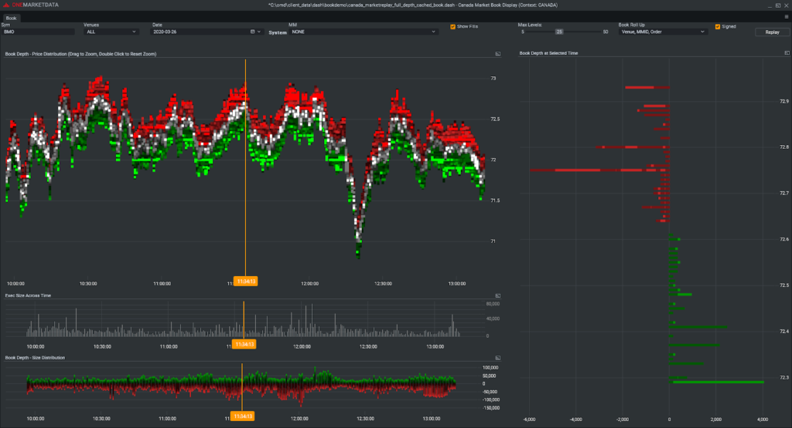

## Table of Contents

## What is the basic concept of market microstructure in traditional finance?

Market microstructure in traditional finance is about how markets work at a detailed level. It looks at how buyers and sellers come together, how prices are set, and how trades happen. Think of it as the plumbing of the financial markets. It helps us understand things like why stock prices move in certain ways and how quickly trades can be made.

One key part of market microstructure is the role of different market participants, like dealers, brokers, and traders. These people help make the market run smoothly by buying and selling securities. They also help set prices by deciding how much they are willing to pay or accept for a trade. Another important aspect is the rules and systems that markets use, like stock exchanges or electronic trading platforms. These rules and systems affect how easy or hard it is to trade and can impact the prices we see.

## How does the concept of market microstructure apply to cryptocurrency markets?

In cryptocurrency markets, market microstructure is about understanding how these digital markets work up close. Just like in traditional finance, it's about how buyers and sellers interact, how prices are determined, and how trades are executed. Cryptocurrency markets often operate 24/7 and are decentralized, which means they don't have a central place like a stock exchange. Instead, trades happen on various platforms and through different types of orders. This can make the market more complex but also more accessible to people around the world.

The role of market participants in crypto markets is also important. There are traders, market makers, and even automated trading bots that help keep the market liquid and efficient. These participants influence how quickly prices change and how easy it is to buy or sell cryptocurrencies. The rules and technology used in crypto trading platforms, like order [books](/wiki/algo-trading-books) and matching engines, also play a big part in how the market functions. Understanding these elements can help explain why [cryptocurrency](/wiki/cryptocurrency) prices can be so volatile and how different trading strategies can affect the market.

## What are the key differences between crypto market microstructure and traditional market microstructure?

The main difference between crypto market microstructure and traditional market microstructure is how they are set up. Traditional markets, like stock exchanges, have a central place where all the trading happens. They follow strict rules and have set hours for trading. On the other hand, crypto markets are often decentralized. This means there isn't one main place where all the trades happen. Instead, trading can occur on many different platforms around the world, and it happens 24/7. This makes crypto markets more open but also more complex.

Another big difference is the role of technology and automation. In traditional markets, human traders and brokers play a big part in how trades happen. While technology is important, there are still many rules and checks in place. In crypto markets, technology and automation, like trading bots and algorithms, are even more crucial. These tools can trade very quickly and can cause prices to change fast. This can lead to more [volatility](/wiki/volatility-trading-strategies) in crypto markets compared to traditional markets, where changes might be slower and more controlled.

## What are the main components of the crypto market microstructure?

The crypto market microstructure is made up of several important parts. One key part is the trading platforms, or exchanges, where people buy and sell cryptocurrencies. These platforms can be different from each other, with some being more centralized, like Coinbase, and others being more decentralized, like Uniswap. The way these platforms work, including how they match buyers and sellers and how they handle orders, is a big part of the crypto market's structure. Another important part is the role of market participants, like traders and market makers, who help keep the market running smoothly by buying and selling cryptocurrencies.

Another component is the technology behind crypto trading, like blockchain and smart contracts. These technologies help make sure trades are safe and fair. They also allow for things like decentralized finance (DeFi), where people can lend, borrow, or trade without a middleman. The rules and regulations, or sometimes the lack of them, also shape how the crypto market works. Since crypto markets often have fewer rules than traditional markets, this can lead to more innovation but also more risk. Understanding these parts helps explain why the crypto market can be so fast-moving and unpredictable.

## How do order books function in cryptocurrency exchanges?

Order books in cryptocurrency exchanges are like big lists that show what people want to buy and sell. Imagine a table with two sides. On one side, you see all the people who want to buy a cryptocurrency, and they list how much they're willing to pay. This is called the "bid" side. On the other side, you see all the people who want to sell, and they list the price they want to get. This is called the "ask" side. The [order book](/wiki/order-book-trading-strategies) shows all these bids and asks in order from the highest price someone is willing to pay to the lowest price someone is willing to accept.

When someone wants to trade, the exchange looks at the order book to find a match. If someone wants to buy at a price that someone else is willing to sell at, the trade happens. The exchange takes the highest bid and the lowest ask that match, and that's the price the trade goes through at. This system helps make sure the prices are fair and that there's always someone ready to buy or sell. It's what keeps the market moving and helps decide the price of cryptocurrencies at any moment.

## What role do market makers play in the crypto market, and how do they influence liquidity?

Market makers in the crypto market are like helpers who make sure there's always someone ready to buy or sell. They do this by putting up their own money to buy cryptocurrencies when no one else wants to, and they sell when no one else is selling. This helps keep the market running smoothly because it means people can always trade, even if there aren't many other buyers or sellers around. Market makers earn money by buying low and selling high, even if it's just a tiny difference in price.

By doing what they do, market makers make the market more liquid. Liquidity means how easy it is to buy or sell something without changing the price too much. When market makers are around, it's easier for people to trade because there's always someone ready to take the other side of the deal. This can help keep prices stable and make people feel more confident about trading. Without market makers, the crypto market could be a lot more unpredictable and harder to use.

## How do trading fees and transaction costs impact the microstructure of crypto markets?

Trading fees and transaction costs are like the tolls you pay when you use the crypto market. These costs can change how people trade and affect the overall market. When fees are high, people might trade less because it costs more to buy and sell. This can make the market less liquid, which means it's harder to find someone to trade with. On the other hand, if fees are low, more people might want to trade, making the market more active and easier to use.

These costs also play a big part in how people decide to trade. Some people might choose to use exchanges with lower fees, even if those exchanges are less well-known. Others might try to find ways to trade without paying as much, like using different kinds of orders or trading on decentralized platforms. The way fees and costs work can shape the whole market, influencing everything from how quickly prices change to how many people are willing to be market makers.

## What are the effects of high-frequency trading on cryptocurrency market dynamics?

High-frequency trading ([HFT](/wiki/high-frequency-trading-strategies)) in the cryptocurrency market means using computers to trade very fast, often in milliseconds. This can make the market move quickly because HFT traders can buy and sell a lot in a short time. When they do this, they can cause prices to go up and down a lot. This can be good because it makes the market more active and can help prices be more accurate. But it can also be bad because it can make the market feel unpredictable and risky for people who are not trading as fast.

HFT can also affect how easy it is to trade. When HFT traders are active, they can make the market more liquid. This means it's easier for people to buy and sell because there's always someone ready to trade. But sometimes, if too many HFT traders are trying to do the same thing at the same time, it can lead to big price swings or even market crashes. So, while HFT can help keep the market moving, it can also make it a bit wild and hard to predict.

## How do regulatory frameworks influence the microstructure of crypto markets?

Regulatory frameworks are like rules that governments and other groups make to control how crypto markets work. These rules can change a lot about the market. For example, if the rules are strict, it might be harder for new exchanges to start up or for people to trade freely. This can make the market less exciting and less active because people might be scared to do things that could get them in trouble. On the other hand, if there are no rules or very few rules, the market might be more open and fast-moving, but it could also be riskier because there's less protection for people.

These rules also affect who can join the market and how they can trade. Some countries might say only certain people can trade or that exchanges need to follow special rules to keep people's money safe. This can make the market feel safer and more trusted, but it might also slow things down. When rules change, it can cause the market to shift too. For example, if a new rule makes it harder to trade a certain way, people might start trading differently, which can change prices and how easy it is to buy and sell.

## What advanced metrics are used to analyze the microstructure of crypto markets?

To understand the crypto market better, people use special numbers called advanced metrics. One important metric is the order book depth, which shows how many people want to buy or sell at different prices. If there are a lot of orders, the market is deep and can handle big trades without prices changing too much. Another metric is the bid-ask spread, which is the difference between the highest price someone is willing to pay and the lowest price someone is willing to sell at. A small spread means it's easy to trade because the prices are close together.

Another useful metric is trading [volume](/wiki/volume-trading-strategy), which tells you how much trading is happening. High volume can mean the market is busy and prices might be more stable. Market impact is also important; it measures how much a big trade can change the price. If a big trade doesn't change the price much, the market is strong and can handle big moves. Lastly, there's volatility, which shows how much prices go up and down. High volatility can mean the market is risky but also exciting, with lots of chances to make money or lose it.

## How do decentralized exchanges (DEXs) differ from centralized exchanges in terms of market microstructure?

Decentralized exchanges (DEXs) and centralized exchanges work differently in how they handle trades. In a DEX, there's no big company in charge. Instead, people trade directly with each other using smart contracts on a blockchain. This means they don't have to trust a middleman, and anyone can join from anywhere in the world. But because there's no central control, DEXs can be slower and might have less trading happening at once. This can make it harder to find someone to trade with, and prices might change more when big trades happen.

Centralized exchanges, on the other hand, are like big trading hubs run by a company. They have lots of rules and controls to make sure trades happen fast and safely. Because they're in charge, they can make sure there's always someone ready to buy or sell, which makes the market more liquid. But this also means people have to trust the exchange with their money and follow its rules. If something goes wrong with the exchange, like a hack, people's money could be at risk. So, while centralized exchanges can be easier to use and more active, they come with their own set of risks.

## What are the current research trends and future directions in crypto market microstructure?

People who study crypto markets are really interested in how these markets work and how they can be made better. One big thing they're looking at is how to make the market more stable. They want to understand why prices can change so much and so quickly. They're also studying how different kinds of trading, like high-frequency trading, affect the market. Another hot topic is how decentralized exchanges work and how they can be improved to be faster and easier to use. Researchers are also trying to figure out how to make trading safer and more fair for everyone, not just the big players.

Looking to the future, one direction researchers might go is figuring out better ways to handle the huge amount of data that comes from crypto markets. They might use new tools and methods to see patterns and make better predictions about what will happen next. Another thing they might focus on is how new rules and laws could change the market. As more countries start to make rules about cryptocurrencies, it's important to understand how these rules will affect trading. Finally, researchers might look more into how people behave in these markets and how to make trading easier and more accessible for everyone, not just people who know a lot about technology.

## References & Further Reading

[1]: Gandal, N., & Halaburda, H. (2016). ["Can We Predict the Winner in a Market with Network Effects? Competition in Cryptocurrency Market."](https://papers.ssrn.com/sol3/papers.cfm?abstract_id=2832836) Economic Inquiry, 54(2), 1002-1019.

[2]: Aitken, M., & Harris, F. H. (2011). ["Microstructure Theory"](https://scholar.google.com/citations?user=T7FURswAAAAJ&hl=en) by Frank de Jong and Barbara Rindi.

[3]: Lopez de Prado, M. (2018). ["Advances in Financial Machine Learning"](https://www.amazon.com/Advances-Financial-Machine-Learning-Marcos/dp/1119482089).

[4]: Gomber, P., Arndt, B., Lutat, M., & Uhle, T. (2013). ["High-Frequency Trading."](https://papers.ssrn.com/sol3/papers.cfm?abstract_id=1858626) In Springer Reference, 475-486.

[5]: Chan, E. (2009). ["Quantitative Trading: How to Build Your Own Algorithmic Trading Business"](https://github.com/ftvision/quant_trading_echan_book).

[6]: Jansen, S. (2020). ["Machine Learning for Algorithmic Trading – Second Edition."](https://github.com/stefan-jansen/machine-learning-for-trading) 

[7]: Arnold, T., Butler, A. W., Crack, T. F., & Zhang, A. (2011). ["The Information Content of Implied Skewness and Kurtosis Changes Prior to Earnings Announcements for Stock Returns."](https://papers.ssrn.com/sol3/papers.cfm?abstract_id=299393) Journal of Banking & Finance, 35(5), 1164-1176.

[8]: Chuen, D. L. K., Lee, D., & Guo, L. (Eds.). (2017). ["Handbook of Blockchain, Digital Finance, and Inclusion."](https://www.sciencedirect.com/book/9780128104415/handbook-of-blockchain-digital-finance-and-inclusion-volume-1) Volume 1, Cryptocurrency, FinTech, InsurTech, and Regulation. 

[9]: Treleaven, P., Galas, M., & Lalchand, V. (2013). ["Algorithmic trading review."](https://dl.acm.org/doi/10.1145/2500117) Communications of the ACM, 56(11), 76-85. 

[10]: Aronson, D. R. (2006). ["Evidence-Based Technical Analysis: Applying the Scientific Method and Statistical Inference to Trading Signals."](https://www.amazon.com/Evidence-Based-Technical-Analysis-Scientific-Statistical/dp/0470008741)